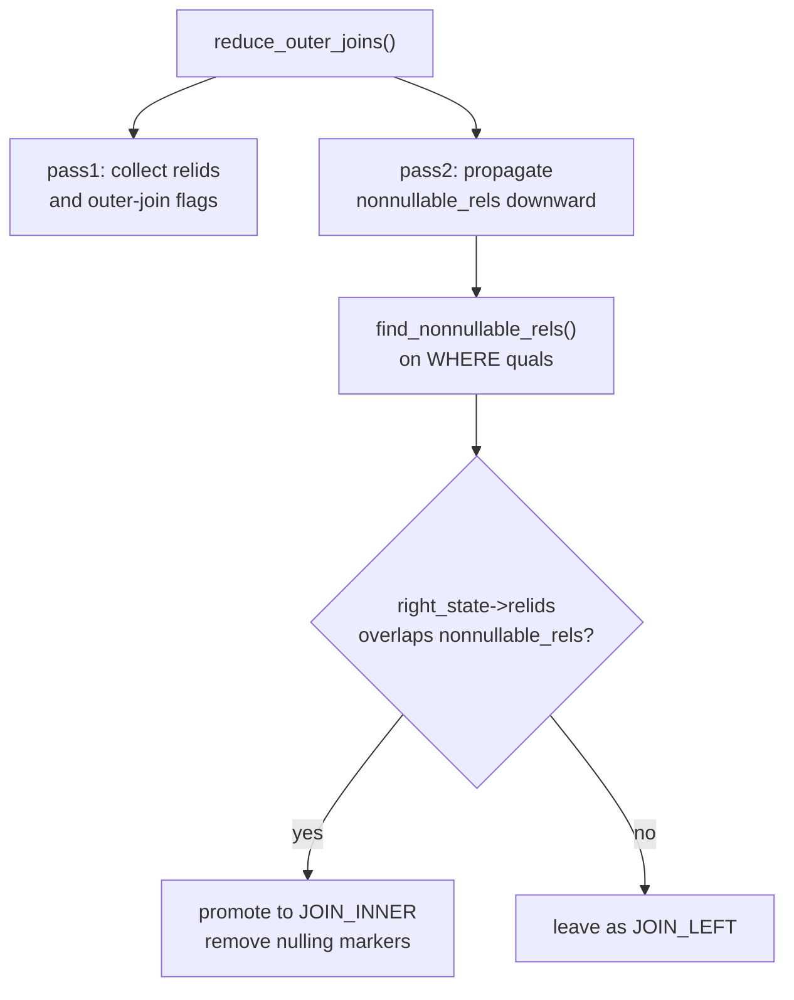

# Outer Join Promotion

A LEFT JOIN produces one output row for every row in the left table, whether or not it matches anything on the right. When no match exists, the right-side columns are filled with NULLs. An INNER JOIN, by contrast, only produces rows where both sides match. These two semantics are different — unless the query's WHERE clause already discards every null-padded row, in which case the outputs are identical. When the planner can prove this, it replaces the outer join with an inner join. This is outer join promotion. It matters because inner joins have no required ordering: the planner can freely swap left and right inputs, combine them with other inner joins, and explore join orders that are illegal with an outer join in place.

The transformation is implemented in `reduce_outer_joins()` (`src/backend/optimizer/prep/prepjointree.c`). It runs after expression preprocessing, once all qual aliases have been expanded. It runs before the main join-order search begins.

## What Makes a Predicate Null-Rejecting

A predicate is null-rejecting for a relation if it cannot return TRUE when all of that relation's columns are NULL. In three-valued SQL logic, most comparison operators evaluate to NULL (not FALSE) when either operand is NULL. A NULL WHERE clause result is treated the same as FALSE, so the row is rejected. Any strict expression on a nullable column is therefore null-rejecting: `c.status = 'active'` returns NULL when `c.status` is NULL, and that NULL causes the row to be filtered out.

`find_nonnullable_rels()` (`clauses.c`) computes which relations are made non-nullable by a given expression. It walks the expression tree looking for clauses that provably cannot return TRUE for all-NULL input. The result is a `Relids` bitmapset: the set of relation RT-indexes that are forced non-null by the expression.

The rules it applies:

| Expression | Null-rejecting for `c`? | Reason |
|---|---|---|
| `c.col = constant` | Yes | `=` is strict; returns NULL when `c.col` is NULL |
| `c.col > constant` | Yes | `>` is strict |
| `c.col IS NOT NULL` | Yes | explicitly returns FALSE when `c.col` is NULL |
| `c.col IS NULL` | No | returns TRUE when `c.col` is NULL — the opposite |
| `strict_function(c.col)` | Yes | strict functions return NULL on NULL input |
| `COALESCE(c.col, fallback)` | No | returns `fallback` when `c.col` is NULL, never NULL itself |
| `A AND B` | Union of A's and B's rejections | either arm producing FALSE-or-NULL rejects the row |
| `A OR B` | Intersection of A's and B's rejections | both arms must reject for the OR to reject |

The AND rule means that any single null-rejecting arm in a conjunction is sufficient: `WHERE c.status = 'active' AND o.total > 1000` null-rejects `c` because the first arm does, regardless of the second. The OR rule is stricter: `WHERE c.status = 'active' OR o.total > 1000` does not null-reject `c`. If `c.status` is NULL, the second arm `o.total > 1000` might still be TRUE, so the row is allowed through.

The `top_level` flag inside `find_nonnullable_rels_walker()` tracks whether the walker is at the top-level boolean structure or has descended into a strict function's argument list. At the top level, a FALSE-or-NULL result is sufficient for rejection. Below a strict function, only a proven NULL result matters. `IS NOT NULL` is only recognised as null-rejecting at the top level (`clauses.c` line 1595). Inside a strict function's arguments, `IS NOT NULL` would absorb the NULL before the function sees it, which changes the strictness reasoning.

## How the Planner Applies the Test

`reduce_outer_joins()` makes two passes over the join tree.

The first pass (`reduce_outer_joins_pass1()`) is purely structural. It walks the `FromExpr` and `JoinExpr` nodes in the jointree, recording for each node: which base relation RT-indexes appear beneath it (`relids`), and whether the subtree contains any outer join at all (`contains_outer`). This bookkeeping lets the second pass stop descending early: once it reaches a subtree with no outer joins, there is nothing to promote.

The second pass (`reduce_outer_joins_pass2()`) carries a `nonnullable_rels` bitmapset downward. At each `FromExpr` node it calls `find_nonnullable_rels()` on the node's WHERE quals, adds the result to the inherited set from above, and recurses into children. When it reaches a `JoinExpr` for a LEFT JOIN, it checks whether `nonnullable_rels` overlaps the right side's `relids`. If the overlap is non-empty, the right side is provably non-null at that level of the tree, so any null-padded row would already have been filtered. The join type then changes to `JOIN_INNER`.

The key check for a LEFT JOIN (from `prepjointree.c` around line 3005):

```c
case JOIN_LEFT:
    if (bms_overlap(nonnullable_rels, right_state->relids))
        jointype = JOIN_INNER;
    break;
```

After a successful promotion, `reduce_outer_joins()` also removes any "nulling relid" markers that the expression rewriter had attached to Vars from the now-inner-joined relation. These markers are used elsewhere in the planner to track which outer joins could have introduced a NULL into a given Var; once the join is inner, those markers are stale and must be cleared (`remove_nulling_relids()`, `prepjointree.c`).



## The Column Placement Problem

The most common reason promotion fails when developers expect it to succeed is that the null-rejecting predicate is on the wrong side. Consider:

```sql
SELECT *
FROM orders o
LEFT JOIN customers c ON o.customer_id = c.id
WHERE o.customer_id IS NOT NULL;
```

`o.customer_id IS NOT NULL` is a predicate on the left table, `orders`. It tells the planner to exclude `orders` rows with a NULL `customer_id`, but it says nothing about whether `c.id` is NULL. A LEFT JOIN null-pads the right side: if `customer_id = 42` but no `customers` row has `id = 42`, the join still produces a row with `c.*` all NULL. `o.customer_id IS NOT NULL` does not reject that row. `o.customer_id` is 42, which is NOT NULL, so the predicate passes.

Because `o.customer_id` belongs to the left relation (`orders`), `find_nonnullable_rels()` places `orders`'s RT-index into `nonnullable_rels`, not `customers`'s. The overlap check against the right side's relids finds nothing, and the LEFT JOIN stays.

The predicate that enables promotion is one on the right-side columns:

```sql
SELECT *
FROM orders o
LEFT JOIN customers c ON o.customer_id = c.id
WHERE c.status IS NOT NULL;  -- right-side column
```

Now if the join produced a null-padded row for `c`, `c.status` would be NULL, and `c.status IS NOT NULL` would be FALSE — the row is rejected. Since no such row can reach the output, the LEFT JOIN and an INNER JOIN are equivalent, and the planner promotes.

Any strict predicate on any right-side column works:

```sql
WHERE c.status = 'active'       -- strict equality, null-rejecting
WHERE c.created_at > '2020-01-01'  -- strict comparison, null-rejecting
WHERE lower(c.email) LIKE '%@example.com'  -- lower() is strict, null-rejecting
```

## Primary Keys Do Not Help

A common expectation is that because `c.id` is the primary key — and therefore never NULL in the actual `customers` table — the planner should be able to prove the LEFT JOIN is safe to promote. It does not.

The planner's `reduce_outer_joins()` uses only predicate-based reasoning, not constraint-based reasoning. The distinction is important: a table constraint says something about rows stored in the heap. But the result of a LEFT JOIN is not rows from the heap — it is a derived relation. When no match exists, the right side is synthetically padded with NULLs regardless of any column constraint. `c.id` being a primary key means `c.id` is never NULL in `customers`. It says nothing about `c.id` in the join's output, where null-padding can manufacture a NULL `c.id` for any unmatched `orders` row.

The same rationale appears in the `JOIN_LEFT → JOIN_ANTI` detection block inside `reduce_outer_joins_pass2()` (`prepjointree.c`), which explicitly considers and then rejects constraint-based inference:

```c
/* NOTE: there are other ways that we could
 * detect an anti-join, in particular if we were to check whether Vars
 * coming from the RHS must be non-null because of table constraints.
 * That seems complicated and expensive though (in particular, one
 * would have to be wary of lower outer joins). For the moment this
 * seems sufficient.
 */
```

That comment is specifically about anti-join detection, not inner-join promotion. The obstacle it identifies is the same: constraint-based inference would require tracking which outer joins below the current node could be the source of a synthesised NULL, and whether the constraint is actually enforced at the time the query runs. The predicate-based approach is conservative but fast and correct for both cases.

## Foreign Key Constraints Do Not Help Either

Even if `o.customer_id` is declared as a FOREIGN KEY referencing `c.id`, the planner does not use this to infer that every `orders.customer_id` has a matching `customers` row. FK constraints can be marked `NOT VALID` (constraint is on file but existing rows were not checked), can be `DEFERRED` (checked at transaction commit, not at row insertion), or can be violated by rows inserted before the constraint was added. The planner has no way to guarantee referential integrity holds without actually executing the join, so it does not try.

This is by design: `reduce_outer_joins()` is a syntactic/predicate-level transformation. It does not consult `pg_constraint`. If you know a FK is valid and enforced, the way to express that knowledge to the planner is to write an INNER JOIN.

## COALESCE as a Blocking Pattern

COALESCE is a common ORM pattern that silently blocks promotion:

```sql
SELECT *
FROM orders o
LEFT JOIN customers c ON o.customer_id = c.id
WHERE COALESCE(c.name, 'Unknown') = 'John';
```

`COALESCE(c.name, 'Unknown')` is not strict. When `c.name` is NULL — as it will be on null-padded rows — COALESCE returns `'Unknown'`, not NULL. The comparison `'Unknown' = 'John'` is FALSE, so those rows are filtered out. The filtering happens at the comparison level, not by COALESCE producing NULL. `find_nonnullable_rels()` does not recognise COALESCE as null-rejecting because COALESCE can return a non-null value even when its first argument is NULL. The LEFT JOIN is not promoted.

The subtlety is that the query might work correctly — rows where `c` is null-padded do get filtered because `'Unknown' != 'John'` — but the planner cannot use that filter to eliminate the outer join's null-padding overhead or to unlock reordering. If the intent is to find orders with customers named 'John', the COALESCE is unnecessary anyway, and writing `WHERE c.name = 'John'` both expresses the intent and enables promotion.

## OR as a Weakening Pattern

An OR that mixes right-side and left-side conditions typically prevents promotion:

```sql
SELECT *
FROM orders o
LEFT JOIN customers c ON o.customer_id = c.id
WHERE c.status = 'active' OR o.total > 1000;
```

`find_nonnullable_rels()` computes the intersection of the null-rejecting relids from each OR arm. The first arm `c.status = 'active'` is null-rejecting for `c`. The second arm `o.total > 1000` references only `orders`, so it contributes `orders` to the set, not `c`. The intersection of `{c}` and `{orders}` is empty — no relation is null-rejected by both arms — so the whole OR does not null-reject `c`. The LEFT JOIN remains.

This is semantically correct: a row where `c` is null-padded (so `c.status` is NULL, making the first arm FALSE or NULL) could still satisfy `o.total > 1000`, meaning it should appear in the output. The LEFT JOIN genuinely differs from an INNER JOIN for this query. The OR clause is not just blocking the optimisation — it is encoding a real semantic requirement.

Compare with AND:

```sql
WHERE c.status = 'active' AND o.total > 1000
```

Here `find_nonnullable_rels()` takes the union: the first arm contributes `{c}`, the second contributes `{orders}`. The combined set is `{c, orders}`. The overlap check against the right side's relids (`{c}`) is non-empty, and the LEFT JOIN is promoted to INNER JOIN.

## Diagnosing Promotion with EXPLAIN

Whether promotion happened is visible in `EXPLAIN` output. A promoted join uses the same node type as an explicit INNER JOIN:

```
Hash Join         -- promoted or explicit INNER JOIN
Nested Loop       -- promoted or explicit INNER JOIN
Merge Join        -- promoted or explicit INNER JOIN
```

An unpromoted outer join carries the join type in the node name:

```
Hash Left Join    -- unpromoted LEFT JOIN
Nested Loop Left Join   -- unpromoted LEFT JOIN
```

To check quickly:

```sql
EXPLAIN
SELECT o.id, c.name
FROM orders o
LEFT JOIN customers c ON o.customer_id = c.id
WHERE c.status = 'active';
```

If the plan shows `Hash Join` (without "Left"), the join was promoted. If it shows `Hash Left Join`, the WHERE clause was not sufficient to trigger promotion.

## Practical Guidance

To guarantee promotion: add a strict WHERE predicate on any right-side column. `WHERE c.id IS NOT NULL` is the minimal explicit form; any strict comparison on `c.*` works equally well.

If the FK semantics truly guarantee that every left-side row has a right-side match, write `INNER JOIN` directly. This is both more expressive and immediately correct without relying on the planner's predicate analysis. The outer join was perhaps written defensively; if the defensive behaviour is not needed, the inner join is the cleaner statement.

If promotion is blocked by COALESCE, consider whether the COALESCE is necessary. ORMs sometimes generate `COALESCE(col, default)` in WHERE clauses for nullable columns; if the default value would never match the filter anyway, removing the COALESCE and filtering on the column directly is both faster and promotable.

If an OR clause mixes conditions across both sides of the join and is blocking promotion, evaluate whether the OR logic is intentional. If the business rule genuinely allows null-padded rows through when the left-side condition is true, the LEFT JOIN is correct and promotion is not appropriate. If the intent was to filter on both conditions simultaneously, rewrite as AND — which is both correct and promotable.

## Related Topics

- [[subsystems/planner/join-ordering|Join Ordering]] — outer join promotion expands the join-order search space by converting constrained outer joins into freely reorderable inner joins
- [[subsystems/planner/join-elimination|Join Elimination]] — a complementary transformation that removes joins entirely when their results are provably unused
- [[subsystems/planner/expression-preprocessing|Expression Preprocessing]] — runs before `reduce_outer_joins()` and expands qual aliases that the null-rejection analysis depends on
- [[subsystems/planner/equivalence-classes|Equivalence Classes]] — inner joins unlocked by promotion feed into equivalence-class construction, enabling additional predicate pushdown
- [[subsystems/planner/predicate-pushdown|Predicate Pushdown]] — the WHERE predicates that trigger promotion are also candidates for pushing below the join node
- [[subsystems/planner/subqueries|Subqueries]] — subquery flattening is a related join-tree rewrite that runs in the same preprocessing phase as outer join promotion
- [[subsystems/planner/reading-explain|Reading EXPLAIN]] — how to confirm in EXPLAIN output whether a LEFT JOIN was promoted to an inner join
