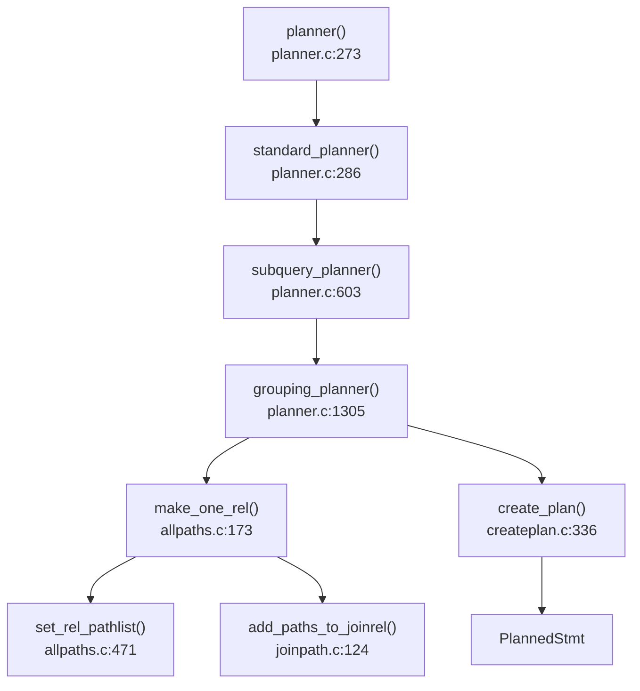
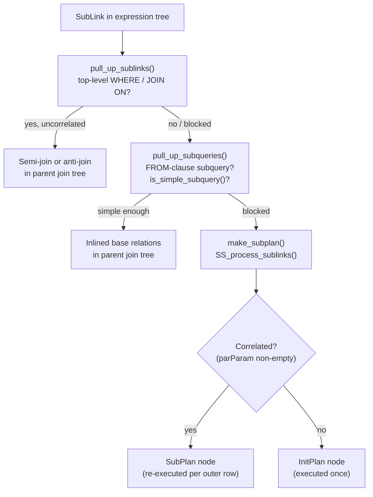

# Planner Overview

The planner takes the rewritten `Query` tree produced by the analyzer and rewriter and returns a `PlannedStmt` containing a tree of `Plan` nodes that the executor can run. Its only job is to find the cheapest way to compute the correct result — it never changes what is computed, only how.

The planner works in two distinct phases. First it enumerates candidate access strategies (called *paths*) for each relation and join, attaching a cost estimate to each. Then it selects the cheapest path and converts it into an executable `Plan` node tree.

## Planning pipeline



Planning is organized as a set of nested scopes, each responsible for a distinct concern. The outermost entry point (`planner()`, `planner.c`) exposes a hook (`planner_hook`) so extensions can intercept planning entirely before any work begins. `standard_planner()` does the real work: it creates the global planner state (`PlannerGlobal`), drives optimization of the query tree, picks the best path from the final relation, and assembles the result into a `PlannedStmt`.

One level inward, `subquery_planner()` handles each query level independently. This function creates per-level state (`PlannerInfo`), preprocesses expressions — constant folding, sublink expansion, and HAVING-to-WHERE pushdown — and then delegates to `grouping_planner()`. Treating each subquery level as its own planning scope means that nested subqueries can be optimized with their own cost context. This cost context is essential for accurate row and cost estimates.

`grouping_planner()` (`planner.c`) is responsible for everything above the scan/join level: GROUP BY, window functions, DISTINCT, ORDER BY, and LIMIT. It drives the generation of scan and join paths via `query_planner()` and `make_one_rel()`, then wraps the resulting relation with upper-level paths for aggregation and sorting.

## Key data structures

### PlannerInfo

`PlannerInfo` (`src/include/nodes/pathnodes.h`, line 192) is the root of all optimization state for one query level. Notable fields:

| Field | Purpose |
|---|---|
| `parse` | The `Query` being planned |
| `glob` | Global state shared across recursive calls (for subqueries) |
| `simple_rel_array` | Base relations indexed by range-table index |
| `join_rel_list` | All join relations discovered so far |
| `upper_rels[]` | Upper-level relations (GROUP, WINDOW, DISTINCT, ORDER, FINAL) |
| `all_query_rels` | Bitmapset of all relids that must be joined |

### RelOptInfo

`RelOptInfo` (line 844) represents a relation at any level: a base table, a join result, a subquery, or an upper-level aggregate. Key fields:

| Field | Purpose |
|---|---|
| `relids` | Set of base relids this relation represents |
| `rows` | Estimated output row count |
| `pages`, `tuples` | Physical size statistics loaded from `pg_class` |
| `pathlist` | All candidate `Path` nodes for this relation |
| `cheapest_total_path` | The path with the lowest total cost |
| `cheapest_startup_path` | The path with the lowest startup cost (for LIMIT queries) |
| `reltarget` | Default output column list and width estimate |

### Path

`Path` (line 1590) represents one way to produce a relation's rows. Every scan strategy, join algorithm, and sort order is a `Path`. Key fields:

| Field | Purpose |
|---|---|
| `pathtype` | Node tag: `T_SeqScan`, `T_IndexScan`, `T_HashJoin`, etc. |
| `parent` | The `RelOptInfo` this path produces |
| `rows` | Estimated output row count |
| `startup_cost` | Cost before the first tuple is returned |
| `total_cost` | Cost to return all tuples |
| `pathkeys` | Sort ordering of output (used to avoid explicit sorts for ORDER BY or merge joins) |

The planner retains multiple paths per relation rather than pruning to a single winner immediately, because different callers have different priorities. A query with LIMIT may prefer lower startup cost; an unrestricted aggregation prefers lower total cost. Each time a new path is generated, `add_path()` compares it against existing candidates using Pareto dominance: a path is discarded only if another path is cheaper on both dimensions. Paths that are cheaper in one dimension but not the other are kept, ensuring that no globally optimal path is discarded prematurely while still keeping `pathlist` small.

## Path generation

`make_one_rel()` (`allpaths.c`) orchestrates the planner's central task: generating candidate paths for every base relation and join combination. It begins by loading physical statistics — row counts and page counts — for each base relation from `pg_class` via `get_relation_info()` (`plancat.c`). With those statistics in hand, it generates candidate access paths for every base relation, then recursively builds join relations from those bases.

For each base relation, every viable access method is explored (`set_rel_pathlist()`, `allpaths.c`). A sequential scan is always added as a fallback. Index scan paths — plain index scans, index-only scans, and bitmap index scans — are added for each applicable index. If the WHERE clause contains a `ctid =` predicate, a TID scan path is also considered. The planner does not commit to any of these at this stage; all viable options are kept and compared on cost.

**PostgreSQL 17:** `IS NULL` predicates on columns declared `NOT NULL` are short-circuited to produce an empty result immediately, and `IS NOT NULL` on a `NOT NULL` column is removed as an always-true condition, eliminating unnecessary scans without relying on statistics. **PostgreSQL 18:** OR conditions over equality tests on the same column can be transformed into an array membership check for more efficient bitmap index processing.

For joins, the planner tries all three join algorithms for each pair of relations (`add_paths_to_joinrel()`, `joinpath.c`):
- **Nested loop** — always possible; inner relation is rescanned for each outer row.
- **Hash join** — inner relation is hashed; outer is probed.
- **Merge join** — both inputs must be sorted on the join key; sorting cost is included if needed.

Each algorithm may be tried with the outer and inner roles swapped, and with various input orderings.

**PostgreSQL 18:** Right Semi Join plans are now considered during join enumeration, giving the planner an additional strategy when the semi-join's smaller side would be more efficient as the build side. Merge joins can additionally exploit incremental sorts, reducing the sort cost when the input is already partially ordered. Self-joins on the same table where the join is redundant given a unique key are automatically eliminated (controlled by the `enable_self_join_elimination` GUC).

## Cost model

The planner selects among candidate paths by comparing estimated costs, which are computed in `costsize.c` using a set of GUC parameters that express the relative expense of different hardware operations:

| GUC | Default | Represents |
|---|---|---|
| `seq_page_cost` | 1.0 | Reading one page sequentially |
| `random_page_cost` | 4.0 | Reading one page at a random location |
| `cpu_tuple_cost` | 0.01 | Processing one tuple in CPU |
| `cpu_index_tuple_cost` | 0.005 | Processing one index entry |
| `cpu_operator_cost` | 0.0025 | Evaluating one operator or function |
| `effective_cache_size` | 128MB | Estimated OS + shared buffer cache size (influences index vs. seq choice) |

These values are dimensionless and relative to each other — only their ratios matter. This allows the planner to be tuned to different hardware profiles by adjusting GUCs rather than recompiling.

A sequential scan (`cost_seqscan()`) incurs a uniform I/O cost across all pages plus a CPU cost per tuple evaluated:
```
disk_cost  = seq_page_cost × pages
cpu_cost   = cpu_tuple_cost × tuples  +  qual_cost × tuples
total_cost = disk_cost + cpu_cost
```

An index scan (`cost_index()`) first estimates the fraction of index entries that satisfy the scan condition using column statistics and clause selectivity, then charges `cpu_index_tuple_cost` per matching index entry and `random_page_cost` per heap page fetched. For highly selective queries this is much cheaper than a sequential scan; for low-selectivity queries the random I/O cost dominates and a sequential scan wins.

Join costs reflect each algorithm's resource profile:
- Nested loop (`cost_nestloop()`): `outer_cost + outer_rows × inner_cost_per_rescan`.
- Hash join (`initial_cost_hashjoin()` / `final_cost_hashjoin()`): cost to build the hash table from the inner relation plus cost to probe it for each outer row.
- Merge join (`initial_cost_mergejoin()` / `final_cost_mergejoin()`): sort costs for unsorted inputs plus a linear merge pass.

Enable/disable flags (`enable_seqscan`, `enable_indexscan`, `enable_hashjoin`, etc.) add a large penalty to the corresponding path type rather than disabling it entirely, so the planner always produces a complete plan even when a method is "disabled".

## Statistics

Cost estimates are only as good as the statistics they use. When a base relation's `RelOptInfo` is initialized (`get_relation_info()`, `plancat.c`), it is populated with `pages` and `tuples` from `pg_class.relpages` and `pg_class.reltuples` — values kept current by ANALYZE and [[subsystems/background/autovacuum|autovacuum]]. Each applicable index also contributes an `IndexOptInfo` recording index size and per-column selectivity.

Selectivity estimates for WHERE clauses draw on per-column statistics stored in `pg_statistic`: most-common values with their frequencies, a histogram of the value distribution, and the fraction of NULLs. These statistics let the planner estimate what fraction of rows survive each filter without scanning actual data.

**PostgreSQL 17:** `pg_stats` gains two new columns for range-type columns — a histogram of range lengths and a histogram of range bounds — giving the planner more accurate selectivity estimates for range containment and overlap predicates.

## Subquery handling

SQL queries can embed subqueries in several syntactically distinct ways — in the FROM clause, in WHERE as `EXISTS`/`IN`/`ANY` predicates, or as scalar subexpressions in the SELECT list. The planner treats each differently. The key strategic question for each subquery is whether it can be *flattened* into the enclosing query's join tree, or whether it must remain as a separately executed unit. Flattening is almost always better: once a subquery becomes part of the parent's join tree, the planner can reorder it against other relations, apply index paths across the join boundary, and avoid materializing intermediate results. Whether flattening is possible depends on the subquery's structure and where in the parent query it appears.

### Flattening EXISTS and IN subqueries into joins

The most impactful transformation is turning `EXISTS (subquery)`, `NOT EXISTS (subquery)`, and `column IN (subquery)` predicates that appear in WHERE or JOIN/ON clauses into semi-joins and anti-joins respectively. This happens during `pull_up_sublinks()` (`prepjointree.c`), which runs before any other optimization work — before expression simplification, before path generation, before even the join graph is built.

For each qualifying sublink predicate, the planner extracts the subquery from the predicate, adds it to the parent's range table, and replaces it in the jointree with a new `JoinExpr` node carrying `JOIN_SEMI` or `JOIN_ANTI` as its join type. The condition that connected the subquery to the outer query (the `WHERE` clause of the subquery that references outer-level columns) becomes the join's ON qualifier. After this transformation, the originally implicit correlation is an explicit join that the rest of the planner can optimize freely — including choosing a hash join, a merge join, or an index nested-loop just as it would for any other join.

For `col IN (subquery)` (parsed as `ANY_SUBLINK`), the subquery must not reference any variables from the parent query level itself — only the test expression may do so. If those conditions hold, `convert_ANY_sublink_to_join()` (`subselect.c`) adds the subquery as an `RTE_SUBQUERY` range-table entry and builds a `JOIN_SEMI` node whose quals replace the original `PARAM_SUBLINK` placeholders with `Var` references to the newly inserted subquery RTE.

For `EXISTS (subquery)` (`EXISTS_SUBLINK`), the transformation is structurally similar but the subquery's target list can be stripped away entirely, since only row existence matters. `simplify_EXISTS_query()` (`subselect.c`) removes the select list, DISTINCT, and non-affecting ORDER BY from the EXISTS subquery before converting it. The subquery's remaining FROM tables are merged directly into the parent's range table. Its (adjusted) WHERE clause becomes the semi-join qualifier. `NOT EXISTS` follows the same path but produces `JOIN_ANTI`.

Both conversions apply only when the sublink appears at the top level of a conjunctive WHERE or inner-join ON clause. In an outer join's ON clause, conversion is only allowed when the sublink references relations exclusively on the nullable side; a sublink that crosses the outer-join boundary cannot be safely elevated. Neither conversion is attempted below an OR — the three-valued logic of SQL makes it impossible to tell whether NULL input should produce FALSE or NULL in that context. If none of these structural conditions are met, the sublink is left untouched and processed later as a SubPlan node.

**PostgreSQL 17:** Correlated `IN` subqueries that use lateral references can now be transformed into joins in more cases, reducing the number of subqueries that fall through to correlated SubPlan execution.

### Flattening FROM-clause subqueries

A subquery that appears in the FROM clause as `SELECT ... FROM (SELECT ...) alias` is represented as an `RTE_SUBQUERY` range-table entry in the parent query. `pull_up_subqueries()` (`prepjointree.c`), which runs after `pull_up_sublinks()`, attempts to inline each such subquery by replacing its single range-table slot with the subquery's own range-table entries and merging its join tree into the parent's.

After inlining, the subquery's base relations are directly visible to the parent's path generator. They can participate in any join order, pick up filter pushdowns, and take advantage of parameterized index paths connecting them to other relations — none of which is possible when the subquery remains a separate scan node. Outer-query filter clauses that reference the former subquery's output columns are rewritten to reference the underlying base relations directly, eliminating a projection layer.

The preconditions for inlining are conservative (`is_simple_subquery()`, `prepjointree.c`). A subquery cannot be flattened if it has any of: aggregation, window functions, GROUP BY, HAVING, ORDER BY, DISTINCT, LIMIT/OFFSET, UNION/INTERSECT/EXCEPT, FOR UPDATE/SHARE, or a WITH (CTE) list. A subquery behind a `security_barrier` view is also excluded, to prevent predicate pushdown from leaking data through side-channel operators. Volatile functions in the target list block flattening too, because inlining could introduce multiple evaluations of the same function call. When the subquery appears on the inner side of an outer join, additional restrictions around lateral references apply.

Simple `UNION ALL` subqueries that fail the flattening test for other reasons are handled separately: `pull_up_simple_union_all()` converts them into an append relation, allowing the planner to generate parallel `Append` or `MergeAppend` paths over the union branches without nesting a full sub-plan.

**PostgreSQL 17:** `UNION` (without `ALL`) can now use `MergeAppend` plans to deduplicate results from ordered branches, avoiding the previous requirement of a full sort followed by a `Unique` node when the branches already produce ordered output.

### When flattening is not done: SubPlan and InitPlan nodes

When none of the structural conditions for flattening are met, the subquery must remain a separately planned unit. This is common for correlated subqueries — subqueries whose WHERE clause references columns from the outer query. A correlated subquery by definition cannot be moved into the outer join tree as a semi-join, because its result depends on each individual outer row.

After flattening opportunities are exhausted, any remaining `SubLink` nodes in the expression tree are processed by `SS_process_sublinks()` (`subselect.c`), which calls `make_subplan()` for each one. `make_subplan()` invokes `subquery_planner()` recursively to produce a complete plan for the subquery, then wraps it in a `SubPlan` node that lives inside the parent's expression tree.

Two runtime behaviours are possible depending on whether the subquery references outer columns:

- A **SubPlan** (correlated subplan) is re-executed for every row of the outer query that needs it. Its `parParam` list carries the `PARAM_EXEC` parameter IDs that the outer executor will fill in before each re-execution. For `IN`/`ANY` tests that are uncorrelated and whose result fits in `work_mem`, the planner can build a hash table over the subquery's output and probe it instead of re-scanning; `useHashTable` is set on the `SubPlan` node in that case.

- An **InitPlan** is an uncorrelated subplan — one whose `parParam` list is empty. It is executed exactly once, before the outer query begins scanning, and its result is stored in a `PARAM_EXEC` slot for later use. Scalar subqueries in the SELECT list that do not reference outer columns become InitPlans. An EXISTS subquery that is uncorrelated also becomes an InitPlan returning a boolean.

The distinction matters enormously for performance. An InitPlan pays its cost once; a correlated SubPlan pays it `N` times where `N` is the number of outer rows it is evaluated for. A query like `WHERE x = (SELECT max(y) FROM t)` will use an InitPlan and compute `max(y)` once. A query like `WHERE EXISTS (SELECT 1 FROM t WHERE t.id = outer.id)` cannot use an InitPlan because the inner condition depends on `outer.id`. It becomes a correlated SubPlan that re-executes for each outer row, unless `pull_up_sublinks()` already converted it to a semi-join — which it would do if the EXISTS appeared at the top level of the WHERE clause.



### Subquery RTEs that survive to path generation

FROM-clause subqueries that were not flattened survive into the path generation phase as `RTE_SUBQUERY` entries in the range table. When `set_base_rel_sizes()` (`allpaths.c`) reaches such an entry, it calls `set_subquery_pathlist()` rather than the usual `set_plain_rel_size()`. `set_subquery_pathlist()` invokes `subquery_planner()` recursively right then, producing a complete `PlannerInfo` and a set of paths for the inner query. The inner query's final `RelOptInfo` (at `UPPERREL_FINAL`) provides the row count and cost estimates that the outer planner needs; these are copied into the outer `RelOptInfo` via `set_subquery_size_estimates()`.

From the outer planner's perspective, a non-flattened subquery RTE is a black box: its internal structure is invisible. No outer join clause can be pushed through it as a parameterized path. The outer planner generates a `SubqueryScanPath` wrapping whatever cheapest path the inner planner chose. That path competes against all other access strategies on cost alone. Filter clauses on the outer relation that reference the subquery's output columns are evaluated as `qpquals` on the `SubqueryScan` node unless they can be pushed down into the subquery's own WHERE clause (which `set_subquery_pathlist()` attempts before planning the inner query, subject to pushdown-safety checks).

## Converting the winning path to an executable plan

The optimizer's internal `Path` representation and the executor's `Plan` representation are kept deliberately separate: `Path` nodes reference `RelOptInfo` structures and raw cost estimates, while `Plan` nodes reference expression trees the executor can evaluate directly. Once the cheapest path is selected, `create_plan()` (`createplan.c`) bridges this gap by traversing the `Path` tree and dispatching to a type-specific builder for each node (`create_plan_recurse()`). Each builder copies the path's metadata — targetlist, quals, cost estimates — into the corresponding `Plan` struct. The resulting `Plan` tree is structurally identical to the winning `Path` tree, just expressed in executor-facing terms.

## Join enumeration: dynamic programming

For queries involving few enough relations (below `geqo_threshold`), the planner finds the optimal join order using a bottom-up dynamic programming algorithm that avoids re-evaluating the same subsets multiple times (`standard_join_search()`, `allpaths.c`; `join_search_one_level()`, `joinrels.c`).

The algorithm maintains `root->join_rel_level`, an array of lists indexed by the number of base relations in the join. Level 1 is pre-populated with the initial base relations. For each level from 2 up to `levels_needed`, every valid `k`-way join is formed from previously built `(k-1)`-way joins combined with single-table relations, as well as "bushy" combinations joining a `j`-way result with a `(k-j)`-way result.

The key to avoiding duplicate work is that each unique combination of base relations — represented as a bitmapset of relids — maps to exactly one `RelOptInfo`. When two different construction orders reach the same combination, the second one finds the existing `RelOptInfo` rather than creating a new one (`make_join_rel()`, `joinrels.c`). The lookup uses `root->join_rel_list` (a flat list) for small queries and `root->join_rel_hash` (a hash table keyed on `relids`) for larger ones, both maintained by `build_join_rel()`.

The worst-case space and time is O(2^N) in the number of relations: with N tables there are 2^N possible subsets. In practice the planner applies heuristics — preferring clause-connected joins over Cartesian products and only forming bushy joins when join clauses exist between the two sub-trees — which prune the search space significantly. The O(2^N) bound is still the reason GEQO exists.

## GEQO

When the number of relations to join reaches `geqo_threshold` (default 12) and `enable_geqo` is on, the planner replaces exact dynamic programming with a genetic algorithm (`geqo()`, `geqo_main.c`). The dynamic-programming approach would need to evaluate up to 2^12 = 4096 join subsets just to reach level 12, and the number grows rapidly. GEQO trades optimality guarantees for bounded running time.

GEQO models the join-order problem as a variant of the Travelling Salesman Problem. A *chromosome* is a permutation of the N relation identifiers (stored as a `Gene` array); the permutation encodes the left-deep join order in which those relations are assembled into a final join tree. The *fitness* of a chromosome is the estimated total cost of the join tree it encodes, evaluated by constructing a real join tree from the permutation (`gimme_tree()`) and reading the cheapest path's cost.

The algorithm maintains a population of chromosomes, randomly initialized and sorted by fitness. Each generation selects two parents by a linear-bias selection function, produces a child via a recombination operator (Edge Recombination Crossover by default, selected at compile time in `geqo.h`), evaluates the child's fitness, and replaces the worst individual in the pool. After a configured number of generations (proportional to pool size), the algorithm uses the best chromosome to build the final join relation.

GEQO is not guaranteed to find the globally optimal join order, but it reliably finds good plans in bounded time. Because it works in a short-lived [[subsystems/memory/contexts|memory context]] that is reset between evaluations, it leaves no mark on `root->join_rel_list` or `root->join_rel_hash`; those structures are reset before each evaluation.

## Parameterised paths

A *parameterised path* is a scan or join path whose cost and output depend on values supplied by an outer query level at execution time. This mechanism exists primarily to enable index nested-loop joins: when relation B has an index on a join column, the planner can build an `IndexPath` for B whose index qual references a column of the outer relation A. At execution, each row of A passes its join column value as a `NestLoopParam` to the inner plan, which then scans only the matching index entries rather than all of B. The savings are substantial when B's join column is selective.

The connection between a parameterised path and its outer supplier is recorded in `ParamPathInfo` (`pathnodes.h`, line 1544):

| Field | Purpose |
|---|---|
| `ppi_req_outer` | Bitmapset of the outer relation(s) that supply parameters |
| `ppi_rows` | Row-count estimate after applying the parameterised clauses |
| `ppi_clauses` | Join clauses available from the outer relation (base rels only) |

`Path.param_info` points to the relevant `ParamPathInfo`, or is NULL for unparameterised paths. The macro `PATH_REQ_OUTER(path)` extracts `ppi_req_outer` safely.

The parameterisation is reflected directly in the path's cost: `cost_nestloop()` charges `outer_rows × inner_cost_per_rescan`, where `inner_cost_per_rescan` is the cost of the parameterised inner path (already reflecting index selectivity). A non-parameterised hash join avoids the per-row inner rescan but pays an upfront hash-build cost; the planner's cost model selects between them based on estimated row counts and selectivity.

Parameterised paths propagate upward through join trees. A join rel can itself be parameterised if it was built from a parameterised subpath. `add_paths_to_joinrel()` tracks the resulting `ppi_req_outer` set so that the outer supplier is always joined before the parameterised rel.

## Upper paths

After the scan/join phase produces its best `RelOptInfo`, the query still needs to be sorted, grouped, and limited. Rather than treating these as a single monolithic post-processing step, `grouping_planner()` (`planner.c`) wraps the scan/join result in a chain of *upper rels* — one per logical processing stage — each with its own `pathlist` subject to Pareto dominance. Each upper rel is a `RelOptInfo` with `reloptkind = RELOPT_UPPER_REL`, retrieved by `fetch_upper_rel(root, stage, NULL)`. The defined stages, in order, are:

| Stage constant | Handles |
|---|---|
| `UPPERREL_GROUP_AGG` | GROUP BY, aggregation, HAVING |
| `UPPERREL_WINDOW` | Window functions |
| `UPPERREL_DISTINCT` | SELECT DISTINCT |
| `UPPERREL_ORDERED` | ORDER BY |
| `UPPERREL_FINAL` | LIMIT/OFFSET, top-level projections |

Separating these into independent upper rels means that, for example, an unordered aggregate path can win over a pre-sorted one (or vice versa) depending on whether a downstream ORDER BY can be satisfied "for free" by the aggregate's output ordering.

The planner derives target expressions for each stage by working backward from the final SELECT list. `make_group_input_target()` (`planner.c`) determines what the scan/join rel must produce when grouping is involved: the GROUP BY keys plus the raw input expressions consumed by aggregate functions, with the final aggregate output expressions stripped away. `apply_scanjoin_target_to_paths()` then projects the scan/join paths onto this target, adding `ProjectionPath` wrappers where the output differs from the relation's natural columns.

From there, `create_grouping_paths()` generates paths for `UPPERREL_GROUP_AGG` — trying Hash Aggregate, Group Aggregate, or combinations of partial aggregation with Gather. `create_ordered_paths()` adds Sort and optional Index Scan paths for ORDER BY. If the query includes LIMIT or OFFSET, `create_limit_path()` wraps the cheapest ordered path in a `LimitPath`. `grouping_planner()` reads the final winner from `fetch_upper_rel(root, UPPERREL_FINAL, NULL)->cheapest_total_path` and hands it to `create_plan()`.

**PostgreSQL 17:** The planner can internally reorder `GROUP BY` columns to match an available index order or a downstream `ORDER BY`, avoiding an explicit sort step. This is controlled by the `enable_groupby_reordering` GUC. **PostgreSQL 18:** `SELECT DISTINCT` key reordering applies the same principle to the `DISTINCT` stage, reordering distinct keys to match existing sort order and avoiding redundant sorts (controlled by `enable_distinct_reordering`). GROUP BY redundant column elimination uses unique index information to drop GROUP BY keys that are functionally determined by other keys. HAVING clause conditions on `GROUPING SETS` can be pushed down to the WHERE clause when safe, reducing the rows that reach the grouping step.

## Version History

**PostgreSQL 17** introduced several targeted optimizations. GROUP BY reordering (`enable_groupby_reordering`) allows the planner to internally permute GROUP BY keys to align with an index or ORDER BY, avoiding a sort. Correlated IN subqueries with lateral support have expanded transformation to joins. UNION without ALL can use MergeAppend rather than Sort+Unique. IS NULL on NOT NULL columns short-circuits to empty; IS NOT NULL on NOT NULL columns is dropped as always-true. Range-type statistics in `pg_stats` (range length and bound histograms) improve selectivity estimates for range predicates.

**PostgreSQL 18** extends the planner's transformation repertoire. Self-join elimination (`enable_self_join_elimination`) removes joins of a table to itself when the join is redundant given a unique key. SELECT DISTINCT reordering (`enable_distinct_reordering`) avoids redundant sorts by permuting distinct keys to match available ordering. Right Semi Join plans are now considered as a join strategy. OR-to-array transformation enables bitmap index processing for OR chains over a single column. GROUP BY redundant column elimination drops keys made functionally redundant by unique indexes. HAVING pushdown to WHERE applies to GROUPING SETS. Merge joins can use incremental sorts, reducing sort cost on partially ordered input.

## See also

- [[architecture/overview]] — where the planner fits in the query pipeline
- [[code-paths/simple-select]] — end-to-end example showing the planner in context
- [[code-paths/extended-query]] — how plan caching interacts with the planner
