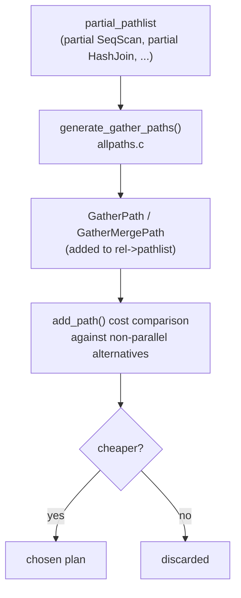

# Parallel Query Planning

PostgreSQL models parallelism as a first-class concern of the planner, not as a post-processing transformation. When the planner considers whether to parallelize a relation scan or join, it generates an alternative set of candidate paths — called partial paths — alongside the ordinary ones. Partial paths and their accompanying Gather nodes compete in the same cost-based comparison that governs all other planning decisions.

The execution side of parallel query — dynamic shared memory segments, worker process startup, tuple queues, and error propagation — is covered in [[subsystems/executor/parallel]]. This article focuses on how the planner decides whether to use parallelism and how many workers to request.

## Partial Paths and the Gather Node

The central planning abstraction is the *partial path*. A partial path is one that a single worker executes against a fraction of the work — not the full relation. A partial `SeqScan` does not scan the whole table; each worker claims independent block ranges as it runs, so the union of all workers' output covers the full table. The same concept applies to partial `IndexScan`, partial `HashJoin`, and partial `NestLoop`: each worker operates independently on its assigned portion and produces a subset of the total result.

Partial paths live in `RelOptInfo.partial_pathlist`, separate from the ordinary `pathlist`. The planner populates `partial_pathlist` during the same phase that builds ordinary paths — for example, `create_plain_partial_paths()` (`allpaths.c`) adds a parallel sequential scan. `create_index_paths()` adds parallel index scans where the index supports them. These paths carry a `parallel_workers` field indicating how many workers the plan should request.

A partial path alone does not produce a usable query plan. It must be wrapped in a `GatherPath` or `GatherMergePath`, which is the node that the leader process executes. The Gather node launches the workers, reads tuples from each worker through a message queue, and forwards them to the rest of the plan tree. `GatherMerge` does the same but merges pre-sorted streams from workers, preserving order.

`generate_gather_paths()` (`allpaths.c`) performs this wrapping. It iterates over `partial_pathlist`, creates a `GatherPath` over the cheapest partial path (since `Gather`'s output is always unordered, only total cost matters), and adds a `GatherMergePath` for each partial path that already carries useful pathkeys. These gathered paths are added to the relation's ordinary `pathlist` as full competitors:

```c
cheapest_partial_path = linitial(rel->partial_pathlist);
simple_gather_path = create_gather_path(..., cheapest_partial_path, ...);
add_path(rel, simple_gather_path);
```

The gathered path then competes on cost against the non-parallel alternatives. If the parallel plan is cheaper, it wins; if not, it is discarded. There is no special treatment — parallelism is just another option in the search space.



## The Cost Model for Parallel Plans

Two GUC parameters capture the overhead specific to parallel execution:

- `parallel_setup_cost` (default 1000.0): a one-time fixed cost charged to startup for launching workers and setting up shared memory. At the default, this is equivalent to reading 1000 sequential pages. It means parallelism is only chosen when the non-parallel plan is expensive enough that the speedup from additional workers outweighs this fixed overhead.
- `parallel_tuple_cost` (default 0.1): a per-tuple cost charged to run cost, reflecting the time to pass one tuple from a worker through the shared-memory message queue to the leader. Because this accumulates with every output tuple, queries that produce large result sets pay more for parallelism than queries that aggregate down to a few rows.

These defaults are intentionally conservative. An OLTP query fetching a few rows by primary key will almost never benefit from parallelism: the non-parallel plan cost is well below `parallel_setup_cost`, so the gathered path loses immediately in the cost comparison. Large analytical queries that scan millions of rows spread that setup cost across enormous savings.

`cost_gather()` (`costsize.c`) builds the total cost of a `GatherPath` by taking the subpath's costs and appending the parallel overhead:

```
startup_cost = subpath.startup_cost + parallel_setup_cost
run_cost     = subpath.run_cost + parallel_tuple_cost * output_rows
```

The subpath's costs are already *per-worker* costs, scaled down by the parallel divisor (see below), so the gathered path's total cost reflects what the leader sees: it pays setup once, then receives all the tuples through the queue.

`cost_gather_merge()` adds a heap-based merge cost on top of these, proportional to `N * log2(N)` for N streams (workers plus leader), because GatherMerge must interleave sorted streams using a priority queue.

### Worker Count and the Parallel Divisor

`compute_parallel_worker()` (`allpaths.c`) computes the number of workers a partial path requests. It takes the number of heap pages the scan expects to read and uses a threshold-doubling formula:

```
threshold = min_parallel_table_scan_size   (default: 8 MB, i.e. 1024 pages)
workers = 1
while heap_pages >= threshold * 3:
    workers++
    threshold *= 3
```

This produces roughly logarithmic scaling: 1 worker for tables above 8 MB, 2 workers above 24 MB, 3 above 72 MB, and so on. `min_parallel_index_scan_size` (default 512 kB) controls the same threshold for index-driven scans; the function takes the minimum of the heap and index worker counts when both are relevant.

The result is capped at `max_parallel_workers_per_gather` (default 2). If the table has a `parallel_workers` storage parameter set explicitly, that value overrides the entire calculation:

```sql
ALTER TABLE t SET (parallel_workers = 8);
```

This reloption is useful when the automatic calculation is wrong — for example, wide rows where the page count understates the actual work, highly compressed data where page count overstates it, or SSD storage where the per-worker speedup is different from the planner's assumptions. Setting it to 0 disables parallelism for that table entirely, even if the table is large.

Once the worker count is set on the path, `get_parallel_divisor()` (`costsize.c`) scales the per-worker cost. The divisor is not simply the worker count: the leader also participates in executing the parallel portion of the plan, contributing a fraction proportional to how much time it has left after servicing worker output. With 1 worker the leader typically contributes significantly; with 4 or more it is mostly busy reading from queues. The formula adds the leader's estimated contribution to the raw worker count:

```
leader_contribution = max(0, 1.0 - 0.3 * parallel_workers)
parallel_divisor    = parallel_workers + leader_contribution
```

At 4 workers, the leader contributes 0% and the divisor is exactly 4.0. At 1 worker, the leader contributes 70% and the divisor is 1.7 — meaning the parallel plan divides cost by 1.7, not by 2. This conservative estimate reflects empirical observation that the leader is partially occupied with coordination.

## Parallel Safety Classification

Before any partial path is generated for a relation, the planner checks whether the relation and its expressions are safe to execute in a parallel worker. This is the *parallel safety* classification. It operates at three levels:

- **PARALLEL SAFE**: the expression can run in any worker without restriction.
- **PARALLEL RESTRICTED**: the expression must run in the leader, not in a worker. It can appear in the plan tree above a Gather node, but not below one.
- **PARALLEL UNSAFE**: the expression prevents parallelism entirely for the sub-tree it appears in.

Every function in `pg_proc` has a `proparallel` column recording its classification. Built-in functions are classified by the core developers; user-defined functions default to UNSAFE unless marked otherwise with `PARALLEL SAFE` in `CREATE FUNCTION`. The planner calls `max_parallel_hazard()` (`clauses.c`) at the start of planning to scan the entire query tree for the worst hazard level. It records the result in `PlannerGlobal.maxParallelHazard`. If the query contains any UNSAFE construct, `parallelModeOK` is set false. No parallel paths are generated at all.

For individual expressions and nodes, `is_parallel_safe()` (`clauses.c`) checks whether a subtree is safe enough to push below a Gather. It recursively walks the expression, delegating per-function checks to `max_parallel_hazard_checker()`. Key cases that are not SAFE:

- **Volatile functions** (those with `provolatile = 'v'` and `proparallel = 'u'`): unsafe, because their side effects or non-determinism may not behave correctly when called from multiple workers simultaneously.
- **`nextval()` and sequence access** (`NextValueExpr` nodes): restricted, because sequence allocation is session-local and must remain in the leader.
- **Window functions**: restricted, because the row ordering within a partition may differ between workers, making window function results non-deterministic across workers.
- **`CoerceToDomain`**: restricted (conservatively), because domain constraints could theoretically contain unsafe expressions.
- **Subplans with parameters** (`SubPlan` nodes where `parallel_safe = false`): restricted, because the subplan state is not shared between workers.
- **CTEs and tuplestore scans**: unsafe, because the CTE's tuplestore is not shared across worker processes.
- **Temporary tables**: the relation itself is marked unsafe for parallelism, because workers cannot access the leader's local buffers.

The practical consequence is that RESTRICTED expressions float up to the leader side of the plan. They appear in the target list or WHERE clause of nodes above the Gather, while the partial subtree below the Gather contains only SAFE expressions.

To check an existing function's classification:

```sql
SELECT proname, proparallel FROM pg_proc WHERE proname = 'myfunc';
-- proparallel: 's' = safe, 'r' = restricted, 'u' = unsafe
```

## Workers Planned vs. Workers Launched

The most common source of confusion when inspecting parallel plans is seeing `Workers Planned: 4` in `EXPLAIN` output but `Workers Launched: 0` or `Workers Launched: 2` in `EXPLAIN ANALYZE`. The planner records how many workers it requested in the `Gather` node's `num_workers` field; the executor records how many it actually started. These diverge for several independent reasons.

**`max_parallel_workers_per_gather`** (default 2) is a session-level and cluster-level GUC that caps the workers requested per Gather node. If the planner computes 8 workers but this GUC is 2, the plan is built with 2 workers. Setting it to 0 disables parallelism entirely for the session — a common developer trick when debugging plans: `SET max_parallel_workers_per_gather = 0`.

**`max_parallel_workers`** (default 8) is a cluster-wide cap on the total number of parallel workers across all running queries. It is distinct from `max_worker_processes`, which limits the total number of background worker slots of all types. When `max_parallel_workers` active workers are already running, new Gather nodes launch zero workers — the query runs serially.

**`max_worker_processes` exhausted**: parallel workers are background workers registered via `RegisterDynamicBackgroundWorker()`. If all `max_worker_processes` slots are occupied by other background workers (logical replication workers, [[subsystems/background/autovacuum|autovacuum]] workers, custom extensions), `RegisterDynamicBackgroundWorker()` fails silently and `nworkers_launched` stays at zero. The Gather node then falls back to the leader executing the sub-plan directly.

**`dynamic_shared_memory_type = none`**: parallel execution requires a DSM segment for worker communication. Setting this GUC to `none` disables dynamic shared memory entirely, which disables all parallelism. This setting is rare in production but occasionally appears in minimal or embedded deployments.

**Small tables at plan time**: `compute_parallel_worker()` already returns 0 for tables below `min_parallel_table_scan_size`. This is a planning decision, not a runtime check — by the time execution begins, the worker count in the plan is fixed. A table that was large when the plan was cached may be empty at execution time, but the plan will still request workers. Conversely, a newly-grown table won't get parallel workers until the plan is replanned.

The executor's fallback is graceful throughout. `nodeGather.c` checks `nworkers_launched` after calling `LaunchParallelWorkers()` and sets `need_to_scan_locally = true` if no workers started — the leader executes the entire sub-plan itself, producing correct results at reduced throughput.

## When Parallelism Helps and When It Doesn't

Parallel query improves throughput when the non-parallel plan cost is large enough that dividing it across workers (minus the setup overhead) yields a real speedup. The cases where it consistently helps:

- **Large sequential scans**: the classic case. Each worker scans an independent range of blocks; the total I/O and CPU work divides nearly linearly across workers. Parallel aggregations (`COUNT`, `SUM`, `AVG`) benefit further because partial aggregation happens in each worker, dramatically reducing the tuples the leader must handle.
- **Parallel hash joins on large tables**: the build phase can be distributed across workers building independent hash tables (partial hash join). The probe phase runs in parallel against each worker's slice of the outer relation.
- **Full-table analytical queries**: any query that must visit most of the table benefits from dividing the row-processing work.

The cases where parallelism does not help or actively hurts:

- **OLTP queries**: a query that executes in 0.1 ms will not benefit from paying `parallel_setup_cost` (equivalent to 1000 sequential page reads) for workers that may not even start before the query finishes.
- **Index scan-dominated queries**: a query that fetches 10 rows via a primary key lookup has no large sequential work to divide. The index scan itself is PARALLEL SAFE, but the planner correctly computes that the setup cost exceeds any possible savings.
- **I/O-bottlenecked single-disk systems**: if the bottleneck is a single spinning disk, additional workers simply contend for the same device. Parallel query is most effective when either storage bandwidth scales with concurrency (multiple disks, RAID, NVMe) or when CPU processing is the binding resource.
- **Queries with PARALLEL UNSAFE nodes**: if any part of the query is unsafe, `parallelModeOK = false`. No parallel paths are generated. Calling a user-defined function that was not marked `PARALLEL SAFE` blocks the entire plan from being parallelized, even if only one minor expression uses it.
- **Queries with PARALLEL RESTRICTED expressions in hot paths**: a restricted expression above Gather is safe, but if the restricted expression is called per-row on a large input, the leader becomes the bottleneck regardless of how many workers run below.

The planner's conservative default for `parallel_setup_cost` is deliberate: it errs toward not parallelizing queries that are borderline. Lowering `parallel_setup_cost` or raising `min_parallel_table_scan_size` adjusts where the threshold falls. A DBA who knows that workers start quickly on their hardware (e.g., workers are pre-warmed) can lower `parallel_setup_cost` to make the planner more aggressive.

## Related Topics

- [[subsystems/executor/parallel|Parallel Executor]] — covers the runtime side of parallelism: DSM segments, worker startup, tuple queues, and error propagation that the planner's Gather node relies on.
- [[subsystems/planner/cost-model|Planner Cost Model]] — explains how `parallel_setup_cost`, `parallel_tuple_cost`, and the per-worker cost scaling fit into the broader cost estimation framework.
- [[subsystems/planner/partial-aggregation|Partial Aggregation]] — describes how aggregate functions are split into partial and finalize phases so each worker can aggregate its own slice before the leader combines results.
- [[subsystems/partitioning/partition-wise-join|Partition-Wise Join]] — an orthogonal parallelism strategy where joins are decomposed along partition boundaries rather than using Gather nodes.
- [[subsystems/partitioning/partition-wise-aggregate|Partition-Wise Aggregate]] — similarly decomposes aggregation across partitions, which interacts with parallel query planning when both strategies are considered.
- [[subsystems/background/bgworker|Background Workers]] — the infrastructure that launches parallel query workers; exhausting `max_worker_processes` slots here directly causes Workers Launched to fall short of Workers Planned.
- [[subsystems/storage/synchronized-scans|Synchronized Scans]] — the heap-level mechanism that allows multiple worker backends to share scan progress over a single relation without redundant block reads.
- [[subsystems/planner/join-ordering|Join Ordering]] — the join search that partial paths and Gather-wrapped paths compete within alongside their non-parallel counterparts.
- [[subsystems/planner/index-selection|Index Selection]] — the index path generation logic that also produces the parallel index scan paths considered alongside partial sequential scans.
