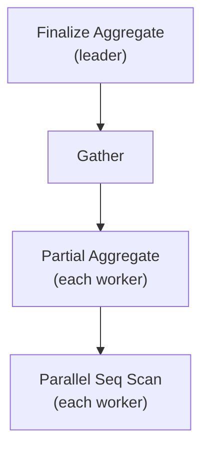
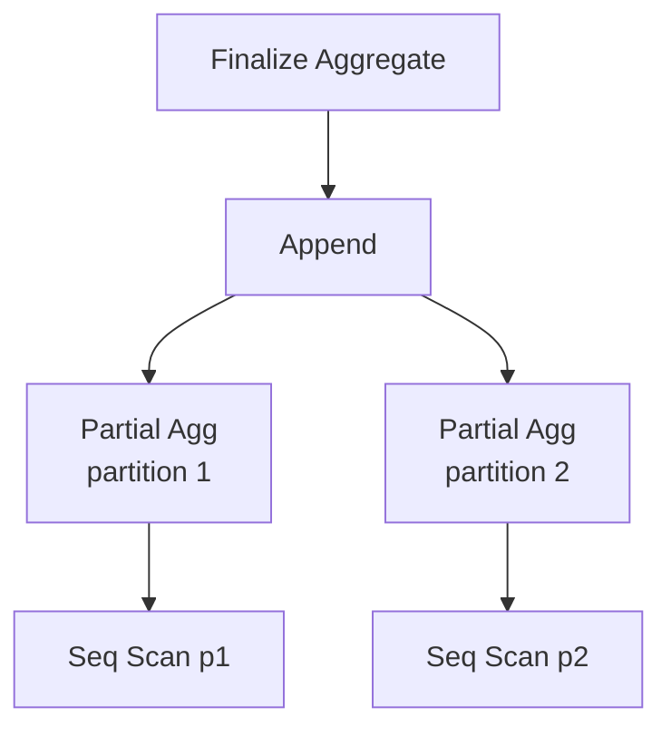

# Aggregation Strategies: Hash, Sort, Partial, and Partition-wise

When a query contains `GROUP BY` or aggregate functions, the planner must choose not just which access paths to use for the base relations, but also how to perform the aggregation itself. Three decisions dominate: whether to hash or sort the groups, whether to split aggregation across parallel workers, and whether to push aggregation down into individual partitions. Each decision interacts with the others. The planner evaluates all valid combinations before picking the cheapest overall plan.

The entry point is `create_grouping_paths()` in `planner.c`, which builds a new `RelOptInfo` (the `grouped_rel`) containing all candidate paths for the aggregated result. It delegates the actual path generation to `create_ordinary_grouping_paths()`, which generates hash-based, sort-based, and partial paths and adds them all to the relation. `set_cheapest()` at the end selects the winner.

## Hash Aggregate vs. Sort Aggregate

The two fundamental aggregation strategies trade memory for CPU work in opposite directions.

**Hash Aggregate** (`AGG_HASHED`) builds a hash table keyed on the GROUP BY columns. The executor hashes each input tuple, finds its matching entry in the table, and updates the per-group transition state in place. After all input is consumed, the planner emits one output row per hash table entry. This requires keeping the entire group state in memory simultaneously — O(distinct groups × entry size) — but it reads each input tuple exactly once with no sorting overhead.

**Sort Aggregate** (`AGG_SORTED`) requires the input to arrive in GROUP BY order. The executor then scans linearly, accumulating a transition state until the grouping key changes. At that point, the current group is finalised and a new one begins. Memory usage is bounded to a single group's state at a time, but a sort pass is needed first unless the input is already ordered (by an index scan or an earlier sort for the same keys).

The planner generates paths for both strategies when conditions allow — `enable_hashagg` must be on and the GROUP BY expressions must all be hashable for hash paths to be considered; `enable_sort` and sortable grouping keys are the analogous gate for sort paths. The planner then calls `cost_agg()` (`costsize.c`) for each candidate path and picks the cheaper one.

The memory threshold is the key heuristic for hash paths. `cost_agg()` calls `hash_agg_set_limits()` to compute a `mem_limit` (derived from `get_hash_memory_limit()`, which reads `work_mem`) and a `ngroups_limit`. The number of expected batches is:

```
nbatches = max(numGroups × hashentrysize / mem_limit,
               numGroups / ngroups_limit)
```

When `nbatches` is 1 — all groups fit in memory — the hash path is very attractive. When `nbatches > 1`, the cost model adds I/O cost for spill writes and reads, which can tip the balance toward the sort path. For GROUP BY with few distinct values on a large table, hash often wins; for high-cardinality grouping on a table that is already sorted or indexed on the GROUP BY columns, sort aggregate often wins.

## Hash Table Spilling to Disk

Before PostgreSQL 13, a hash aggregate that exceeded `work_mem` would fail at runtime with an out-of-memory error. Since PG 13, the executor instead spills overflow batches to disk using a partitioned approach (`nodeAgg.c`).

When the hash table grows beyond the memory limit, the executor calls `hash_agg_enter_spill_mode()`. From that point on, tuples that would create a new group are not inserted into the hash table — instead they are spilled to one of several temporary tapes, partitioned by a secondary hash of the group key. After the initial pass over the input completes, each spill tape is re-read and processed as a new batch. If a batch itself exceeds `work_mem`, it is spilled again recursively, using a fresh set of hash bits. HyperLogLog cardinality estimates track expected group counts in each partition to guide partitioning decisions.

`EXPLAIN ANALYZE` surfaces this behaviour through two output fields on the `Hash Aggregate` node:

```
Hash Aggregate  (cost=...) (actual rows=... loops=1)
  Batches: 4  Memory Usage: 8193kB
```

`Batches: 1` means everything fit in memory. `Batches: N` where N > 1 means N−1 spill batches were written and re-read. When you see spilling, raising `work_mem` for the session is usually the first remedy — doing so may eliminate the batches entirely if `work_mem` is large enough to hold all groups.

The cost model in `cost_agg()` accounts for expected spilling: for each level of recursive spilling, it adds both read and write I/O costs (with a 2× penalty on hash I/O compared to sequential I/O, reflecting worse OS cache behaviour), plus CPU cost for re-processing spilled tuples. This means the planner can prefer a sort path when heavy spilling is predicted, even before runtime.

## Partial Aggregation for Parallel Queries

Parallel query plans allow workers to scan disjoint chunks of the table simultaneously. Naively, each worker would need to send all its rows to the leader for a single final aggregation — negating most of the parallel speedup. Partial aggregation avoids this by letting each worker aggregate its own chunk independently, then sending only per-group partial states to the leader for a final combine step.

The plan shape looks like:



The two phases use different `AggSplit` values (`nodes.h`):

| Phase | AggSplit | What it does |
|---|---|---|
| Partial (worker) | `AGGSPLIT_INITIAL_SERIAL` | Runs the transition function; skips the final function; serialises the state if needed |
| Finalize (leader) | `AGGSPLIT_FINAL_DESERIAL` | Deserialises partial states; runs the combine function to merge them; runs the final function |
| Non-parallel | `AGGSPLIT_SIMPLE` | Runs transition + final function; no serialisation |

For `AVG(x)`, the partial phase accumulates a `(sum, count)` pair per group. The finalize phase receives one `(sum, count)` pair per worker per group, combines them by summing both components, then divides to produce the final average. The group key columns are passed through both phases so the leader can route each partial state to the right group.

### When Partial Mode Is Allowed

The planner's `can_partial_agg()` (`planner.c`) gates partial aggregation. It returns false in three cases:

- The query has neither aggregates nor a GROUP BY clause (nothing to parallelize).
- The query uses `GROUPING SETS` (parallel grouping sets are not currently supported).
- `root->hasNonPartialAggs` or `root->hasNonSerialAggs` is true.

These flags are set during aggregate preprocessing in `prepagg.c`. An aggregate is marked non-partial when it has no combine function (`aggcombinefn` in `pg_aggregate` is null). It is also marked non-partial when it requires ordered input: aggregates with `ORDER BY` or `DISTINCT` within the aggregate call defeat partial mode, because the transition function must see tuples in a specific order. An aggregate is marked non-serialisable when its transition type is `INTERNAL` but the aggregate lacks `aggserialfn`/`aggdeserialfn` — the partial state cannot be sent across a process boundary.

Most built-in aggregates — `SUM`, `COUNT`, `MIN`, `MAX`, `AVG`, `array_agg` — support partial mode. Custom aggregates must declare `combinefunc` and, when the transition type is `INTERNAL`, also `serialfunc` and `deserialfunc` in `CREATE AGGREGATE`.

When partial aggregation is possible, `create_grouping_paths()` sets the `GROUPING_CAN_PARTIAL_AGG` flag and passes it to `create_ordinary_grouping_paths()`, which generates both partial and non-partial paths. The partially-grouped relation is filled with `AGGSPLIT_INITIAL_SERIAL` agg paths (both hash and sort variants); the finalize step then wraps those through a Gather with `AGGSPLIT_FINAL_DESERIAL`. The planner costs all of these and picks the cheapest.

Other conditions that block partial aggregation in practice:

- A **security-barrier view** between the scan and the aggregate — security quals must be evaluated before rows leave the scan, preventing worker-level aggregation from moving above the barrier.
- A **volatile function in HAVING** — a volatile HAVING clause must be evaluated exactly once per group, which is incompatible with combining partial states across workers.

## Partition-wise Aggregate

When the source table is partitioned and the GROUP BY columns include all partition key columns, every row in a given group belongs to exactly one partition. The planner can therefore aggregate each partition independently and combine the results with an `Append` — no cross-partition sort or hash table is needed.

`create_grouping_paths()` sets `extra.patype = PARTITIONWISE_AGGREGATE_FULL` when `enable_partitionwise_aggregate` is on and the query has no `GROUPING SETS`. `create_ordinary_grouping_paths()` then checks whether the input relation is actually partitioned and whether the GROUP BY columns cover the partition key. If so, `create_partitionwise_grouping_paths()` iterates each live partition, calls `create_ordinary_grouping_paths()` recursively for each child, and assembles the per-partition grouped rels into an `Append`.

When the GROUP BY does not cover all partition key columns, rows from a given group can span partitions. The planner falls back to **partial partitionwise aggregate** (`PARTITIONWISE_AGGREGATE_PARTIAL`): each partition runs a partial aggregate (`AGGSPLIT_INITIAL_SERIAL`). The partial states are collected via `Append`. A final aggregate (`AGGSPLIT_FINAL_DESERIAL`) above the `Append` combines them. As the comment in `create_partitionwise_grouping_paths()` notes, this is less certainly a win. It helps when partial aggregation significantly reduces the number of rows flowing through the `Append`, and it hurts when groups are very small and numerous.



Full partition-wise aggregate requires no finalize step. Each partition emits fully aggregated rows, and the `Append` simply concatenates them. Partial partition-wise aggregate requires the extra combine pass shown above.

Partition-wise aggregate is disabled by default (`enable_partitionwise_aggregate = off`) because the additional planning time — generating and costing one grouped rel per partition — can be noticeable on tables with many partitions. Turn it on when the aggregate query is the critical path and the partition count is manageable.

## Reading EXPLAIN Output

Aggregation strategy choices are visible in `EXPLAIN (ANALYZE)` output:

| Output | Meaning |
|---|---|
| `Hash Aggregate` | Non-parallel hash aggregation |
| `HashAggregate  Batches: 1` | All groups fit in `work_mem` |
| `HashAggregate  Batches: N` (N > 1) | Hash table spilled to disk; N−1 batches written to temp files |
| `Group Aggregate` | Sort-based aggregation; sort node will appear below |
| `Partial HashAgg` | Worker-side partial hash aggregate in a parallel plan |
| `Finalize HashAgg` | Leader-side finalize step combining partial states |
| `Partial GroupAgg` | Worker-side partial sort aggregate in a parallel plan |
| `Finalize GroupAgg` | Leader-side finalize step for sort-based partial aggregate |

When a hash aggregate spills (`Batches > 1`), `Memory Usage` reports peak hash table size in that session. Increasing `work_mem` enough to accommodate all groups removes the spill: a reasonable target is roughly `dNumGroups × (tuple_width + 64 bytes overhead)` where `dNumGroups` is the actual distinct group count from a previous run.

## Related Topics

- [[subsystems/executor/aggregate|Aggregate Executor Node]] — the runtime implementation of hash and sort aggregation, including the transition/combine/final function call sequence that partial aggregation splits across workers
- [[subsystems/planner/parallel-query|Parallel Query]] — the broader parallel query framework that governs how workers are assigned, how Gather nodes are introduced, and the conditions under which partial aggregation is enabled
- [[subsystems/partitioning/partition-wise-aggregate|Partition-wise Aggregate]] — detailed coverage of the partition-wise aggregate optimisation that `create_partitionwise_grouping_paths()` implements
- [[subsystems/executor/work-mem-and-spill|work_mem and Spill]] — how `work_mem` governs hash table memory limits and when spill-to-disk batching is triggered for Hash Aggregate nodes
- [[sql-features/advanced-aggregation|Advanced Aggregation]] — SQL-level features such as `GROUPING SETS`, `ROLLUP`, and `CUBE` that interact with and constrain the planner's partial-aggregation decisions
- [[subsystems/planner/cost-model|Cost Model]] — the `cost_agg()` and `hash_agg_set_limits()` logic that determines whether a hash or sort aggregate path is chosen and how spill cost is estimated
- [[subsystems/executor/group-by|Group By Executor]] — the executor-level `Group` node used for sort-based grouping without aggregation, complementing the sort-aggregate strategy
- [[subsystems/planner/join-ordering|Join Ordering]] — the DP search that produces the input `RelOptInfo` fed into `create_grouping_paths()`.
- [[subsystems/partitioning/overview|Table Partitioning]] — partitioned table internals that partition-wise aggregate relies on.
- [[architecture/process-architecture|Process Architecture]] — parallel worker processes and how they exchange partial aggregate states via shared memory.
