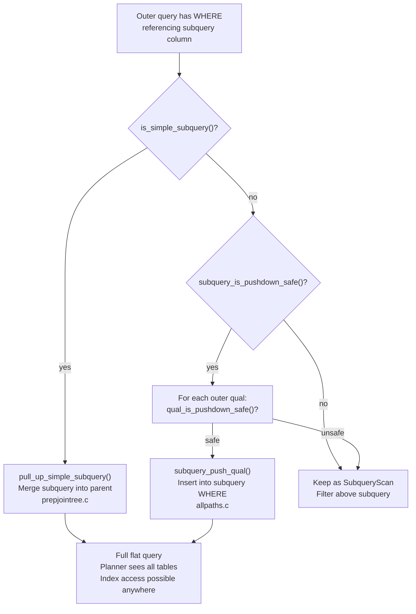

# Predicate Pushdown

When an outer query filters on a column produced by a subquery, that filter can often be moved inside the subquery so that the inner query sees fewer rows from the start. Moving `col = 5` from the outer WHERE into the body of the subquery is predicate pushdown. It matters because the inner query can then use an index on `col` rather than scanning everything and discarding rows above. Without pushdown, the executor sees a `SubqueryScan` that produces every row the inner query can emit, with the filter applied only after.

The planner pursues this in two distinct ways. Its first and strongest option is to dissolve the subquery boundary entirely — once the subquery is merged into the parent's join tree, there is no pushdown problem at all, because all predicates and all base tables are visible together. When that is not possible, the planner falls back to literally copying outer WHERE clauses into the subquery's own qual list before planning the subquery independently. Both mechanisms live in `prepjointree.c` and `allpaths.c`; both run before cost-based optimisation begins.

## Subquery Flattening

The primary path is subquery flattening (also called subquery unnesting), implemented in `pull_up_subqueries()` (`src/backend/optimizer/prep/prepjointree.c`). The function walks the query's FROM tree looking for `RTE_SUBQUERY` range-table entries. For each one it calls `is_simple_subquery()` to decide whether the inner query is safe to merge.

A subquery that passes the test is dissolved. The planner renumbers its range-table entries and appends them to the parent's range table. It replaces every Var in the parent that referenced the subquery RTE with the corresponding expression from the subquery's target list. The subquery's own FROM and WHERE nodes fold into the parent's join tree. From this point the planner sees a single flat query: it can push any filter to the earliest base table that supplies the required columns, use any index, and consider any join order across what were previously separate scopes.

The simplicity check in `is_simple_subquery()` is a list of disqualifying properties:

| Subquery feature | Why flattening is blocked |
|---|---|
| `hasAggs`, `groupClause`, `groupingSets`, `havingQual` | Aggregation defines group boundaries; row counts change and predicates interact with aggregation differently above versus below it |
| `hasWindowFuncs` | Window functions see their full partition; a predicate pushed inside would change which rows participate in each partition |
| `hasTargetSRFs` | Set-returning functions expand one input row into multiple output rows; the row counts are unpredictable from outside |
| `distinctClause` | DISTINCT may collapse multiple rows; predicates applied to the collapsed output have different semantics than predicates applied before deduplication |
| `sortClause` | ORDER BY in a subquery is only meaningful with LIMIT; without LIMIT the planner discards it, but its presence is a signal that the query author expected a specific ordering |
| `limitOffset`, `limitCount` | LIMIT/OFFSET restricts the row set; a join cannot replicate that restriction, so merging would change results |
| `setOperations` | UNION/INTERSECT/EXCEPT (other than simple UNION ALL, which has its own flattening path) |
| `cteList` | WITH clauses inside the subquery are not yet handled by this code path |
| `hasForUpdate` | FOR UPDATE locking must apply at the subquery's semantic level; scattering it would raise locking to the wrong point |
| `security_barrier` on the RTE | Scattering the subquery's Vars into the parent would allow the parent's WHERE to filter rows before the view's security quals run |

If the subquery is on the inner side of an outer join, flattening is also restricted: pulling the subquery up into the outer join's scope could cause predicates to move across the join boundary, changing null-extension semantics.

The pass is recursive. Before merging a subquery, `pull_up_simple_subquery()` runs `pull_up_subqueries()` on the child first, so nested simple subqueries are flattened from the inside out. The planner resolves a two-level stack of simple subqueries into a single flat query in one planning cycle.

## Qual Pushdown When Flattening Fails

When a subquery cannot be flattened, the planner still attempts to push individual outer WHERE clauses into the subquery's own qual list before planning the subquery. This happens inside `set_subquery_pathlist()` (`src/backend/optimizer/path/allpaths.c`), which is called when the planner generates access paths for an `RTE_SUBQUERY` relation.

The check has two layers. `subquery_is_pushdown_safe()` decides whether the subquery as a whole can accept pushed quals at all. If it returns true, the planner calls `qual_is_pushdown_safe()` on each individual outer clause to decide whether that specific clause is safe to push.

`subquery_is_pushdown_safe()` refuses the entire pushdown attempt if:

- The subquery has a LIMIT or OFFSET — pushing a filter inside would change the set of rows that LIMIT counts.
- The subquery has EXCEPT or EXCEPT ALL in its set operations — because filtering a set difference changes results differently than filtering the inputs.
- The subquery has nonempty `groupingSets` — because grouping-set expansion makes some grouping columns nullable by design, and a qual referencing such a column could be constant-folded incorrectly.

For subqueries with DISTINCT, window functions, or set-returning functions, `subquery_is_pushdown_safe()` sets `unsafeVolatile = true` rather than refusing outright. This means non-volatile predicates can still be pushed; volatile ones are blocked because extra evaluations would change results.

`qual_is_pushdown_safe()` then checks each candidate predicate:

- Clauses containing SubPlans are refused — the SubLink-to-SubPlan transformation has already run on the outer query but not inside the subquery, and mixing the two representations would be incorrect.
- If `unsafeVolatile` is set (due to DISTINCT, window functions, or SRFs), volatile-function-containing clauses are refused.
- If `unsafeLeaky` is set (because the subquery RTE has `security_barrier = true`), any clause that passes column values through non-leakproof functions is refused — it could leak information the security barrier is supposed to hide.
- Clauses referencing whole-row Vars of the subquery are refused.
- Clauses referencing subquery output columns that `check_output_expressions()` flagged as unsafe (for example, columns computed by set-returning functions) are refused.

`subquery_push_qual()` inserts predicates that pass into the subquery's WHERE clause before the subquery's own planning begins. Predicates that fail remain as filters on the `SubqueryScan` node in the outer plan.



## Pushdown Through Views

A regular view is not a planning concept at all. The rewrite system in `src/backend/rewrite/rewriteHandler.c` replaces every view reference with the view's definition text before the planner ever sees the query. The query reaches the planner with the view's underlying tables directly in its FROM clause, so predicate pushdown through a plain view is simply subquery flattening applied to what was the view's body. There is no separate mechanism and no performance distinction between writing the view inline and referencing the view by name.

Two view types are exceptions.

**Security-barrier views** (`CREATE VIEW ... WITH (security_barrier = true)`) are a hard fence. The `security_barrier` flag is set on the RTE that results from rewriting the view reference. `is_simple_subquery()` checks for `rte->security_barrier` and refuses flattening immediately. In `set_subquery_pathlist()`, when the RTE has `security_barrier = true`, the planner sets `safetyInfo.unsafeLeaky` to true, which causes `qual_is_pushdown_safe()` to refuse any clause that touches column values through non-leakproof functions. The reason is information security: the view's own WHERE clause must run before any outer predicate to prevent a caller from inferring the existence of rows they should not see. Outer predicates on leakproof operations (simple integer equality, range comparisons) are still allowed through, but anything that could reveal information through error messages or timing differences is blocked. See [[subsystems/planner/optimization-fences]] for a full treatment of security barriers.

**Views over set operations** produce subqueries with `setOperations` set, which `is_simple_subquery()` rejects. `subquery_is_pushdown_safe()` may still allow partial pushdown depending on whether the set operation is UNION, INTERSECT, or EXCEPT, and whether the subquery has a LIMIT.

## Pushdown Through Aggregation

When a subquery has GROUP BY and an outer predicate references one of the group keys, that predicate can be pushed inside — not as a HAVING clause, but as a WHERE clause that filters rows before aggregation. Fewer input rows reach the aggregation step, which can be substantially cheaper. This transformation happens as part of qual pushdown when `is_simple_subquery()` has blocked flattening (because `hasAggs` is true). The planner pushes predicates on GROUP BY keys into the subquery's WHERE clause; they then filter at the base-table scan level, potentially enabling index use.

Predicates that reference aggregated values — `COUNT(*) > 10`, `SUM(amount) >= 1000` — cannot be pushed inside. They must remain as HAVING conditions, applied after aggregation. The planner identifies which is which by checking whether the qual references any aggregate function (`contain_agg_clause()`). If it does, the qual stays in HAVING; if it references only GROUP BY keys and constants, it is a candidate for WHERE pushdown.

The HAVING-to-WHERE promotion for a query's own HAVING clause is a related but separate optimisation. In `subquery_planner()` (`src/backend/optimizer/plan/planner.c`), the planner walks the current query's `havingQual` before cost-based planning begins. The planner moves a HAVING clause to `parse->jointree->quals` when it does not reference an aggregate function, volatile function, or SubPlan, and when the query has a non-empty GROUP BY. This converts the clause from a post-aggregation filter to a pre-aggregation filter. The move is cheap to do at the query's own level and is done unconditionally when the conditions are met.

```sql
-- The outer predicate on a GROUP BY key is pushed inside
SELECT *
FROM (
    SELECT customer_id, COUNT(*) AS order_count
    FROM orders
    GROUP BY customer_id
) sub
WHERE sub.customer_id = 42;

-- After pushdown, equivalent to:
SELECT customer_id, COUNT(*) AS order_count
FROM orders
WHERE customer_id = 42
GROUP BY customer_id;
```

The pushed predicate filters the base scan on `orders` before grouping. An index on `customer_id` is now usable. Without pushdown, the aggregation would consume the entire `orders` table and the WHERE on `sub.customer_id` would filter a single output row at the end.

## JOIN Predicate Pushdown

For inner joins, the WHERE clause and the JOIN...ON clause are semantically equivalent. The planner treats them identically: both are distributed by `distribute_qual_to_rels()` (`src/backend/optimizer/plan/initsplan.c`) to the `baserestrictinfo` or `joininfo` of the relevant relations. A predicate that references only one relation becomes a restriction clause on that relation — it is pushed to the base-table scan. A predicate that references two or more relations becomes a join clause, evaluated when those relations are joined. The planner pushes each clause to the earliest point in the join tree where all its referenced relations are available. This is the natural consequence of the cost-based join search, not a separate transformation step.

For outer joins, the semantics differ and pushdown is constrained. A predicate in the WHERE clause that references the nullable side of a LEFT JOIN will often trigger outer join promotion (`reduce_outer_joins()` in `prepjointree.c`): if the predicate is strict — meaning it returns NULL or FALSE when the nullable-side columns are NULL — then the outer join cannot produce rows that satisfy the predicate anyway, so it is demoted to an inner join. Once demoted, the predicate can be freely pushed. See [[subsystems/planner/outer-join-promotion]] for the mechanics.

If the predicate is not strict (for example, `nullable_col IS NULL`), the outer join is not promoted and the predicate is not pushed inside the join. The outer join continues to produce null-extended rows, and the predicate filters those rows after the join.

A predicate that belongs in the ON clause of an outer join — one that the author intended to limit which rows match on the inner side without filtering outer rows that produce no match — must remain there. Moving it to the WHERE clause would change semantics: the WHERE clause runs after null-extension and rejects non-matching outer rows entirely, while the ON clause runs during the join and allows null-extended rows through.

## The enable_filter_pushdown GUC (PostgreSQL 17+)

PostgreSQL 17 introduced the `enable_filter_pushdown` GUC (defaulting to `on`) to control whether single-table filters from outer queries are pushed down into subqueries that cannot be fully flattened. Previously the qual pushdown path in `set_subquery_pathlist()` was always attempted when `subquery_is_pushdown_safe()` returned true. The GUC allows disabling it when pushdown produces plan regressions — situations where pushing a predicate causes the subquery to choose a worse access path than if the filter were applied above it. This is uncommon but has been observed with complex subqueries where the pushed predicate defeats an otherwise-good plan inside the subquery.

In PostgreSQL 16 and earlier, the pushdown is always attempted when safe; there is no GUC to suppress it.

## Reading EXPLAIN Output

EXPLAIN reveals whether pushdown succeeded or not.

When a subquery has been flattened, there is no `Subquery Scan` node in the plan at all. The subquery's tables appear directly in the join tree. Any filter appears as a `Filter` or index condition on the base-table scan node. This is the best outcome.

When flattening failed but qual pushdown succeeded, the subquery appears as a `Subquery Scan` in the plan. The pushed predicate appears inside the child of that node — typically as an `Index Cond` or `Filter` on the inner scan. The outer node shows no `Filter` for the pushed predicate:

```
Subquery Scan on sub
  ->  Index Scan using orders_customer_id_idx on orders
        Index Cond: (customer_id = 42)
```

When pushdown was blocked entirely, the subquery's child performs a full scan. The `Subquery Scan` node carries the predicate as its own `Filter`:

```
Subquery Scan on sub  (cost=...)
  Filter: (customer_id = 42)
  ->  Seq Scan on orders
```

The `Seq Scan` processes every row; only then does the `Filter` on the `Subquery Scan` node discard non-matching rows. An index on `customer_id` is invisible to this plan.

`EXPLAIN (VERBOSE)` adds output-column lists to each node, which makes it easier to trace which expressions are being evaluated at each level of the plan tree. For diagnosing whether a specific predicate was pushed, look for the predicate text appearing above or below the `Subquery Scan` boundary.

## Practical Implications

A subquery with no aggregation, DISTINCT, LIMIT, window functions, or set operations is almost certainly flattened. Writing `SELECT * FROM (SELECT * FROM t WHERE ...) sub WHERE sub.other_col = 5` is stylistically equivalent to writing the flat query directly — the subquery boundary vanishes at planning time and imposes no performance cost.

Once a subquery has aggregation, the boundary becomes real. Outer predicates on GROUP BY keys will be pushed inside (giving index access before aggregation), but predicates on aggregate output values will not. The outer query sees a `Subquery Scan` over the aggregated result. The plan for the inner query is determined independently. The inner query's access paths depend only on its own WHERE, not on whatever else the outer query does.

LIMIT in a subquery creates the most complete optimization barrier: no outer predicate can be pushed inside regardless of what it references, because any filter on the input would change the set of rows that LIMIT selects.

Security-barrier views are a similar hard boundary. Outer predicates pass through only when they contain no leakproof-function concerns; most real application predicates involve some function call that the planner treats conservatively.

## Related Topics

- [[subsystems/planner/restrict-info]] — RestrictInfo structures that carry individual predicates through the planner, including the distribution logic that pushes clauses to base relations
- [[subsystems/planner/equivalence-classes]] — how the planner propagates equality constraints across join boundaries, closely tied to how pushed predicates enable index use
- [[subsystems/planner/constraint-exclusion]] — compile-time elimination of partitions and child tables using CHECK constraints, a complementary mechanism to runtime predicate pushdown
- [[subsystems/partitioning/partition-pruning]] — runtime and plan-time pruning of partition branches using the same predicate information that drives pushdown
- [[subsystems/rewriter/overview]] — the rewrite stage that expands view references before the planner sees the query, making plain-view pushdown equivalent to subquery flattening
- [[subsystems/planner/join-elimination]] — removing joins whose output is unused, a related simplification pass that runs alongside subquery flattening in prepjointree.c
- [[subsystems/executor/subplan-nodes]] — the executor representation of subqueries that could not be flattened, showing what the plan tree looks like when pushdown fails
- [[subsystems/planner/subqueries|Subquery Planning and Flattening]] — the full mechanics of subquery flattening, SubPlan nodes, and semi-join conversion
- [[subsystems/planner/optimization-fences|Optimization Fences]] — security barriers, volatile functions, and other hard fences that block pushdown and other transformations
- [[subsystems/planner/outer-join-promotion|Outer Join Promotion]] — how strict predicates on the nullable side of an outer join cause the join to be promoted to an inner join
- [[subsystems/planner/ctes|Common Table Expressions (CTEs)]] — how CTEs interact with optimization and when `WITH` creates an optimization boundary
- [[subsystems/planner/cost-model|Planner Cost Model]] — how the planner costs the resulting paths after predicates have been distributed
