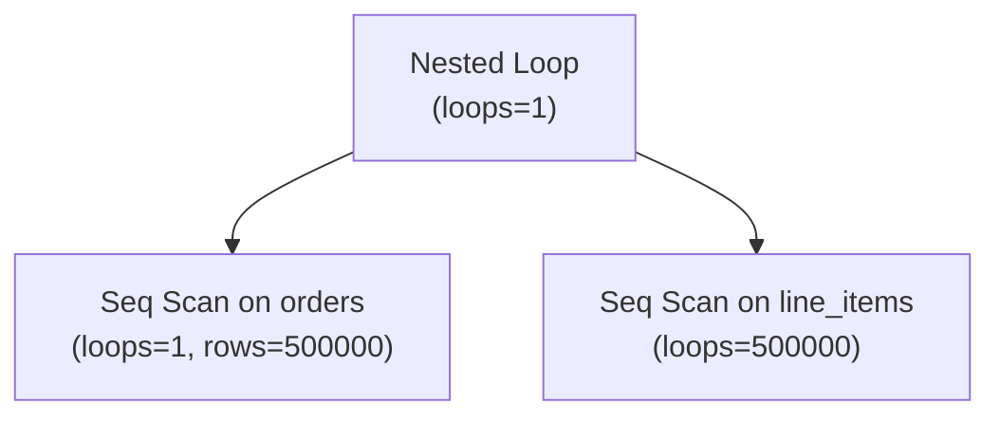

# Reading EXPLAIN Output

`EXPLAIN` renders the plan tree the planner chose for a query. `EXPLAIN ANALYZE` also executes the query and annotates each node with what actually happened. Understanding the output is the first step in almost any query performance investigation, because the plan is the primary artefact that connects a slow query to a fixable cause.

## Node structure and cost annotations

A plan is a tree of nodes. Each node is a unit of execution: a scan, a join, a sort, an aggregation. In the text output, indentation shows parent-child relationships — a node that is indented under another is its input. The top-level node is the one that sends rows to the client; everything below it feeds into it.

Every node opens with a line like:

```
-> Hash Join  (cost=212.50..4891.20 rows=8400 width=64)
```

The three annotations carry specific meanings:

**`cost=startup..total`** — These are the planner's estimates in cost units, where `seq_page_cost = 1.0` is the baseline (one sequential 8 kB page read). The startup cost is the work required before the first row can be emitted — for a hash join this is the entire cost of building the hash table; for a sequential scan it is zero. The total cost is the work to emit all rows. These numbers are not wall-clock times; they are unit-less and only meaningful relative to each other and to the cost parameters. See [[subsystems/planner/cost-model]] for the derivation of each node type.

The startup/total distinction matters when the query does not consume all rows. A `LIMIT 10` clause, an `EXISTS` check, or a correlated subquery that stops at the first match all benefit from low startup cost even if the total cost is higher. The planner interpolates the cost of fetching `k` rows from a node that would otherwise produce `N` as `startup + (total - startup) × k / N`.

**`rows=N`** — The planner's estimate of how many rows this node will emit. This is the single most diagnostic number in the output. It is derived from per-column statistics and the independence assumption, so it can be badly wrong whenever those assumptions fail. See [[subsystems/planner/statistics]] for how the estimate is computed.

**`width=N`** — The planner's estimate of the average output row width in bytes. This influences memory planning (hash table sizing, sort memory) but is rarely a direct source of plan mistakes.

## EXPLAIN ANALYZE additions

`EXPLAIN ANALYZE` actually runs the query and wraps each plan node with instrumentation (`InstrStartNode` / `InstrStopNode`, `instrument.c`). At the end of each loop, `InstrEndLoop` accumulates the time and tuple count into the node's `Instrumentation` struct. When the plan is printed, `ExplainNode` (`explain.c`) divides the accumulated totals by `nloops` to produce per-loop averages.

The text output extends each node line with:

```
-> Hash Join  (cost=212.50..4891.20 rows=8400 width=64)
              (actual time=18.432..143.701 rows=7923 loops=1)
```

**`actual time=startup..total`** — Wall-clock milliseconds from when the node was first entered to when it emitted its last row, divided by `loops`. These are real elapsed times, not cost units. Comparing them against the estimated `cost=` numbers is meaningless beyond a rough sanity check, because cost is a model and time is a measurement.

**`rows=N`** (actual) — Rows emitted by this node per loop, averaged across all loops. The ratio of actual to estimated rows at each node is the most useful signal in any plan analysis.

**`loops=N`** — How many times this node was executed. A nested loop join drives its inner side once per outer row, so the inner node's `loops` value equals the outer row count. Because the `actual time` displayed is per-loop, total time spent in a node is `actual time × loops`. A common mistake is to read the `actual time` of an inner node directly; on a nested loop with 10,000 outer rows, an inner node showing `actual time=0.050..0.090` actually consumed `0.090 × 10000 = 900 ms` in total.

**`never executed`** — A node that was in the plan but was never reached by the executor shows this instead of timing data (`nloops == 0` in `instrument.c`). This is normal for an inner side of a nested loop when the outer side returned no rows, or for one branch of an `Append` that was pruned at execution time.

The instrumentation itself adds overhead. Every node call records a `clock_gettime` on entry and exit (`InstrStartNode` / `InstrStopNode`). On queries with deep plans or very many rows, `EXPLAIN ANALYZE` can be measurably slower than bare execution. `EXPLAIN (ANALYZE, TIMING OFF)` disables the per-node timers but still collects row counts — useful when the timing overhead distorts the measurement or when you only care about row estimate accuracy.

## EXPLAIN (ANALYZE, BUFFERS)

Adding `BUFFERS` attaches page-level I/O counters to each node. The counters come from `BufferUsage` (`instrument.h`), which `InstrStartNode` snapshots at entry and `InstrStopNode` diffs against the post-execution global counters (`pgBufferUsage`). The result is the buffer activity caused by that specific node.

```
Buffers: shared hit=4321 read=890, temp read=1200 written=1200
```

**`shared hit=N`** — Pages found in `shared_buffers`. No I/O occurred; the page was already in the shared buffer pool.

**`shared read=N`** — Pages that were not in `shared_buffers` and had to be fetched from the OS or disk. When the OS page cache is warm, "read" here does not necessarily mean physical disk I/O, but it does mean a kernel call and memory copy rather than a pointer dereference into shared memory.

**`shared written=N`** — Pages dirtied and written during this query. Uncommon in pure read queries; appears when an update, delete, or HOT update touches pages.

**`temp read=N` / `temp written=N`** — Pages spilled to and read from temporary files. A non-zero value here is a strong signal: the node ran out of `work_mem` and had to use disk. Both sort nodes and hash joins spill to temp files when they exceed their memory budget.

The buffer counters are cumulative from the node's perspective: a child node's buffer activity is included in the parent's total as well. To isolate a single node's I/O, subtract its children's counters.

To diagnose whether a slow query is I/O-bound or CPU-bound: a high `shared read` count with modest CPU time points at cold data; a low `shared read` with high elapsed time points at CPU-heavy expression evaluation or a bad join strategy.

## The fundamental signal: estimated vs. actual rows

The single most reliable diagnostic in `EXPLAIN ANALYZE` output is the ratio of `actual rows` to estimated `rows` at each node. When they match, the planner's cost model was working from accurate information. When they diverge significantly, the planner almost certainly chose a suboptimal plan.

An underestimate (actual >> estimated) means the planner thought a node would emit fewer rows than it did. A hash join that expected 100 rows from the probe side but received 100,000 may have been sized with too few buckets, or a subsequent filter assumed to be selective was not. Underestimates on scan nodes usually trace to stale statistics — `ANALYZE` hasn't run since the table grew — or to correlated columns, where the planner multiplied two selectivities together assuming independence. Checking `pg_stats` for the relevant column (especially `n_distinct`, `most_common_vals`, and `histogram_bounds`) and comparing against the actual data distribution is the right starting point. The age of the statistics can be checked via `pg_stat_user_tables.last_analyze`. The table's age can be checked via `age(relfrozenxid)`.

An overestimate (actual << estimated) means the planner thought there was more work to do. This often results in a plan that's actually fast, because the planner chose a more expensive-looking strategy that turns out to be good. But overestimates can also lead to bad plans — for example, choosing a hash join over a nested loop because the estimated outer row count was high, when the actual count was small.

Extended statistics (`CREATE STATISTICS ... (dependencies, ndistinct, mcv)`) address multi-column correlation and multi-column distinct counts. Without them, the planner multiplies per-column selectivities independently, which systematically underestimates combined selectivity for correlated columns.

## Seq Scan on a large table

A sequential scan on a large table is the most visible sign of a missing or unusable index. There are three distinct causes, and each has a different fix.

If no index exists on the filter column, the scan is the only option. The fix is obvious.

If an index exists but the planner is not using it, the most common culprits are: a function wrapping the indexed column (`WHERE lower(email) = ...` cannot use a plain index on `email`; it needs a functional index), a type mismatch between the column and the literal (an index on an `integer` column cannot be used with `WHERE col = '42'::text`), or an implicit cast that prevents index use.

If an index exists and could in principle be used, but the planner prefers the sequential scan, the planner believes the filter is not selective enough to justify random I/O. This can happen when `random_page_cost` is calibrated for spinning disks (default 4.0) but the storage is an SSD (where 1.1–1.5 is more appropriate), or when table statistics are stale and the planner believes fewer rows exist than actually do.

To distinguish an unusable index from a planner preference, set `enable_seqscan = off` in a test session and re-run `EXPLAIN`. If the query now uses the index but is slower, the planner was right. If it is faster, the cost model is miscalibrated.

## Hash Batches > 1

A hash join builds an in-memory hash table from the inner relation, then probes it for each outer row. If the inner relation exceeds `work_mem`, the executor partitions both inputs to disk in multiple batches and processes them in sequence. `EXPLAIN ANALYZE` reports this as `Buckets: N  Batches: M` in the hash node. When `M > 1`, the join spilled to disk.

```
Hash  (cost=891.00..891.00 rows=50000 width=8) (actual time=142.301..142.301 rows=50000 loops=1)
      Buckets: 65536  Batches: 4  Memory Usage: 4096kB
```

Batching multiplies I/O: the inner relation is written and read once per batch cycle, and the outer relation is scanned once per batch. The performance cost is typically proportional to `Batches - 1` extra passes over the data. The root cause is insufficient `work_mem`. Raising `work_mem` (either globally or `SET work_mem = '...'` in the session) reduces or eliminates batching. Because `work_mem` is per-sort-or-hash-per-query, not per-session, raising it globally can multiply memory use substantially; targeted `SET` commands in known-slow queries or connection-level overrides for specific roles are safer.

## Sort spilling to disk

A sort node that cannot fit its input in memory spills to disk as an external merge sort. `EXPLAIN ANALYZE` reports the method used:

```
Sort  (actual time=3241.892..3598.124 rows=1000000 loops=1)
  Sort Key: created_at
  Sort Method: external merge  Disk: 82432kB
```

`Sort Method: quicksort` means it fit in memory. `Sort Method: external merge` means it did not. The cause is the same as hash join batching: `work_mem` is too small for the input. Incremental sort (`Sort Method: incremental sort`) is a variant that can avoid sorting the full input when the data is already partially ordered.

## High "Rows Removed by Filter"

After a scan fetches rows, a filter predicate is evaluated on each fetched row. Rows that fail the filter are discarded. `EXPLAIN ANALYZE` reports the discard count:

```
Seq Scan on orders  (actual time=0.021..834.210 rows=1023 loops=1)
  Filter: (status = 'shipped')
  Rows Removed by Filter: 4997810
```

Nearly five million rows were fetched and discarded. An index on `status` would convert this into an index scan that fetches only matching rows. The "Rows Removed by Filter" line is also shown for Index Scan nodes when a heap filter discards rows after they were fetched by the index — a sign that the index predicate is less selective than the additional filter. A partial index or a composite index including the filter column may help.

For a Bitmap Heap Scan, `Rows Removed by Index Recheck` is specifically the count of rows that passed the bitmap lookup but failed the actual heap-level predicate check. When this count is high, the bitmap was lossy: the executor did not have enough `work_mem` to store individual TIDs and had to store page-level granularity instead, causing entire heap pages to be fetched even though only a fraction of their rows matched.

## SubPlan nodes

A `SubPlan` node in the plan tree is a correlated subquery that is re-executed for each row of the outer query. The plan prints it inline:

```
-> Seq Scan on employees  (actual time=0.012..892.304 rows=100000 loops=1)
     Filter: (salary > (SubPlan 1))
     SubPlan 1
       -> Aggregate  (actual time=0.008..0.008 rows=1 loops=100000)
            -> ...
```

The `loops=100000` on the inner aggregate shows it ran once per outer row. Even if the inner query is cheap individually, multiplying by the outer row count makes it expensive in aggregate. Correlated subplans in `WHERE` clauses or `SELECT` lists are almost always better expressed as a `JOIN` or a lateral subquery, which lets the executor use set-based operations instead of row-by-row re-execution. The plan cost shown for a `SubPlan` represents one execution; the actual cost to interpret is `cost × outer_rows`, which the loops count makes explicit.

## CteScan nodes

When a CTE is materialised, the planner generates a `CteScan` node to read from the materialised result. Predicates from the outer query cannot be pushed into a materialised CTE; the CTE executes completely, stores all its output, and then the `CteScan` filters from that stored result. This is the "optimisation fence" property of CTEs before PostgreSQL 12, and it still applies whenever `MATERIALIZED` is explicit or whenever the CTE is referenced more than once.

```
CTE Scan on summary  (actual time=0.003..2341.892 rows=4 loops=1)
  Filter: (total > 10000)
  Rows Removed by Filter: 999996
```

Here the CTE computed a million rows, all of which were materialised, and then only four survived the outer filter. If the CTE is inexpensive and referenced only once, `WITH ... AS NOT MATERIALIZED` (PostgreSQL 12+) tells the planner to treat it as an inline subquery and push predicates in.

## Nested Loop with a large outer table

Nested loop joins are efficient when the outer side is small or the inner side has an index on the join column. Without an inner index, each outer row triggers a full inner scan.



In the diagram above, `line_items` is scanned 500,000 times. Even a cheap inner scan of 1 ms per iteration produces 500 seconds of total work. The fix is an index on the join column of `line_items`. Once the inner side uses an index scan, the inner `loops` count remains the same but each loop costs only the index probe rather than a full sequential scan.

## Gather / Gather Merge with workers=0

A parallel plan inserts a `Gather` or `Gather Merge` node above the parallelised work. The plan annotation shows how many workers were requested and how many were actually launched:

```
Gather  (actual time=0.892..4321.304 rows=50000 loops=1)
  Workers Planned: 4
  Workers Launched: 0
```

`Workers Launched: 0` means the parallel plan ran serially despite being planned for parallelism. The most common causes: `max_parallel_workers` was exhausted by other sessions; `max_parallel_workers_per_gather` was reduced or set to zero; the table was too small for the threshold in `min_parallel_table_scan_size`; or `max_parallel_workers` was set to zero at the session level. In this case, the plan still works correctly but gets none of the expected parallelism speedup.

## Reading timing data correctly

Because `actual time` is always per-loop, the total time a node consumed is `actual time × loops`. For the root node, `loops=1` always, so the total and per-loop times are identical. But inner nodes of a nested loop have `loops` equal to the outer row count, so a 0.050 ms inner node with 50,000 loops consumed 2,500 ms total — far more than the 134 ms shown for the root in the same plan.

When diagnosing a slow query, start from the node where `actual time × loops` is largest, not necessarily from the root. A quick pass through the tree multiplying each node's total time by its loops count surfaces where the real time is going.

```
EXPLAIN (ANALYZE, BUFFERS, FORMAT JSON)
SELECT ...
```

`FORMAT JSON` produces machine-readable output with all values as typed numbers rather than formatted strings, making it easy to extract `Actual Total Time × Actual Loops` for each node programmatically. Tools like `explain.depesz.com` and `pev2` consume this format. `FORMAT TEXT` is more readable interactively but harder to parse.

## Practical workflow

A structured approach keeps analysis from becoming guesswork.

First, run `EXPLAIN (ANALYZE, BUFFERS)` and identify the node with the highest `actual time × loops`. That is where the query spends its time, regardless of what the top-level cost numbers suggest.

Second, check the row estimate ratio at that node and its inputs. A large discrepancy — actual rows ten times or more above or below estimated — points to where the planner made a wrong assumption. Trace back to the base table scan contributing bad estimates: check `pg_stats` for the relevant columns, verify that `ANALYZE` has run recently (`pg_stat_user_tables.last_analyze`), and check whether extended statistics would help if multiple columns are involved.

Third, if buffer data shows heavy `shared read`, the query is I/O-bound. Options include increasing `shared_buffers`, warming the cache, adding or improving indexes, or checking whether `effective_cache_size` is set realistically.

Fourth, if temp I/O appears, identify whether it is from a sort or a hash join and raise `work_mem` accordingly — either for the session or by rewriting the query to reduce the input size to the expensive node.

Fifth, if the plan structure itself is wrong — a nested loop where a hash join should be, or a sequential scan where an index scan should be — check whether `random_page_cost` and `effective_cache_size` are calibrated for the actual storage hardware, and whether the statistics are current.

## Related Topics

- [[subsystems/planner/cost-model|Cost Model]] — explains the unit-less cost arithmetic behind the `cost=startup..total` annotations shown in every plan node
- [[subsystems/planner/statistics|Planner Statistics]] — covers how per-column statistics are collected and used to produce the `rows=N` estimates that drive plan choice
- [[subsystems/planner/stale-statistics-and-bad-plans|Stale Statistics and Bad Plans]] — diagnoses the most common source of row-estimate divergence visible in EXPLAIN ANALYZE output
- [[subsystems/planner/extended-statistics|Extended Statistics]] — describes multi-column statistics that fix correlated-column underestimates identified through explain analysis
- [[code-paths/explain|EXPLAIN]] — documents the executor-side structures (`Instrumentation`, `BufferUsage`) that populate the ANALYZE and BUFFERS sections
- [[subsystems/executor/work-mem-and-spill|Work Mem and Spill]] — details the `work_mem` budget that governs hash-join batching and sort spills reported in EXPLAIN ANALYZE
- [[troubleshooting/slow-queries|Slow Queries]] — practical troubleshooting guide that builds on EXPLAIN ANALYZE interpretation to resolve common performance problems
- [[subsystems/planner/join-ordering|Join Ordering]] — explains how the planner searches join orders, relevant when a Nested Loop or Hash Join node in EXPLAIN output looks suboptimal
- [[subsystems/planner/subqueries|Subquery Planning and Flattening]] — covers when subqueries are flattened into the main plan versus executed as separate SubPlan nodes seen in EXPLAIN output
- [[subsystems/planner/ctes|Common Table Expressions (CTEs)]] — explains the CteScan and materialization behavior behind the CTE-related plan nodes discussed here
