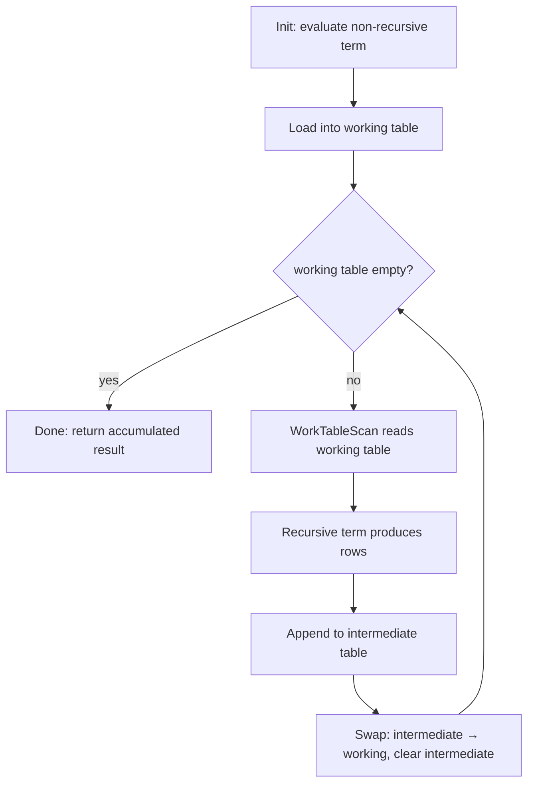

# Recursive Queries (WITH RECURSIVE)

## Syntax and Semantics

```sql
WITH RECURSIVE cte(col1, col2) AS (
    -- non-recursive term: seeds the working table
    SELECT ...
    UNION ALL
    -- recursive term: references cte, reads from working table
    SELECT ... FROM cte JOIN ...
)
SELECT * FROM cte;
```

The non-recursive term executes once. Its result set becomes the initial working table. The recursive term is then evaluated repeatedly: each iteration reads from the current working table (via `WorkTableScan`), produces new rows, and appends them to an intermediate table. At the end of each iteration, the intermediate table becomes the new working table. The executor then clears the intermediate table. Execution halts when an iteration produces zero rows.

The CTE name referenced inside the recursive term always refers to the working table of the current iteration, not the full accumulated result.

## UNION vs UNION ALL

| Combinator | Behavior | Cost |
|---|---|---|
| `UNION ALL` | Keeps all rows including duplicates | O(1) per row appended |
| `UNION` | Deduplicates across the entire accumulated result | Hash or sort over full result set each iteration |

`UNION` deduplication checks each new row against every row produced so far, not just the current iteration. For large or deep graphs this is extremely expensive. Prefer `UNION ALL`. Implement cycle detection manually (see below).

`UNION` also provides an implicit cycle-breaking guarantee: if the recursive term can only produce rows already in the result, it will produce zero new rows on the next iteration and terminate. This is useful for small graphs where correctness matters more than performance.

## Execution Model

The executor node is `RecursiveUnion` (plan node) backed by `RecursiveUnionState` (exec state). The working and intermediate tables are tuplestore-backed in-memory or disk-spilled stores.



`ExecRecursiveUnion` in `nodeRecursiveunion.c` drives this loop. The `WorkTableScan` plan node (`ExecWorkTableScan`) holds a pointer into the `RecursiveUnionState`'s working tuplestore and simply iterates it each time the recursive term is evaluated.

Key fields in `RecursiveUnionState`:
- `working_table` — tuplestore for the current iteration's input
- `intermediate_table` — tuplestore accumulating current iteration's output
- `intermediate_empty` — set to false when any row is appended; checked to detect termination

## Performance Characteristics

- Each iteration performs a **full sequential scan** of the working table via `WorkTableScan`. There is no index access on the recursive self-reference.
- Inner joins on the recursive side (e.g., joining the CTE against a base table to look up children) **can** use indexes on the base table. The working table itself is always scanned linearly.
- Total heap fetches scale as O(depth x branching_factor). Each level of depth re-reads the working table. With `UNION ALL`, the working table contains only the rows from the previous level.
- The executor stores working table contents in a tuplestore. For large result sets the tuplestore will spill to disk (`work_mem` governs the threshold), dramatically increasing I/O.

For trees with high fan-out at shallow depths, the working table stays small. Performance is good. For graphs with many cycles or very deep traversal, performance degrades linearly with depth.

## Depth Limiting

### Explicit depth counter

```sql
WITH RECURSIVE tree AS (
    SELECT id, parent_id, 1 AS depth
    FROM nodes
    WHERE parent_id IS NULL
  UNION ALL
    SELECT n.id, n.parent_id, t.depth + 1
    FROM nodes n
    JOIN tree t ON n.parent_id = t.id
    WHERE t.depth < 100
)
SELECT * FROM tree;
```

The recursive term evaluates `WHERE t.depth < 100` before rows enter the intermediate table. This cuts off runaway recursion early.

### CYCLE clause (PG14+)

```sql
WITH RECURSIVE graph AS (
    SELECT id, neighbor_id
    FROM edges
    WHERE id = 1
  UNION ALL
    SELECT e.id, e.neighbor_id
    FROM edges e
    JOIN graph g ON e.id = g.neighbor_id
)
CYCLE neighbor_id SET is_cycle USING path
SELECT * FROM graph WHERE NOT is_cycle;
```

`CYCLE col SET flag USING path` automatically carries a path array. It sets `is_cycle = true` when a value repeats in the path. The planner rewrites this into an explicit path-array check before PG14 executor changes take effect. It is syntactic sugar over the manual approach.

## Cycle Detection Pre-PG14

```sql
WITH RECURSIVE graph AS (
    SELECT id, ARRAY[id] AS path
    FROM nodes
    WHERE id = 1
  UNION ALL
    SELECT n.id, g.path || n.id
    FROM nodes n
    JOIN graph g ON n.parent_id = g.id
    WHERE NOT (n.id = ANY(g.path))
)
SELECT * FROM graph;
```

The `path` array grows by one element per level. The `NOT (n.id = ANY(path))` check prevents re-visiting any node already in the current path. Array operations are O(depth) per row, so for deep graphs this adds up.

## Common Use Cases

### Org chart / category tree

```sql
WITH RECURSIVE org AS (
    SELECT id, name, manager_id, 0 AS level
    FROM employees WHERE manager_id IS NULL
  UNION ALL
    SELECT e.id, e.name, e.manager_id, o.level + 1
    FROM employees e JOIN org o ON e.manager_id = o.id
)
SELECT level, name FROM org ORDER BY level, name;
```

### Graph reachability

```sql
WITH RECURSIVE reachable AS (
    SELECT dst FROM edges WHERE src = 42
  UNION  -- UNION for implicit cycle breaking on small graphs
    SELECT e.dst FROM edges e JOIN reachable r ON e.src = r.dst
)
SELECT dst FROM reachable;
```

### Bill of materials (BOM)

```sql
WITH RECURSIVE bom AS (
    SELECT component_id, 1::numeric AS qty
    FROM assemblies WHERE product_id = 999
  UNION ALL
    SELECT a.component_id, b.qty * a.qty
    FROM assemblies a JOIN bom b ON a.product_id = b.component_id
)
SELECT component_id, SUM(qty) FROM bom GROUP BY component_id;
```

### Date series generation (non-recursive alternative preferred)

```sql
-- Prefer generate_series() for date ranges; recursive CTE shown for illustration
WITH RECURSIVE dates AS (
    SELECT '2024-01-01'::date AS d
  UNION ALL
    SELECT d + 1 FROM dates WHERE d < '2024-01-31'
)
SELECT d FROM dates;
```

Use `generate_series('2024-01-01'::date, '2024-01-31', '1 day')` instead — it is faster and simpler.

## Materialization

Recursive CTEs are **always materialized** — the executor must store the working table as a real tuplestore to support iterative evaluation. This is not configurable.

This differs from non-recursive CTEs. Since PG12, the planner can inline (un-materialize) non-recursive CTEs when it is safe to do so. `NOT MATERIALIZED` is the default when the CTE is referenced once and has no side effects. Adding `MATERIALIZED` to a non-recursive CTE forces a tuplestore, which acts as an optimization fence. Recursive CTEs have no such option; they are always fenced.

## When NOT to Use Recursive CTEs

- **Bounded depth with few levels**: a chain of `LEFT JOIN` on an adjacency list is simpler. It also lets the planner use indexes at every level.
- **Cycles without explicit detection**: without `CYCLE` or a path array, a graph with cycles will loop indefinitely.
- **Very deep trees (>1000 levels)**: the working table accumulates level-by-level. At depth 1000, each iteration scans up to 1000 x fan-out rows. Consider a closure table or ltree extension instead.
- **Large flat result sets**: if the query ultimately returns millions of rows, materialization into a tuplestore spills to disk. A plain query with an index may be faster.

## Practical Guidance

- Always use `UNION ALL` unless you need implicit cycle breaking on a small, well-bounded graph. Implement cycle detection with a path array or the `CYCLE` clause.
- Add a depth counter and a `WHERE depth < N` guard on any recursive query that touches production data until you have proven the depth is bounded.
- Check `EXPLAIN` for `WorkTableScan` — it always shows `rows=1` in the estimate because the planner cannot predict iteration count. Actual row counts from `EXPLAIN (ANALYZE, BUFFERS)` are the only reliable signal.
- Index the join column on the base table (e.g., `parent_id`), not the CTE reference. The CTE working table is always scanned sequentially; the base table join can use an index.
- For hierarchical data queried frequently, consider `ltree` (path-based), `intarray` with a closure table, or a materialized path column — these avoid recursive execution entirely.
- [[subsystems/executor/work-mem-and-spill|work_mem]] controls when the tuplestore spills to disk. For recursive queries over large graphs, increasing `work_mem` per session can prevent spill.

## Related Topics

- [[subsystems/planner/ctes|CTEs (Common Table Expressions)]] — covers non-recursive CTEs, inlining behaviour since PG12, and the `MATERIALIZED` / `NOT MATERIALIZED` options that contrast with the always-materialized recursive form.
- [[subsystems/planner/optimization-fences|Optimization Fences]] — explains why recursive CTEs act as hard fences that prevent the planner from pushing predicates through the working table boundary.
- [[subsystems/executor/subquery-values-worktable-scan|Subquery, VALUES, and WorkTableScan]] — documents the `WorkTableScan` executor node that reads the working table on each recursive iteration.
- [[subsystems/executor/tuplestore|Tuplestore]] — describes the tuplestore infrastructure used to hold the working and intermediate tables, including when and how it spills to disk.
- [[subsystems/executor/work-mem-and-spill|work_mem and Spill]] — details the `work_mem` threshold that governs when recursive-query tuplestores overflow to temporary disk files.
- [[sql-features/ctes|CTEs (SQL Feature)]] — user-facing overview of CTE syntax, scoping rules, and when to prefer CTEs over subqueries or derived tables.
- [[subsystems/planner/temp-tables-vs-ctes|Temp Tables vs CTEs]] — compares the runtime and planning trade-offs of recursive CTEs against alternatives such as temporary tables and closure tables.
- [[subsystems/executor/sort|Sort]] — the general-purpose sort executor node; a query that adds `ORDER BY` on top of a recursive CTE still needs this node, since the working table's iteration order is not a meaningful sort order.
