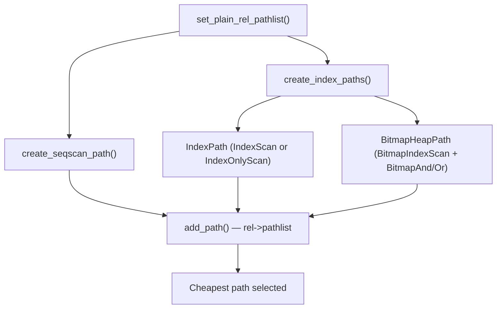

# Scan Type Selection

For every base relation in a query, the planner must decide how to read the rows from it. The four fundamental scan types — sequential scan, index scan, bitmap heap scan, and index-only scan — cover the space from "read everything" to "read almost nothing from the heap". Choosing the wrong one is often the most impactful planning mistake in practice, because the cost difference between a sequential scan and an index scan on a selective predicate can be several orders of magnitude.

The decision is not an explicit if-else chain. `set_plain_rel_pathlist()` in `allpaths.c` generates all applicable scan paths for the relation and adds each to `rel->pathlist` via `add_path()`. `add_path()` prunes dominated paths — those that are more expensive in both startup and total cost than an existing path. The final plan uses whichever survivor has the lowest total cost after the full path enumeration.



## Sequential Scan

A sequential scan reads every page of the relation in heap order, applying WHERE clauses as a post-read filter on each tuple. It never uses an index. Its startup cost is zero — the first tuple is available after the first page read. Its total cost scales directly with the physical page count and stored tuple count (`cost_seqscan()`, `costsize.c`):

```
disk_cost  = seq_page_cost * rel.pages
cpu_cost   = (cpu_tuple_cost + qual_eval_cost) * rel.tuples
total_cost = disk_cost + cpu_cost
```

The CPU component charges for every stored tuple, not just those that pass the filter, because the executor cannot apply the filter until it reads the tuple. This matters for wide, sparse tables where the filter rejects most tuples.

The sequential scan's advantage is that it is immune to the penalty of uncorrelated heap access: every read is sequential by definition. When selectivity is high — a large fraction of rows match — an index scan would have to fetch most heap pages anyway, but it would fetch them in random order at `random_page_cost` each rather than `seq_page_cost`. The crossover is roughly when the expected heap page fetches from an index scan exceed the table's page count (scaled by the `random_page_cost / seq_page_cost` ratio). With the defaults of 4.0 and 1.0, the sequential scan starts to win at selectivities above roughly 20–30% of a large table, though the exact threshold depends on correlation, caching, and index overhead.

## Index Scan

An index scan descends the B-tree to the first matching leaf entry, then fetches heap tuples one at a time by following their TIDs (tuple identifiers). Each heap fetch is a random I/O in the general case: successive matching index entries may point to tuples scattered across unrelated heap pages. The cost in `cost_index()` has two parts: the index traversal cost (supplied by the index AM's `amcostestimate` function), and the heap fetch cost.

The heap fetch cost is where correlation matters most. `pg_stats.correlation` measures how closely the physical order of tuples in the heap matches the order of the index. A value of 1.0 means the heap is perfectly sorted by the index key. Each successive heap fetch lands on the next sequential page. A value of 0.0 means the index order is completely uncorrelated with heap order. Every fetch may hit a cold page. The planner computes `csquared = indexCorrelation²` and interpolates between two extreme cost estimates:

```
max_IO_cost = pages_fetched * random_page_cost          -- csquared = 0
min_IO_cost = random_page_cost
            + (pages_fetched - 1) * seq_page_cost        -- csquared = 1

heap_IO_cost = max_IO_cost + csquared * (min_IO_cost - max_IO_cost)
```

`pages_fetched` here is not simply `selectivity * relPages`. It uses the Mackert-Lohman formula (`index_pages_fetched()`, `costsize.c`) to account for cache re-use. When the same heap page is likely to be in the shared buffer pool or OS page cache on a second access, the cost model does not charge for it again. The formula apportions the `effective_cache_size` across all tables and indexes in the query, giving each its pro-rated cache budget `b`. When `b` is large relative to the table size, the cost model finds many heap pages in cache. The effective fetch count is then much smaller than the raw estimate.

The practical implication: index scans are competitive primarily at low selectivity (few rows match) and at high correlation (the index order mirrors heap order). A freshly `CLUSTER`ed table behaves almost like sequential I/O through an index, which is why `CLUSTER` can dramatically change plan selection. On an unclustered table with moderate selectivity, the index scan's random I/O cost often makes the bitmap heap scan or even a sequential scan cheaper.

## Bitmap Heap Scan

The bitmap heap scan splits the work into two phases to solve the random-I/O problem of plain index scans.

In the first phase (`BitmapIndexScan`), the executor uses the index to build a bitmap of heap page numbers that contain at least one matching tuple. This phase uses the same index traversal as an index scan, but instead of immediately fetching heap tuples, it records only the page numbers. The executor builds the bitmap in index order. Doing so costs the same as traversing the index, but it defers all heap access. The entire first-phase cost is startup cost.

In the second phase (`BitmapHeapScan`), the executor sorts the bitmap into physical page order. It then reads the heap pages sequentially. Because the executor visits heap pages in physical order, the access pattern is much closer to sequential than in a plain index scan. The executor rechecks the WHERE conditions against each tuple after the heap fetch. This is necessary because the bitmap records pages, not individual tuples. A matching page may therefore contain non-matching tuples.

The planner models the per-page cost of the second phase as an interpolation (`cost_bitmap_heap_scan()`, `costsize.c`):

```
cost_per_page = random_page_cost
              - (random_page_cost - seq_page_cost) * sqrt(pages_fetched / T)
```

When the executor fetches only a handful of pages, cost approaches `random_page_cost`. When it fetches nearly all pages, cost approaches `seq_page_cost`. This nonlinear transition reflects the fact that, at high page coverage, the bitmap-sorted access order looks increasingly sequential.

Bitmap scans are most competitive in the moderate-selectivity range where an index scan would generate too much random I/O but a sequential scan would read too much irrelevant data. On a table backed by a hard disk with `random_page_cost = 4.0`, the bitmap scan can win over an index scan at selectivities as low as a fraction of a percent. On SSDs with `random_page_cost = 1.5`, the advantage narrows considerably. The random I/O penalty that the bitmap scan avoids becomes much smaller.

When the bitmap grows too large to fit in [[subsystems/executor/work-mem-and-spill|work_mem]], it degrades to a "lossy" bitmap. In a lossy bitmap, individual bit entries represent pages rather than tuples. In lossy mode, the recheck step is mandatory and more expensive, but the scan still works correctly.

## BitmapAnd and BitmapOr

The planner can handle a WHERE clause with multiple index-eligible predicates joined by AND by combining individual bitmap index scans. `choose_bitmap_and()` in `indxpath.c` evaluates whether combining two or more `BitmapIndexScan` results into a `BitmapAnd` node reduces total cost. Each contributing index builds its own page bitmap. `BitmapAnd` intersects them. The intersection is more selective than any individual bitmap. The executor fetches only pages that appear in every input bitmap. The planner tries each index as an "AND group leader" and incrementally adds other indexes only when doing so reduces the estimated total cost (`bitmap_and_cost_est()`).

For OR predicates, `generate_bitmap_or_paths()` generates `BitmapOr` nodes, where the union of the contributing bitmaps covers all pages matching any branch of the OR. This is important for queries like `WHERE status = 'active' OR priority = 'high'` when neither predicate alone has a good enough index.

In both cases, the executor rechecks the actual heap tuple after the heap fetch, because the page-level bitmap is a conservative superset. A page may be included because one predicate matches, even if the AND of all predicates does not.

## Index-Only Scan

An index-only scan returns column values directly from the index without fetching heap tuples at all, when the index contains every column the query needs. It is structurally identical to a plain index scan at the path level — the same `IndexPath` struct in `pathnodes.h`, with `path.pathtype = T_IndexOnlyScan`. However, `cost_index()` reduces the estimated heap fetch count by the fraction of the table that is all-visible according to the visibility map.

```
adjusted_pages_fetched = pages_fetched * (1.0 - allvisfrac)
```

`allvisfrac` is the fraction of the heap's pages currently marked all-visible in the visibility map, meaning all transactions can see every tuple on those pages. For pages in that set, the index-only scan can return data without touching the heap. For pages not yet marked all-visible, the executor falls back to a heap fetch to verify tuple visibility — these are the "heap fetches" reported as `Index Only Scan` with `Heap Fetches: N` in `EXPLAIN (ANALYZE)`.

`check_index_only()` in `indxpath.c` determines eligibility for an index-only scan. It collects every attribute referenced anywhere in the query — the SELECT list, WHERE clauses, ORDER BY, GROUP BY — and checks whether all of them are covered by columns in the index that support returning data (`canreturn[i]` in `IndexOptInfo`). If even one referenced column is absent from the index, the planner does not attempt an index-only scan. Standard B-tree indexes support `canreturn` for all key columns; GiST and GIN indexes generally do not, so index-only scans on those are rare.

The table below summarises when each scan type has a natural advantage:

| Scan type | Favored when |
|-----------|-------------|
| SeqScan | Selectivity is high (many rows match); table fits in a few pages; no usable index |
| IndexScan | Selectivity is very low (few rows); index is well-correlated with heap order; `random_page_cost` is low (SSD) |
| BitmapHeapScan | Moderate selectivity; uncorrelated index; OR/AND of multiple indexes needed |
| IndexOnlyScan | All needed columns are in the index; table has high `allvisfrac` (frequent VACUUM) |

## How the Planner Weighs the Options

All four scan types enter the competition through `set_plain_rel_pathlist()` and `create_index_paths()`. `set_plain_rel_pathlist()` always generates the SeqScan path. For each applicable index, `create_index_paths()` generates an `IndexPath` (possibly as `T_IndexOnlyScan` if eligible) and adds it to the bitmap candidate list. It also calls `choose_bitmap_and()` to generate the best `BitmapHeapPath` from all available bitmap index candidates. The planner submits all paths to `add_path()`, which discards a path if another path dominates it in both startup and total cost.

The key levers in this competition:

**Selectivity** is the fraction of rows the planner estimates the WHERE clause will return. It comes from `pg_statistic` data collected by `ANALYZE`. The lower the selectivity, the more attractive any index-based scan becomes, since it reads fewer heap pages.

**`random_page_cost` / `seq_page_cost` ratio** is the single most important tuning parameter for scan selection. The default ratio of 4.0 reflects spinning-disk assumptions. On NVMe SSDs, values like 1.1 to 1.5 are more accurate. Lowering this ratio shifts the cost model toward preferring index scans and away from sequential scans and bitmap scans at moderate selectivities.

**Index correlation** (available in `pg_stats.correlation`) adjusts how much the cost model penalizes the index scan's heap fetch cost for random access. A correlation of ±1.0 essentially eliminates the random penalty. A correlation near 0 maximises it. When `pg_stats.correlation` is close to zero for an index, the planner assigns nearly the full `random_page_cost` per heap fetch, making the bitmap scan or sequential scan more attractive at moderate selectivities.

**`effective_cache_size`** controls how aggressively the Mackert-Lohman formula credits cache hits for repeated index-lookup pages. A larger value reduces the estimated fetch count for index scans on large but frequently-queried tables. This parameter should reflect the actual combined size of `shared_buffers` and the OS file cache, not just `shared_buffers`.

**`allvisfrac`** shifts the index scan cost toward the index-only scan cost. Tables with frequent `VACUUM` have high `allvisfrac` and make index-only scans especially cheap.

## Practical Diagnosis

When `EXPLAIN` shows a SeqScan where you expected an index scan, a structured approach resolves most cases:

1. Confirm the index exists with `\d tablename`. A missing or dropped index is common.
2. Check whether `ANALYZE` ran recently. Stale statistics can wildly overestimate selectivity, making the planner think most rows will match.
3. Check whether the WHERE clause actually matches the index. A function applied to the indexed column (`WHERE lower(name) = 'alice'`) bypasses a plain B-tree index on `name`. You need a functional index on `lower(name)` instead. Implicit casts can have the same effect.
4. Check `pg_stats.correlation` for the index column. A correlation near zero with a large table and default `random_page_cost = 4.0` may make the index scan genuinely more expensive than a sequential scan.
5. Try `SET random_page_cost = 1.5`. Re-run `EXPLAIN`. If the plan switches to an index scan, the storage is faster than the default assumes.

When an index-only scan reports a large number of heap fetches in `EXPLAIN (ANALYZE)`, the visibility map is stale. The executor must then verify visibility by touching the heap. Running `VACUUM` on the table will update the visibility map and reduce heap fetches on subsequent executions. A table with heavy write traffic may never reach a high `allvisfrac` and will always incur heap fetches even with a covering index. In that case, a plain index scan is little more expensive and requires no special upkeep.

`EXPLAIN (BUFFERS)` adds per-node buffer hit and read counts. Comparing `Buffers: shared hit=N read=M` against the cost model's assumptions is the most direct way to confirm whether `effective_cache_size` is calibrated correctly. A plan where nearly all pages are cache hits but the planner estimated mostly cold reads suggests `effective_cache_size` is set too low.

## Related Topics

- [[subsystems/planner/bitmap-scans|Bitmap Scans]] — deeper treatment of BitmapAnd/BitmapOr path generation and when the planner prefers a bitmap heap scan over a plain index scan.
- [[subsystems/planner/cost-model|Cost Model]] — the underlying cost formulas (`seq_page_cost`, `random_page_cost`, `cpu_tuple_cost`) that drive every scan-type comparison.
- [[subsystems/planner/index-selection|Index Selection]] — how the planner picks which index to use once the scan type is known, covering partial indexes and expression indexes.
- [[subsystems/indexes/index-only-scans|Index-Only Scans]] — detailed mechanics of visibility-map checks, `allvisfrac`, and the heap-fetch fallback reported by `EXPLAIN (ANALYZE)`.
- [[subsystems/planner/selectivity-estimation|Selectivity Estimation]] — how row-count estimates are derived from `pg_statistic`, directly controlling which scan type wins the cost comparison.
- [[subsystems/planner/stale-statistics-and-bad-plans|Stale Statistics and Bad Plans]] — explains why `ANALYZE` staleness causes the planner to misjudge selectivity and choose a sequential scan over an available index.
- [[subsystems/executor/seq-scan|Sequential Scan]] — executor-level view of how a SeqScan node reads heap pages and evaluates filter quals tuple by tuple.
- [[subsystems/indexes/index-am|Index Access Method Interface]] — the generic `IndexAmRoutine` interface that every index type implements; `cost_index()` and `create_index_paths()` call into it to estimate and generate index scan paths.
- [[subsystems/storage/page-layout|Page Layout]] — the fixed-size page format that underlies both the heap pages a SeqScan reads sequentially and the index pages an IndexScan traverses.
- [[subsystems/storage/visibility-map|Visibility Map]] — tracks the all-visible bit that `allvisfrac` is derived from, which is what makes an Index-Only Scan cheaper than a plain index scan.
