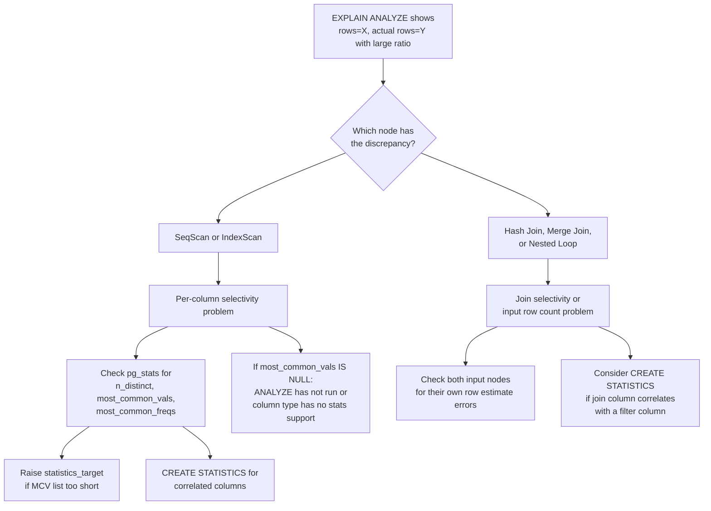

# Selectivity Estimation: Patterns, Joins, and Combining Predicates

The [[subsystems/planner/statistics]] article covers the foundation: what ANALYZE collects and how single-column equality, range, and null predicates are estimated using MCV lists and histograms. This article covers the cases that fall outside that model — pattern matching, join selectivity, array membership, and the mechanics of combining multiple predicates. These are where estimation errors are most common and most consequential.

## LIKE and pattern matching

LIKE selectivity is handled by `patternsel_common()` in `like_support.c`. The key to understanding it is that its quality depends entirely on whether the pattern has a fixed prefix.

`pattern_fixed_prefix()` examines the pattern constant and classifies it into one of three states: `Pattern_Prefix_Exact` (the pattern matches exactly one string, e.g., `'abc'` with no wildcards), `Pattern_Prefix_Partial` (the pattern begins with a constant string followed by wildcards, e.g., `'abc%'`), or `Pattern_Prefix_None` (the pattern begins with a wildcard, e.g., `'%abc'` or `'%abc%'`).

For an exact-match pattern, the estimator delegates to `var_eq_const()` — ordinary equality selectivity using the MCV list or histogram. For a partial prefix, `patternsel_common()` constructs equivalent range bounds from the prefix (a pattern `'abc%'` is equivalent to `col >= 'abc' AND col < 'abd'`). It then uses histogram-based range selectivity to estimate the fraction of the column covered by that prefix. It then multiplies the prefix selectivity by a heuristic remainder estimate for the post-prefix portion of the pattern, computed by `like_selectivity()` using character-level constants (`FIXED_CHAR_SEL = 0.20` per literal character, `FULL_WILDCARD_SEL = 5.0` per `%`, clamped to 1.0). When the histogram has at least 100 entries, `patternsel_common()` also tries a direct histogram scan, applying the LIKE operator against histogram boundary values. It then blends that result with the heuristic estimate proportionally.

For `Pattern_Prefix_None`, none of this is possible. There are no histogram boundaries to locate a prefix against. The heuristic `like_selectivity()` computation starts from a baseline of 1.0 and degrades only for literal characters. A leading `%` discards those characters. The estimator falls back directly to `DEFAULT_MATCH_SEL = 0.005` — 0.5% — regardless of actual data distribution.

This means that the accuracy of LIKE estimates splits cleanly:

- `col LIKE 'abc%'` — the planner uses histogram range selectivity; quality depends on statistics target
- `col LIKE '%abc'` or `col LIKE '%abc%'` — always returns 0.5%, independent of statistics

ILIKE uses the same `patternsel_common()` path with `Pattern_Type_Like_IC`. `SIMILAR TO` and `~` (POSIX regex) also go through `patternsel_common()` with `Pattern_Type_Regex` or `Pattern_Type_Regex_IC`. Regex patterns can sometimes yield a fixed prefix (e.g., `'^abc.*'`). Complex patterns with alternation or anchors that prevent prefix extraction fall back to `DEFAULT_MATCH_SEL` the same way.

For join clauses, pattern operators always return `DEFAULT_MATCH_SEL` — the histogram-based prefix path is not attempted (`like_support.c`, `like_regex_support()`).

The practical consequence for suffix or infix search is that the planner chronically underestimates or overestimates depending on the actual selectivity relative to 0.5%. A column where 30% of values contain a particular substring will be estimated at 0.5%, pushing the planner toward plans that assume a tiny result set. pg_trgm indexes add their own selectivity estimation support function that can do better for trigram-indexed columns. Using it requires the index to exist and the query to be eligible to use it.

## Join selectivity

The join selectivity estimator for equality joins is `eqjoinsel_inner()` in `selfuncs.c`. It estimates the fraction of the Cartesian product that satisfies `A.x = B.y`, which the planner multiplies by `outer_rows * inner_rows` to get the join output row count.

When both columns have MCV lists in their statistics tuples, the estimator iterates over all pairs of MCV values. It sums the products `freq_A[v] * freq_B[v]` for values that appear in both lists — the `matchprodfreq` accumulator. Values in one MCV list that have no match in the other contribute to `unmatchfreq`. The non-MCV remainder of each side contributes to `otherfreq`. The non-MCV portions are then combined using the distinct-count formula: the unmatched portion of each side is assumed to be uniformly distributed among the remaining `ndistinct - num_mcv_matches` values. This makes the probability that a random non-MCV row from relation A matches a random non-MCV row from relation B approximately `1 / max(ndistinct_A, ndistinct_B)`. The total selectivity is computed from both relations' perspectives. The smaller estimate is used.

When MCV lists are unavailable for either side, the estimator falls back to:

```
selectivity = (1 - nullfrac_A) * (1 - nullfrac_B) / max(ndistinct_A, ndistinct_B)
```

This formula reflects the "smaller side determines" reasoning. If relation B has 10,000 distinct values and relation A has 500, each value of A should match on average `B_rows / 10000` rows of B. The selectivity from A's perspective is therefore `1/10000`. Taking the minimum of the two perspectives (equivalent to dividing by the max ndistinct) is an upper bound that assumes most values participate in the join.

The join selectivity model assumes no correlation between the join column and any filter column applied to either input. A plan with `WHERE a.status = 'active' AND a.id = b.fk_id` estimates the join selectivity of the `id = fk_id` condition independently of how `status = 'active'` has already filtered relation A. If the active rows have a very different id distribution from the full table, the ndistinct and MCV data — which were collected over all rows — will produce a wrong estimate. Extended statistics (`CREATE STATISTICS ... (dependencies)`) can help when multiple filter columns within a single table are correlated. There is no mechanism, however, for describing cross-table correlations.

The row count of a join node in EXPLAIN output (`rows=N`) is computed as:

```
join_rows = outer_plan_rows * inner_plan_rows * join_selectivity
```

A large discrepancy at a Hash Join or Merge Join node — where the plan row count is much smaller than the actual rows — indicates that either the input row estimates were wrong (producing a wrong product), or the join selectivity itself is wrong (too small a fraction), or both.

## IN and = ANY selectivity

`scalararraysel()` in `selfuncs.c` handles `col = ANY(array)` and the SQL `IN` form, which the parser rewrites as `ScalarArrayOpExpr`. The approach depends on what kind of array expression is present.

For a literal array constant (e.g., `col IN (1, 2, 3)`), the array is deconstructed into individual elements. The per-element equality selectivity is computed for each value using the normal `eqsel()` path — including MCV lookup — and the individual selectivities are combined with the inclusion-exclusion formula for OR: `P(col=1 OR col=2 OR col=3) = s1 + s2 - s1*s2 + ...`. The result is clamped to 1.0.

For a non-constant array expression (a subquery result, a function call, a parameter), the estimator has no concrete values to look up. It asks the underlying operator's selectivity function for a single estimate against a dummy right-hand operand. It then applies that single-element estimate 10 times as if for a 10-element array, using the inclusion-exclusion accumulation. This "10 elements" assumption comes from `estimate_array_length()`. That function returns a hardcoded 10 for expressions it cannot evaluate statically.

For an `ARRAY[...]` constructor expression (as opposed to a literal constant), the elements are a list of expression nodes. If those nodes can be reduced to constants by `estimate_expression_value()`, the same element-by-element path is used. If not, the 10-element fallback applies.

The practical consequence is that `IN (1, 2, 3)` benefits from MCV statistics for each literal value. It produces a sum of three independent MCV lookups. `= ANY($1)` — a bind parameter containing an array — always produces the 10-element heuristic estimate instead, regardless of the actual array length or values. If the array at runtime has 10,000 elements, the estimate may be off by orders of magnitude.

## Combining multiple predicates

AND predicate lists go through `clauselist_selectivity_ext()` in `clausesel.c`. The function first attempts to apply extended statistics — if the predicates reference a single relation and that relation has `pg_statistic_ext` entries. It then removes clauses that were covered by extended statistics from the remaining work. The uncovered clauses are then combined by multiplying their individual selectivities:

```
P(A AND B AND C) = P(A) * P(B) * P(C)
```

This independence assumption is the root of the multi-column estimation problem described in [[subsystems/planner/extended-statistics]]. The multiplication is exact only when the columns are genuinely independent. For correlated columns, the product is smaller than the true selectivity (too pessimistic). This leads the planner to underestimate rows and, potentially, to choose loop-heavy plans expecting a tiny result.

`clauselist_selectivity_ext()` also has a range-query optimization: when it detects a pair of inequality predicates on the same column (e.g., `x > 34 AND x < 42`), it uses a more accurate combined formula rather than multiplying two independent range selectivities. Each individual inequality selectivity represents a tail of the distribution (`hisel` is the fraction below the high bound, `losel` is the fraction below the low bound), and the range selectivity is:

```
range_selec = hisel + losel + nullfrac - 1.0
```

This avoids the double-counting that would occur from multiplying two independent range selectivities against each other.

OR predicate lists go through `clauselist_selectivity_or()`. The formula is the standard inclusion-exclusion approximation:

```
P(A OR B) = P(A) + P(B) - P(A) * P(B)
```

The `P(A) * P(B)` term estimates the overlap using the same independence assumption used for AND clauses. For three or more arms, the accumulation iterates: `s = s + s_new - s * s_new`. This is a recursive application of the two-arm formula. Extended statistics are also tried first for OR lists when all clauses reference the same relation.

The asymmetry between AND and OR errors is worth noting. The independence assumption causes AND combinations to underestimate (the product is smaller than reality when columns are positively correlated). OR combinations overestimate instead (the overlap term `P(A)*P(B)` is too large when columns are positively correlated, subtracting too much). In practice, AND-underestimation drives more plan problems because it causes join planners to allocate undersized hash tables and choose nested loops over hash joins.

## Default selectivities when no statistics exist

When `ANALYZE` has never run on a table, or when a column's statistics tuple is absent, `clause_selectivity()` falls back to constants defined in `src/include/utils/selfuncs.h`:

| Predicate type | Constant | Value |
|---|---|---|
| `col = constant` | `DEFAULT_EQ_SEL` | 0.5% |
| `col < constant` | `DEFAULT_INEQ_SEL` | 33.3% |
| `col > b AND col < c` | `DEFAULT_RANGE_INEQ_SEL` | 0.5% |
| `col LIKE pattern` | `DEFAULT_MATCH_SEL` | 0.5% |
| `col IS NULL` | `DEFAULT_UNK_SEL` | 0.5% |
| `col IS NOT NULL` | `DEFAULT_NOT_UNK_SEL` | 99.5% |

These defaults exist to ensure that index scans remain attractive (the comments in `selfuncs.h` note that the developers chose a default equality selectivity of 0.5% to make index scans look beneficial for typical table densities of ~100 tuples/page). The defaults are wildly wrong for most real tables and distributions.

The `DEFAULT_EQ_SEL` value of 0.5% is also tied to `DEFAULT_NUM_DISTINCT = 200`: if a column has exactly 200 distinct values in a uniform distribution, then `1/200 = 0.005`. The estimator computes equality selectivity for a value not in the MCV list as `(non-MCV fraction) / (ndistinct - num_mcv)`. When no statistics are available, `DEFAULT_EQ_SEL` is the fallback for both the numerator and denominator being unknown.

The `rows=1` estimate visible in EXPLAIN output for a table that clearly has many matching rows is the classic symptom of missing statistics: `DEFAULT_EQ_SEL` on several columns multiplied together gives a number so small that even a large table rounds to 1 row.

## Diagnosing estimation errors



The investigation starts with `EXPLAIN ANALYZE` and focuses on which plan node first shows a large gap between estimated and actual rows. A factor of 2–3× is noise; a factor of 100× or more is a sign of a structural estimation failure.

Per-column statistics are inspected via `pg_stats`:

```sql
SELECT attname, n_distinct, most_common_vals, most_common_freqs,
       correlation, null_frac
FROM pg_stats
WHERE tablename = 't' AND attname IN ('col1', 'col2');
```

Key signals:
- `most_common_vals IS NULL` — statistics were never collected or the column type does not support MCV storage; run `ANALYZE` or check if the column type has a `pg_operator` entry with `eqsel` registered
- A short `most_common_vals` array on a highly skewed column — raise the statistics target with `ALTER TABLE t ALTER COLUMN col SET STATISTICS 500` and re-run `ANALYZE`
- A very low `n_distinct` (e.g., 5) on a column that the planner treats as high-cardinality — stale statistics after a data load; run `ANALYZE`

For LIKE patterns, check whether the pattern has a fixed prefix. If the application generates patterns like `'%keyword%'` or `'%keyword'`, no statistics-based improvement is possible — the estimate will always be 0.5%. If patterns are consistently of the form `'prefix%'`, the histogram selectivity path applies and a higher statistics target will help.

For join selectivity problems, confirm that ANALYZE has run on both joined tables and that the join columns have reasonable `n_distinct` values. If the join column is a foreign key and the referenced table has far fewer distinct values than the referencing table, the `MIN(1/nd1, 1/nd2)` formula should produce a reasonable estimate. Still, verify that neither side is using a stale `n_distinct` that predates a large data change.

## Related Topics

- [[subsystems/planner/statistics|Planner Statistics]] — the foundation layer this article extends: what ANALYZE collects, how MCV lists and histograms are built, and how single-column estimates are produced
- [[subsystems/planner/extended-statistics|Extended Statistics]] — CREATE STATISTICS and how functional dependencies, ndistinct coefficients, and MCV lists for column groups correct the independence assumption in clauselist_selectivity
- [[subsystems/planner/cost-model|Cost Model]] — how selectivity estimates are multiplied by tuple costs and page I/O costs to produce the path costs the planner minimises
- [[subsystems/planner/stale-statistics-and-bad-plans|Stale Statistics and Bad Plans]] — practical guide to identifying when outdated pg_statistic data is the source of estimation errors and corrective actions
- [[subsystems/planner/or-clauses|OR Clauses]] — how OR predicate lists are transformed and estimated, complementing the clauselist_selectivity_or coverage here
- [[subsystems/planner/array-multirange-selfuncs|Array and Multirange Selectivity Functions]] — selectivity estimation for array operators and multirange types, adjacent to the scalararraysel path described here
- [[code-paths/analyze|ANALYZE]] — the code path that populates pg_statistic, determining what data is available for all selectivity estimation
- [[subsystems/planner/index-selection|Index Selection]] — how per-column selectivity drives index vs sequential scan choices.
