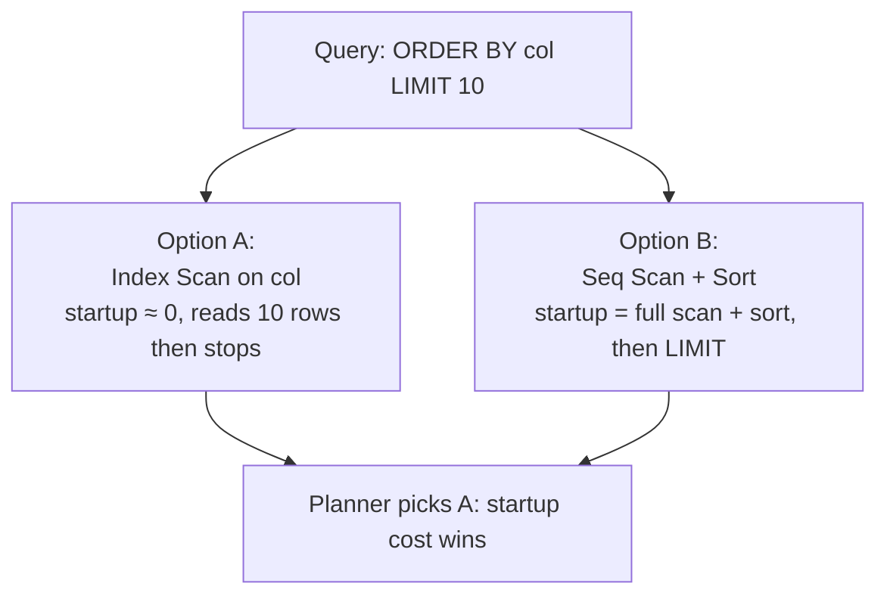

# Sort Avoidance

Sorting millions of rows is one of the most expensive things a query can do. A Sort node on a large relation typically requires O(N log N) comparisons. When the data exceeds `work_mem`, it spills to disk as an external merge sort that appears in `EXPLAIN ANALYZE` as `Sort Method: external merge Disk: NkB`. Eliminating the sort entirely — by choosing a scan or join path that already delivers rows in the required order — can turn a query from slow to instant.

The planner tracks the sort order of every candidate path using a uniform abstraction called pathkeys. This representation is expressive enough to recognise ordering opportunities that would otherwise be invisible: an index scan on column `a` can satisfy an `ORDER BY b` if `a = b` is a join condition. Understanding pathkeys explains when the planner chooses index scans over sequential scans, merge joins over hash joins, and when a Sort node will or will not appear in a plan.

## PathKeys: the Sort-Order Abstraction

A `PathKey` (defined in `src/include/nodes/pathnodes.h`) is a pair of (EquivalenceClass, sort direction). Every path in the planner carries a `pathkeys` list — a list of `PathKey` nodes — that describes the sort order of that path's output. The first element is the primary sort key, the second is the secondary, and so on. An empty list means the path's output is in no particular order.

```c
typedef struct PathKey
{
    EquivalenceClass *pk_eclass;  /* the value that is ordered */
    Oid          pk_opfamily;     /* btree opfamily defining the ordering */
    int          pk_strategy;     /* BTLessStrategyNumber (ASC) or BTGreaterStrategyNumber (DESC) */
    bool         pk_nulls_first;
} PathKey;
```

The key design choice is that a `PathKey` references an `EquivalenceClass` rather than a specific expression. An EquivalenceClass groups expressions that the planner knows are equal throughout the query — typically because of join conditions or `WHERE` clauses. If the query contains `JOIN orders o ON o.customer_id = c.id`, then `o.customer_id` and `c.id` belong to the same equivalence class. A path sorted on `o.customer_id` and a path sorted on `c.id` therefore carry the same `PathKey`. This is the mechanism by which the planner recognises that an index scan on `customers.id` can satisfy an `ORDER BY c.id` after a join — both expressions point to the same EC, and therefore to the same PathKey pointer.

Because PostgreSQL maintains exactly one canonical `PathKey` per (EC, opfamily, strategy, nulls_first) combination per query, equality between PathKeys reduces to pointer comparison (`compare_pathkeys()`, `pathkeys.c`). This makes pathkey matching cheap and exact.

The planner's `PlannerInfo` struct tracks several dedicated pathkey lists:

| Field | What it represents |
|---|---|
| `query_pathkeys` | The pathkeys the final plan must satisfy (ORDER BY, or GROUP BY if that drives ordering) |
| `group_pathkeys` | Pathkeys for the GROUP BY clause |
| `sort_pathkeys` | Pathkeys for the ORDER BY clause |
| `distinct_pathkeys` | Pathkeys for DISTINCT |
| `window_pathkeys` | Pathkeys for the bottom window function's ORDER BY |

`standard_qp_callback()` (`planner.c`) assigns `query_pathkeys` using a priority order: if there is a sortable GROUP BY, group_pathkeys wins; otherwise window_pathkeys; otherwise distinct_pathkeys (if longer than sort_pathkeys); otherwise sort_pathkeys. The planner optimises toward a single target ordering at a time.

## How Indexes Provide Pathkeys

When `create_index_paths()` (called from `indxpath.c`) generates a candidate index scan path, it calls `build_index_pathkeys()` (`pathkeys.c`) to compute that scan's pathkeys. `build_index_pathkeys()` iterates over the index's key columns in order and looks each one up in the query's EquivalenceClasses. If a key column appears in an EC — meaning it is referenced somewhere in the query — the function creates a canonical PathKey for it. It drops columns that don't appear in any EC, because the planner has no use for ordering by them. The direction of the PathKey reflects the index's sort order. A backward index scan can reverse this direction.

This means an index scan on `(col ASC)` in forward direction gets `pathkeys = [{EC(col), ASC}]`. A backward scan of the same index gets `pathkeys = [{EC(col), DESC}]`. If the index is defined as `(a ASC, b ASC)`, the scan gets pathkeys `[{EC(a), ASC}, {EC(b), ASC}]` — but only up to the last column that participates in an EC, and only while columns are added contiguously. Stopping early is correct: once the planner encounters an index column with no EC match, lower-order columns cannot be useful for ordering (they would be sorted within groups defined by the missing column, which no one asked for).

## Matching Pathkeys to ORDER BY

`pathkeys_contained_in(keys1, keys2)` (`pathkeys.c`) tests whether `keys2` satisfies `keys1` — that is, whether a path with pathkeys `keys2` is at least as well sorted as required by `keys1`. It uses `compare_pathkeys()`. That function walks both lists simultaneously and compares elements by pointer. If `keys1` is a prefix of `keys2`, or if they are equal, the check passes.

During planning, the planner calls `get_cheapest_path_for_pathkeys()` (`pathkeys.c`) to find the lowest-cost path from a set of candidates whose pathkeys satisfy a given requirement:

```c
Path *
get_cheapest_path_for_pathkeys(List *paths, List *pathkeys,
                                Relids required_outer,
                                CostSelector cost_criterion,
                                bool require_parallel_safe)
```

The function iterates over `paths` and calls `pathkeys_contained_in()` for each. Among matching paths, it picks the one with the lowest cost by the specified criterion (startup or total). If no matching path exists, it returns NULL. The planner must then add a Sort node.

`create_sort_path()` (`pathnode.c`) adds a Sort. It wraps an unordered path in a `SortPath` and calls `cost_sort()` to estimate its cost. The resulting sorted path then competes normally with any pre-sorted paths on cost. The pre-sorted path must offer enough benefit (by avoiding the sort) to compensate for any higher scan cost it carries.

For queries with a LIMIT, the comparison uses `get_cheapest_fractional_path_for_pathkeys()` instead. This function weights startup cost more heavily. A plan that already produces sorted output starts returning rows immediately. A sequential scan or hash join, by contrast, must process all rows before the Sort can emit its first output. For `ORDER BY col LIMIT 10`, this tradeoff almost always favours an index scan on `col`, even if the index scan's total cost would be higher than the sequential scan's.

## GROUP BY, DISTINCT, and Streaming Aggregation

The planner considers two strategies for `GROUP BY`: hashing (HashAgg, which requires no particular input order) and sorting followed by streaming aggregation (GroupAgg, which processes one group at a time as long as input arrives sorted). `create_grouping_paths()` (`planner.c`) generates candidate paths for both strategies and compares their costs.

When an available path already carries pathkeys matching the GROUP BY columns — because an index provides the ordering, or because a join delivers sorted output — the planner can build a GroupAgg path directly on top of it without inserting a Sort. The resulting plan has the GroupAgg node reading from the index scan or join, grouping and aggregating in a single pass with no materialisation. For high-cardinality GROUP BY columns where HashAgg would spill to disk, this sorted approach is often substantially faster.

`DISTINCT` follows the same logic. The planner can satisfy it with a Sort+Unique path (sort, then deduplicate adjacent equal rows), a HashAgg-style path, or — when an index already provides the required order — a plain unique-scan path. The cost comparison uses `distinct_pathkeys` in the same way it uses `sort_pathkeys` for ORDER BY.

A redundancy optimisation applies in both cases: if a GROUP BY or DISTINCT column is constrained to a single value by a `WHERE` clause (`WHERE x = 5 GROUP BY x, y`), `pathkey_is_redundant()` (`pathkeys.c`) detects that the `x` column's equivalence class contains a constant and marks the corresponding PathKey redundant. The effective sort key is just `y`, making it easier to match available index orders.

## Merge Join as a Source of Order

A merge join produces output sorted on the join key because it consumes both inputs in sorted order and interleaves them. When the join key matches a later `ORDER BY` or `GROUP BY`, the merge join's output pathkeys satisfy that requirement without any additional sort.

This is one reason the planner sometimes chooses a merge join over a hash join even when the hash join's isolated cost is lower. The planner evaluates the full picture: if the merge join's ordered output eliminates a Sort node that would otherwise add significant cost, the combined plan (merge join + no sort) can be cheaper than (hash join + sort). `build_join_pathkeys()` (`pathkeys.c`) propagates the outer path's pathkeys through the join for inner/left joins. Full and right joins clear pathkeys instead, because null padding can disrupt order.

Correspondingly, when considering which sort order to use as the basis for a merge join, `select_outer_pathkeys_for_merge()` (`pathkeys.c`) explicitly checks whether the merge join's sort order can match `query_pathkeys`. If so, it prefers that direction, increasing the chance that the merge join's output can be used directly by a downstream GROUP BY or ORDER BY without a second sort.

## Incremental Sort

PostgreSQL 13 introduced Incremental Sort for cases where a path is partially sorted — its pathkeys are a prefix of the required keys but not the full set. Rather than re-sorting all rows on all columns, Incremental Sort groups rows by the already-sorted prefix and sorts only within each group.

```sql
-- With an index on (category), this query needs (category, price) order
SELECT category, price, name
FROM products
ORDER BY category, price;
```

If the planner has a path sorted on `category` (from an index) but unsorted on `price`, `create_incremental_sort_path()` (`pathnode.c`) can insert an Incremental Sort that:

1. Detects each boundary where `category` changes (using the presorted key).
2. Accumulates rows within each `category` group.
3. Sorts that group by `price`.
4. Emits the sorted group before moving to the next.

The cost advantage is real when groups are small — when `category` has many distinct values, each group is small and sorting within it is cheap. When groups are large (low cardinality), the performance approaches a full sort. `EXPLAIN` shows the `Presorted Key` annotation to identify which leading columns are already sorted:

```
Incremental Sort  (cost=...)
  Sort Key: category, price
  Presorted Key: category
  -> Index Scan using products_category_idx on products
```

`pathkeys_useful_for_ordering()` (`pathkeys.c`) counts how many leading pathkeys of a candidate path match `query_pathkeys`. The planner uses this count to determine whether Incremental Sort is worth generating as a candidate: if there are `n` common leading keys, it builds an Incremental Sort path presorted on those `n` keys, costed against a full sort of the remaining columns within each group.

## The Startup Cost / Total Cost Tradeoff

The cost model assigns every path two costs: `startup_cost` (the cost before the first row is returned) and `total_cost` (the cost to produce all rows). For queries with a `LIMIT`, the planner operates on a `tuple_fraction` — the fraction of rows expected to be fetched — and blends the two costs accordingly.

An index scan that produces sorted output has near-zero startup cost: the first row is available as soon as the first index page is read. A hash join followed by a Sort has high startup cost: the Sort cannot emit any row until it has consumed and sorted all input. For `ORDER BY col LIMIT 10`:



`get_cheapest_fractional_path()` (`planner.c`) converts the tuple_fraction into a blended cost and finds the path with the lowest blended value. When the fraction is very small (a small LIMIT relative to the table), even a moderately more expensive index scan beats a cheap sequential scan because the sequential scan's sort overhead is enormous relative to the rows actually returned.

This is why adding `LIMIT` to a query can dramatically change the plan. It is also why `ORDER BY col LIMIT 1` almost always uses an index on `col`. `ORDER BY col` without a limit, in contrast, may prefer a sequential scan when the index is not sufficiently selective.

## Practical Guidance

**Single-column ORDER BY.** An index on `(col ASC)` eliminates the Sort for `ORDER BY col ASC`. An index on `(col DESC)` eliminates the Sort for `ORDER BY col DESC`. The planner considers both forward and backward scans of every index. `build_index_pathkeys()` flips direction flags when scanning backward. An index with `NULLS LAST` will not match `ORDER BY col NULLS FIRST` because `pk_nulls_first` must match.

**Multi-column ORDER BY.** A composite index `(a ASC, b ASC)` can satisfy `ORDER BY a, b` entirely. It can also satisfy `ORDER BY a` alone (because `a` is a prefix). It cannot satisfy `ORDER BY b` alone, because the index is sorted by `a` first. The pathkey matching checks the list as an ordered prefix: every required pathkey must appear in order from the front of the path's pathkeys.

**Mixing directions.** An index `(a ASC, b ASC)` satisfies both `ORDER BY a ASC, b ASC` and `ORDER BY a DESC, b DESC` (via a backward scan), but not `ORDER BY a ASC, b DESC`. Composite indexes with mixed directions (`CREATE INDEX ON t (a ASC, b DESC)`) can match mixed-direction ORDER BY clauses.

**Covering indexes.** A covering index that includes all columns needed by the query enables an IndexOnlyScan, which avoids heap fetches entirely. Combined with sort elimination, covering indexes can turn a query into a pure index-only sorted scan:

```sql
CREATE INDEX ON orders (customer_id, order_date) INCLUDE (amount);

-- This query may use an IndexOnlyScan in sorted order with no Sort node:
SELECT order_date, amount
FROM orders
WHERE customer_id = 42
ORDER BY order_date;
```

**Reading EXPLAIN output.** A query with `ORDER BY` does not always produce a plan with a Sort node. When the plan has no Sort node, the planner found a path whose pathkeys already satisfy the requirement:

```sql
EXPLAIN SELECT id, name FROM customers ORDER BY id;

Index Scan using customers_pkey on customers
  (cost=0.43..52.43 rows=1000 width=36)
```

There is no Sort node. The primary key index delivers rows in `id` order. In contrast:

```sql
EXPLAIN SELECT id, name FROM customers ORDER BY name;

Sort  (cost=96.32..98.82 rows=1000 width=36)
  Sort Key: name
  -> Seq Scan on customers  (cost=0.00..17.00 rows=1000 width=36)
```

`EXPLAIN ANALYZE` additionally shows the Sort method and memory usage: `Sort Method: quicksort Memory: 128kB` for an in-memory sort, or `Sort Method: external merge Disk: 4096kB` for a sort that spilled to disk. Disk sorts are expensive and are often the first target for index additions.

**Why the sort sometimes stays.** Even with a suitable index, the planner may keep a Sort node if:
- The table's statistics suggest a sequential scan is cheaper than the index scan (common for large tables without selective predicates, where the index introduces random I/O).
- There is no LIMIT and the total cost of the sorted index scan exceeds the total cost of a sequential scan plus sort.
- The query uses `enable_indexscan = off` or similar GUCs for testing.

Setting `enable_sort = off` removes the Sort option, forcing the planner to find a pre-sorted path or fail. This is rarely appropriate in production but is useful when diagnosing whether a better-ordered plan exists.

## Related Topics

- [[subsystems/planner/equivalence-classes|Equivalence Classes]] — PathKey identity is built on EquivalenceClasses that group expressions known equal by join conditions or WHERE clauses.
- [[subsystems/planner/cost-model|Cost Model]] — the startup_cost vs. total_cost tradeoff is central to when the planner prefers a pre-sorted index path over a cheaper scan followed by a Sort.
- [[subsystems/executor/incremental-sort|Incremental Sort]] — the executor node that exploits partially-sorted input, generated when a path's pathkeys are a prefix of the required order.
- [[subsystems/executor/sort|Sort]] — the executor node inserted when no pre-sorted path is available, including its in-memory quicksort and external merge strategies.
- [[subsystems/planner/index-selection|Index Selection]] — how the planner evaluates index scan paths, including the pathkeys each index provides for sort-avoidance opportunities.
- [[subsystems/planner/join-method-selection|Join Method Selection]] — merge joins preserve input order and can satisfy downstream ORDER BY or GROUP BY, influencing the sort-avoidance cost comparison.
- [[subsystems/executor/sort-support|Sort Support]] — the per-datatype abbreviation and comparison API that makes in-memory sorts faster when a Sort node cannot be avoided.
- [[subsystems/planner/reading-explain|Reading EXPLAIN Output]] — how to read Sort and Incremental Sort nodes, including the `Sort Method` and `Presorted Key` annotations, in EXPLAIN output.
