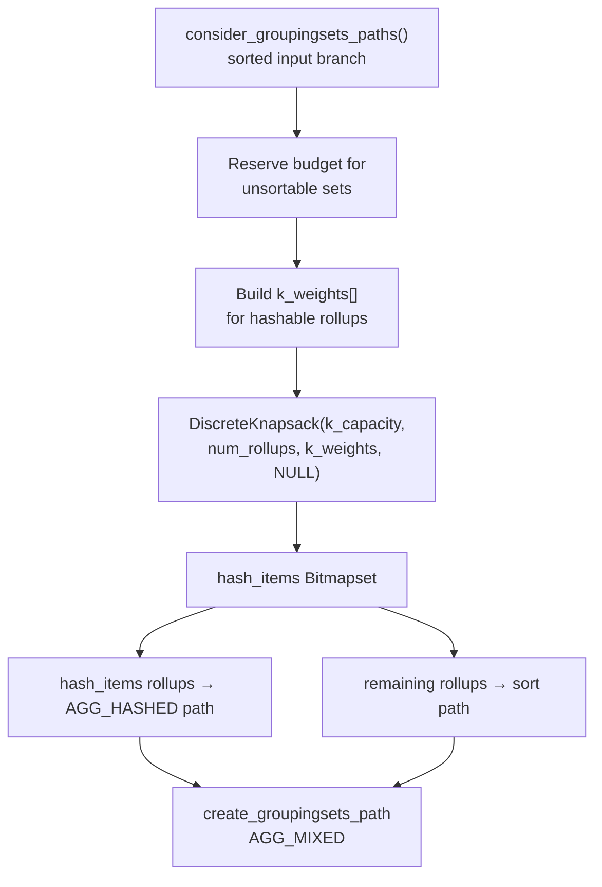

When a query contains `GROUP BY GROUPING SETS`, `ROLLUP`, or `CUBE`, the planner must decide for each rollup whether to compute it by sorting or by building a hash table. Sorting is always safe but pays a per-rollup sort cost. Hashing is faster but memory-bounded. With many rollups and limited `work_mem`, not every rollup can be hashed. The planner must choose a subset that fits in the hash memory budget while maximising the number of sorts avoided. PostgreSQL solves this selection problem with a 0/1 knapsack algorithm implemented in `src/backend/lib/knapsack.c`.

## The Combinatorial Problem

A `GROUPING SETS` query can produce many rollups, each requiring its own hash table whose size depends on the estimated number of distinct groups for that grouping key combination. `get_hash_memory_limit()` derives the available budget from `work_mem` (scaled by `hash_mem_multiplier`). If all rollups could fit in that budget the decision is trivial. When their combined footprint exceeds the budget, every subset of rollups is a candidate. An exhaustive search over 2^N subsets is infeasible for large N.

The planner models this as a classic 0/1 knapsack: each rollup is an item, its estimated hash table size is its weight, and saving one sort step is its value. Concretely, this happens in `consider_groupingsets_paths()` (planner.c). The planner calls it with a sorted input path and a `grouping_sets_data` structure carrying the prepared list of rollups together with hashability flags.

## The Knapsack Formulation

`DiscreteKnapsack(max_weight, num_items, item_weights, item_values)` requires integer weights. Estimated hash table sizes are floating-point bytes, so the planner pre-scales them:

```
scale      = max(availspace / (20 × num_rollups), 1.0)
k_capacity = floor(availspace / scale)
k_weights[i] = min(floor(sz / scale), k_capacity + 1)
```

The scale factor allows a ~5 % error margin while keeping `k_capacity` small enough that the DP table stays within a few megabytes (the comment in planner.c notes that even 4096 rollups at 5 % error requires only ~42 MB of workspace). The planner clamps weights larger than `k_capacity + 1` so that an individual oversized rollup still has a valid integer weight.

Because the current cost model for sort nodes does not accurately reflect comparison costs, the planner treats every item as having equal value (it passes the `item_values` argument as `NULL`, so `DiscreteKnapsack` defaults all values to 1). This means the algorithm maximises the *count* of rollups that can be hashed, not their cost differential. This is a documented limitation. The comment in planner.c reads:

> "we really ought to use the cost saving as the item value; however, currently the costs assigned to sort nodes don't reflect the comparison costs well"

## Dynamic Programming Implementation

`DiscreteKnapsack` uses the standard space-optimised 0/1 DP. Rather than a full 2-D table it maintains a single `values[0..max_weight]` array updated in-place, iterating weights from `max_weight` down to `item_weight` on each item pass. This backward scan is the classic trick that prevents a newly added item from being counted twice within the same pass.

Alongside `values[]` it maintains a parallel `sets[]` array of `Bitmapset *` pointers so that the winning item set can be read out directly from `sets[max_weight]` after all passes complete. The function pre-allocates all bitmapsets with an unused sentinel bit equal to `num_items`. This allows in-place mutation using `bms_del_members` / `bms_add_members` without additional palloc calls during the inner loop. The function strips the sentinel bit from the final result before returning.

The whole computation runs inside a short-lived child [[subsystems/memory/contexts|memory context]] (`AllocSetContextCreate`). The planner deletes this context once it copies out the result bitmap, keeping the planner's memory footprint clean.

Time complexity is O(N × W) where N is the number of candidate rollups and W is `k_capacity`. Because `k_capacity` is bounded by the scaled memory budget, this is pseudo-polynomial — NP-hard in the worst case for unbounded W, but tractable in practice.

## Integration with consider_groupingsets_paths

The planner calls `consider_groupingsets_paths()` once for sorted input and once for unsorted input for each candidate path. In the sorted-input branch it:

1. Reserves hash budget for any unsortable sets that *must* be hashed regardless.
2. Iterates hashable rollups (skipping the first, which benefits from the input sort order for free) to build the `k_weights` array.
3. Calls `DiscreteKnapsack` to obtain a `Bitmapset` of rollup indexes to hash.
4. Partitions the rollup list: selected rollups go into the mixed hash path; the rest stay sorted. The planner constructs an `AGG_MIXED` grouping-sets path for the combination.

The planner places rollups that `DiscreteKnapsack` excludes in sort-based rollup nodes. The planner will still produce and cost both a fully-sorted path and the mixed sort/hash path, letting the overall path comparison choose between them.



## Weight Scaling and Error Tolerance

The 5 % error margin comes from the scale factor denominator of `20 × num_rollups`. At this margin, the algorithm might misclassify a rollup whose true size is just below the budget boundary as over budget, or vice versa. The comment explicitly accepts this: "a 5% error margin" is good enough given that estimated hash table sizes are themselves approximations of the real runtime footprint. Tightening the margin would increase `k_capacity` and thus memory use for the DP table.

## Practical Implication

If a query groups by seven or eight columns with combinations that form many rollups and `work_mem` is low, the knapsack selection directly determines which grouping-level subtotals are computed cheaply (in-memory hash) and which require a sort pass. Increasing `work_mem` (or `hash_mem_multiplier`) raises `availspace`. A larger `availspace` increases the budget. A larger budget lets the knapsack select more rollups for hashing, reducing the number of sort nodes in the plan. This is visible in `EXPLAIN` output as `MixedAggregate` vs. `GroupAggregate` nodes.

## Related Topics

- [[subsystems/planner/extended-statistics]]
- [[subsystems/planner/selectivity-estimation]]
- [[subsystems/executor/work-mem-and-spill]]
- [[subsystems/planner/partial-aggregation]]
