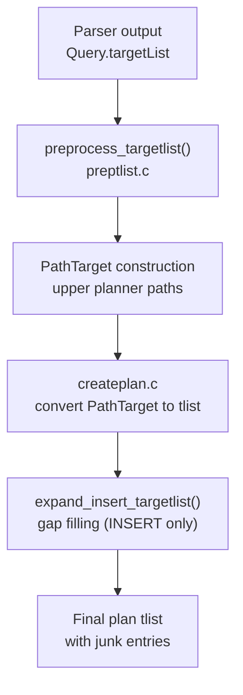

Before the planner hands a query to the executor it transforms the target list from the parser's representation into one that the executor can evaluate directly. That transformation is carried out mainly in `preptlist.c`. It inserts synthetic "junk" columns the executor needs for row identity, locking, and RETURNING semantics. It fills gaps left by dropped or generated columns in INSERT. It also renumbers the column positions that UPDATE uses to route output values to the right heap columns.

## Junk Attributes

A junk attribute is a `TargetEntry` with `resjunk = true`. The planner inserts junk entries freely because the executor strips them before writing a tuple to the heap or returning it to the client. Junk entries act as a side channel: the executor can evaluate a value alongside the visible columns and consume it through `ExecFindJunkAttribute`, all without exposing it in the output row.

The purposes junk attributes serve:

| Attribute name | Producer | Consumer |
|---|---|---|
| `ctid` | preptlist, for base-table UPDATE/DELETE | `ExecModifyTable` to locate the target tuple |
| `tableoid` | preptlist, for inheritance UPDATE/DELETE | `ExecModifyTable` to pick the right child relation |
| `ctidN` / `tableoidN` | preptlist, for `FOR UPDATE` scans | `EvalPlanQual` to re-fetch locked rows |
| `wholerowN` | preptlist, for `FOR UPDATE` on whole-row marks | `EvalPlanQual` |
| RETURNING cross-rel Vars | preptlist | `ExecModifyTable` RETURNING projection |
| `update_colnos` metadata | planner | `ExecModifyTable` to map tlist positions to heap attribute numbers |

## Row Identity for UPDATE and DELETE

Every UPDATE or DELETE must locate the exact physical tuple it intends to modify. For a plain heap relation that means carrying the `ctid` system attribute through the plan tree. For an inheritance hierarchy — where the executor does not know until runtime which child table a row came from — the plan also needs `tableoid` so `ExecModifyTable` can route the operation to the right child.

The planner deliberately defers the injection for inheritance targets. When the planner sees a partitioned or inherited result relation, it skips the ctid injection in `preptlist.c`. It leaves the injection for `createplan.c` to insert per-leaf-relation instead, once the full set of children is known. The planner injects ctid immediately for base-table targets.

UPDATE introduces an additional renumbering convention. The executor must write specific columns of the heap tuple, not just the columns that appear sequentially in the plan's target list. The planner records the mapping in `update_colnos` — a list that pairs each non-junk target-list entry with the heap attribute number it should land in. This separation means the plan's tlist can be freely extended with junk entries and reordered for join output without breaking the column-routing logic.

## INSERT Gap Filling

A stored table's physical attribute layout may not match the column list the INSERT provides. `expand_insert_targetlist` normalises the target list to match the physical tuple descriptor exactly, handling three distinct cases:

- **Dropped columns** — a physical slot that no longer has a live column definition. The planner inserts a NULL literal with the dropped column's type OID so the tuple is the right width.
- **Generated columns** — columns defined with `GENERATED ALWAYS AS`. The planner inserts a NULL placeholder. The executor overwrites it by evaluating the generation expression after the base row is formed.
- **Normal columns absent from the column list** — columns not named in the INSERT. These get their default expression if one exists, or NULL otherwise. When the column's type is a domain, the NULL must carry the domain's type OID rather than the base type so that domain-constraint checking fires correctly.

After `expand_insert_targetlist` runs, the target list has exactly as many non-junk entries as the relation has physical attributes, in attribute-number order.

## RETURNING Cross-Relation Vars

A RETURNING clause can reference columns of relations other than the one being modified — typically when the DML is inside a join or a CTE. Those Vars carry the original range-table index of their source relation. That index has no meaning in the executor's output tuple slot.

For result-relation Vars the planner leaves them in place. The executor resolves them from the slot that holds the just-modified tuple. For Vars that reference a foreign range-table entry — one that does not correspond to any physical scan in the plan — the planner pulls them out of the RETURNING list. It injects them as junk entries earlier in the target list instead, with an attribute name the RETURNING projection node can look up via `ExecFindJunkAttribute`. This avoids the executor having to resolve range-table entries it cannot reach.

## FOR UPDATE and EvalPlanQual

Queries with `FOR UPDATE`, `FOR SHARE`, or their `NO KEY` / `KEY SHARE` variants need to be able to re-evaluate their result if a locked tuple is concurrently modified. The mechanism is `EvalPlanQual`: it re-fetches the newest committed version of a locked tuple and re-runs the plan above it to check whether the row still qualifies.

To support this, the planner attaches a `PlanRowMark` to each scan that participates in locking. `preptlist.c` then injects one junk attribute per row mark:

- **`ctidN`** — the physical location of the row in a regular heap table, where N is the range-table index.
- **`tableoidN`** — required alongside ctid for inheritance targets, so EvalPlanQual knows which child table to re-fetch from.
- **`wholerowN`** — used when the lock mode requires a whole-row copy rather than just a tid; foreign tables fall into this category.

For inheritance parent RTEs — entries that represent the parent relation in an inheritance scan rather than a specific child — the planner marks the row mark as a parent entry and does not inject ctid, because the parent RTE is not itself scanned. The ctid injection happens for each child leaf instead, under the child's range-table index.

## Relationship to Path Targets

By the time `preptlist.c` finishes, the query's target list consists of `TargetEntry` nodes attached to the top plan node's `targetlist` field. The planner's cost and path machinery works with `PathTarget` structures instead — a more compact representation that carries expressions and sort-group references without the full `TargetEntry` wrapper.

The handoff between the two representations happens at plan creation. `createplan.c` converts the path target built by the upper-planner path machinery back into a target list. It calls back into the target-list preparation logic for the final junk-injection and renumbering steps. The full pipeline is:

The result is the target list the executor receives: visible columns in attribute-number order, followed by junk columns the executor consumes internally and then discards.

## Related Topics

- [[subsystems/planner/target-list|Path Targets and PathTarget]]
- [[code-paths/update|ExecModifyTable]]
- [[code-paths/update|UPDATE execution]]
- [[code-paths/insert|INSERT execution]]
- [[code-paths/delete|DELETE execution]]
- [[code-paths/update|RETURNING clause]]
