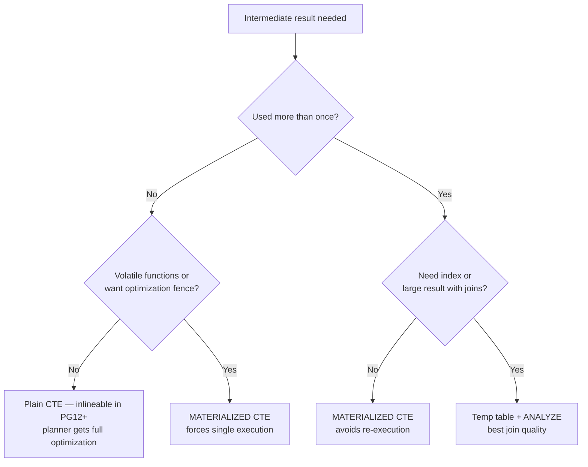

# Temp Tables vs CTEs

Choosing between a CTE and a temp table affects plan quality, statistics availability, catalog overhead, and session cleanup. Neither is universally better. The right choice depends on how many times the result is used, whether it is volatile, and whether the planner needs accurate row estimates downstream.

## CTE Inlining (PG12+)

Before PostgreSQL 12, every non-recursive CTE was an optimization fence. The planner always materialized it. Its result was opaque to the outer query's planner. From PG12 onward, the planner may inline a CTE — treating it identically to a derived table (subquery) — when it is non-recursive, non-volatile, and referenced exactly once.

The decision lives in `inline_cte` (`prepjointree.c`). The `CommonTableExpr.ctematerialized` field controls the override:

| Value | Meaning |
|---|---|
| `CTEMaterializeDefault` | Planner decides (inline if safe) |
| `CTEMaterializeAlways` | Force materialization (`MATERIALIZED` keyword) |
| `CTEMaterializeNever` | Force inlining (`NOT MATERIALIZED` keyword) |

When inlined, the planner merges the CTE's subtree into the outer query tree before optimization. This allows `pull_up_subqueries` to lift the range table entry and the full optimizer to apply predicate pushdown, partition pruning, and join reordering across the boundary.

```sql
-- PG12+: planner inlines this CTE and pushes the predicate inside
WITH active_orders AS (
    SELECT * FROM orders WHERE status = 'open'
)
SELECT * FROM active_orders WHERE customer_id = 42;
-- Equivalent to: SELECT * FROM orders WHERE status = 'open' AND customer_id = 42
```

```sql
-- Force materialization — result is computed once, stored in a tuplestore
WITH ranked AS MATERIALIZED (
    SELECT *, rank() OVER (PARTITION BY dept ORDER BY salary DESC) AS rnk
    FROM employees
)
SELECT * FROM ranked WHERE rnk = 1;
```

## When to Force CTE Materialization

See [[sql-features/ctes|CTEs (SQL Feature)]] for the full guidance on when to force `MATERIALIZED` (multiple references, volatile functions, deliberate optimization fences) versus `NOT MATERIALIZED`.

## Temp Tables

`CREATE TEMP TABLE t AS SELECT ...` materializes the result into a real heap relation in the session-local temp schema (`pg_temp_N`). This has concrete consequences:

- The table exists in `pg_class`, `pg_attribute`, and related catalogs for the session lifetime (or until dropped).
- `ANALYZE t` populates `pg_statistic` for the table. The planner then has histograms, `n_distinct`, and MCV lists when `t` appears in later queries.
- The table supports indexes: `CREATE INDEX ON t (col)`.
- [[subsystems/background/autovacuum|Autovacuum]] ignores temp tables — they are session-scoped and dropped on session exit, so dead-tuple accumulation is irrelevant.

```sql
CREATE TEMP TABLE mid AS
    SELECT customer_id, sum(amount) AS total
    FROM orders
    WHERE created_at >= now() - interval '90 days'
    GROUP BY customer_id;

ANALYZE mid;  -- critical: gives the planner real row counts and histograms

CREATE INDEX ON mid (customer_id);

SELECT c.name, m.total
FROM customers c
JOIN mid m USING (customer_id)
WHERE m.total > 1000;
```

Without `ANALYZE`, the planner falls back to `pg_class.reltuples = 0` and uses a default estimate. That estimate is no better than a materialized CTE.

## Statistics: The Core Difference

A materialized CTE lives in an executor-level tuplestore, invisible to the planner. When the outer query references a materialized CTE, the planner has no statistics about it and uses a hard-coded row estimate (currently 1000 rows in most paths via `cte_inline` logic). This estimate is frequently wrong and causes bad join order decisions downstream.

Temp tables after `ANALYZE` expose full `pg_statistic` rows. The planner's `get_relation_statistics` path reads these normally, enabling accurate selectivity estimation for filters and joins.

```
Materialized CTE         Temp table + ANALYZE
-------------------      --------------------
No pg_statistic          Full histograms
Fixed ~1000 row est.     Accurate reltuples
No index possible        Indexes usable
No catalog overhead      Touches pg_class etc.
```

## Catalog Overhead

Every `CREATE TEMP TABLE` writes rows to `pg_class`, `pg_attribute`, `pg_type` (for composite type), and triggers `RelationCacheInvalidate`. In a tight loop — for example, a PL/pgSQL function called thousands of times — this overhead accumulates. CTEs have no catalog impact. They exist only in the query tree during planning and as a tuplestore during execution.

For functions called at high frequency, prefer CTEs or subqueries. Reserve temp tables for batch workloads where creation cost is amortized over heavy subsequent use.

## ON COMMIT Behavior

Temp tables support `ON COMMIT DROP` and `ON COMMIT DELETE ROWS`, enabling automatic cleanup within transaction-scoped functions:

```sql
CREATE TEMP TABLE work_items ON COMMIT DROP AS
    SELECT * FROM queue WHERE status = 'pending' LIMIT 10000;
ANALYZE work_items;
-- ... complex processing ...
-- table disappears at COMMIT, no explicit DROP needed
```

This is safer than relying on session end for cleanup. It also avoids catalog bloat in long-running sessions that call the function repeatedly.

## Practical Guidance

Decision tree for intermediate results:



Concrete rules:

- **One use, no volatiles**: plain CTE. The planner inlines it. Predicate pushdown and partition pruning work across the boundary.
- **One use, volatile or fence**: `MATERIALIZED` CTE. Explicit intent, zero catalog cost.
- **Two uses, moderate cost**: `MATERIALIZED` CTE is usually sufficient. Avoids double execution without catalog overhead.
- **Three or more uses, or joins with large tables follow**: temp table + `ANALYZE`. The planner needs statistics to make good join decisions. Without them, row estimate errors compound through multi-join plans.
- **Index required on intermediate result**: temp table only. CTEs cannot be indexed.
- **High-frequency function**: CTE. Avoid catalog churn.
- **Batch ETL, once per session**: temp table with `ON COMMIT DROP` if transactional cleanup is needed.

A common antipattern is using a materialized CTE as a join input in a multi-table query and wondering why the plan is slow. The planner's 1000-row estimate for the CTE leads it to choose a nested loop that performs badly at actual scale. Adding `CREATE TEMP TABLE t AS ...; ANALYZE t;` and replacing the CTE reference with `t` typically resolves this immediately.

## Related Topics

- [[sql-features/ctes|CTEs (SQL Feature)]] — user-facing usage guidance on when to write MATERIALIZED / NOT MATERIALIZED, including the canonical example.
- [[subsystems/planner/ctes|CTE Planning]] — covers how the planner handles CTE inlining, fencing, and the full optimization pipeline for `WITH` clauses.
- [[subsystems/planner/optimization-fences|Optimization Fences]] — explains when and why materialization boundaries block predicate pushdown and join reordering.
- [[subsystems/planner/stale-statistics-and-bad-plans|Stale Statistics and Bad Plans]] — describes how missing or outdated `pg_statistic` rows cause the same row-estimate errors seen with un-analyzed temp tables.
- [[subsystems/planner/selectivity-estimation|Selectivity Estimation]] — details how the planner uses histograms and MCV lists from `pg_statistic`, which temp tables expose after `ANALYZE` but materialized CTEs do not.
- [[subsystems/executor/tuplestore|Tuplestore]] — the in-memory/on-disk store used to hold materialized CTE results during execution.
- [[subsystems/catalog/pg-class|pg_class]] — the catalog table written for every temp table, explaining the catalog overhead cost discussed in this article.
- [[code-paths/create-table-as|CREATE TABLE AS]] — the code path executed when `CREATE TEMP TABLE t AS SELECT ...` is issued.
- [[subsystems/planner/recursive-queries|Recursive Queries (WITH RECURSIVE)]] — recursive CTEs cannot be replaced with temp tables since they depend on the WITH RECURSIVE working-table iteration model discussed here.
