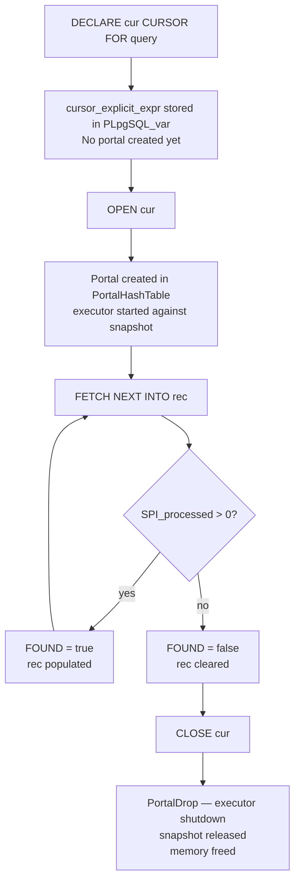
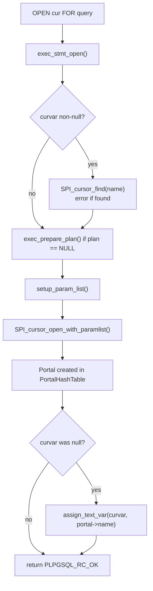
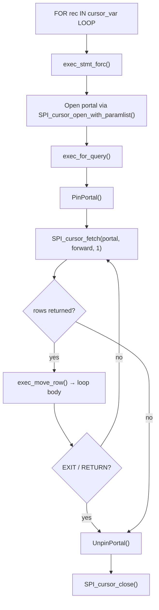

# PL/pgSQL Cursors

A cursor in PL/pgSQL is a named handle to a query's execution state. Instead of running a query to completion and materializing all rows, a cursor opens a portal — a suspended execution context — and lets the caller pull rows incrementally. This is the mechanism that makes it possible to process large result sets without holding them entirely in memory, to step through rows one at a time with full procedural logic between fetches, and to return a live result set from a function to its caller rather than materializing a table.

At the implementation level a PL/pgSQL cursor variable is a `PLpgSQL_var` of type `refcursor` (plpgsql.h). Its runtime value is a text string: the name of an open portal in the backend's portal hash table. The portal itself is the same `PortalData` structure that backs SQL `DECLARE CURSOR` statements — there is no separate PL/pgSQL cursor object. The distinction between PL/pgSQL cursor variables and SQL cursors is entirely at the language surface; underneath they share the same portal machinery described in [[code-paths/cursor|Cursors and Portals]].



## Cursor variable flavours

PL/pgSQL offers three ways to declare a cursor variable, each with a different relationship between the variable and the query it will execute.

**Unbound cursor variables** are declared simply as `refcursor` with no associated query:

```sql
DECLARE
    cur refcursor;
```

The variable is a placeholder. It has no associated query at declaration time; `OPEN` can bind any query to it. This is the most flexible form. It is necessary when the query varies at runtime or when the cursor will be passed in as a parameter.

**Bound cursor variables** associate a fixed query with the variable at declaration time:

```sql
DECLARE
    cur CURSOR FOR SELECT id, name FROM accounts WHERE status = 'active';
```

The compiler parses the query and stores it in `cursor_explicit_expr` on the `PLpgSQL_var` struct during compilation (plpgsql.h). No portal exists until `OPEN` runs — the binding is between the variable and the query text, not between the variable and a running portal. This lets the function declare its cursors at the top where they are easy to find, while deferring execution to the point where the cursor is opened.

**Parameterised bound cursors** extend the bound form with formal parameters:

```sql
DECLARE
    cur CURSOR (min_date date, max_date date)
        FOR SELECT * FROM events WHERE ts BETWEEN min_date AND max_date;
```

The parameters are stored as an internal row (`cursor_explicit_argrow` on `PLpgSQL_var`). When `OPEN` is called with arguments, `exec_stmt_open` (pl_exec.c) evaluates the argument expressions into that internal row before planning and opening the portal. The parameters become bound values in the query, not separate Param nodes — the cursor query is planned with the actual argument values at open time.

The compile-time representation of all three forms is a `PLpgSQL_var`. The key difference is whether `cursor_explicit_expr` is non-null. An unbound `refcursor` has it null; bound cursor variables have it set to the query expression. The `cursor_options` field records the `SCROLL`/`NO SCROLL` specification if given.

## OPEN: creating the portal

`OPEN` is the statement that transitions a cursor variable from a declared but inert state into an active portal. The executor handles this in `exec_stmt_open` (pl_exec.c), which dispatches on three cases depending on whether the `PLpgSQL_stmt_open` node carries a `query`, a `dynquery`, or neither (meaning it is opening a bound cursor variable):

For an **unbound cursor opened FOR SELECT**, `exec_prepare_plan` prepares the query expression if no plan exists yet, then `exec_stmt_open` calls `SPI_cursor_open_with_paramlist`. This creates a portal in the backend's hash, starts the executor against a snapshot, and returns a portal handle. `exec_stmt_open` then stores the portal name into the cursor variable as a text value. If the variable already held a non-null value (a previously assigned name), `exec_stmt_open` checks that no portal of that name is currently open before proceeding, raising `duplicate_cursor` if one is found.

For an **unbound cursor opened FOR EXECUTE**, `exec_stmt_open` evaluates the SQL string at runtime and passes it to `exec_dynquery_with_params`. This is the dynamic cursor form: no plan is ever cached, and PostgreSQL re-parses and re-plans the query on every open. This prevents plan caching but allows fully dynamic SQL construction.

For a **bound cursor variable**, `exec_stmt_open` retrieves `cursor_explicit_expr` from the `PLpgSQL_var`, evaluates any arguments into `cursor_explicit_argrow`, prepares the plan if needed, and calls `SPI_cursor_open_with_paramlist`. `exec_stmt_open` passes through the `cursor_options` from the variable declaration, controlling whether the portal is scrollable.

In all cases, the portal name ends up as the text value of the cursor variable. This indirection through a name rather than a pointer is intentional: it lets a program store cursors in variables, pass them as `refcursor` parameters, and manipulate them by name with `SPI_cursor_find`.

When a cursor variable is null before `OPEN`, `SPI_cursor_open_with_paramlist` generates a unique name (of the form `<unnamed portal N>`). `assign_text_var` then stores that generated name back into the cursor variable. This is the normal case for anonymous cursors. When the variable already holds a specific name (either user-assigned or retained from a previous open), `exec_stmt_open` passes that name to the portal creation function, allowing the programmer to control what name the portal is visible under, including in `pg_cursors`.



## FETCH: pulling rows

Once a cursor is open, `FETCH` retrieves rows by finding the portal by name and advancing its position. `exec_stmt_fetch` (pl_exec.c) extracts the portal name from the cursor variable, calls `SPI_cursor_find` to recover the portal pointer, then dispatches to either `SPI_scroll_cursor_fetch` or `SPI_scroll_cursor_move`.

The fetch direction is encoded in the `PLpgSQL_stmt_fetch` node as a `FetchDirection` enum, with an associated count. The full set of directions mirrors SQL cursor semantics:

| Syntax | Direction | Notes |
|---|---|---|
| `FETCH NEXT INTO var` | `FETCH_FORWARD` / 1 | Default; advances one row |
| `FETCH PRIOR INTO var` | `FETCH_BACKWARD` / 1 | Requires a scroll cursor |
| `FETCH FIRST INTO var` | `FETCH_ABSOLUTE` / 1 | Repositions to row 1 |
| `FETCH LAST INTO var` | `FETCH_ABSOLUTE` / -1 | Repositions to final row |
| `FETCH ABSOLUTE n INTO var` | `FETCH_ABSOLUTE` / n | Absolute row number |
| `FETCH RELATIVE n INTO var` | `FETCH_RELATIVE` / n | Offset from current position |
| `FETCH FORWARD n INTO var` | `FETCH_FORWARD` / n | Advance n rows |
| `FETCH BACKWARD n INTO var` | `FETCH_BACKWARD` / n | Reverse n rows |
| `FETCH ALL INTO var` | `FETCH_FORWARD` / `LONG_MAX` | Drain the cursor |

After the fetch, `SPI_processed` holds the number of rows returned (0 or 1 for most directions; more for `FETCH FORWARD n`). `exec_stmt_fetch` sets `FOUND` to true if at least one row was returned, and calls `exec_move_row` to assign the fetched tuple into the target variable. If the fetch returns no row, `exec_stmt_fetch` still calls `exec_move_row` with a null tuple. This clears the target variable to null/default values.

`MOVE` uses the same code path with `is_move = true`. The portal advances, but the executor discards the rows. `FOUND` returns only the count of skipped rows. `MOVE` is useful for repositioning a scroll cursor without actually processing the intervening rows.

Any direction other than `FETCH_FORWARD` / `FETCH_BACKWARD` with count 1 requires a scroll cursor. Attempting a backward or random-access fetch on a non-scrollable portal raises an error at the SPI level.

The typical pattern for iterating all rows with a manual cursor is:

```sql
OPEN cur;
LOOP
    FETCH cur INTO rec;
    EXIT WHEN NOT FOUND;
    -- process rec
END LOOP;
CLOSE cur;
```

The `EXIT WHEN NOT FOUND` clause relies on `FETCH` setting `FOUND` to false when the cursor reaches the end of the result set. `FOUND` here refers to the special PL/pgSQL variable that `FETCH`, `MOVE`, and other row-returning statements update, not to any column in the fetched row.

## CLOSE: releasing the portal

`CLOSE` is the explicit cleanup operation. `exec_stmt_close` (pl_exec.c) finds the portal by name and calls `SPI_cursor_close`, which calls `PortalDrop`. This tears down the executor state, releases any snapshot held by the portal, frees the portal's [[subsystems/memory/contexts|memory context]], and removes the portal from the hash table.

`CLOSE` does not modify the cursor variable — it retains the portal name as its text value even after the portal is gone. Attempting to `FETCH` from a closed cursor will fail with "cursor does not exist" when `SPI_cursor_find` returns null. If the function intends to reopen the cursor, it should set the variable to null first. Then `OPEN` assigns a fresh portal name instead of re-using the stale text.

**Not closing cursors is a memory and resource leak.** A portal lives in `TopPortalContext` and holds a transaction snapshot. In a function that opens many cursors in a loop without closing them, each open cursor keeps its snapshot alive and prevents VACUUM from reclaiming dead tuples visible to any of those snapshots. The combined effect of many open cursors in a long transaction is xmin bloat: the oldest snapshot horizon creeps backward. As a result, [[subsystems/background/autovacuum|autovacuum]] cannot clean up older versions of frequently updated rows. The standard remedy is to always pair `OPEN` with `CLOSE`, or to prefer FOR loops which close the portal implicitly.

### Cursor lifetime across subtransactions

When an EXCEPTION block rolls back a subtransaction, the abort cleanup destroys portals created inside the subtransaction. `AtSubAbort_Portals` marks them `PORTAL_FAILED` and strips their resource owners; `AtSubCleanup_Portals` then calls `PortalDrop` on them. A cursor variable that held the name of a portal destroyed this way refers to a non-existent portal. Subsequent `FETCH` calls raise "cursor does not exist".

When the inner subtransaction commits, `AtSubCommit_Portals` re-parents any portals from a parent subtransaction that survived the nested abort. It updates their `createSubid` to point to the enclosing subtransaction, so PostgreSQL continues tracking them correctly.

This means a function should not rely on cursor variables across EXCEPTION block boundaries without explicit checks. A pattern such as `IF cur IS NOT NULL THEN CLOSE cur; END IF;` before re-opening can prevent "duplicate cursor" errors when a function retries after catching an exception.

## FOR loops over cursors

Two kinds of FOR loop use cursors internally: loops over explicit cursor variables (`FOR rec IN cursor_var LOOP`) and loops over inline queries (`FOR rec IN SELECT ... LOOP`). Both compile down to AST nodes that share the `PLpgSQL_stmt_forq` supertype; the difference is whether the portal comes from a pre-declared cursor variable or is created on the fly.

**FOR over a cursor variable** compiles to `PLpgSQL_stmt_forc`. The executor function `exec_stmt_forc` (pl_exec.c) opens the portal using the same logic as `exec_stmt_open` — it evaluates any cursor arguments, prepares the plan, and calls `SPI_cursor_open_with_paramlist`. It then delegates to `exec_for_query` to run the loop, and closes the portal unconditionally on exit (whether by normal completion, `EXIT`, or error). If the cursor variable was null before the loop, the generated portal name is stored into it during the loop and cleared again afterward.

**FOR over a query** compiles to `PLpgSQL_stmt_fors`. It works identically, except that the portal is created directly from the inline query expression rather than from a cursor variable's `cursor_explicit_expr`.

`exec_for_query` (pl_exec.c) is the shared loop driver for both forms, and also for `FOR ... IN EXECUTE`. It:

1. Pins the portal with `PinPortal` to prevent the loop body from closing the cursor accidentally — a `CLOSE cursor_name` or `DISCARD ALL` inside the loop would otherwise destroy the portal mid-iteration.
2. Calls `SPI_cursor_fetch` in batches. If `prefetch_ok` is true (set for query loops but not for cursor variable loops), the initial fetch grabs 10 rows to amortize executor startup; subsequent fetches grab up to 50 rows at a time.
3. For each fetched tuple, assigns it to the loop variable via `exec_move_row` and runs the loop body.
4. Continues until no rows remain or the loop exits via `EXIT`/`RETURN`.
5. Unpins the portal and returns.

The reason cursor variable loops do not prefetch is that the cursor is accessible to user code inside the loop. `UPDATE ... WHERE CURRENT OF cursor_name` requires the cursor to be positioned exactly on the current row. Batching would break that requirement.



The implicit close at loop end is the main practical advantage of FOR loops over cursors: the programmer cannot forget to call `CLOSE`. For linear iteration without random access, a FOR loop is almost always preferable to manual OPEN/FETCH/CLOSE.

### FOR over a query versus SELECT INTO

A common source of confusion is when to use a cursor FOR loop versus `SELECT INTO`. The two behave differently in a fundamental way:

`SELECT INTO` (`exec_stmt_execsql` with `into = true`) executes the query to completion, collects the first row into the target variable, and discards the rest. `SELECT INTO` never materialises the full result set. Only the first row is accessible. The query runs in its entirety before the statement returns.

A cursor FOR loop opens a portal and fetches rows incrementally. The FOR loop starts the plan once and drives the executor one batch at a time. The query does not run to completion upfront; the executor suspends between fetches and resumes on the next iteration. For a query returning millions of rows this makes a significant difference in both memory usage and time-to-first-row.

The trade-off is overhead per iteration: each loop iteration involves SPI dispatch and row assignment. For small result sets (tens of rows), the overhead of cursor bookkeeping may exceed the cost of a single `SELECT INTO` followed by processing all rows from `SPI_tuptable`. For large result sets where streaming is needed, the cursor loop wins clearly.

## Scroll cursors and backward fetch

By default, `SPI_cursor_open_with_paramlist` passes no scroll flags. It creates the portal as non-scrollable (`CURSOR_OPT_NO_SCROLL`). The executor can then pipeline rows forward without any buffering overhead.

A scroll cursor (`SCROLL` keyword at declaration, or `CURSOR_OPT_SCROLL` passed in `cursor_options`) allows backward fetches and random access. When the portal strategy is `PORTAL_ONE_SELECT`, `PortalStart` checks `ExecSupportsBackwardScan` against the plan tree. If the plan can go backward natively — a `Sort` node or `SeqScan`, for instance — the portal incurs no extra cost. If not — a `HashJoin`, `Agg`, or parallel node — the planner adds a `Materialize` node above the plan root, which buffers the entire result set before the executor returns the first row to the caller.

The consequence is that declaring a scroll cursor over a complex query that requires hash joins or aggregation causes the executor to materialize the entire result set before the first `FETCH` returns. The cursor loses its streaming benefit; only random access remains. Declare scroll cursors only when the function genuinely needs backward or random-access fetch.

For bound cursor variables, the declaration specifies `SCROLL` and `NO SCROLL` at declaration time, and the compiler stores them in `cursor_options` on `PLpgSQL_var`. For unbound cursors, the `OPEN` statement itself can specify them.

## Memory and snapshot lifecycle

Understanding where the memory for a cursor's data lives is important for writing correct, leak-free code.

When `SPI_cursor_open_with_paramlist` creates a portal, it allocates `portalContext` as a child of `TopPortalContext`. This context holds the plan copy, the parameter list, and the executor state. `FETCH` also allocates the executor's tuple output in `portalContext`, or in the per-tuple memory context that PostgreSQL resets after moving each row to its destination.

`PortalStart` stores the transaction snapshot it takes in `queryDesc->snapshot` and registers it as an active snapshot for the duration of the portal's existence. Holding many open cursors in a single transaction keeps the `xmin` of the backend artificially low, preventing VACUUM from cleaning up rows that are not visible to any of these snapshots. In a function that processes large data by opening, fetching from, and forgetting to close many cursors, this can accumulate quickly.

When `CLOSE` or transaction end cleanup calls `PortalDrop`, it calls `ExecutorFinish` then `ExecutorEnd` to release executor resources, drops the snapshot registration, tears down the `ResourceOwner`, and deletes `portalContext`. For held portals, `holdContext` is a separate memory context that persists beyond `portalContext`; it lives until the cursor is explicitly closed or the session ends.

The cursor variable itself — the text datum holding the portal name — lives in the function's SPI `procCxt` for the duration of the call. It does not hold any reference to the portal's memory; it is just a string. The portal's memory is entirely self-contained. The portal infrastructure manages it.

## Returning cursors to callers

`refcursor` is a first-class type in PostgreSQL, which means a function can accept or return cursor variables just like any other type:

```sql
CREATE FUNCTION open_accounts(min_balance numeric)
RETURNS refcursor
LANGUAGE plpgsql AS $$
DECLARE
    cur refcursor;
BEGIN
    OPEN cur FOR
        SELECT id, name FROM accounts WHERE balance >= min_balance;
    RETURN cur;  -- returns the portal name, not the rows
END;
$$;
```

The caller receives the portal name and can fetch from it:

```sql
BEGIN;
SELECT open_accounts(1000);        -- returns, e.g., '<unnamed portal 1>'
FETCH ALL FROM "<unnamed portal 1>";
COMMIT;
```

This is one of the few ways PL/pgSQL can return a result set without materializing it entirely. `SETOF` functions and `TABLE(...)` return types collect all rows into a tuplestore before returning them; a `refcursor` return hands back an open portal and lets the caller pull rows at its own pace.

There is a critical constraint: the portal only lives within the transaction that opened it. The caller must `FETCH` from it within the same transaction, and must `CLOSE` it before the transaction ends (or let the transaction cleanup close it). If the caller commits without closing, `PreCommit_Portals` destroys the portal. Forgetting to close a refcursor returned from a function is a resource leak, because the portal and its snapshot remain live until transaction end.

When a function takes a `refcursor` as an `IN` parameter, it can fetch from a cursor opened by the caller. This enables two patterns: the caller can control what query the function iterates over, or two functions can share a single cursor across multiple calls.

A function can also return multiple cursors by using multiple `OUT` parameters of type `refcursor`:

```sql
CREATE FUNCTION open_report_cursors(
    OUT accounts refcursor,
    OUT transactions refcursor
) LANGUAGE plpgsql AS $$
BEGIN
    OPEN accounts FOR SELECT * FROM accounts WHERE active;
    OPEN transactions FOR SELECT * FROM transactions WHERE posted_date = current_date;
END;
$$;
```

The caller retrieves both portal names and fetches from each independently. The caller must close both portals before the transaction ends. Each portal holds its own executor state and snapshot independently; fetching from one does not advance the other.

## Cursors and transactions

Portals live for the duration of the transaction that created them. This is the fundamental constraint on PL/pgSQL cursor usage: a cursor opened inside a function cannot outlive the function's enclosing transaction. At transaction end, `PreCommit_Portals` (portalmem.c) iterates all portals and drops non-holdable ones; `AtAbort_Portals` does the same on abort. The cursor variable retains its text value (the portal name) after this cleanup, but the portal it refers to is gone.

**WITH HOLD cursors** are the exception. A cursor declared `WITH HOLD` causes `PreCommit_Portals` to call `PersistHoldablePortal` before the transaction commits. This function drains all remaining rows from the executor into a `Tuplestorestate` held in `holdContext`. `holdContext` is intentionally a peer of `portalContext` rather than a child, so it survives `portalContext` deletion. After draining, `PersistHoldablePortal` shuts down the executor, releases the query plan, and transitions the portal to being backed entirely by in-memory tuple data. Draining fully expands [[subsystems/storage/toast|TOAST]] values, so no snapshot is needed after commit. The data freezes at the moment the transaction commits.

PL/pgSQL does not expose `WITH HOLD` as a cursor declaration keyword in its own syntax, but it surfaces indirectly through procedure transaction control. Procedures (created with `CREATE PROCEDURE`) are the only PL/pgSQL code that can issue `COMMIT` or `ROLLBACK` directly. Consider a procedure that calls `COMMIT` while a cursor FOR loop is in progress. The following sequence occurs:

1. The loop body completes its current iteration.
2. The `COMMIT` call reaches the transaction commit machinery.
3. `HoldPinnedPortals` (portalmem.c) detects that `PinPortal` has pinned the cursor's portal (because `exec_for_query` called `PinPortal` at loop entry) and calls `HoldPortal` on it.
4. `HoldPortal` drains all remaining rows into `holdStore` and materializes them.
5. The transaction commits.
6. The loop continues iterating, now reading from the tuplestore rather than from a live executor.

This is the mechanism that makes batch-processing procedures viable: a procedure can open a cursor over a large table, process rows, commit every N rows, and continue — all within a single `FOR` loop. The cost is that the auto-hold mechanism materializes all unprocessed rows into memory (or disk) at each commit point.

The costs of a `WITH HOLD` or auto-held cursor are:
- The auto-hold mechanism reads and stores all remaining rows in memory (spilling to disk beyond `work_mem`).
- The data freezes at commit time — updates by subsequent transactions are not visible.
- The tuplestore stays in `TopPortalContext` for as long as the cursor remains open.
- Auto-held portals (created by `HoldPinnedPortals`) look like held cursors to the rest of the system. But if the procedure exits with an error, `PortalErrorCleanup` cleans them up.

## Observing open cursors

Open cursors created by `OPEN` statements are visible in the `pg_cursors` system view, which reads from the backend's `PortalHashTable`. Each row shows the cursor name, the query text, whether it is holdable, binary, or scrollable, and the creation time. Only portals with `visible = true` appear in `pg_cursors`; `pg_cursors` does not list portals created internally by FOR loops, because `exec_for_query` does not set the visibility flag.

```sql
SELECT name, statement, is_holdable, is_scrollable
FROM pg_cursors;
```

A function can use `pg_cursors` to check whether a cursor it expects to exist is still open, though this is unusual. More commonly, the view is useful for diagnosing resource leaks: if a long-running transaction shows many open cursors in `pg_cursors`, those cursors are accumulating snapshot references and memory.

`CLOSE ALL` closes every non-active cursor in the current session, which is a blunt but effective cleanup tool for interactive sessions.

## Snapshot semantics

When `SPI_cursor_open_with_paramlist` creates a portal, `PortalStart` acquires a transaction snapshot via `GetTransactionSnapshot()` (or `GetActiveSnapshot()` if one is already active). `PortalStart` stores this snapshot in `queryDesc->snapshot` and holds it for the portal's entire lifetime. `FETCH` does not re-acquire it.

The practical consequence is that the snapshot taken at `OPEN` time determines which rows are visible to a cursor, not the state at `FETCH` time. Rows inserted or updated by other transactions after `OPEN` are invisible; rows deleted by other transactions after `OPEN` remain visible. This provides repeatable-read semantics within the cursor's lifetime, regardless of the session's transaction isolation level.

This snapshot-at-open behaviour is often an advantage — the cursor sees a stable view of the table even if other sessions are modifying it concurrently. But it also means that a cursor opened at the start of a long-running function will see data from that point in time, not the current state. In a procedure that commits periodically, this is particularly relevant. After a commit inside a FOR loop, the auto-held cursor's data freezes at the commit boundary. New rows added after that commit are not visible to the still-running loop.

## Interaction with UPDATE WHERE CURRENT OF

A non-scrollable cursor that has just fetched a row exposes a current row position. `UPDATE ... WHERE CURRENT OF cursor_name` or `DELETE ... WHERE CURRENT OF cursor_name` can target that position. This mechanism ties a DML statement to the exact row the cursor is sitting on, without requiring the caller to track a primary key or include it in the SELECT list.

```sql
DECLARE
    cur CURSOR FOR SELECT id, balance FROM accounts FOR UPDATE;
    rec accounts%ROWTYPE;
BEGIN
    OPEN cur;
    LOOP
        FETCH cur INTO rec;
        EXIT WHEN NOT FOUND;
        IF rec.balance < 0 THEN
            UPDATE accounts SET balance = 0, flagged = true
            WHERE CURRENT OF cur;
        END IF;
    END LOOP;
    CLOSE cur;
END;
```

`WHERE CURRENT OF` works only for cursors backed by simple single-table queries (no joins, no set operations, no aggregation) where PostgreSQL can trace each row back to a specific physical tuple. The executor includes a `ctid` junk column in the output plan. The UPDATE/DELETE statement extracts this attribute via `ExecGetJunkAttribute` to identify the exact tuple to modify — bypassing the normal WHERE clause evaluation entirely.

This is why cursor variable FOR loops do not prefetch. If the loop body contains `UPDATE WHERE CURRENT OF`, the cursor must sit exactly on the row it is processing. That guarantee holds only if the cursor advances exactly one row at a time. The `prefetch_ok = false` flag passed to `exec_for_query` from `exec_stmt_forc` ensures this.

`FOR UPDATE` in the cursor query acquires row-level locks on each fetched row, preventing concurrent updates between the `FETCH` and the `UPDATE WHERE CURRENT OF`. Without `FOR UPDATE`, a concurrent session could modify the row between those two operations. The `WHERE CURRENT OF` would then update the already-modified version.

## Plan caching and dynamic cursors

Static cursor queries — those in bound cursor variables or in `OPEN cur FOR SELECT ...` — go through `exec_prepare_plan`, which stores the plan in `cursor_explicit_expr->plan` (or `stmt->query->plan` for the unbound form) via `SPI_keepplan`. The plan survives for the lifetime of the compiled `PLpgSQL_function` struct. Every subsequent `OPEN` of the same cursor, in any call of the function, reuses it.

The plan is subject to the same generic/custom plan selection logic as any other PL/pgSQL SQL statement: the first five executions use custom plans (re-planned with the actual parameter values each time), then the plan cache compares the average custom plan cost to the generic plan cost and chooses the cheaper option. For bound cursor variables with parameters — particularly those with highly skewed parameter distributions — this can mean that the plan chosen after five opens differs significantly from the plan used in the first five. Setting `plan_cache_mode = force_custom_plan` trades replanning cost for consistently parameter-sensitive plans. See [[subsystems/plpgsql/overview|PL/pgSQL Internals]] for the full plan caching discussion.

An important subtlety: all portals opened from the same cursor variable in the same function share the plan. If two portals are open simultaneously from the same bound cursor variable (which is unusual but possible via different calls), both reference the same `SPIPlanPtr`. The plan is reference-counted. `PortalDrop` decrements the count rather than freeing the plan while another portal still holds it.

Dynamic cursors — `OPEN cur FOR EXECUTE sql_string` — never cache a plan. Every open call re-parses and re-plans the query string. This is necessary because the string can change on every call. The executor cannot know what plan would be appropriate until it evaluates the string. The `USING` clause passes parameters safely without SQL injection risk, but does not restore plan caching. For frequently opened dynamic cursors, the overhead is proportional to query complexity.

The practical implication for performance is that a function opening the same static cursor in a tight loop pays planning cost only once per session (or per `CREATE OR REPLACE`), while a function using `FOR EXECUTE` pays it on every iteration.

## Common pitfalls

**Forgetting CLOSE.** A function must close every cursor it explicitly opens. A FOR loop closes automatically; manual OPEN/FETCH/CLOSE does not. Unclosed cursors hold snapshots, prevent VACUUM progress, and consume memory for the entire transaction duration. In long-running transactions that process many items by opening cursors in a loop, this is not just a theoretical concern — each unclosed portal holds a snapshot reference and a live executor state.

**Scroll cursors over hash-join queries.** Declaring `SCROLL` on a cursor whose query involves hash joins or aggregations causes the planner to insert a `Materialize` node at the top of the plan. This node materializes the entire result set immediately. The apparent streaming benefit of a cursor disappears. Use `EXPLAIN` to check whether the plan includes a `Materialize` at the root before relying on scroll semantics for large queries.

**Returning refcursor across transaction boundaries.** A refcursor return value is just a portal name string. If the caller commits the transaction before fetching, the portal is gone and the name is meaningless. Only `WITH HOLD` portals survive commits. A program can create them only via a direct SQL `DECLARE ... WITH HOLD` statement, or via the auto-hold mechanism in procedures with explicit `COMMIT`. Error messages from this situation ("cursor does not exist") can be confusing if the programmer is not aware of the transaction scoping rule.

**Dynamic cursor replanning cost.** `OPEN cur FOR EXECUTE` pays parse-and-plan overhead on every call, including when the SQL string does not change between calls. For a cursor opened millions of times across a large batch job, this cost accumulates significantly. Where the query shape is known at write time, prefer the bound cursor form or a static `OPEN cur FOR SELECT ...`.

**Cursor variable not null after failed open.** `OPEN` can leave a stale name in the cursor variable in two cases. First, `OPEN` may raise an error after it checks that the named portal does not already exist, but before the portal is fully created. Second, the variable may simply be left over from a previous call. Subsequent `OPEN` calls will find the name non-null and attempt to reuse it, potentially colliding with a live portal of the same name. Initialise cursor variables to `NULL` before reuse:

```sql
cur := NULL;
OPEN cur FOR SELECT ...;
```

**Mixing FETCH and FOR loops.** A function can use a bound cursor variable either with manual FETCH or with a FOR loop — but not both at the same time. If a FOR loop is running over a cursor variable and the loop body also calls `FETCH ... FROM cursor_name`, the manual fetch advances the cursor. The loop then skips rows. The portal pin (`PinPortal`) prevents closing the cursor inside the loop but does not prevent fetching.

**EXCEPTION blocks and cursor cleanup.** An EXCEPTION block that catches an error does not automatically close cursors opened in the protected body. After the subtransaction abort, PostgreSQL destroys portals created in the failed subtransaction; portals from enclosing subtransactions survive. The cursor variable may point to a destroyed portal. Code that opens cursors inside EXCEPTION-protected blocks should check and close them explicitly in the exception handler.

## Related Topics

- [[code-paths/cursor|Cursors and Portals]] — portal data structures, scroll semantics, WITH HOLD materialisation, and snapshot handling that back every PL/pgSQL cursor variable
- [[subsystems/plpgsql/overview|PL/pgSQL Internals]] — compilation pipeline, execution model, and plan caching that govern how cursor queries are prepared and replanned
- [[subsystems/plpgsql/exception-handling|Exception Handling]] — how EXCEPTION blocks abort subtransactions and destroy portals opened inside the protected body
- [[subsystems/transactions/subtransactions|Subtransactions]] — the subtransaction abort and commit machinery that re-parents or drops portals when a nested block fails
- [[subsystems/executor/where-current-of|WHERE CURRENT OF]] — the junk-attribute mechanism that lets UPDATE/DELETE target the exact row a cursor is sitting on
- [[subsystems/executor/tuplestore|Tuplestore]] — the in-memory spill-to-disk store used to materialise held-cursor rows after a commit inside a procedure
- [[subsystems/executor/overview|Executor Overview]] — ExecutorStart/Run/Finish/End and the Volcano pull model that portals drive one batch at a time
