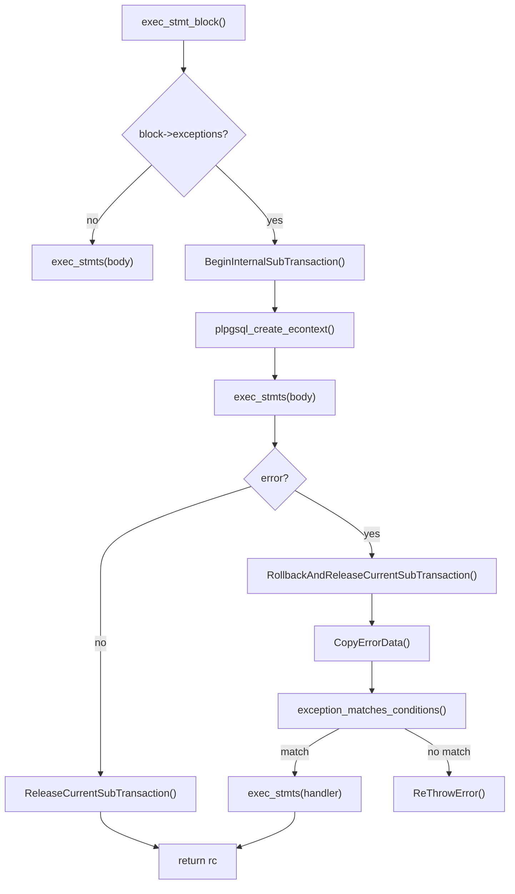

PL/pgSQL exception handling lets a block of procedural code intercept database errors and respond without aborting the whole transaction. The feature integrates PostgreSQL's internal error signalling with the subtransaction machinery to give each `EXCEPTION` block a well-defined rollback boundary. Understanding how it works internally clarifies both why it has overhead and why its rollback semantics are broader than users often expect.

## The EXCEPTION block structure

A PL/pgSQL `BEGIN ... EXCEPTION WHEN ... END` block is parsed into a `PLpgSQL_stmt_block` that carries an optional `PLpgSQL_exception_block` pointer (`pl_gram.y`). When that pointer is non-null, the executor treats the block body differently from an ordinary `BEGIN...END`. If there is no `EXCEPTION` clause, the executor runs the block body directly with no extra overhead — the presence of the clause is the sole trigger for the subtransaction machinery described below.

The grammar rule for the exception section (`exception_sect` in `pl_gram.y`) uses a mid-rule action: when the parser recognises the `EXCEPTION` keyword, it injects two special variables into the block's namespace before parsing the `WHEN` clauses. These are `SQLSTATE` (a `text` constant holding the five-character SQLSTATE code) and `SQLERRM` (the primary error message text). The compiler compiles both as constant datums with `isconst = true`, allocating them in the compiled function's datum array. It stores their positions in that array as `sqlstate_varno` and `sqlerrm_varno` inside the `PLpgSQL_exception_block` struct. The executor calls `assign_text_var` on both datums as soon as it identifies a matching handler. This makes them available throughout handler execution (`pl_gram.y`, `exec_stmt_block` in `pl_exec.c`).

The `PLpgSQL_exception_block` struct itself is a compile-time artefact that lives in the function's [[subsystems/memory/contexts|memory context]]. It holds the `exc_list` (a `List` of `PLpgSQL_exception` nodes, one per `WHEN` clause) alongside the two datum numbers. Each `PLpgSQL_exception` carries its own `conditions` list (a linked list of `PLpgSQL_condition` nodes) and an `action` list (the statements to execute if that handler matches).

## Subtransaction per EXCEPTION block

The defining characteristic of a PL/pgSQL EXCEPTION block is that its body always executes inside an internal subtransaction — a PostgreSQL savepoint established by `BeginInternalSubTransaction` immediately before the body begins. This happens unconditionally. `exec_stmt_block` engages the subtransaction machinery on every call where `block->exceptions` is non-null, even if the body runs without error (`pl_exec.c`).

On the normal (no-error) path, the executor calls `ReleaseCurrentSubTransaction` when the body finishes. On the error path, a `PG_CATCH` block captures the error, calls `RollbackAndReleaseCurrentSubTransaction` to undo everything the body did since the savepoint, and then searches the handler list for a matching `WHEN` clause.



The subtransaction rollback is complete and transactional: every row inserted, every lock acquired, and every catalog change made inside the body is undone. This surprises users who expect only the failing statement to be reverted. In standard SQL, statement-level atomicity means that a single failing statement rolls back just that statement, while the transaction continues. PL/pgSQL's block-level rollback is stronger than that — the entire body is undone, not just the statement that raised the error. This is a consequence of using subtransactions as the implementation vehicle: the subtransaction boundary is the `BEGIN` of the enclosing `EXCEPTION` block, not the failing statement itself.

A concrete illustration: if a block inserts five rows, updates a counter, and then fails on a sixth insert due to a constraint violation, the handler finds the counter unchanged and all five earlier inserts gone. The rollback affects only the work done after the subtransaction was established; any work done outside the block (before entry) remains intact.

The rollback does not affect sequences advanced inside the block. Sequence operations bypass normal MVCC and are deliberately non-transactional: `nextval` reserves a value in shared memory. That value is spent even if the calling transaction (or subtransaction) aborts. This means that when a program uses an EXCEPTION block to retry an INSERT, the sequence will have gaps corresponding to the failed attempts. Applications that assume gapless sequence values should not rely on sequences inside exception handlers.

The subtransaction rollback releases row-level locks acquired inside the block. The outer transaction, however, holds table-level locks for its entire duration. A block that runs `LOCK TABLE foo IN EXCLUSIVE MODE` and then catches an exception will still hold that lock after the handler executes.

## ExprContext lifetime and subtransaction cleanup

`plpgsql_create_econtext` creates a fresh `ExprContext` inside each subtransaction (`pl_exec.c`). This is necessary because an `ExprContext` registers shutdown callbacks tied to the subtransaction in which it was created; reusing the outer `eval_econtext` inside a subtransaction would cause those callbacks to fire when the wrong subtransaction ends. `plpgsql_create_econtext` creates the new context after `BeginInternalSubTransaction` but before the body's statements run, so all expression evaluation during the body belongs to the correct subtransaction level.

The `simple_econtext_stack` (a backend-global linked list in `pl_exec.c`) tracks all live econtext entries along with the subtransaction ID (`xact_subxid`) in which they were created. The `plpgsql_subxact_cb` callback, registered at backend startup via `RegisterSubXactCallback`, walks the stack on subtransaction commit or abort and frees any entries belonging to the subtransaction that just ended. This ensures the callback cleans up expression evaluation state correctly, even when something outside PL/pgSQL aborts the subtransaction — for example, when a C trigger function or a foreign data wrapper raises an error that unwinds through an active PL/pgSQL frame.

The same callback handles both `SUBXACT_EVENT_COMMIT_SUB` and `SUBXACT_EVENT_ABORT_SUB`. On commit it calls `FreeExprContext` with `isCommit = true` (which runs the context's shutdown callbacks); on abort it calls it with `isCommit = false` (which skips them, since the subtransaction has already been rolled back and those callbacks may reference freed memory).

After `RollbackAndReleaseCurrentSubTransaction`, the plan cache invalidation machinery that runs as part of subtransaction abort releases any cached SPI plans associated with the subtransaction level. If the same statement executes again in the next loop iteration, the executor will find `expr->plan` invalidated and will replan from scratch. This replanning cost is additional overhead on top of the subtransaction setup, and is a second reason why EXCEPTION blocks in loops can degrade performance more than the savepoint cost alone would suggest.

`exec_stmt_block` handles the statement memory context (`stmt_mcontext`) specially around exception blocks. Before entering the subtransaction, it calls `get_stmt_mcontext(estate)` to ensure that a statement context exists. `exec_stmt_block` does this outside the `PG_TRY` block deliberately: if an out-of-memory error occurred while allocating the error-handling context, there would be no safe place to store the error data. It then uses `stmt_mcontext` inside the `PG_CATCH` block to hold the `CopyErrorData` result before the subtransaction rolls back.

## Overhead of EXCEPTION blocks

The subtransaction involved in every EXCEPTION block is not free. `BeginInternalSubTransaction` allocates a `ResourceOwner`, assigns a new `SubTransactionId`, records the new subtransaction in the per-backend subtransaction stack, and writes a savepoint record to the write-ahead log. `ReleaseCurrentSubTransaction` tears all of that down — or `RollbackAndReleaseCurrentSubTransaction` does so with the additional undo work. On the normal (no-error) path, the full setup-and-release cycle applies to every execution, even when the body completes cleanly.

The WAL component matters for any workload where durability is guaranteed. Each `BeginInternalSubTransaction` writes a `XLOG_XACT_SUBTRANSACTION_SAVEPOINT` WAL record. Under high concurrency, many concurrent EXCEPTION blocks generate a stream of subtransaction WAL records that increases WAL volume and can affect checkpoint behaviour.

In tight loops the cost accumulates. A loop that executes ten thousand iterations of a body enclosed in an EXCEPTION block will pay the subtransaction setup-and-teardown cost ten thousand times. The interaction with plan caching (replanning after subtransaction abort) multiplies this: if the loop catches errors on any iterations, those iterations pay both the rollback cost and the replanning cost for every statement inside the body.

Functions that catch errors rarely — or that use the EXCEPTION clause only for correctness in the edge case — often benefit from restructuring to avoid the EXCEPTION block in the hot path. One common approach is to hoist the dangerous operation out of the loop and into a separate helper function that wraps only that specific call in an EXCEPTION block.

For INSERT conflicts, the canonical alternative is `INSERT ... ON CONFLICT DO NOTHING` or `INSERT ... ON CONFLICT DO UPDATE`, both of which handle uniqueness violations atomically inside a single command without any subtransaction machinery. For constraint violations on update or delete, similar restructuring may be possible using `WHERE` clauses that rule out the failing case.

Nested EXCEPTION blocks are cumulative: each level adds its own subtransaction. Deep nesting in loops is the worst case for performance. A function with three EXCEPTION levels inside a loop of ten thousand iterations may generate thirty thousand subtransactions per call.

## Exception matching

After `RollbackAndReleaseCurrentSubTransaction`, `exec_stmt_block` iterates over the handler list (`block->exceptions->exc_list`) and calls `exception_matches_conditions` for each `PLpgSQL_exception` in document order. The first matching handler wins; the executor does not consider later handlers for the same error. The function compares the error's `sqlerrcode` against each `PLpgSQL_condition` in the handler's condition list (`pl_exec.c`):

- An exact SQLSTATE match (`edata->sqlerrcode == sqlerrstate`) succeeds immediately.
- A category match applies when the condition code is a category sentinel (a packed code where the last two digits are zero, checked by `ERRCODE_IS_CATEGORY`). `ERRCODE_TO_CATEGORY` strips the specific error down to its category for comparison. `WHEN data_exception` thus catches `22001 string_data_right_truncation`, `22003 numeric_value_out_of_range`, and every other `22xxx` code, without listing them individually.
- The grammar represents the special `WHEN OTHERS` clause as a condition with `sqlerrstate == 0`. The matching function interprets this as "match everything except" and explicitly excludes `ERRCODE_QUERY_CANCELED` and `ERRCODE_ASSERT_FAILURE`. This exclusion is intentional: a query-cancel signal is typically user-initiated or timeout-driven. Silently absorbing it would make sessions uninterruptible. A handler can still list `WHEN QUERY_CANCELED` and `WHEN ASSERT_FAILURE` explicitly as named conditions to catch them, but `WHEN OTHERS` will not catch them.

A handler can also write conditions as literal SQLSTATE strings (`WHEN SQLSTATE '23505'`), which is equivalent to the condition name form (`WHEN unique_violation`). The grammar's `proc_condition` rule handles both forms: a condition name goes through `plpgsql_parse_err_condition` (which maps names to SQLSTATE codes via a compiled-in table), while the `SQLSTATE 'xxxxx'` form parses the five-character string and calls `MAKE_SQLSTATE` to pack it into an integer. Both paths produce a `PLpgSQL_condition` with the same packed `sqlerrstate` value (`pl_gram.y`).

A single handler can list multiple conditions joined with `OR`; they compile to a linked list of `PLpgSQL_condition` nodes. `exception_matches_conditions` iterates the list with short-circuit logic, returning `true` on the first match. The OR list is a compile-time flattening: `WHEN no_data_found OR too_many_rows` creates two `PLpgSQL_condition` nodes in a linked list, not two separate handlers.

If no handler in the list matches, `ReThrowError` re-raises the original `ErrorData`. The error then propagates to the enclosing block or to the caller. The subtransaction rollback has already happened at this point, so the enclosing context starts from a clean state with the prior work of the block gone.

## Stacked diagnostics

Inside an exception handler, `GET STACKED DIAGNOSTICS` retrieves detailed information about the caught error. The information is available because `exec_stmt_block` sets `estate->cur_error` to the `ErrorData *` captured by `CopyErrorData` before executing the matching handler. The `ErrorData` struct lives in the `stmt_mcontext` memory context, which outlasts the subtransaction rollback (`pl_exec.c`).

`exec_stmt_getdiag` reads fields directly from that `ErrorData` struct:

| Item | Source field |
|---|---|
| `MESSAGE_TEXT` | `edata->message` — the primary error message |
| `DETAIL` | `edata->detail` — extended detail text, may be null |
| `HINT` | `edata->hint` — suggested remediation, may be null |
| `RETURNED_SQLSTATE` | `unpack_sql_state(edata->sqlerrcode)` — five-character string |
| `SCHEMA_NAME` | `edata->schema_name` — schema where error originated, if applicable |
| `TABLE_NAME` | `edata->table_name` — table where error originated, if applicable |
| `COLUMN_NAME` | `edata->column_name` — column where error originated, if applicable |
| `CONSTRAINT_NAME` | `edata->constraint_name` — constraint name for constraint violations |
| `PG_EXCEPTION_CONTEXT` | reconstructed call-stack string via `GetErrorContextStack()` |

`GET STACKED DIAGNOSTICS` is only legal inside an exception handler: the executor checks that `estate->cur_error != NULL` and raises `STACKED_DIAGNOSTICS_ACCESSED_WITHOUT_ACTIVE_HANDLER` otherwise. Using it outside a handler — in a non-exception code path — is a compile-time or runtime error depending on whether the grammar can detect the context.

The raising code populates the `SCHEMA_NAME`, `TABLE_NAME`, `COLUMN_NAME`, and `CONSTRAINT_NAME` fields only when it explicitly sets them via the `err_schema`, `err_table`, `err_column`, and `err_constraint` error fields. Constraint-violation errors from the executor (such as `unique_violation` or `foreign_key_violation`) populate these fields; errors raised by `RAISE EXCEPTION` in user code do not, unless the user supplies them with the `SCHEMA`, `TABLE`, `COLUMN`, and `CONSTRAINT` options.

`assign_text_var` calls populate the simpler `SQLSTATE` and `SQLERRM` variables — injected by the grammar at compile time — at the start of handler execution. They do not require a `GET DIAGNOSTICS` statement. They offer a quick way to obtain the SQLSTATE code and message text without the verbosity of the `GET STACKED DIAGNOSTICS` syntax.

`exec_stmt_block` saves `estate->cur_error` on entry and unconditionally restores it after the handler finishes, even if the handler raises a new error. This means that in a nested EXCEPTION scenario — an exception block inside a handler — the outer `cur_error` is always accessible after the inner block exits, correctly reflecting the outer error context.

## Re-raising and propagation

`RAISE` without arguments re-raises the current exception. The executor checks `estate->cur_error != NULL` and calls `ReThrowError` on the captured `ErrorData` (`pl_exec.c`). `ReThrowError` re-enters the PostgreSQL error signalling path with the original error data intact, preserving the original SQLSTATE code, message text, detail, hint, and the original error context stack. The re-raised error looks, to the caller, exactly like the original error — there is no sign in the error context that it passed through a handler.

`RAISE EXCEPTION 'message'` behaves differently: it creates a brand-new `ErrorData` with a fresh SQLSTATE (defaulting to `P0001 raise_exception` unless an `ERRCODE` option overrides it) and an error context that reflects the current PL/pgSQL call position, not the original failing statement. `RAISE EXCEPTION` discards the original error's context stack. This form is appropriate when a handler wants to translate a low-level error into a domain-specific message, at the cost of losing the original diagnostic information.

A handler that wants to both record the original error and re-raise it can call `GET STACKED DIAGNOSTICS` to capture the fields into local variables, do whatever logging or side-effect work is needed, and then call `RAISE` (no arguments) to propagate the original error unchanged.

If `RAISE` appears outside any exception handler, the executor raises `STACKED_DIAGNOSTICS_ACCESSED_WITHOUT_ACTIVE_HANDLER` (SQLSTATE `0Z002`). PostgreSQL uses the same SQLSTATE for `GET STACKED DIAGNOSTICS` called outside a handler.

Non-exception `RAISE` levels (`NOTICE`, `WARNING`, `INFO`, `LOG`, `DEBUG`) go through the same `exec_stmt_raise` code path but call `ereport` at the corresponding severity. They emit a message and return normally; they do not interrupt execution, do not interact with the EXCEPTION block machinery, and cannot be caught by `WHEN` handlers. They are visible to the client through the normal message channel and can be suppressed or redirected via `client_min_messages` and `log_min_messages`.

## Common patterns and pitfalls

**Catching unique violations.** `EXCEPTION WHEN unique_violation THEN` is a common idiom for upsert-like logic predating `ON CONFLICT`. The subtransaction cost is constant whether or not the violation fires. More importantly, the pattern has a time-of-check/time-of-use race: two concurrent transactions can both fail to find the existing row, both attempt the INSERT, and both raise `unique_violation`. One catches the error and succeeds; the other may loop back and raise again. The correct modern alternative is `INSERT ... ON CONFLICT`, which handles the race atomically inside a single command and avoids the subtransaction overhead entirely.

**Using EXCEPTION for "INSERT or return existing."** A variant of the above is catching `unique_violation`, then selecting the conflicting row in the handler. This pattern is not safe under concurrent writes because the subtransaction rollback undoes the failed INSERT but does not guarantee that the row found in the handler is stable. `INSERT ... ON CONFLICT DO NOTHING RETURNING` or `INSERT ... ON CONFLICT DO UPDATE ... RETURNING` are safer alternatives.

**DML inside a handler.** After `RollbackAndReleaseCurrentSubTransaction`, the handler executes outside the rolled-back subtransaction, in the outer transaction context. DML statements inside the handler can succeed. Their effects are visible if the outer transaction commits. This is intentional and useful — logging errors to an audit table, for example — but it means the handler's DML is coupled to the outer transaction's fate. If the outer transaction is later rolled back, the audit rows go with it. For truly persistent audit logging, consider a `dblink` call to a separate connection or a deferred trigger on a separate table.

**Loops with EXCEPTION.** Placing an EXCEPTION block inside a loop is the most common source of subtransaction performance problems. Each loop iteration establishes and releases a subtransaction regardless of whether an error occurs. If the loop body rarely raises errors, restructuring to pull the EXCEPTION block outside the loop (catching the first error and exiting) or using conditional logic (`IF EXISTS ...`) to avoid the error-raising operation is typically significantly faster.

**Nested EXCEPTION blocks.** Each nested level contributes its own subtransaction. A structure like:

```sql
BEGIN
  BEGIN
    BEGIN
      -- three subtransactions active here
    EXCEPTION WHEN ... THEN ...
    END;
  EXCEPTION WHEN ... THEN ...
  END;
EXCEPTION WHEN ... THEN ...
END;
```

has three savepoints live simultaneously inside the innermost body. The overhead is additive. Deep nesting is rare in well-structured code but can appear in generated or templated PL/pgSQL (for example, code generators that wrap every statement in an EXCEPTION block for fine-grained error tracking).

**Transaction control and EXCEPTION blocks.** `COMMIT` and `ROLLBACK` are available only inside procedures (not functions) and they end the entire current transaction. An EXCEPTION block cannot span a transaction boundary: the EXCEPTION clause and its internal subtransaction are always scoped to a single transaction. Attempting `COMMIT` from inside a block that has an active EXCEPTION subtransaction will raise an error. If a procedure uses `COMMIT` for long-running batch work, the entire body should be outside any EXCEPTION block, or the procedure should place the EXCEPTION block inside an inner loop that completes before each commit.

**Exceptions from within EXCEPTION handlers.** If the handler body itself raises an error, the error propagates outward through the call stack. It behaves as if the handler were ordinary PL/pgSQL code. The same EXCEPTION block does not re-apply; the error moves to the enclosing block's handler (if any). The `estate->cur_error` save-and-restore in `exec_stmt_block` ensures that when the outer handler eventually runs, it sees its own original `ErrorData`, not the one raised inside the inner handler.

**Sequences and other non-transactional side effects.** Beyond sequences, the subtransaction rollback will not affect any operation that bypasses MVCC or uses its own resource management. Advisory lock releases and non-transactional GUC changes (`SET LOCAL` is transactional; a plain `SET` is not) survive the rollback and remain effective in the outer transaction. Applications that rely on EXCEPTION blocks for retry logic should audit which side effects inside the block are transactional and which are not.

## Cleanup after subtransaction abort

When `RollbackAndReleaseCurrentSubTransaction` runs, it destroys the SPI layer's tuple tables and portals opened inside the subtransaction. Any `SPI_tuptable` pointers that code inside the block was using become dangling; `exec_stmt_block` explicitly nulls them by setting `estate->eval_tuptable = NULL` immediately after the rollback. The executor then calls `exec_eval_cleanup` to drop any partial expression results held in the evaluation econtext, leaving the expression evaluation machinery in a clean state before handler execution begins.

Local variables declared in the block retain their last assigned values even after the rollback. This is because variable storage lives in the function's call-lifetime memory context (the SPI `procCxt`), which is outside the subtransaction. Variables that were written inside the block before the error will still hold those written values in the handler — the variable assignments themselves are not transactional. This behaviour can be surprising. A variable that was incremented five times before the error shows the incremented value in the handler, even though the rollback has undone the five increments to any table rows.

Cursors opened inside the block (via `OPEN cursor FOR ...`) are portals that belong to the subtransaction's resource owner. When the subtransaction rolls back, `PortalDrop` closes those portals and frees their resources. Attempting to `FETCH` from such a cursor inside the handler will fail with a "cursor does not exist" error. Cursors opened before the block was entered, by contrast, remain open and usable in the handler.

The rollback discards deferred constraint checks that were queued inside the subtransaction. This means a handler cannot observe a deferred constraint violation as an exception: the transaction checks such violations at commit time, which is after all EXCEPTION handlers have already run.

## Related Topics

- [[subsystems/plpgsql/overview|PL/pgSQL Internals]] — overview of PL/pgSQL execution, memory management, and the function call infrastructure that hosts exception blocks
- [[subsystems/transactions/subtransactions|Subtransactions]] — the internal savepoint machinery that underpins every EXCEPTION block's rollback boundary
- [[subsystems/error-handling|Error Handling]] — how PostgreSQL's ereport/elog error signalling, ErrorData, and PG_TRY/PG_CATCH work at the C level
- [[subsystems/plpgsql/variable-scoping|Variable Scoping]] — how block-level variable lifetimes interact with the subtransaction rollback that exception handling introduces
- [[code-paths/call|CALL]] — procedure invocation path, including how transaction control inside procedures interacts with EXCEPTION block boundaries
- [[subsystems/transactions/transaction-lifecycle|Transaction Lifecycle]] — the broader transaction state machine that exception-block subtransactions nest inside
- [[subsystems/locking/overview|Locking Overview]] — covers table-level lock retention across subtransaction rollback, relevant to the lock semantics discussed in exception handling
