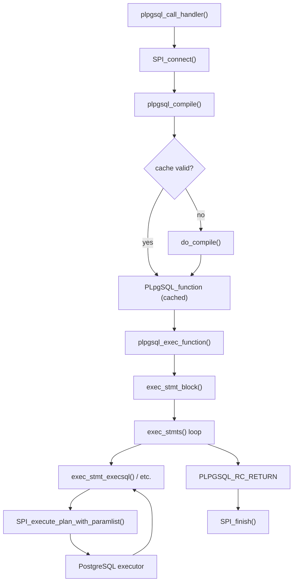
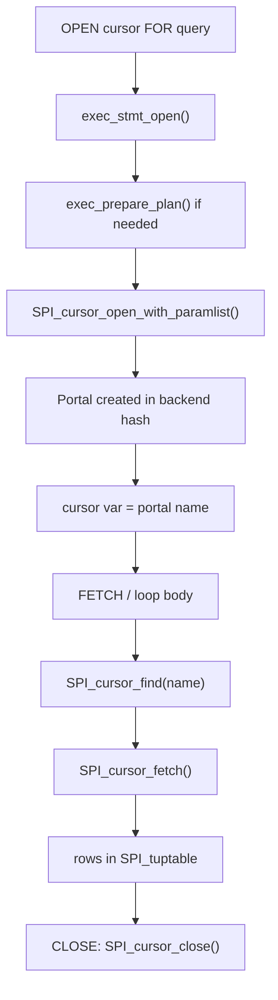

PL/pgSQL is PostgreSQL's built-in procedural language. It is a loadable extension (`plpgsql.so`) that plugs into the language handler mechanism, giving it the same standing in `pg_language` as any other procedural language. The runtime model has two phases: a per-backend compile phase that converts the function source into an AST, and a separate execution phase that walks the AST and runs SQL statements through the Server Programming Interface (SPI).

## Language handler registration

PL/pgSQL registers itself through the standard extension mechanism. The extension SQL script (`plpgsql--1.0.sql`) issues a single `CREATE TRUSTED LANGUAGE` statement:

```sql
CREATE TRUSTED LANGUAGE plpgsql
  HANDLER plpgsql_call_handler
  INLINE plpgsql_inline_handler
  VALIDATOR plpgsql_validator;
```

This populates a row in `pg_language`. The three C functions are entry points in `pl_handler.c`:

| Entry point | Invoked when |
|---|---|
| `plpgsql_call_handler` | Any regular function, procedure, or trigger written in plpgsql is called |
| `plpgsql_inline_handler` | A `DO` block is executed |
| `plpgsql_validator` | `CREATE FUNCTION` runs with `check_function_bodies = on` |

When the function manager (`fmgr`) dispatches a call to a PL/pgSQL function, it calls `plpgsql_call_handler`. The handler opens an SPI connection, delegates to `plpgsql_compile` to get a compiled `PLpgSQL_function` struct, then calls the appropriate execution routine (`plpgsql_exec_function`, `plpgsql_exec_trigger`, or `plpgsql_exec_event_trigger`). On return it decrements a use counter and closes SPI.

The `plpgsql_validator` entry point runs at `CREATE FUNCTION` time and performs a dry-run compilation by calling `plpgsql_compile` with `forValidator = true`. The validator checks variable declarations and builds the statement tree, but does not plan SQL statements inside the body. This catches syntax errors and undefined variables without executing anything.

`_PG_init`, called once when the shared library loads, initialises the per-backend hash table (`plpgsql_HashTableInit`), registers transaction and subtransaction callbacks (`plpgsql_xact_cb`, `plpgsql_subxact_cb`), and sets up the instrumentation plugin rendezvous point.

## The compile phase

`plpgsql_compile` (`pl_comp.c`) is the gatekeeper for the compiled form of a function. On every call it:

1. Fetches the `pg_proc` tuple for the function OID.
2. Looks up the per-backend hash table (`plpgsql_HashTable`) using a `PLpgSQL_func_hashkey` that encodes the OID, trigger context, input collation, and resolved argument types for polymorphic functions.
3. Validates the cached entry by comparing the tuple's `xmin` and `ctid` against the stored values (`fn_xmin`, `fn_tid`). A mismatch means the function was replaced by a `CREATE OR REPLACE FUNCTION`.
4. If no valid entry exists, calls the internal `do_compile`.

```c
/* plpgsql_compile fast path (pl_comp.c) */
function = (PLpgSQL_function *) fcinfo->flinfo->fn_extra;
if (!function)
    function = plpgsql_HashTableLookup(&hashkey);

if (function &&
    function->fn_xmin == HeapTupleHeaderGetRawXmin(procTup->t_data) &&
    ItemPointerEquals(&function->fn_tid, &procTup->t_self))
    return function;   /* cache hit */

/* cache miss or stale: compile */
function = do_compile(fcinfo, procTup, function, &hashkey, forValidator);
```

The cache is keyed per-backend: there is no shared compiled form across connections. Each backend compiles the function independently, paying the compile cost once per session (or once per `CREATE OR REPLACE`).

`do_compile` reads the function source from `pg_proc.prosrc`, runs it through the PL/pgSQL scanner and grammar (`pl_gram.y`), and builds the `PLpgSQL_function` struct in a private `MemoryContext` rooted at `TopMemoryContext`. The context survives for the life of the session (or until the function is replaced). `do_compile` uses a separate short-lived `plpgsql_compile_tmp_cxt` for allocations that are only needed during compilation.

### The PLpgSQL_function struct

`PLpgSQL_function` (`plpgsql.h`) holds everything the executor needs:

```c
typedef struct PLpgSQL_function {
    char       *fn_signature;   /* for error messages */
    Oid         fn_oid;
    TransactionId fn_xmin;      /* for cache validation */
    ItemPointerData fn_tid;

    int         ndatums;
    PLpgSQL_datum **datums;     /* flat array of all variables */

    PLpgSQL_stmt_block *action; /* root of the statement tree */

    unsigned int nstatements;   /* count, for profiling */
    struct PLpgSQL_execstate *cur_estate;
    unsigned long use_count;    /* non-zero means function is active */
} PLpgSQL_function;
```

`datums` is a flat array indexed by datum number (`dno`). Every local variable, function parameter, record, row, and special variable (`FOUND`, trigger-specific variables) gets a `dno`. The statement tree references variables only by `dno`, never by name, so name resolution is entirely a compile-time concern.

### Statement AST nodes

Each statement type maps to a C struct that embeds a `PLpgSQL_stmt_type` discriminant and a source line number. The full set is enumerated in `PLpgSQL_stmt_type`:

| Enum value | Struct | Purpose |
|---|---|---|
| `PLPGSQL_STMT_BLOCK` | `PLpgSQL_stmt_block` | BEGIN/END block, carries exception handler |
| `PLPGSQL_STMT_ASSIGN` | `PLpgSQL_stmt_assign` | Variable assignment |
| `PLPGSQL_STMT_IF` | `PLpgSQL_stmt_if` | IF/ELSIF/ELSE |
| `PLPGSQL_STMT_EXECSQL` | `PLpgSQL_stmt_execsql` | Inline SQL statement |
| `PLPGSQL_STMT_DYNEXECUTE` | `PLpgSQL_stmt_dynexecute` | `EXECUTE` (dynamic SQL) |
| `PLPGSQL_STMT_RETURN` | `PLpgSQL_stmt_return` | RETURN |
| `PLPGSQL_STMT_RAISE` | `PLpgSQL_stmt_raise` | RAISE |
| `PLPGSQL_STMT_OPEN` | `PLpgSQL_stmt_open` | OPEN cursor |
| `PLPGSQL_STMT_FETCH` | `PLpgSQL_stmt_fetch` | FETCH / MOVE |
| `PLPGSQL_STMT_FORS` | `PLpgSQL_stmt_fors` | FOR loop over SELECT |
| `PLPGSQL_STMT_FORI` | `PLpgSQL_stmt_fori` | FOR loop over integer range |
| `PLPGSQL_STMT_WHILE` | `PLpgSQL_stmt_while` | WHILE loop |
| `PLPGSQL_STMT_CALL` | `PLpgSQL_stmt_call` | CALL procedure |
| `PLPGSQL_STMT_COMMIT` | `PLpgSQL_stmt_commit` | COMMIT |
| `PLPGSQL_STMT_ROLLBACK` | `PLpgSQL_stmt_rollback` | ROLLBACK |

The compiler represents SQL expressions embedded in PL/pgSQL code — conditions, right-hand sides of assignments, `INTO` targets — as `PLpgSQL_expr`, which holds the raw query string, a `SPIPlanPtr` (populated on first use), and an optional fast-path `Expr *` for simple expressions.

## Execution

The executor (`pl_exec.c`) maintains a `PLpgSQL_execstate` for the duration of a function call. The execstate holds a copy of the datums array populated with runtime values, the SPI evaluation context, the current `err_stmt` pointer for error reporting, and the result accumulator for set-returning functions.



### SQL statement execution

Every inline SQL statement compiles to a `PLpgSQL_stmt_execsql` node. `exec_stmt_execsql` (`pl_exec.c`) handles its execution:

- On the first call for a given statement, `exec_stmt_execsql` invokes `exec_prepare_plan`. This calls `SPI_prepare_extended` with a custom parser setup hook (`plpgsql_parser_setup`) that resolves PL/pgSQL variable references as `Param` nodes rather than column references. `exec_prepare_plan` stores the resulting `SPIPlanPtr` in `expr->plan` via `SPI_keepplan`; it survives as long as the compiled `PLpgSQL_function` does.
- On subsequent calls, `exec_stmt_execsql` reuses the plan. `setup_param_list` passes the local variables as a `ParamListInfo`, so the executor sees them as bound parameters.
- The actual dispatch is `SPI_execute_plan_with_paramlist(expr->plan, paramLI, readonly, tcount)`. After execution, `SPI_processed` and `SPI_tuptable` carry the result count and rows.

The executor sets `FOUND` automatically, based on the command type and row count.

### Simple expression fast path

Not all expressions in PL/pgSQL go through SPI. `exec_prepare_plan` calls `exec_simple_check_plan` after preparing the plan. If the plan has exactly one query, and that query consists of a single targetlist expression with no FROM clause, `exec_simple_check_plan` extracts the `Expr` node and stores it in `expr->expr_simple_expr`.

On subsequent evaluations `exec_eval_simple_expr` calls `ExecEvalExpr` directly on that expression tree, bypassing SPI, parse, and plan entirely. `exec_eval_simple_expr` evaluates the expression inside the transaction-wide `shared_simple_eval_estate`, which is created once per transaction and shared across all PL/pgSQL function calls in that transaction. DO blocks get their own private EState to avoid accumulating state across DO invocations.

The condition `expr->expr_simple_in_use` guards against recursion. If the executor reaches the same expression tree again while it is already evaluating that tree — possible if a simple expression calls a function that re-enters the same PL/pgSQL function — it falls back to the SPI path.

## SPI — Server Programming Interface

SPI is the C API that allows code executing inside a backend to run SQL without going through the client protocol. PL/pgSQL is the most prominent SPI user, but triggers, C functions, and other procedural languages use it too. The implementation is in `src/backend/executor/spi.c`.

`SPI_connect` (or `SPI_connect_ext`) pushes a new `_SPI_connection` entry onto a backend-global stack. Each connection gets a `procCxt` (procedure-lifespan memory) and an `execCxt` (query-lifespan memory). SPI fully supports nested calls — PL/pgSQL calls `SPI_connect` at the start of `plpgsql_call_handler` and `SPI_finish` at the end, so a PL/pgSQL function that calls another PL/pgSQL function via SQL will have two SPI levels active simultaneously.

```c
/* SPI_connect_ext (spi.c) — key initialisation */
_SPI_current->procCxt = AllocSetContextCreate(
    _SPI_current->atomic ? TopTransactionContext : PortalContext,
    "SPI Proc", ALLOCSET_DEFAULT_SIZES);
_SPI_current->execCxt = AllocSetContextCreate(..., "SPI Exec", ...);
MemoryContextSwitchTo(_SPI_current->procCxt);
```

`SPI_finish` pops the level, deletes both [[subsystems/memory/contexts|memory contexts]], and restores the previous `SPI_processed` / `SPI_tuptable` global values that `SPI_connect` saved when the connection opened.

### SPI_execute vs SPI_prepare + SPI_execute_plan

`SPI_execute` parses, plans, and runs a query string on every call. It creates a one-shot plan that is discarded afterwards. This is appropriate for queries that are not repeated, or for queries constructed at runtime where a cached plan would never be reused.

`SPI_prepare_extended` (used by `exec_prepare_plan`) stores the parse and plan in a `SPIPlanPtr` that `SPI_keepplan` can retain across calls. PL/pgSQL then executes the plan repeatedly via `SPI_execute_plan_with_paramlist`. This is how PL/pgSQL achieves PREPARE-like semantics for every static SQL statement in the function body.

| Function | Plan lifetime | Use case |
|---|---|---|
| `SPI_execute` | Single call | One-off dynamic queries |
| `SPI_prepare_extended` + `SPI_keepplan` | Function lifetime | Static PL/pgSQL statements |
| `SPI_cursor_open_with_paramlist` | Until portal closed | Cursor queries |

## Plan caching and generic/custom plan selection

The same plan cache infrastructure (`plancache.c`) that serves prepared statements manages plans stored via `SPI_keepplan`. Each `SPIPlanPtr` wraps one or more `CachedPlanSource` structs.

On the first execution (or after a cache invalidation), the plan cache re-validates the plan. If the underlying tables or functions have changed, the planner replans the query. The planner chooses between a generic plan (planned once with parameter markers) and a custom plan (replanned with the actual parameter values) using `choose_custom_plan`:

- For the first five executions, the planner always generates custom plans to collect cost data.
- After five executions, the planner compares the average custom plan cost (including replanning overhead) against the generic plan cost. Whichever is cheaper wins.
- The `plan_cache_mode` GUC (`auto`, `force_generic_plan`, `force_custom_plan`) overrides the automatic selection.

This logic is identical to the logic for server-side prepared statements (`PREPARE`/`EXECUTE`). A PL/pgSQL function that runs a query with a highly skewed parameter distribution may benefit from `SET plan_cache_mode = force_custom_plan`, trading replanning cost for better per-execution plans.

## EXCEPTION blocks and subtransactions

A `BEGIN ... EXCEPTION WHEN ... END` block has a cost even when no exception is raised. `exec_stmt_block` (`pl_exec.c`) detects the presence of an exception handler and always wraps the block body in an internal subtransaction:

```c
if (block->exceptions)
{
    BeginInternalSubTransaction(NULL);
    MemoryContextSwitchTo(oldcontext);

    PG_TRY();
    {
        plpgsql_create_econtext(estate);
        rc = exec_stmts(estate, block->body);
        /* ...copy return value out of sub-xact if needed... */
        ReleaseCurrentSubTransaction();
    }
    PG_CATCH();
    {
        RollbackAndReleaseCurrentSubTransaction();
        /* ...match exception against WHEN clauses... */
    }
    PG_END_TRY();
}
```

`BeginInternalSubTransaction` acquires a subtransaction savepoint. Even when the body runs without error and the block calls `ReleaseCurrentSubTransaction`, this imposes overhead: the subtransaction machinery must track row locks, portal state, and resource owners. Functions that use EXCEPTION blocks purely for `SQLSTATE` checks on operations that rarely fail pay this cost on every call.

`plpgsql_create_econtext` creates a new `ExprContext` inside the subtransaction, because the outer `eval_econtext` would fire its callbacks at the wrong time if the subtransaction aborted. The `simple_econtext_stack` tracks all live econtext entries so the subtransaction abort callbacks can clean them up correctly.

The subtransaction abort releases any cached plans held at that time. Subsequent execution of the same statement will replan from scratch. This is why code inside a frequently-entered EXCEPTION block may exhibit more replanning than equivalent code outside one.

## RAISE and error context

`RAISE` (`exec_stmt_raise`, `pl_exec.c`) constructs an error using the standard `ereport` machinery. The RAISE level maps directly to PostgreSQL error severity levels (`DEBUG`, `LOG`, `INFO`, `NOTICE`, `WARNING`, `EXCEPTION`). For `RAISE EXCEPTION`, the call unwinds the stack in the normal error handling path.

`plpgsql_exec_error_callback` injects the function name and line number that appear in error messages from PL/pgSQL code; PostgreSQL registers it as an error context callback at function entry. It reads `estate->err_stmt->lineno` and `estate->func->fn_signature` to compose messages like:

```
ERROR:  ...
CONTEXT:  PL/pgSQL function my_func(integer) line 12 at SQL statement
```

PostgreSQL also invokes the callback during variable initialisation if `estate->err_var` is non-null, attributing the error to the declaring line rather than an executing statement.

## Cursors in PL/pgSQL

A cursor variable in PL/pgSQL is a `PLpgSQL_var` of type `refcursor`. `exec_stmt_open` handles the `OPEN cursor FOR query` statement: it prepares the plan if not already done, builds a `ParamListInfo`, and calls `SPI_cursor_open_with_paramlist`. This creates a portal in the current backend's portal hash and stores the portal name as the value of the cursor variable (a text string). Declaring a cursor with `CURSOR FOR` at compile time stores the query expression in `curvar->cursor_explicit_expr`; `OPEN` does not create the portal until it runs.

`FETCH` and `MOVE` (`exec_stmt_fetch`) look up the portal by name via `SPI_cursor_find` and call `SPI_cursor_fetch` or `SPI_scroll_cursor_fetch`. The result rows land in `SPI_tuptable`; `exec_stmt_fetch` moves them into the target variable.

`CLOSE` (`exec_stmt_close`) calls `SPI_cursor_close`, which destroys the portal and releases its resources.

FOR loops over queries (`PLpgSQL_stmt_fors`) use the same portal mechanism internally. `exec_stmt_fors` opens a cursor, fetches rows in batches, and closes the portal at loop end. The prefetch count starts at 1 and rises to 50 once the first row confirms the query returns data.



## Memory management

Three distinct memory lifetimes co-exist inside an executing PL/pgSQL function:

1. **Function lifetime** (`func->fn_cxt`): the compiled AST, datum type descriptors, and cached `SPIPlanPtr` values. Survives across calls; freed only when the function is replaced.

2. **Call lifetime** (SPI `procCxt`): local variable values, the `PLpgSQL_execstate` itself, and tuple data fetched from queries. Created by `SPI_connect` and freed by `SPI_finish`.

3. **Statement lifetime** (`estate->stmt_mcontext`): scratch memory needed for a single statement — for example, the `ErrorData` captured during exception handling. Created on-demand via `get_stmt_mcontext` and reset at statement end.

A fourth ephemeral tier is the `eval_econtext` per-tuple memory context, used for short-lived expression evaluation results and reset after each `exec_eval_cleanup` call.

## Instrumentation

The plugin mechanism (`PLpgSQL_plugin`, `plpgsql.h`) lets extensions intercept function entry, exit, and statement boundaries without modifying the PL/pgSQL source. The plugin registers callbacks (`func_setup`, `func_beg`, `func_end`, `stmt_beg`, `stmt_end`) via a rendezvous variable (`PLpgSQL_plugin`). Extensions such as `plpgsql_check` and coverage tools use this interface. `_PG_init` sets up the plugin pointer, and `plpgsql_exec_function` consults it.

Compilation assigns each statement a unique `stmtid` (`function->nstatements++`). A profiling plugin can use `stmtid` as an array index to accumulate per-statement call counts and timing data across multiple function invocations.

## Common performance pitfalls

**EXCEPTION block overhead.** Every block with an EXCEPTION clause creates and releases a subtransaction on every execution, regardless of whether an error occurs. For hot paths, move the error-prone operation outside the EXCEPTION block or restructure to use a different error-avoidance strategy (e.g. `ON CONFLICT DO NOTHING` for INSERT conflicts).

**Plan instability at the five-execution boundary.** A PL/pgSQL function whose SQL statement is executed exactly five times may produce different plans on call 5 (last custom plan) and call 6 (first generic plan). If this causes a regression, `plan_cache_mode` can force consistency.

**Variable shadowing.** When a PL/pgSQL variable name matches a column name in a query, the default `plpgsql.variable_conflict = error` setting raises an error. Setting it to `use_variable` or `use_column` suppresses the error but changes query semantics silently. The `plpgsql.extra_warnings = 'shadowed_variables'` setting makes this visible at function creation time.

**Dynamic SQL replanning.** `EXECUTE` (dynamic SQL via `PLpgSQL_stmt_dynexecute`) never caches a plan. Every execution parses and plans the string from scratch. Using `EXECUTE ... USING` passes parameters safely but does not help with replanning cost.

## Related Topics

- [[subsystems/plpgsql/exception-handling|PL/pgSQL Exception Handling]] — details the subtransaction mechanics, error matching, and SQLSTATE handling that underpin the EXCEPTION block coverage in this article.
- [[subsystems/plpgsql/cursors|PL/pgSQL Cursors]] — covers the portal lifecycle, FETCH/MOVE semantics, and FOR-loop cursor batching that build on the SPI cursor API described here.
- [[subsystems/plpgsql/variable-scoping|PL/pgSQL Variable Scoping]] — explains how datum numbers are resolved at compile time and how shadowing rules interact with query parameter binding.
- [[subsystems/plpgsql/trigger-functions|PL/pgSQL Trigger Functions]] — describes how `plpgsql_exec_trigger` and `plpgsql_exec_event_trigger` differ from the regular call path outlined in this article.
- [[subsystems/extensions/procedural-languages|Procedural Languages]] — explains the language handler registration mechanism (`pg_language`, `plpgsql_call_handler`) that PL/pgSQL relies on.
- [[subsystems/planner/generic-plans|Generic vs Custom Plans]] — covers the `choose_custom_plan` heuristic and `plan_cache_mode` GUC that govern plan reuse for every cached SPI plan inside PL/pgSQL.
- [[subsystems/transactions/subtransactions|Subtransactions]] — documents the internal savepoint infrastructure that PL/pgSQL EXCEPTION blocks invoke via `BeginInternalSubTransaction`.
- [[code-paths/create-function|CREATE FUNCTION Code Path]] — walks through `ProcedureCreate()` and `pl_comp.c`, the compilation path that turns function source text into the cached `PLpgSQL_function` this article describes executing.
- [[code-paths/call|CALL Statement Code Path]] — the parse and execution path for stored procedures, which reuses the same PL/pgSQL handler and SPI machinery as ordinary functions.
- [[code-paths/do|DO — Anonymous Code Blocks]] — runs a PL/pgSQL block without creating a catalog function, sharing the same compile and execution phases outlined here.
- [[code-paths/cursor|Cursors and Portals]] — the portal and executor infrastructure underlying the cursor statements PL/pgSQL exposes through SPI.
