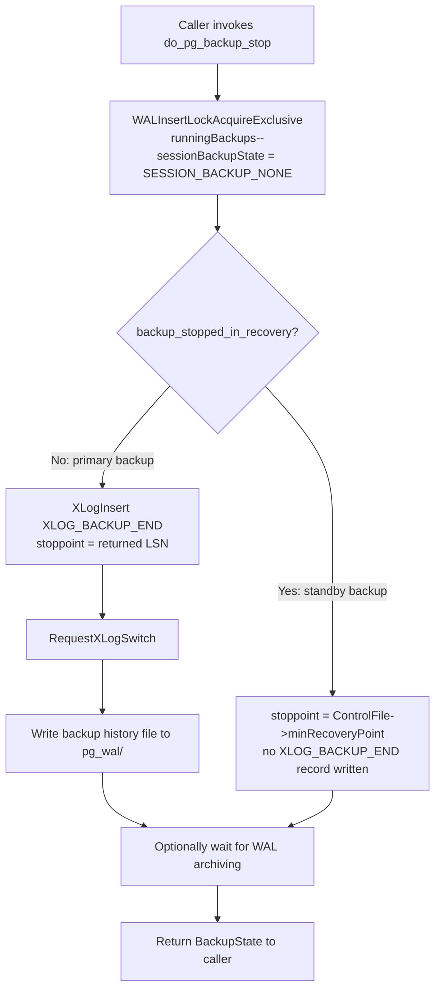
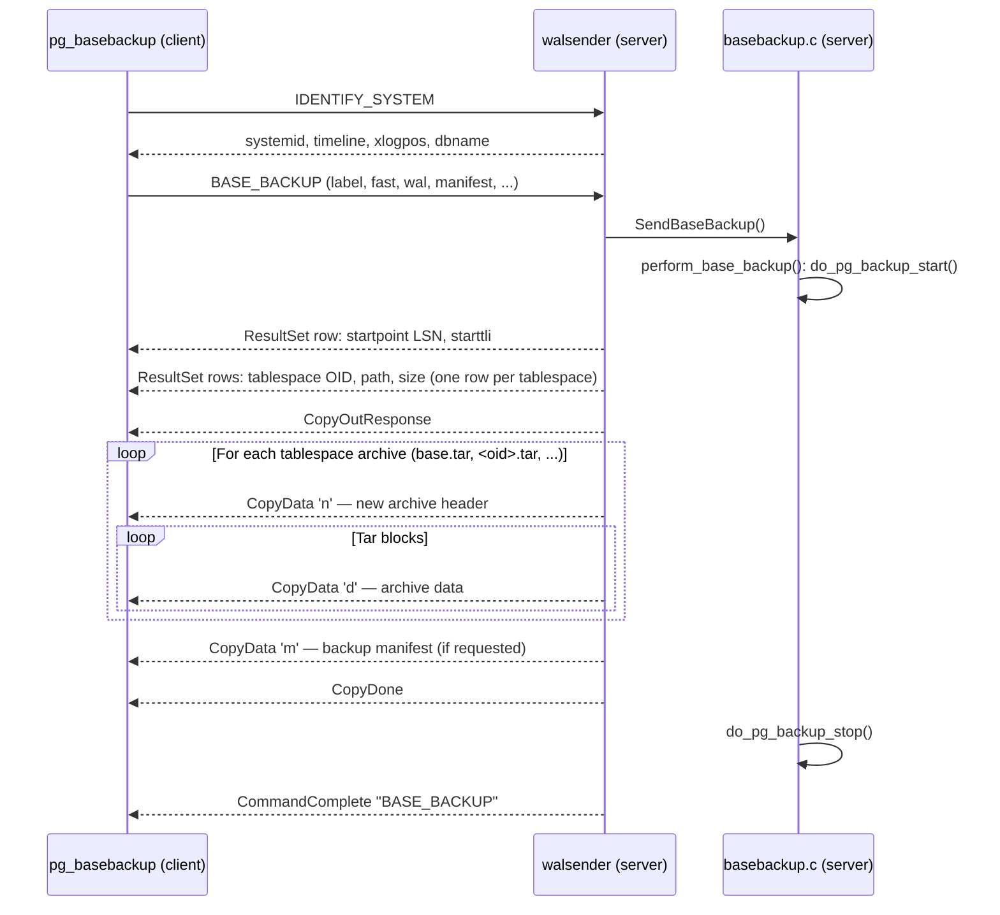

# pg_basebackup and Physical Base Backups

A **base backup** is a consistent binary snapshot of the entire cluster data directory (`PGDATA`) together with any out-of-place tablespaces. It can start a fresh standby server or serve as the baseline for point-in-time recovery (PITR). Because individual pages may be written mid-backup (a "torn page"), PostgreSQL makes the backup consistent not by quiescing I/O but by ensuring that WAL replay, starting from the recorded start LSN, can repair every torn page before the instance accepts connections.

## What Makes a Base Backup Consistent

The consistency guarantee rests on three pillars:

1. **Full-page writes (FPW).** When `do_pg_backup_start` increments `XLogCtl->Insert.runningBackups`, the WAL-insertion path logs every first write to a page after the backup-start checkpoint as a full-page image (`src/backend/access/transam/xlog.c`, line 823):
   ```c
   doPageWrites = (Insert->fullPageWrites || Insert->runningBackups > 0);
   ```
   This means that even if the backup copies a torn page, the WAL stream contains a full pre-modification image that recovery can apply.

2. **A well-defined start LSN.** `do_pg_backup_start` forces a checkpoint and reads the REDO pointer from `pg_control` as `state->startpoint`. Recovery must replay all WAL from this LSN onward to reach a consistent state.

3. **An end-of-backup WAL record.** `do_pg_backup_stop` writes an `XLOG_BACKUP_END` record (`RM_XLOG_ID`) that carries `state->startpoint`. Recovery uses this record to know it has replayed enough WAL and may now open for connections (`backupEndRequired` is cleared).

## Backup APIs

PostgreSQL exposes two SQL-callable APIs and one internal path used by `pg_basebackup`.

### Legacy: `pg_start_backup` / `pg_stop_backup` (deprecated PG 15+)

The original API used **exclusive** backups: the server wrote a single `backup_label` file to `PGDATA`, and only one backup could run at a time. These functions were removed in PostgreSQL 15. They are not discussed further.

### Current: `pg_backup_start` / `pg_backup_stop`

Introduced as the non-exclusive replacement. State lives in a per-session `BackupState` struct allocated in a dedicated [[subsystems/memory/contexts|memory context]] (`backupcontext` in `xlogfuncs.c`), not in shared memory. This allows arbitrarily many concurrent non-exclusive backups.

```c
/* src/include/access/xlogbackup.h */
typedef struct BackupState
{
    char        name[MAXPGPATH + 1];   /* label string */
    XLogRecPtr  startpoint;            /* backup start WAL location (REDO ptr) */
    TimeLineID  starttli;
    XLogRecPtr  checkpointloc;         /* the checkpoint that preceded the start */
    pg_time_t   starttime;
    bool        started_in_recovery;

    XLogRecPtr  stoppoint;             /* filled by do_pg_backup_stop */
    TimeLineID  stoptli;
    pg_time_t   stoptime;
} BackupState;
```

`pg_backup_start(label, fast)` returns the start LSN. `pg_backup_stop(waitforarchive)` returns a composite of `(lsn, backup_label_contents, tablespace_map_contents)` — the caller must write these files into the data directory being restored.

| Field | Source | Purpose |
|---|---|---|
| `startpoint` | `ControlFile->checkPointCopy.redo` after checkpoint | Earliest WAL needed for recovery |
| `checkpointloc` | `ControlFile->checkPoint` | Location of checkpoint record itself |
| `starttli` | `ControlFile->checkPointCopy.ThisTimeLineID` | Timeline at backup start |
| `stoppoint` | LSN of `XLOG_BACKUP_END` record | Signals recovery it can stop |

### Internal: `do_pg_backup_start` / `do_pg_backup_stop`

Both SQL functions delegate to `do_pg_backup_start` and `do_pg_backup_stop` in `xlog.c`. `perform_base_backup` in `basebackup.c` also calls these when `pg_basebackup` uses the replication protocol.

## `do_pg_backup_start` Step by Step

```mermaid
flowchart TD
    A[Client calls pg_backup_start / BASE_BACKUP command] --> B[WALInsertLockAcquireExclusive<br/>runningBackups++]
    B --> C[RequestXLogSwitch — force segment boundary]
    C --> D[RequestCheckpoint CHECKPOINT_FORCE | CHECKPOINT_WAIT<br/>optionally CHECKPOINT_IMMEDIATE if fast=true]
    D --> E[Read ControlFile: checkpointloc, startpoint, starttli]
    E --> F{gotUniqueStartpoint?}
    F -- No: another backup has same start --> D
    F -- Yes --> G[Scan pg_tblspc, build tablespace_map string]
    G --> H[Set sessionBackupState = SESSION_BACKUP_RUNNING]
    H --> I[Return startpoint LSN to caller]
```

Key details:

- **WAL segment switch before checkpoint.** `RequestXLogSwitch(false)` ensures the checkpoint record is in a fresh segment with no pages carrying the old TLI, avoiding a corner case after PITR restores (`xlog.c` line 8455).
- **Uniqueness loop.** If `XLogCtl->Insert.lastBackupStart >= state->startpoint`, `do_pg_backup_start` forces a second checkpoint so that concurrent backups have distinct start points (used as identifiers in the backup history file).
- **No exclusive lock on PGDATA.** The backup is "non-exclusive": the server returns `backup_label` and `tablespace_map` as strings to the caller, rather than writing them to disk. For `pg_basebackup`, the server writes them into the tar stream; the client extracts them.

## `do_pg_backup_stop` Step by Step



`do_pg_backup_stop` writes the **backup history file** to `pg_wal/` with a name derived from the start segment and start LSN (e.g., `000000010000000000000003.00000028.backup`). It contains the same fields as `backup_label` plus `STOP WAL LOCATION`, `STOP TIME`, and `STOP TIMELINE`.

## The `backup_label` File

`build_backup_content` in `src/backend/access/transam/xlogbackup.c` assembles the file contents from `BackupState`:

```
START WAL LOCATION: 0/3000028 (file 000000010000000000000003)
CHECKPOINT LOCATION: 0/3000060
BACKUP METHOD: streamed
BACKUP FROM: primary
START TIME: 2026-06-09 10:00:00 UTC
LABEL: pg_basebackup base backup
START TIMELINE: 1
```

| Line | Field | Recovery use |
|---|---|---|
| `START WAL LOCATION` | `state->startpoint` → `RedoStartLSN` | First WAL record recovery must apply |
| `CHECKPOINT LOCATION` | `state->checkpointloc` | Tells recovery where to read the checkpoint record |
| `BACKUP METHOD: streamed` | literal | Sets `backupEndRequired = true`; recovery plays until `XLOG_BACKUP_END` |
| `BACKUP FROM: standby` | `state->started_in_recovery` | Recovery validates pg_control state matches a standby |
| `START TIMELINE` | `state->starttli` | Used to verify TLI continuity |

`read_backup_label` in `src/backend/access/transam/xlogrecovery.c` parses these fields with `fscanf` at startup. `read_backup_label` stores `START WAL LOCATION` into `RedoStartLSN`, overriding the checkpoint REDO pointer from `pg_control`. `CHECKPOINT LOCATION` tells recovery where to read the checkpoint record. If `backup_label` is absent, recovery uses `pg_control` directly.

## `pg_basebackup` Internals

`pg_basebackup` uses the **replication protocol** rather than a regular SQL connection:

```
psql: dbname=postgres
pg_basebackup: dbname=replication (replication=true)
               optional second connection for WAL streaming
```

### Connection and Command Flow



`src/backend/replication/repl_gram.y` parses the `BASE_BACKUP` command; `walsender.c` (line 1839) dispatches it to `SendBaseBackup`. `SendBaseBackup` constructs a chain of `bbsink` objects and calls `perform_base_backup`.

### The `bbsink` Pipeline

`bbsink` (`src/include/backup/basebackup_sink.h`) is a polymorphic sink abstraction with a vtable (`bbsink_ops`). Sinks chain together:

```
bbsink_copystream  ← bbsink_progress ← [bbsink_gzip/lz4/zstd] ← bbsink_throttle
```

Each call to `bbsink_archive_contents(sink, len)` propagates data through the chain, optionally compressing, throttling, then writing `CopyData 'd'` messages to the client. `src/backend/backup/basebackup_copy.c` (`bbsink_copystream`) implements this.

### Tar Streaming Order

Within `base.tar`, `perform_base_backup` sends files in this order (important for recovery):

1. `backup_label` — injected first via `sendFileWithContent`
2. `tablespace_map` — injected second (if `sendtblspcmapfile` is true)
3. All other files in `PGDATA` via `sendDir` (recursive, skipping excluded dirs/files)
4. `pg_control` — sent **last** so recovery can detect a partial copy

`perform_base_backup` sends `pg_control` last deliberately: if a client crashes mid-copy, the absence or staleness of `pg_control` on disk signals that the backup is incomplete.

### Excluded Paths

`basebackup.c` maintains two static lists:

| List | Examples | Reason |
|---|---|---|
| `excludeDirContents[]` | `pg_stat_tmp`, `pg_replslot`, `pg_dynshmem`, `pg_notify`, `pg_serial`, `pg_snapshots`, `pg_subtrans` | Recreated or emptied at startup |
| `excludeFiles[]` | `backup_label`, `tablespace_map`, `backup_manifest`, `postmaster.pid`, `postmaster.opts`, `pg_internal.init*` | Not needed or actively harmful in restored copy |

## Checkpoint Modes: `--checkpoint=fast|spread`

Passed as the `fast` boolean to `do_pg_backup_start`:

| Mode | `CHECKPOINT_IMMEDIATE` flag | Behavior |
|---|---|---|
| `spread` (default) | not set | Checkpoint spreads dirty-page writes over `checkpoint_completion_target`; less I/O spike but takes longer |
| `fast` | set | Immediate checkpoint; backup starts sooner but causes a concentrated I/O burst |

## WAL Methods: `--wal-method=none|fetch|stream`

Controlled by `opt->includewal` in `basebackup_options`:

| Method | Behaviour | When to use |
|---|---|---|
| `none` | No WAL included; caller must supply WAL separately | Standby setups with continuous WAL archiving already configured |
| `fetch` | WAL segments between `startptr` and `stopptr` are copied from `pg_wal/` at the end of the backup after `do_pg_backup_stop` | Simple, single-connection; vulnerable to WAL recycling if backup takes long |
| `stream` (default) | Opens a **second** replication connection, creates a temporary replication slot (`pg_basebackup_<pid>`), and streams WAL continuously throughout the backup via `LogStreamerMain` (child process/thread) | Prevents WAL recycling; slot ensures WAL retention; requires `max_wal_senders >= 2` |

For `stream`, `StartLogStreamer` (`pg_basebackup.c` line 634) establishes the second connection. It creates a temporary replication slot with `CreateReplicationSlot(..., temp=true, ...)`, ensuring the primary retains WAL even if the backup takes a long time.

## Non-Exclusive Concurrent Backups

The old exclusive model stored backup state in a global file (`backup_label` in `PGDATA`) which prevented concurrent backups. The non-exclusive model stores state in:

- `BackupState` — per-backend struct allocated in session memory
- `sessionBackupState` — a `static SessionBackupState` variable in `xlog.c` (per-backend, not shared)
- `XLogCtl->Insert.runningBackups` — a shared counter protected by `WALInsertLock`

Multiple sessions can each hold their own `BackupState` and increment `runningBackups` independently. FPW enforcement persists as long as `runningBackups > 0`.

```c
/* xlog.c: FPW active whenever any backup is running */
doPageWrites = (Insert->fullPageWrites || Insert->runningBackups > 0);
```

## The `tablespace_map` File

`do_pg_backup_start` scans `pg_tblspc/` for numeric symlinks. For each one it records:

```
<oid> <escaped-absolute-path>
```

Example: `16384 /data/pg_tblspc/ts1`

`do_pg_backup_start` backslash-escapes `\n`, `\r`, and `\` characters in the path. On Windows, where `tar` extractors cannot create symlinks, `pg_basebackup` uses `tablespace_map` to recreate symlinks after extraction. On other platforms the file is present for portability and reproducibility. When `sendtblspcmapfile` is true (the default for `pg_basebackup`), `perform_base_backup` does NOT follow symlinks inside `pg_tblspc/` as directories in the tar stream — instead, it sends each tablespace as a separate `<oid>.tar` archive.

## The Backup Manifest

Introduced in PostgreSQL 13. When `manifest=yes` (the default for `pg_basebackup`), the server computes a checksum for every file in the backup and writes a JSON manifest (`backup_manifest`) as the final item in the CopyData stream (message type `'m'`).

`backup_manifest.c` builds the manifest via `AddFileToBackupManifest` (called from `sendFile`) and finalises it with `SendBackupManifest`. It also records WAL range information via `AddWALInfoToBackupManifest`.

The manifest enables `pg_verifybackup` to verify backup integrity without starting a PostgreSQL instance. **PostgreSQL 18:** `pg_verifybackup` gained the ability to verify tar-format backups directly, removing the previous requirement to extract the archive before verification.

| Manifest field | Source |
|---|---|
| Per-file path, size, last-modified | `struct stat` from `sendFile` |
| Per-file checksum | Computed during streaming; algorithm configurable (`manifest_checksums`) |
| WAL start/end LSN and TLI | From `backup_state` |
| PostgreSQL version | `PG_VERSION_STR` |

## Incremental Backups (PostgreSQL 17+)

**PostgreSQL 17** introduced incremental backups via `pg_basebackup --incremental`. Instead of copying the entire data directory, an incremental backup copies only the 8 kB blocks that have been modified since a prior backup. The `--incremental` option takes the path to the manifest of the backup being extended. The resulting backup set is not directly usable as a restore target — `pg_combinebackup` must first synthesise it.

**PostgreSQL 18:** `pg_combinebackup` gained a `--link` option that hard-links unchanged blocks from the base backup rather than copying them. This eliminates the disk space overhead of reconstruction when the base and combined output reside on the same filesystem.

### WAL Summarizer

The **WAL summarizer**, a new background process introduced in PostgreSQL 17, guides incremental backups. It reads WAL as it is produced and writes compact binary **summary files** to `pg_wal/summaries/`, each recording which block numbers (relation fork + block number) were modified in a given LSN range.

Enable the summarizer by setting `summarize_wal = on`. `wal_summary_keep_time` (a duration GUC) controls retention of old summary files; the summarizer removes summaries older than this. Because the summarizer derives summary files from WAL, they do not need separate archiving — it regenerates them on a standby from the standby's WAL stream.

Introspection functions:

| Function | Purpose |
|---|---|
| `pg_available_wal_summaries()` | Lists all summary files present in `pg_wal/summaries/` with their LSN ranges and timelines |
| `pg_wal_summary_contents(tli, start_lsn, end_lsn)` | Returns the individual block-level change records within a specific summary file |
| `pg_get_wal_summarizer_state()` | Shows the summarizer's current position and whether it is keeping up with WAL generation |

The `pg_walsummary` command-line tool dumps a summary file in human-readable form, useful for debugging which relations and blocks were touched in a given WAL range.

The relevant source is `src/backend/backup/basebackup_incremental.c` (PG 17+).

## Standby Backups

`pg_basebackup` can target a standby (`backup_started_in_recovery = true`):

- The standby does not write an `XLOG_BACKUP_END` record (standbys cannot write WAL)
- `do_pg_backup_stop` sets `stoppoint` to `ControlFile->minRecoveryPoint` rather than a newly inserted LSN
- The standby does not write a backup history file to `pg_wal/` (the archiver does not run on standbys)
- The primary already enforces full-page writes; the standby checks that `full_page_writes` has been on since the last restartpoint (`XLogCtl->lastFpwDisableRecPtr`)
- If the standby is promoted during the backup, `do_pg_backup_stop` raises an error

## Key Data Structures

| Symbol | File | Role |
|---|---|---|
| `BackupState` | `src/include/access/xlogbackup.h` | Holds all per-backup state: start/stop LSN, TLI, timestamps, label |
| `basebackup_options` | `src/backend/backup/basebackup.c` | Parsed from `BASE_BACKUP` command options: label, fast, includewal, manifest, compression |
| `bbsink` / `bbsink_ops` | `src/include/backup/basebackup_sink.h` | Polymorphic sink chain for streaming, compressing, throttling backup data |
| `bbsink_copystream` | `src/backend/backup/basebackup_copy.c` | Terminal sink that serialises archives as CopyData protocol messages |
| `backup_manifest_info` | `src/include/backup/backup_manifest.h` | Accumulates per-file checksums and WAL range for the manifest JSON |
| `tablespaceinfo` | (internal to basebackup.c) | OID, absolute path, relative path (if inside PGDATA), size of a tablespace |

## Backup Compression

Since PostgreSQL 15, `pg_basebackup` supports `--compress=lz4`, `--compress=zstd`, and `--compress=gzip` to compress the backup stream before it leaves the server, reducing network bandwidth. PostgreSQL implements each algorithm as a dedicated `bbsink` that sits in the sink chain between the data source and the terminal `bbsink_copystream`: `basebackup_lz4.c` wraps the lz4frame streaming API, and `basebackup_zstd.c` wraps the ZSTD streaming API. Both sinks conform to the same `bbsink_ops` interface (an opaque vtable with `write` and `finalize` callbacks), so `perform_base_backup` does not need to know which algorithm is active — it drives the chain uniformly. Compression occurs on the server side before the data reaches the `CopyData` protocol messages. As a result, the compressed bytes travel over the wire, and the client decompresses locally (or stores the archive compressed). The build only compiles in the lz4 and zstd sinks when it includes `--with-lz4` and `--with-zstd` respectively; if the corresponding library was absent at build time, requesting that algorithm at runtime raises an error.

## See also

- [[subsystems/wal/overview]]
- [[subsystems/wal/checkpoint]]
- [[subsystems/wal/recovery]]
- [[subsystems/replication/streaming]]
- [[subsystems/replication/slots]]
- [[subsystems/wal/archiving]]
