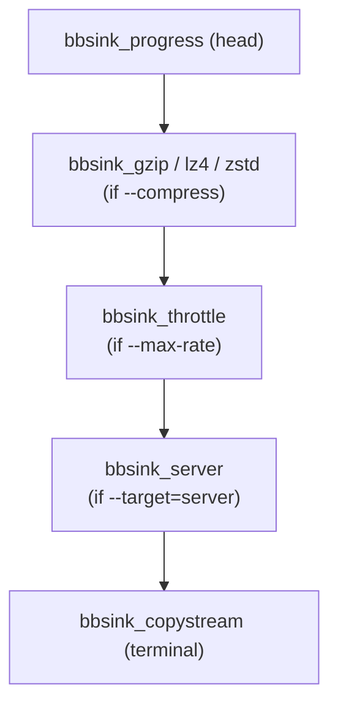

The bbsink (base backup sink) API is the abstraction layer introduced in PostgreSQL 15 that structures how backup data is processed and delivered during a [[subsystems/replication/base-backup|base backup]]. Before it existed, `basebackup.c` contained a tangle of conditionals that multiplexed compression, throttling, progress tracking, and delivery into a single code path. The bbsink model replaces those conditionals with a chain of composable objects: each stage in the chain is responsible for exactly one concern and passes data along to the next stage without knowing anything about what comes before or after it.

## The bbsink struct and vtable

Every sink is an instance of the `bbsink` struct (`src/include/backup/basebackup_sink.h`). The struct is intentionally small: a pointer to a `bbsink_ops` vtable, a shared data buffer and its length, a pointer to the next sink in the chain (`bbs_next`), and a pointer to a `bbsink_state` object shared across all sinks for the same backup.

The `bbsink_ops` vtable defines eight callbacks:

| Callback | Purpose |
|---|---|
| `begin_backup` | Called once at the very start. Must set `bbs_buffer` to a writable buffer of at least `bbs_buffer_length` bytes (always a multiple of `BLCKSZ`). |
| `begin_archive` | Called once per tablespace archive, before any data arrives. Receives the archive filename. |
| `archive_contents` | Called repeatedly with chunks of archive data already placed in `bbs_buffer`. `len` is the valid byte count. |
| `end_archive` | Called when all chunks for one archive have been delivered. |
| `begin_manifest` | Called once before manifest data begins, after all archives are done. |
| `manifest_contents` | Called repeatedly with manifest chunks, same contract as `archive_contents`. |
| `end_manifest` | Called when the manifest is complete. |
| `end_backup` | Called once when everything is finished. Receives the end LSN and timeline. |
| `cleanup` | Called unconditionally before the sink is destroyed — on success after `end_backup`, and on error instead of it. Used to release resources that would not be freed automatically. |

All callbacks are required; no slot may be null. For callbacks that a sink has no need to intercept, it uses one of the `bbsink_forward_*` functions from `basebackup_sink.c` as the implementation. These forwarding functions delegate to `bbs_next` and assert that the buffer is shared between the two sinks — an important invariant for the `archive_contents` and `manifest_contents` paths, where copying data to a separate buffer would be wasteful.

The caller always uses the inline wrappers (`bbsink_begin_backup()`, `bbsink_archive_contents()`, etc.) rather than calling `bbs_ops` function pointers directly. The wrappers add assertions about buffer sizing and state consistency.

## Sink chaining

`SendBaseBackup` builds the chain from the terminal sink outward: it constructs the last sink in the chain first, and passes it as `next` to the constructor of the sink that will precede it. The caller holds a pointer only to the head of the chain and calls all operations on that head; each sink decides what to do and whether to forward downstream via `bbs_next`.

A useful way to read the chain is that data flows from head toward tail, and control returns from tail toward head. A compression sink, for example, receives raw bytes via `archive_contents`, compresses them into its successor's buffer, and then calls `bbsink_archive_contents` on `bbs_next` with the compressed length. The progress sink at the head of the chain increments `bytes_done` in `bbsink_state` and updates `pg_stat_progress_basebackup` before forwarding the same uncompressed byte count downstream — the progress counters always reflect data volume as seen at the head of the chain, which is the pre-compression size.

The shared `bbsink_state` object is a single struct allocated by the caller and pointed to by every sink in the chain. It records the tablespace list, the current tablespace index, `bytes_done`, an estimated `bytes_total`, and the backup start LSN and timeline. Sinks read from this object to make decisions and a few of them (notably the progress sink) write to it.

## Available sink implementations

### Copy-stream sink

`bbsink_copystream_new()` (implemented in `src/backend/backup/basebackup_copy.c`) is the terminal sink in most chains. It serialises archive data into the PostgreSQL copy protocol and sends it to the connected client via the walsender. When `--target` is something other than `client`, `bbsink_copystream_new` constructs it with `send_to_client = false`, and it becomes a no-op terminal that discards data — a target sink inserted between it and the compression layer does the real delivery.

### Server-side sink

`bbsink_server_new()` (`src/backend/backup/basebackup_server.c`) writes each archive as a file in a server-side directory. `pg_basebackup` selects it when the user passes `--target=server:/path/to/dir`. The constructor enforces two security invariants: the caller must hold the `pg_write_server_files` role (ordinary replication permission is not sufficient), and the path must be absolute (to prevent accidentally backing up into `$PGDATA`). On `begin_archive` it opens a new file; on `archive_contents` it writes the buffer and advances the file offset; on `end_archive` it fsyncs and closes. `bbsink_server_new` writes the backup manifest under a `.tmp` suffix and renames it into place atomically after fsync — the presence of a correctly-named manifest is the completion signal.

### Compression sinks

Three compression sinks follow the same structural pattern: `bbsink_gzip_new()`, `bbsink_lz4_new()`, and `bbsink_zstd_new()` (in `basebackup_gzip.c`, `basebackup_lz4.c`, and `basebackup_zstd.c` respectively). Each wraps its compression library's streaming API. The `begin_archive` callback initialises the compression stream; `archive_contents` feeds the input buffer through the compressor and flushes completed output blocks into the successor's buffer; `end_archive` finalises the stream and flushes any remaining compressed bytes.

A key design point: compression sinks allocate their own output buffer (the successor's buffer) on `begin_backup`, and expose it as their own `bbs_buffer` to the layer above them. This means the upstream caller fills what it believes is its buffer. The compression sink transparently reads from the same memory. The compression sink sets its `bbs_buffer_length` to the downstream buffer length, which constrains how large each input chunk can be.

Compression is server-side. For operators, this means CPU cost falls on the database host, not the client. Network traffic is the compressed size, regardless of whether the client is `pg_basebackup` or a custom receiver.

### Throttle sink

`bbsink_throttle_new()` (`src/backend/backup/basebackup_throttle.c`) implements `max_transfer_rate`. Rather than measuring byte rate continuously, it uses a fixed sample size: every `throttling_sample` bytes (= `maxrate_kb * 1024 / THROTTLING_FREQUENCY`, where `THROTTLING_FREQUENCY` is 8), the sink checks how much real time has elapsed since the last measurement and sleeps for the remainder of the expected minimum interval. The sleep uses `WaitLatch` so that it respects interrupts and postmaster death. When the latch fires early due to unrelated WAL activity, the loop re-evaluates and sleeps again if needed.

Dividing by 8 means throttling checks occur eight times per second. This granularity bounds the maximum burst to one-eighth of the per-second rate limit before the next sleep kicks in. Because the throttle sink sits closer to the terminal than the compression sinks in the chain constructed by `basebackup.c`, it throttles the compressed byte stream — the same bytes that travel over the network.

### Progress sink

`bbsink_progress_new()` (`src/backend/backup/basebackup_progress.c`) is always the outermost (head) sink, regardless of what other stages are present. It intercepts `begin_backup`, `archive_contents`, and `end_archive` to update `pg_stat_progress_basebackup` via `pgstat_progress_update_param`. On `archive_contents` it increments `bbsink_state.bytes_done` by the uncompressed `len` and pushes updated `PROGRESS_BASEBACKUP_BACKUP_STREAMED` and `PROGRESS_BASEBACKUP_BACKUP_TOTAL` counters. Because it sits above any compression sink, `bytes_done` grows by pre-compression byte counts.

The sink also increments `tablespace_num` on `end_archive`, which is the mechanism by which the shared backup state tracks which tablespace it is currently processing. The main `basebackup.c` code reports several other progress phases (checkpoint wait, WAL archive wait) via standalone functions (`basebackup_progress_wait_checkpoint()`, `basebackup_progress_wait_wal_archive()`, etc.), calling them directly rather than routing through the sink interface.

## The target abstraction

The target subsystem (`src/backend/backup/basebackup_target.c`) separates "how to deliver bytes" from "how to transform them." A `BaseBackupTargetType` registers two callbacks: `check_detail`, which validates the `TARGET_DETAIL` string at parse time, and `get_sink`, which constructs the appropriate terminal sink. Built-in targets are `client` (the copystream sink), `server` (the server-side file sink), and `blackhole` (which returns the existing next sink unchanged, discarding all data).

Extensions can register new target types with `BaseBackupAddTarget()`. The function stores entries in `TopMemoryContext` so they survive session boundaries; if a caller registers the same name twice, the later registration replaces the earlier one. At backup start, `BaseBackupGetTargetHandle()` resolves the target name and stores the validated detail argument; `BaseBackupGetSink()` then calls `get_sink` to materialise the sink, inserting it between the copystream terminal and the transformation layers.

## How pg_basebackup options map to the chain

`SendBaseBackup()` (`src/backend/backup/basebackup.c`) assembles the chain immediately before `perform_base_backup()` runs:

Construction order in the source is terminal-first: `SendBaseBackup` calls `bbsink_copystream_new` first, then optionally `BaseBackupGetSink` inserts the target sink, then `bbsink_throttle_new` wraps that, then a compression sink wraps the throttle, and finally `bbsink_progress_new` wraps everything. The caller then holds the progress sink and passes it to `perform_base_backup`.

This ordering has observable consequences:

- **Compression happens before throttling in the data path** (progress → compression → throttle → terminal), so `--max-rate` limits the compressed byte rate seen by the network, not the raw byte rate.
- **Progress counters reflect raw bytes** because the progress sink is the head and counts `len` before compression has had a chance to reduce it.
- **Server-side and network delivery can coexist**: when the user specifies `--target=server`, the server sink writes files locally while the copystream terminal may simultaneously send data to the client (or not, if `send_to_client` is false).

## Related Topics

- [[subsystems/replication/base-backup|pg_basebackup and Physical Base Backups]]
- [[subsystems/wal/overview|WAL Overview]]
- [[subsystems/replication/slots|Replication Slots]]
