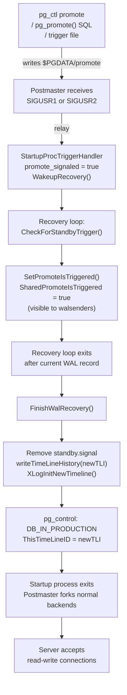
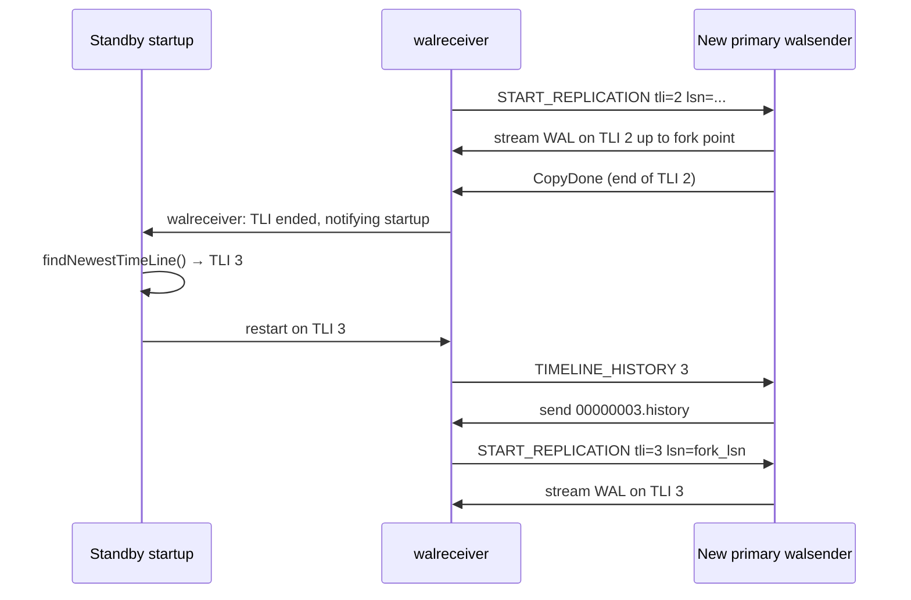
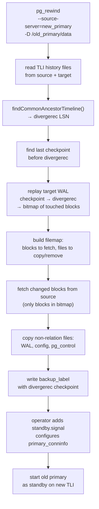
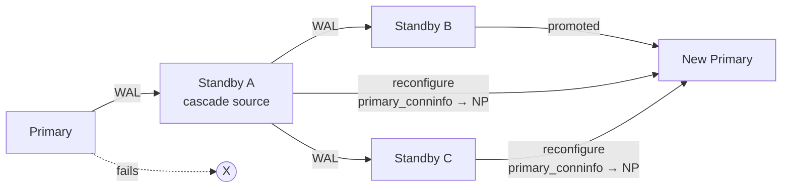

PostgreSQL distinguishes two promotion scenarios: **failover**, where the primary has failed unexpectedly and a standby must take over without coordination with the old primary, and **switchover**, a planned graceful handover where the operator verifies the standby is fully caught up before promoting. Both paths exercise the same kernel-level promotion mechanism inside the startup process — the differences are entirely in preparation steps, data-loss exposure, and post-promotion cleanup work.

## Terminology

| Term | Definition |
|------|-----------|
| **Failover** | Unplanned promotion triggered by primary failure; transactions committed on the primary but not yet replicated are irrecoverably lost |
| **Switchover** | Planned promotion with confirmed zero replication lag; no data loss when executed correctly |
| **Promotion** | The act of transitioning a standby from recovery/replay mode to read-write primary mode |
| **Timeline (TLI)** | A monotonically increasing integer identifying a distinct WAL history branch; prevents two divergent WAL streams from sharing LSN space |
| **Timeline history file** | File in `pg_wal/` (e.g. `00000003.history`) recording the LSN at which each ancestor timeline was forked; accumulates the complete lineage |
| **pg_rewind** | Utility that re-synchronises a former primary by copying only the blocks that changed after the fork point, rather than a full re-clone |
| **repmgr / Patroni** | Third-party tools that automate failover using distributed consensus to prevent split-brain |

## The Promotion Mechanism

### What Triggers Promotion

A standby enters promotion when it is in standby mode (`StandbyMode = true`, set when `standby.signal` existed at startup) **and** a promotion request arrives. There are three delivery mechanisms, but they all converge on writing the `$PGDATA/promote` file (`PROMOTE_SIGNAL_FILE`) and waking the startup process:

1. **`pg_ctl promote`** — the utility writes the trigger file and sends `SIGUSR2` to the postmaster.
2. **`pg_promote()` SQL function** — a superuser session on the standby calls this function (`xlogfuncs.c`), which writes the file and delivers `SIGUSR1` via the postmaster.
3. **Trigger file** — the `promote_trigger_file` GUC names a file whose mere existence activates promotion on the next recovery-loop iteration (legacy `trigger_file` from `recovery.conf` worked identically).

The postmaster's signal handler relays the signal to the startup process, which has installed `StartupProcTriggerHandler()`:

```c
/* src/backend/postmaster/startup.c */
static void
StartupProcTriggerHandler(SIGNAL_ARGS)
{
    promote_signaled = true;
    WakeupRecovery();   /* interrupt any sleep in the recovery loop */
}
```

### Standby promotion signal detection

On each recovery loop iteration, the startup process checks for a pending promotion request by calling `CheckForStandbyTrigger()` (xlogrecovery.c):

```c
/* src/backend/access/transam/xlogrecovery.c (simplified) */
static bool
CheckForStandbyTrigger(void)
{
    if (LocalPromoteIsTriggered)
        return true;

    /* promote_signaled set by signal handler */
    if (promote_signaled || CheckPromoteSignal())
    {
        ereport(LOG, (errmsg("received promote request")));
        ResetPromoteSignal();           /* remove $PGDATA/promote file */
        LocalPromoteIsTriggered = true;
        SetPromoteIsTriggered();        /* set shared-memory flag */
        return true;
    }
    return false;
}
```

`SetPromoteIsTriggered()` writes into `XLogRecoveryCtl->SharedPromoteIsTriggered`. This shared-memory flag lets other processes — notably walsenders serving cascading standbys — call `PromoteIsTriggered()` without going through the startup process. When a cascading walsender detects promotion it logs a message and sets `got_STOPPING = true` to terminate, forcing its downstream to reconnect.

### The Recovery Loop Exit and Mode Switch

Once `CheckForStandbyTrigger()` returns true, the recovery loop sets an internal `promoted` flag and exits cleanly after completing any in-progress WAL record. Control passes to `FinishWalRecovery()`, which:

1. Removes `standby.signal` (so the server does not re-enter standby mode after a subsequent crash).
2. Calls `writeTimeLineHistory()` to create the new timeline's history file.
3. Calls `XLogInitNewTimeline()` to create a writable WAL segment on the new TLI starting at `EndOfLog`.
4. Writes a new `pg_control` with `state = DB_IN_PRODUCTION` and `ThisTimeLineID = newTLI`.
5. Returns to `StartupXLOG()`, which finishes and exits.
6. The postmaster sees the startup process exit and enters normal operation, forking regular backends.



## Timeline Switch on Promotion

Without timeline IDs, two independent primaries could generate conflicting WAL at the same LSN positions. A standby reconnecting after one of them crashed could not distinguish which stream was authoritative. Timelines make every (TLI, LSN) pair globally unique within a cluster's history.

### Computing the New TLI

Inside `FinishWalRecovery()`, the new timeline is computed as:

```c
/* src/backend/access/transam/xlog.c (simplified) */
newTLI = findNewestTimeLine(recoveryTargetTLI) + 1;
```

`findNewestTimeLine()` scans `pg_wal` for existing `.history` files to find the highest TLI that branches from the current one, then adds one. This guarantees uniqueness even if multiple standbys promote concurrently — whichever writes its history file first wins in the archive; the others will see a conflict if they attempt to reuse the same TLI.

Crash recovery on a standalone server (not a standby) does *not* increment the TLI — it extends the existing timeline, because there is no competing history.

### writeTimeLineHistory

```c
/* src/backend/access/transam/timeline.c (simplified) */
void
writeTimeLineHistory(TimeLineID newTLI, TimeLineID parentTLI,
                     XLogRecPtr switchpoint, const char *reason)
{
    char        path[MAXPGPATH];
    char        tmppath[MAXPGPATH];
    FILE       *fd;

    /* e.g. pg_wal/00000004.history */
    TLHistoryFilePath(path, newTLI);
    snprintf(tmppath, sizeof(tmppath), "%s.tmp", path);

    fd = AllocateFile(tmppath, "w");

    /*
     * Copy all lines from the parent's history file (the full ancestry chain),
     * then append the new branch point.
     */
    appendParentHistory(fd, parentTLI);
    fprintf(fd, "%u\t%X/%08X\t%s\n",
            parentTLI,
            LSN_FORMAT_ARGS(switchpoint),
            reason);

    FreeFile(fd);
    durable_rename(tmppath, path, ERROR);   /* atomic on POSIX */

    if (XLogArchivingActive())
        XLogArchiveNotify(path);            /* send to archive */
}
```

The write is atomic via rename. The history file for TLI N always contains the **complete ancestry**: every `(parent_tli, fork_lsn, reason)` triple from TLI 1 up to TLI N-1, accumulated from the parent's file plus the new line.

### History File Format

A history file for timeline 5, which was promoted from a chain 1 → 2 → 3 → 4 → 5, contains:

```
1	0/3000000	no recovery target specified
2	0/A000028	no recovery target specified
3	1/20000A0	switchover at 2024-01-15 09:12:00 UTC
4	1/5000060	no recovery target specified
```

Each line: `parent_tli <TAB> fork_lsn <TAB> human_readable_reason`. The current timeline has no entry because it has no upper bound yet. Timeline 1 never has a history file.

The fork LSN is the **last byte of WAL** that belonged to the parent timeline before the branch — the exact byte position where the histories diverge.

## How Other Standbys Follow the New Primary

When a standby has `recovery_target_timeline = 'latest'` (the default since PostgreSQL 12), it automatically detects and follows a promotion on a sibling.

The walreceiver, after the streaming session ends on the old timeline (the walsender sends `CopyDone`), notifies the startup process. The startup process re-invokes `findNewestTimeLine()`. If a new history file is now available (fetched from the primary or the archive), the startup process updates `recoveryTargetTLI` and signals the walreceiver to restart with a fresh `START_REPLICATION` on the new TLI.



A standby that cannot reach any server with the new history file (and has no archive) will stall at the fork LSN, waiting indefinitely. This is a common failure mode when `primary_conninfo` still points at the crashed old primary.

## What Happens to the Old Primary

After an unplanned failover the old primary typically has WAL records beyond the fork LSN that the standby never received. These records committed transactions that are now permanently lost from the cluster's perspective. When the old primary recovers, its `pg_control` shows a TLI and LSN that diverge from the new primary's history.

Attempting to start the old primary as a standby pointing at the new primary produces:

```
FATAL:  requested timeline 3 is not a child of this server's history
DETAIL:  Latest checkpoint is at 1/500A028 on timeline 2, but in the history of the requested timeline, the server forked off from that timeline at 1/3F00080.
```

The old primary's WAL past `1/3F00080` conflicts with the new primary's WAL at those same LSN positions. It **cannot rejoin without rewinding or re-cloning**.

## pg_rewind

`pg_rewind` makes the old primary's data directory consistent with the new primary by copying only the data blocks that changed after the divergence point, rather than re-cloning the entire cluster. For a divergence that lasted seconds, this can reduce the resync time from tens of minutes to seconds.

### Prerequisites

| Requirement | Why |
|-------------|-----|
| `wal_log_hints = on` **or** data checksums enabled | pg_rewind needs full-page images in WAL to identify which blocks changed |
| `full_page_writes = on` | Must have been `on` during the divergence period on both servers |
| Old primary cleanly shut down (or a standby with valid `minRecoveryPoint`) | pg_rewind cannot determine where divergent WAL ends on a crashed server without a clean checkpoint |
| New primary reachable | Either `--source-server` (live connection) or `--source-pgdata` (mounted filesystem) |

### Three-Phase Algorithm

**Phase 1 — Find the divergence point.** `pg_rewind` reads timeline history files from both source and target, then calls `findCommonAncestorTimeline()` to walk back through the ancestry chains until they share a common ancestor. The result is `divergerec`: the last LSN present in both histories. Everything the target has beyond `divergerec` is divergent.

```c
/* src/bin/pg_rewind/pg_rewind.c (simplified) */
static XLogRecPtr
find_divergence_point(PGconn *conn)
{
    TimeLineHistoryEntry *sourceHistory = getServerHistory(conn);
    TimeLineHistoryEntry *targetHistory = getLocalHistory(datadir_path);
    return findCommonAncestorTimeline(sourceHistory, targetHistory,
                                      &targetTLI, &sourceTLI);
}
```

**Phase 2 — Scan divergent WAL for modified blocks.** Starting from the last checkpoint before `divergerec`, `pg_rewind` replays the target's divergent WAL using a lightweight WAL reader (`parsexlog.c`). For every record that touches a relation block, it records `(relfilenode, block_number)` in a bitmap (`datapagemap.c`). This identifies exactly which blocks `pg_rewind` needs to fetch from the source.

**Phase 3 — Copy changed blocks and files.** `pg_rewind` builds a file map (`filemap.c`) comparing the source and target file trees. For relation files, `pg_rewind` fetches only the blocks in the Phase 2 bitmap — it leaves the rest of the file untouched. It handles non-relation files (WAL segments, configuration files, `pg_control`) with full-file copies. It fetches the source `pg_control` last to capture the most recent `minRecoveryPoint`, which becomes the target's recovery starting point.

After `perform_rewind()` completes, `pg_rewind` writes a `backup_label`. This lets PostgreSQL recover from the correct checkpoint. The operator then creates `standby.signal` and sets `primary_conninfo` before starting the rewound server.



### The `--restore-target-wal` Flag

If the old primary crashed and its `pg_wal` directory has been partially recycled, Phase 2 cannot find all the divergent WAL on disk. The `--restore-target-wal` flag instructs pg_rewind to invoke `restore_command` from `postgresql.conf` to fetch WAL segments from the archive. Without this, Phase 2 will fail with "could not find common ancestor".

## Replication Slots and Failover

Replication slots live in `$PGDATA/pg_replslot/` and are **local to the server that holds them**. When a standby is promoted, it does not inherit the old primary's slots — they simply do not exist on the new primary.

The operator must recreate, on the new primary, any physical slots that guaranteed WAL retention for downstream standbys on the old primary:

```sql
-- On the new primary after promotion: recreate physical slots
SELECT pg_create_physical_replication_slot('replica2_slot');
SELECT pg_create_physical_replication_slot('replica3_slot');

-- Verify slot state
SELECT slot_name, slot_type, active, restart_lsn
FROM pg_replication_slots;
```

**Logical replication slots** are more problematic: they carry decoded change position (`confirmed_flush_lsn`) that cannot be reconstructed. A logical subscriber that was replicating from the old primary will lose its slot on failover and may miss changes.

PostgreSQL 17 introduced **failover slots** (`failover = true` when creating a logical slot). A background worker synchronises these slots to standbys, so that logical subscribers can reconnect to the new primary without skipping changes:

```sql
-- PG 17+: create a slot that survives failover
SELECT pg_create_logical_replication_slot(
    'my_sub_slot',
    'pgoutput',
    false,      -- temporary
    true        -- failover
);
```

On earlier versions, managing logical replication across failover requires either the replication tool's own coordination (e.g., pglogical) or accepting a brief gap.

## Cascading Replication and Failover

In a cascading topology, standby B streams from standby A (which streams from the primary). Promoting the primary is straightforward — A and B simply reconnect to the new primary. Promoting A or B as the new primary is more complex.



When a cascading walsender on A detects that the upstream it was serving has promoted, it terminates:

```c
/* src/backend/replication/walsender.c (simplified) */
if (am_cascading_walsender && !RecoveryInProgress())
{
    ereport(LOG,
            (errmsg("terminating walsender process after promotion of upstream")));
    got_STOPPING = true;
}
```

This forces B and C to reconnect. They will fail if their `primary_conninfo` still points at A (now demoted or down). The operator or automation tool must update `primary_conninfo` (typically in `postgresql.auto.conf`) on each downstream before or immediately after promoting B.

If A was behind B at the time of promotion, A also requires `pg_rewind` before it can rejoin as a standby.

## recovery_target_timeline = 'latest'

This parameter (set in `postgresql.conf` or `recovery.conf` on older releases) is the key to automatic timeline following:

```ini
# postgresql.conf on a standby
recovery_target_timeline = 'latest'
```

With `'latest'`, the startup process calls `findNewestTimeLine()` after each streaming session ends and recalculates `recoveryTargetTLI`. When it finds a newer timeline (because a history file just appeared), the walreceiver restarts on that timeline automatically.

Without `'latest'` (e.g., `recovery_target_timeline = 1`), the standby will stop at the end of timeline 1 and never follow a promotion. Operators use this for PITR to a specific point in a historical timeline, not for HA standbys.

Since PostgreSQL 12 the default value is `'latest'`, making the correct behavior opt-out rather than opt-in.

## Promotion Checklist

### Switchover (Planned)

The critical invariant is zero replication lag at the moment of promotion. Rush this and transactions committed on the old primary disappear.

```sql
-- Step 1: On the primary — confirm the target standby has zero lag
SELECT application_name,
       write_lsn,
       flush_lsn,
       replay_lsn,
       write_lag,
       flush_lag,
       replay_lag
FROM pg_stat_replication
WHERE application_name = 'target_standby';
-- All lag columns must be NULL or 00:00:00

-- Step 2: On the standby — confirm apply matches receive
SELECT pg_last_wal_receive_lsn(),
       pg_last_wal_apply_lsn();
-- Both should match the primary's pg_current_wal_lsn()

-- Step 3: On the primary — optionally run a checkpoint to minimize recovery work
CHECKPOINT;

-- Step 4: On the standby — promote
SELECT pg_promote();
-- or from OS: pg_ctl promote -D /path/to/data

-- Step 5: Verify the standby is now a primary
SELECT pg_is_in_recovery();
-- Must return false

-- Step 6: Check the new TLI
SELECT timeline_id FROM pg_control_checkpoint();

-- Step 7: Update application connection strings

-- Step 8: Rewind the old primary and restart it as a standby
-- (on the old primary's OS, after shutting it down cleanly)
-- pg_rewind --source-server="host=new-primary" -D /old/data
-- echo > /old/data/standby.signal
-- pg_ctl start -D /old/data
```

### Failover (Unplanned)

When the primary is unreachable, some steps are impossible and others must be compressed:

```sql
-- On candidate standby: check how far behind we are
SELECT pg_last_wal_receive_lsn(),
       pg_last_wal_apply_lsn(),
       now() - pg_last_xact_replay_timestamp() AS replay_delay;

-- Wait briefly for walreceiver to drain buffered WAL
-- (walreceiver may have already-received WAL in its buffer even if primary is down)
-- A few seconds is typically sufficient; check receive_lsn stops advancing.

-- Promote
SELECT pg_promote();

-- Record the fork LSN for later pg_rewind of the old primary
SELECT pg_current_wal_lsn() AS fork_lsn_approx;

-- Update connection strings; alert on potential data loss window
```

Accept that transactions committed on the old primary between the last replicated WAL and its crash are lost. Measure the loss window as the difference between the old primary's last LSN and the standby's `pg_last_wal_receive_lsn()` at promotion time.

## High-Availability Automation

Manual promotion has a window of seconds to minutes during which the cluster is unavailable — and requires a human in the loop. Production systems use tools that automate the decision, fencing, and cleanup:

| Tool | Consensus store | Key characteristics |
|------|-----------------|---------------------|
| **Patroni** | etcd, Consul, or ZooKeeper | Most widely deployed; DCS-based leader election; automatic `pg_rewind` reintegration; configurable `maximum_lag_on_failover` |
| **repmgr / repmgrd** | PostgreSQL catalog itself | Lighter weight; relies on witness server or vote quorum; supports manual and automatic failover |
| **pg_auto_failover** | Built-in monitor service | Designed for two-node setups; monitor tracks both nodes; no external DCS |
| **Stolon** | etcd or Consul | Kubernetes-native; keeper/proxy/sentinel architecture |

Patroni is worth understanding in detail because it handles the full lifecycle: it monitors `pg_stat_replication` lag, performs primary fencing before promotion (writes a fence token to the DCS that the old primary checks before accepting writes), calls `pg_promote()` on the standby with the least lag, runs `pg_rewind` on the old primary when it recovers, and updates HAProxy or pgBouncer connection routing. All within a configurable `ttl` (default 30 seconds).

The PostgreSQL engine intentionally provides no distributed consensus and no fencing. Split-brain prevention requires infrastructure that PostgreSQL cannot supply: STONITH hardware, cloud instance stop APIs, or a DCS that the primary checks before every write. Any HA tool that does not fence the old primary risks dual-write scenarios. In these scenarios, both servers accept client connections simultaneously.

## Observability

```sql
-- Monitor replication lag in real time (on primary)
SELECT application_name,
       pg_size_pretty(pg_wal_lsn_diff(pg_current_wal_lsn(), replay_lsn)) AS lag_bytes,
       replay_lag,
       extract(epoch from (now() - reply_time)) AS secs_since_heartbeat
FROM pg_stat_replication
ORDER BY lag_bytes DESC;

-- On standby: watch apply progress
SELECT pg_last_wal_receive_lsn() AS received,
       pg_last_wal_apply_lsn()   AS applied,
       pg_is_wal_replay_paused() AS paused;

-- After promotion: confirm timeline
SELECT timeline_id FROM pg_control_checkpoint();

-- Inspect timeline history
SELECT * FROM pg_timeline_history(3);
-- Returns: (tli, switchpoint, reason) for all ancestors of TLI 3

-- Check for split-brain: run on every suspected primary
SELECT inet_server_addr(), pg_is_in_recovery();
-- Exactly one server should return false
```

## Internal Data Structures

### XLogRecoveryCtlData (Shared Memory)

```c
/* src/backend/access/transam/xlogrecovery.c */
typedef struct XLogRecoveryCtlData
{
    /* ... */
    bool        SharedPromoteIsTriggered;   /* set by SetPromoteIsTriggered() */
    XLogRecPtr  lastReplayedEndRecPtr;      /* last WAL record applied */
    XLogRecPtr  replayEndRecPtr;            /* current WAL record being applied */
    slock_t     info_lck;
    /* ... */
} XLogRecoveryCtlData;
```

`SharedPromoteIsTriggered` is the shared-memory bridge between the startup process (which receives the signal) and walsender processes (which need to know to stop serving the old timeline to cascading standbys).

### TimeLineHistoryEntry

```c
/* src/include/access/xlog_internal.h */
typedef struct TimeLineHistoryEntry
{
    TimeLineID  tli;        /* the timeline */
    XLogRecPtr  begin;      /* start LSN (0 for the first entry) */
    XLogRecPtr  end;        /* end LSN (InvalidXLogRecPtr for the current TLI) */
} TimeLineHistoryEntry;
```

The walreceiver and `pg_rewind` both parse history files into arrays of `TimeLineHistoryEntry` and use binary search or linear scan to find the entry whose `[begin, end)` interval contains a target LSN.

## Related Topics

- [[subsystems/replication/streaming|Streaming Replication]] — the WAL transport layer that delivers records from primary to standby and whose session teardown triggers the timeline-switch logic on promotion.
- [[subsystems/replication/hot-standby|Hot Standby]] — covers how standbys serve read-only queries during recovery and the constraints that apply up to the moment of promotion.
- [[subsystems/replication/slots|Replication Slots]] — explains physical and logical slot mechanics, including the slot-loss problem on failover and the PG 17 failover-slot feature.
- [[subsystems/replication/pitr|Point-in-Time Recovery]] — PITR uses the same timeline history files and `recovery_target_timeline` machinery as failover; understanding both together clarifies how LSN/TLI coordinates work.
- [[subsystems/wal/recovery|WAL Recovery]] — the low-level replay engine (xlogrecovery.c) that the startup process drives through to the promotion exit point.
- [[subsystems/observability/pg-stat-replication|pg_stat_replication]] — the primary view used to assess replication lag before a switchover and to verify all standbys have reconnected after promotion.
- [[troubleshooting/replication-lag|Replication Lag]] — practical guidance on diagnosing and minimising lag, directly relevant to reducing the data-loss window in an unplanned failover.
