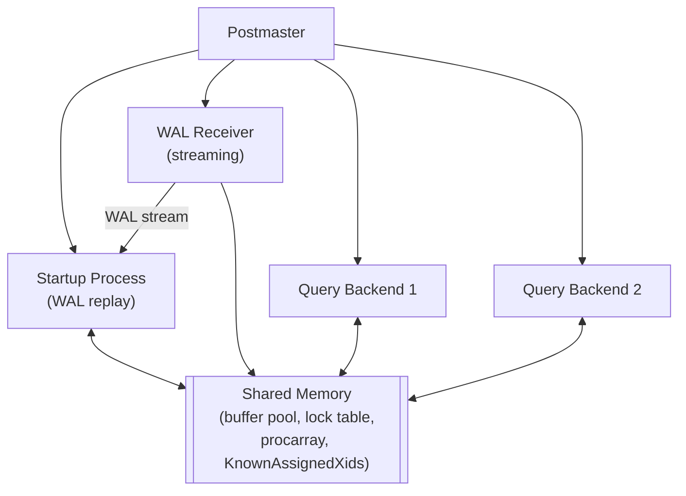
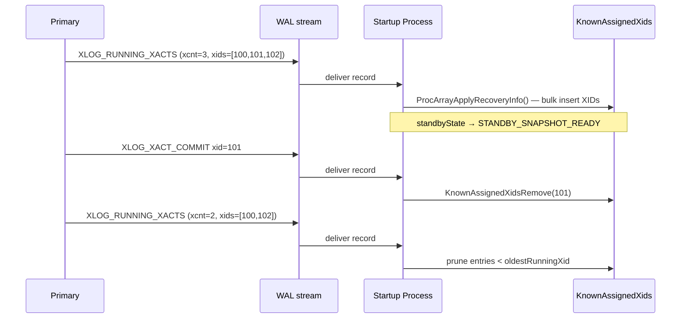
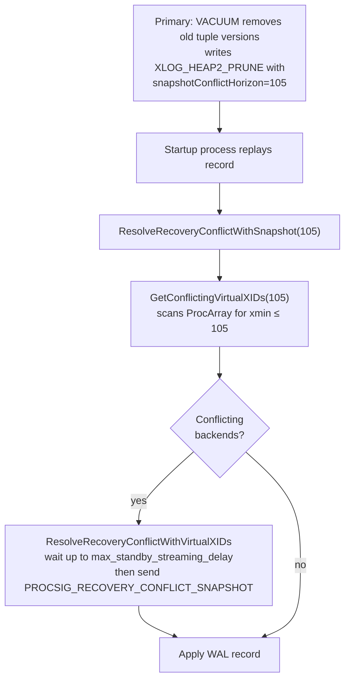
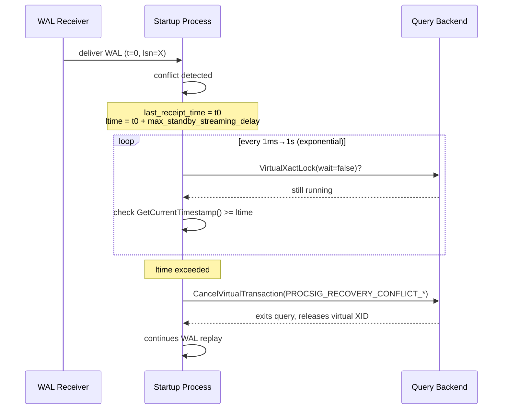

# Hot Standby and Recovery Conflicts

Hot standby is the facility that allows a physical replica to serve read-only queries while simultaneously applying WAL received from the primary. The result is that a standby is never merely a passive tape drive: it is a live PostgreSQL server whose startup process replays WAL in one code path. Normal query backends run concurrently in shared memory.

The challenge hot standby introduces is that WAL replay and live queries have conflicting interests. VACUUM on the primary will write WAL records that, when replayed, would invalidate a snapshot held by a standby query. A primary transaction's `AccessExclusiveLock` may have been WAL-logged, and the standby must replicate it as a real lock — blocking standby queries that want the same relation. PostgreSQL resolves this tension through *recovery conflicts*: a defined set of situations where the startup process may cancel standby queries so that WAL replay can proceed.

## The `hot_standby` GUC and startup sequence

The operator enables hot standby by setting `hot_standby = on` in `postgresql.conf` on the replica. `StartupXLOG()` (`src/backend/access/transam/xlogrecovery.c`) checks the GUC early. If it is off, `standbyState` stays at `STANDBY_DISABLED` for the entire recovery run and query backends may never connect.

The `standbyState` global (type `HotStandbyState`, `src/include/access/xlogutils.h`) drives the state machine that gates query access:

| State | Meaning |
|---|---|
| `STANDBY_DISABLED` | Hot standby off, or crash recovery only; no query access |
| `STANDBY_INITIALIZED` | `InitRecoveryTransactionEnvironment()` has run; transaction tracking structures allocated but not yet populated from WAL |
| `STANDBY_SNAPSHOT_PENDING` | A `XLOG_RUNNING_XACTS` record has been seen but its information may be incomplete; query backends may not connect yet, but redo functions must maintain in-memory state |
| `STANDBY_SNAPSHOT_READY` | Full knowledge of primary in-progress transactions is available; connections are accepted |

The macro `InHotStandby` (`src/include/access/xlogutils.h`) evaluates true whenever `standbyState >= STANDBY_SNAPSHOT_PENDING`, which is the condition used throughout the redo path to decide whether conflict resolution is needed.

### `InitRecoveryTransactionEnvironment`

Called once from the startup process after replaying a checkpoint record, this function (`src/backend/storage/ipc/standby.c`) sets up the infrastructure needed for the startup process to hold locks on behalf of primary transactions:

1. Allocates `RecoveryLockHash` and `RecoveryLockXidHash` — two hash tables tracking `AccessExclusiveLock`s that have been WAL-decoded from the primary.
2. Calls `SharedInvalBackendInit(true)` to register the startup process as a *send-only* participant in the shared-invalidation queue (it emits invalidations but does not read them).
3. Acquires a virtual transaction ID via `VirtualXactLockTableInsert()` so the startup process appears in `pg_locks` as a normal backend.

After this call `standbyState` advances to `STANDBY_INITIALIZED`. The postmaster still refuses connections; the snapshot is not yet valid.

### Opening for queries

Every `XLOG_RUNNING_XACTS` record seen during WAL replay triggers `ProcArrayApplyRecoveryInfo()` (`src/backend/storage/ipc/procarray.c`), which ingests the set of in-progress XIDs from the primary into `KnownAssignedXids`. Once the startup process processes the first complete running-xacts snapshot, `standbyState` advances to `STANDBY_SNAPSHOT_READY` and it sets the shared flag `XLogRecoveryCtl->SharedHotStandbyActive` to true. The postmaster sees this flag on its next check and begins accepting connections.

## Process architecture during recovery

The startup process and all query backends share the same buffer pool, lock table, and `ProcArray`. The startup process is the sole writer of WAL into the shared buffer pool during recovery. Query backends read pages from the buffer pool under normal buffer pins and shared locks. Because both parties use the same lock manager, it is possible for a WAL-applied operation to conflict with a lock held by a query backend — this is the origin of recovery conflicts.

## Snapshot acquisition on a standby

On a primary, `GetSnapshotData()` (`src/backend/storage/ipc/procarray.c`) scans the `ProcArray` to collect in-progress XIDs and computes `xmin`/`xmax`. On a standby the `ProcArray` only contains entries for local backends; there is no entry for primary transactions. The substitute is `KnownAssignedXids`.

Inside `GetSnapshotData()`, when `RecoveryInProgress()` is true, `KnownAssignedXidsGetAndSetXmin()` populates the snapshot's `subxip[]` array from `KnownAssignedXids` instead of from `ProcArray`. The function returns all XIDs in the array that are below `xmax`, sets the snapshot's `xmin` to the oldest such XID, and simultaneously writes that `xmin` into `MyProc->xmin` — which determines how aggressively VACUUM on the primary may reclaim rows.

On the standby, `GetSnapshotData()` treats all XIDs from the primary as subxids and stores them in `snapshot->subxip[]`, because recovery cannot distinguish top-level from subtransaction XIDs (a design decision that simplifies replay at the cost of a slightly larger snapshot structure). It leaves `snapshot->xcnt` (the top-level array) empty.

## KnownAssignedXids: the standby's ProcArray substitute

`KnownAssignedXids` is a pair of shared-memory arrays, `KnownAssignedXids[]` and `KnownAssignedXidsValid[]`, allocated alongside `ProcArrayStruct` during `CreateSharedMemoryAndSemaphores()`. Their size is `TOTAL_MAX_CACHED_SUBXIDS`. The `ProcArrayStruct` tracks the head/tail pointers and a spinlock for the ring-buffer management:

| Field in `ProcArrayStruct` | Purpose |
|---|---|
| `maxKnownAssignedXids` | Allocated capacity of the arrays |
| `numKnownAssignedXids` | Current count of valid (non-hole) entries |
| `tailKnownAssignedXids` | Index of the oldest valid entry |
| `headKnownAssignedXids` | Index one past the newest entry |
| `known_assigned_xids_lck` | Spinlock protecting head/tail |
| `lastOverflowedXid` | Highest XID removed due to overflow; used to detect snapshot overflow |

PostgreSQL keeps the array in XID order. The startup process adds entries when it sees a new XID assigned on the primary, and removes them (individually or by range) when it replays the corresponding commit or abort WAL record.

### Population from `XLOG_RUNNING_XACTS`

Every checkpoint on the primary causes `LogStandbySnapshot()` (`src/backend/storage/ipc/standby.c`) to write a `XLOG_RUNNING_XACTS` record containing the full set of in-progress XIDs via `RunningTransactionsData`:

| Field | Purpose |
|---|---|
| `xcnt` | Count of top-level XIDs in `xids[]` |
| `subxcnt` | Count of subtransaction XIDs in `xids[]` |
| `subxid_status` | Whether `xids[]` is complete or has overflowed |
| `nextXid` | Next XID to be assigned (sets `xmax` on standby) |
| `oldestRunningXid` | Oldest XID still active (lower bound) |
| `latestCompletedXid` | Highest committed-or-aborted XID |
| `xids[]` | Array of all running XIDs (top-level followed by subtransactions) |

On replay, `standby_redo()` calls `ProcArrayApplyRecoveryInfo()`, which sorts the received XIDs and bulk-inserts them into `KnownAssignedXids`. `ProcArrayApplyRecoveryInfo()` silently drops duplicates (possible because the primary wrote the record slightly after snapshotting).

## Recovery conflicts

A recovery conflict occurs when the startup process needs to apply a WAL record that is incompatible with the current state of one or more standby query backends. There are five distinct conflict types.

### Conflict resolution infrastructure

All conflicts funnel through `ResolveRecoveryConflictWithVirtualXIDs()` (`src/backend/storage/ipc/standby.c`). This function takes a null-terminated array of `VirtualTransactionId`s (the conflicting backends), waits for each to release its virtual XID lock (which a backend does only when it commits, aborts, or is cancelled), and cancels it if it does not comply within the delay window.

`GetStandbyLimitTime()` computes the delay window:

- If WAL is being received via streaming: `last_WAL_receipt_time + max_standby_streaming_delay`
- If WAL is being read from archive: `last_WAL_receipt_time + max_standby_archive_delay`
- A value of `-1` means wait forever; `0` means cancel immediately.

The wait loop uses exponential backoff starting at 1 ms, doubling up to a ceiling of 1 s, to avoid busy-waiting. `CancelVirtualTransaction()` delivers cancellation by sending `PROCSIG_RECOVERY_CONFLICT_*` to the target backend via `SIGUSR1`. The signal handler in the target backend sets a flag that `ProcessInterrupts()` will check, causing the query to raise `ERROR` (or `FATAL` for buffer-pin conflicts).

### 1. Buffer pin conflicts (`PROCSIG_RECOVERY_CONFLICT_BUFFERPIN`)

**Trigger:** The startup process calls `LockBufferForCleanup()` — for example while replaying `VACUUM`'s page cleanup — and finds that a query backend holds a pin on the buffer.

**Function:** `ResolveRecoveryConflictWithBufferPin()` (`src/backend/storage/ipc/standby.c`).

A buffer cleanup lock requires exclusive access to the buffer: no other backend may hold even a read pin. Because a heap scan step holds pins for its entire duration, the standby query must release its pin before the startup process can proceed. The startup process sets a `STANDBY_TIMEOUT` timer at `ltime` and a `STANDBY_DEADLOCK_TIMEOUT` timer at `deadlock_timeout`. After `ltime` it broadcasts `PROCSIG_RECOVERY_CONFLICT_BUFFERPIN` to all backends via `CancelDBBackends()`. Each backend checks whether it holds the specific pin that is causing the delay (`HoldingBufferPinThatDelaysRecovery()`); only the guilty backend raises an error.

A special early deadlock check exists for the reverse direction: a query backend about to sleep waiting for a lock (via `ProcSleep()`) first calls `CheckRecoveryConflictDeadlock()`, which aborts the query immediately if it is currently holding a buffer pin that the startup process needs. This prevents the classic deadlock: startup waits for the pin → query waits for a lock → lock is behind an `AccessExclusiveLock` held by startup.

### 2. Lock conflicts (`PROCSIG_RECOVERY_CONFLICT_LOCK`)

**Trigger:** The startup process calls `LockAcquire()` to replay an `AccessExclusiveLock` (from a `XLOG_STANDBY_LOCK` record) and blocks behind a conflicting lock held by a query backend.

**Function:** `ResolveRecoveryConflictWithLock()` (`src/backend/storage/ipc/standby.c`), called from `ProcSleep()` when the waiter is the startup process (`InHotStandby` is true in the startup process).

Only `AccessExclusiveLock` operations on relations are WAL-logged; they are the only lock type that can conflict with the read locks (`AccessShareLock`) that standby queries hold. The startup process holds all such locks via a single virtual XID (its permanent virtual transaction set up in `InitRecoveryTransactionEnvironment()`), acting as a proxy for all primary transactions that hold `AccessExclusiveLock`.

When the startup process is blocked on a lock:
- It sets `STANDBY_LOCK_TIMEOUT` at `ltime` and `STANDBY_DEADLOCK_TIMEOUT` at `deadlock_timeout`.
- After `deadlock_timeout` it signals conflicting backends (`PROCSIG_RECOVERY_CONFLICT_STARTUP_DEADLOCK`) asking them to run deadlock detection.
- After `ltime` it cancels all backends holding conflicting locks via `GetLockConflicts()` + `ResolveRecoveryConflictWithVirtualXIDs()`.

The startup process releases locks when it replays the corresponding commit or abort record via `StandbyReleaseLockTree()`.

### 3. Snapshot conflicts (`PROCSIG_RECOVERY_CONFLICT_SNAPSHOT`)

**Trigger:** The startup process replays a WAL record (typically a heap cleanup or freeze record from VACUUM) that carries a `snapshotConflictHorizon`. Any standby query whose snapshot's `xmin` is older than this horizon has seen transactions that the primary has now cleaned away.

**Function:** `ResolveRecoveryConflictWithSnapshot()` (`src/backend/storage/ipc/standby.c`).

Heap WAL records embed the horizon as `xl_heap_prune.snapshotConflictHorizon` (and equivalents). On replay, the redo function calls `ResolveRecoveryConflictWithSnapshot(snapshotConflictHorizon, ...)`, which calls `GetConflictingVirtualXIDs(snapshotConflictHorizon, dbOid)`. That function scans the `ProcArray` and returns every backend whose `proc->xmin` is valid and not greater than `snapshotConflictHorizon`. In other words, it returns every backend whose snapshot could still see a tuple version that VACUUM on the primary has now deleted.

This is the most common conflict in practice. `hot_standby_feedback` (see below) can mitigate it, as can a replication slot that prevents the primary from advancing its VACUUM horizon past what the standby can tolerate.

### 4. Tablespace and database drop (`PROCSIG_RECOVERY_CONFLICT_TABLESPACE` / `PROCSIG_RECOVERY_CONFLICT_DATABASE`)

**Trigger:** A `DROP TABLESPACE` or `DROP DATABASE` is replayed.

**Tablespace:** `ResolveRecoveryConflictWithTablespace(tsid)` calls `GetConflictingVirtualXIDs(InvalidTransactionId, InvalidOid)` — which matches *all* active backends — and cancels them. This is necessary because any backend might have a temporary file in the tablespace, and PostgreSQL cannot cheaply enumerate which ones do.

**Database:** `ResolveRecoveryConflictWithDatabase(dbid)` is more aggressive: it calls `CancelDBBackends(dbid, ...)` in a loop until `CountDBBackends(dbid)` reaches zero. It does not participate in the `max_standby_*_delay` machinery; it issues cancellations immediately and does not wait for the standard delay window. The reasoning is that idle sessions connected to a dropped database would also block the drop. Idle sessions do not hold virtual XID locks, so the `VirtualXactLock()` mechanism used by `ResolveRecoveryConflictWithVirtualXIDs()` would not work.

### 5. Standby deadlock (`PROCSIG_RECOVERY_CONFLICT_STARTUP_DEADLOCK`)

**Trigger:** PostgreSQL detects a cycle between the startup process and one or more query backends, typically: startup waits for a buffer pin held by backend B, while backend B waits for a lock that startup holds.

**Detection:** Two-sided. The startup process fires `STANDBY_DEADLOCK_TIMEOUT` after `deadlock_timeout` and broadcasts `PROCSIG_RECOVERY_CONFLICT_STARTUP_DEADLOCK` to ask backends to check themselves. On the other side, any backend entering `ProcSleep()` while holding a buffer pin that is blocking the startup process calls `CheckRecoveryConflictDeadlock()`; it immediately raises an `ERROR`.

`pg_stat_database_conflicts.confl_deadlock` counts the conflict.

## Conflict type reference

| Conflict type | `ProcSignalReason` | Triggered by | Resolver function |
|---|---|---|---|
| Buffer pin | `PROCSIG_RECOVERY_CONFLICT_BUFFERPIN` | `LockBufferForCleanup()` in startup | `ResolveRecoveryConflictWithBufferPin()` |
| Lock | `PROCSIG_RECOVERY_CONFLICT_LOCK` | `ProcSleep()` when startup is the waiter | `ResolveRecoveryConflictWithLock()` |
| Snapshot | `PROCSIG_RECOVERY_CONFLICT_SNAPSHOT` | Heap cleanup/freeze WAL replay | `ResolveRecoveryConflictWithSnapshot()` |
| Tablespace drop | `PROCSIG_RECOVERY_CONFLICT_TABLESPACE` | `DROP TABLESPACE` replay | `ResolveRecoveryConflictWithTablespace()` |
| Database drop | `PROCSIG_RECOVERY_CONFLICT_DATABASE` | `DROP DATABASE` replay | `ResolveRecoveryConflictWithDatabase()` |
| Startup deadlock | `PROCSIG_RECOVERY_CONFLICT_STARTUP_DEADLOCK` | Deadlock timer or `CheckRecoveryConflictDeadlock()` | Broadcast cancel + self-check |

## `max_standby_streaming_delay` and `max_standby_archive_delay`

These GUCs (both default 30 s, `-1` = wait forever, `0` = cancel immediately) define how long the startup process is willing to pause WAL replay to wait for a conflicting backend to finish.

The clock starts from the last WAL data receipt timestamp maintained by the WAL receiver. If the standby is receiving WAL via streaming, `max_standby_streaming_delay` applies; if reading from the archive, `max_standby_archive_delay` applies. The difference exists because archival replay is typically less time-sensitive (archive delay does not directly impact replication lag alarm thresholds).

Setting these to `-1` prevents automatic cancellation, which can cause the standby to fall behind indefinitely on a busy primary. Setting them to `0` is aggressive: it can cancel most queries on the standby.

## `hot_standby_feedback`

When `hot_standby_feedback = on`, the WAL receiver periodically sends the standby's oldest `xmin` and `catalog_xmin` back to the primary inside the standby status message (`src/backend/replication/walreceiver.c`, `ProcessWalRcvInterrupts()`/`XLogWalRcvSendReply()`).

The primary stores this value in the `WalSnd` structure for the corresponding walsender process. The [[subsystems/background/autovacuum|autovacuum]] launcher and manual `VACUUM` operations read the minimum across all connected standbys' `xmin` values and will not remove tuple versions that any standby still needs. This prevents snapshot conflicts from arising in the first place.

The trade-off is that a standby running a long-lived query can prevent the primary from reclaiming dead tuple versions, causing table bloat. For this reason `hot_standby_feedback` is off by default.

A replication slot provides stronger protection: the slot's `xmin` persists to disk and survives restarts, whereas `hot_standby_feedback` disappears if the standby disconnects.

## `pg_stat_database_conflicts`

The view `pg_stat_database_conflicts` tracks cumulative counts of cancelled queries, broken down by conflict type:

| Column | Conflict type counted |
|---|---|
| `confl_tablespace` | Tablespace drop |
| `confl_lock` | Lock conflict |
| `confl_snapshot` | Snapshot too old (VACUUM horizon) |
| `confl_bufferpin` | Buffer pin conflict |
| `confl_deadlock` | Startup–backend deadlock |

Counters are per-database and persist until a statistics reset. A rising `confl_snapshot` count is the most common indicator of a standby under snapshot conflict pressure; enabling `hot_standby_feedback` or lowering `vacuum_defer_cleanup_age` on the primary are the usual remedies.

## See also

- [[subsystems/replication/streaming]] — how WAL is delivered from primary to standby via the walsender/walreceiver pair
- [[subsystems/transactions/mvcc]] — snapshot semantics that hot standby queries rely on
- [[subsystems/locking/overview]] — lock table structures shared between startup process and query backends
- [[subsystems/wal/recovery]] — the full WAL replay loop in which hot standby operates
