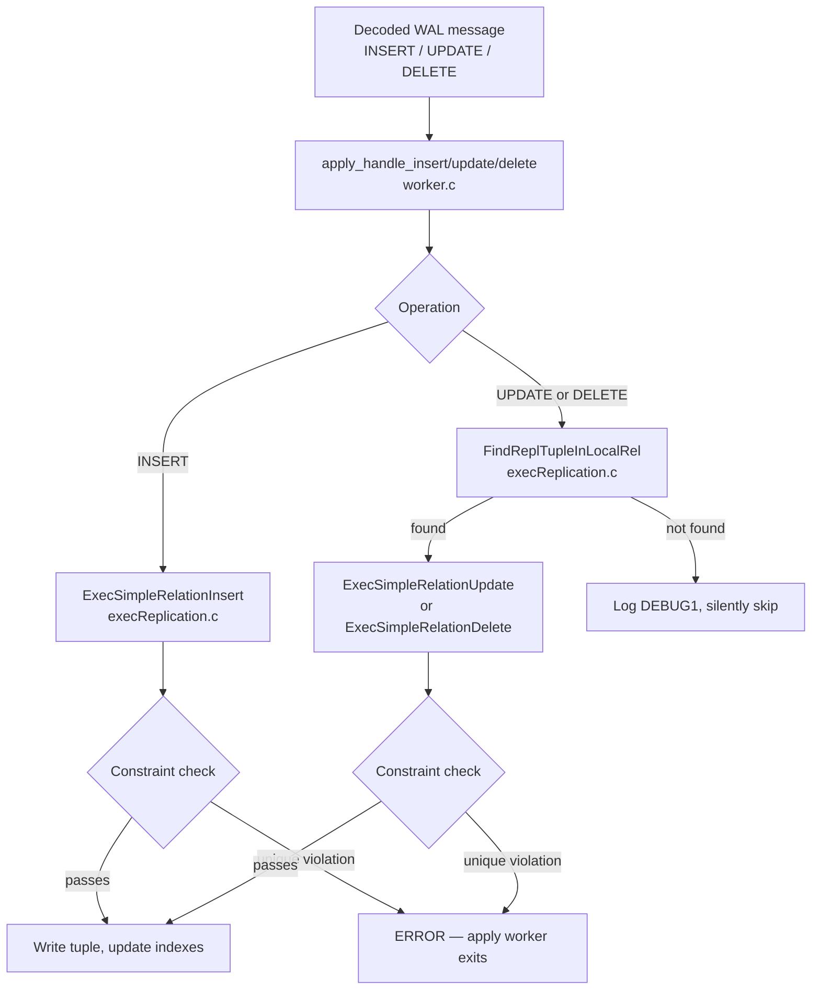
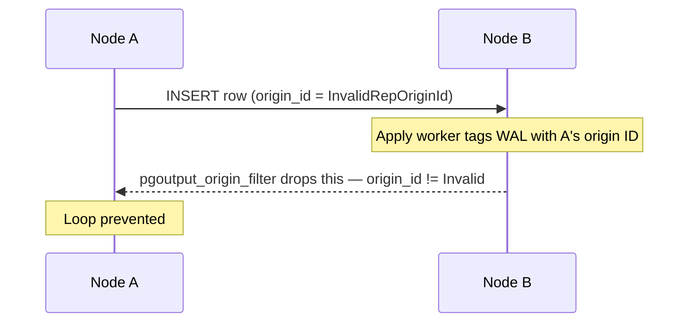

Logical replication applies changes row-by-row on the subscriber: each decoded WAL record becomes an INSERT, UPDATE, or DELETE executed by the apply worker against the local table. Because the subscriber's data can diverge from the publisher's — through local writes, delayed failover, or incomplete initial sync — the apply worker sometimes cannot perform the operation it was asked to perform. These situations are conflicts.

## How the Apply Worker Executes Changes

The apply worker (`src/backend/replication/logical/worker.c`) receives decoded change messages and dispatches them to `apply_handle_insert`, `apply_handle_update`, and `apply_handle_delete`. Each of these resolves the target relation and acquires `RowExclusiveLock`. It then calls the internal workhorse variant with a prepared `TupleTableSlot`.

The workhorse functions delegate to `ExecSimpleRelationInsert`, `ExecSimpleRelationUpdate`, and `ExecSimpleRelationDelete` in `src/backend/executor/execReplication.c`. These functions are not shortcuts — they go through constraint checking, trigger firing, and index maintenance just as normal executor paths do. The implication is that any constraint violation or error raised during a normal INSERT/UPDATE/DELETE is equally possible during apply.

For UPDATEs and DELETEs, the worker must first locate the existing tuple using `FindReplTupleInLocalRel`. This lookup uses either the primary key index, the replica identity index, or (for `REPLICA IDENTITY FULL`) a sequential scan comparing all columns. The outcome of this lookup determines whether a conflict occurs.



## Conflict Types

**INSERT conflict.** A remote INSERT arrives, but a row with the same primary key (or unique index value) already exists on the subscriber. `ExecSimpleRelationInsert` calls `ExecInsertIndexTuples`. This function detects the duplicate key and raises a unique-violation error. This is the most common conflict. It occurs whenever the subscriber has a row the publisher does not know about.

**UPDATE conflict — row not found.** The apply worker calls `FindReplTupleInLocalRel` but finds no matching row. This happens when the row was deleted locally, or when the replica identity columns no longer match. The worker logs a `DEBUG1` message and silently continues. It raises no error; it drops the update.

```c
elog(DEBUG1,
     "logical replication did not find row to be updated "
     "in replication target relation \"%s\"",
     RelationGetRelationName(localrel));
```

**UPDATE conflict — new values cause unique violation.** The row to update exists, but the new column values would create a duplicate in another unique index. `ExecSimpleRelationUpdate` raises an error, halting the apply worker.

**DELETE conflict — row not found.** `FindReplTupleInLocalRel` finds nothing. Like the UPDATE-not-found case, the worker logs a `DEBUG1` message and moves on without error.

The asymmetry is significant. The apply worker treats a not-found row for UPDATE or DELETE as a silent no-op. A unique-violation on INSERT or UPDATE, by contrast, is a hard error that stops replication. A subscriber silently missing updates or deletes can drift from the publisher indefinitely at `DEBUG1` log levels, with no visible signal.

## Structured Conflict Detection

PostgreSQL 17 introduced `src/backend/replication/logical/conflict.c` as a dedicated detection and reporting layer. It replaces the ad hoc error paths that previously surfaced uniqueness violations and missing-row conditions as generic constraint errors or silent `DEBUG1` messages. The new code formalizes those same situations into a `ConflictType` enum, gathers diagnostic context, and emits a single structured report.

`ConflictType` classifies conflicts into two families: uniqueness conflicts, where an incoming change violates a unique index, and logical conflicts, where the row's origin or existence does not match expectations.

| Type | Description |
|---|---|
| `CT_INSERT_EXISTS` | An incoming INSERT conflicts with an existing row on a unique index |
| `CT_UPDATE_EXISTS` | An incoming UPDATE's new values conflict with an existing row on a unique index |
| `CT_MULTIPLE_UNIQUE_CONFLICTS` | An incoming change conflicts on more than one unique index simultaneously |
| `CT_UPDATE_ORIGIN_DIFFERS` | The row to be updated was last written by a different replication origin |
| `CT_UPDATE_MISSING` | The row targeted by an UPDATE cannot be found on the subscriber |
| `CT_DELETE_ORIGIN_DIFFERS` | The row to be deleted was last written by a different origin |
| `CT_DELETE_MISSING` | The row targeted by a DELETE cannot be found on the subscriber |

The uniqueness types map to `ERRCODE_UNIQUE_VIOLATION`. The origin-differs and missing-row types map to `ERRCODE_T_R_SERIALIZATION_FAILURE`, reflecting that they are logical write-write or read-your-writes hazards rather than pure constraint violations.

`ReportApplyConflict()` is the single entry point from the apply worker into this layer. It accepts the conflict type, three optional tuple slots (the search key, the incoming remote row, and the conflicting local row), and the error level that encodes the subscription's conflict action — `ERROR` to halt the apply worker, or a lower level to log and continue. For uniqueness conflicts the report names the triggering index. When `track_commit_timestamp` is enabled, it also attaches the commit timestamp and replication origin of the conflicting local row; `GetTupleTransactionInfo()` performs that lookup against the commit-timestamp infrastructure. The function respects column-level security when formatting row values for the diagnostic output. Before emitting the report, it increments the per-subscription conflict counter visible in `pg_stat_subscription_stats`.

Index setup for conflict detection happens once per relation when the apply worker opens a target table. `InitConflictIndexes()` scans the relation's indexes and collects the OIDs of all non-deferrable unique indexes into `ResultRelInfo.ri_onConflictArbiterIndexes`. It excludes deferrable unique constraints: apply may legitimately violate them mid-transaction, so they are not actionable as conflicts at report time.

The detection layer only classifies and reports conflicts. `worker.c` makes the policy decision — whether to error, skip, or apply an alternative resolution — upstream, before it calls `ReportApplyConflict()`. The `elevel` argument is the channel through which that policy is communicated to the reporting layer.

## Default Behavior When a Hard Error Occurs

When `ExecSimpleRelationInsert` or `ExecSimpleRelationUpdate` raises an error, the apply worker aborts its transaction. The worker process then exits. The launcher (`src/backend/replication/logical/launcher.c`) respects a back-off policy before restarting it. On restart, the worker resumes from the last confirmed flush LSN stored in the replication origin state. Because the worker replays the conflicting transaction again, the same error recurs. Replication halts indefinitely until an operator resolves the conflict manually.

The replication slot on the publisher does not advance. The slot retains WAL. In a long-running conflict, this causes WAL accumulation on the publisher, because `confirmed_flush_lsn` for the slot never moves. In the extreme case this exhausts the publisher's `pg_wal` directory.

PostgreSQL 16 added `disable_on_error` as a subscription parameter. When set, the apply worker calls `DisableSubscriptionAndExit()` on any hard error. This marks the subscription as disabled in `pg_subscription` (`subenabled = false`) before exiting with code 0. The subscription stays disabled until an operator explicitly runs `ALTER SUBSCRIPTION name ENABLE`. This prevents the restart loop, but it requires manual intervention to re-enable. More importantly, the replication slot still does not advance while the subscription is disabled.

## Skipping a Transaction

PostgreSQL 15 added the ability to skip a single conflicting transaction by LSN. The mechanism stores the target finish LSN in `pg_subscription.subskiplsn`. When the apply worker is about to commit a transaction and `subskiplsn` is set, it checks whether the current transaction's finish LSN matches:

```c
#define is_skipping_changes() \
    (unlikely(!XLogRecPtrIsInvalid(skip_xact_finish_lsn)))
```

While `skip_xact_finish_lsn` is set, all DML handlers (`apply_handle_insert`, `apply_handle_update`, `apply_handle_delete`) return immediately without executing anything. After the transaction finishes, `clear_subscription_skip_lsn` resets `subskiplsn` in the catalog.

```sql
-- Find the finish LSN of the conflicting transaction from the subscriber log,
-- then skip it:
ALTER SUBSCRIPTION mysub SKIP (lsn = '0/1A2B3C4');
```

The LSN must be the commit (finish) LSN of the remote transaction, not the LSN of the conflicting change record. The subscriber logs the conflicting transaction's finish LSN when the apply worker exits.

Setting an incorrect LSN does not cause data corruption. `clear_subscription_skip_lsn` emits a warning if the commit LSN of the next successfully applied transaction does not match the stored `subskiplsn`. It clears the field anyway. However, skipping discards the entire transaction including non-conflicting changes within it. The subscriber permanently loses any data that was part of that transaction but did not conflict.

## REPLICA IDENTITY and Its Effect on Conflict Detection

The `relreplident` column of `pg_class` (`src/include/catalog/pg_class.h`) controls what the publisher includes as the "old" tuple key in UPDATE and DELETE messages. It determines what `FindReplTupleInLocalRel` uses to search. It also determines what conflicts are even detectable.

| Mode | Constant | Key sent by publisher | Lookup on subscriber |
|---|---|---|---|
| `DEFAULT` | `'d'` | Primary key columns | Index scan on PK |
| `INDEX` | `'i'` | Columns of the specified unique index | Index scan on named index |
| `FULL` | `'f'` | All non-system columns | Sequential scan comparing all columns |
| `NOTHING` | `'n'` | Nothing | UPDATE/DELETE not published at all |

`REPLICA IDENTITY DEFAULT` requires a primary key on the publisher. If the table has no primary key, the publisher cannot publish UPDATE and DELETE changes. Any attempt raises an error on the publisher at write time.

`REPLICA IDENTITY FULL` sidesteps index requirements but has a steep cost: the publisher writes all column values into each UPDATE and DELETE WAL record. The subscriber must then perform a full sequential scan (`RelationFindReplTupleSeq` in `execReplication.c`) for every UPDATE and DELETE. On large tables this is prohibitively slow. `REPLICA IDENTITY FULL` also means that if a locally-modified row differs in any column from the published old tuple, `FindReplTupleInLocalRel` will not find it. The row is effectively invisible to the update, producing a silent miss.

`REPLICA IDENTITY NOTHING` is appropriate for append-only tables. It disables UPDATE and DELETE replication entirely for that table, eliminating the possibility of UPDATE and DELETE conflicts at the cost of not replicating those operations.

```sql
ALTER TABLE orders REPLICA IDENTITY FULL;
ALTER TABLE orders REPLICA IDENTITY USING INDEX orders_email_key;

-- Check current setting:
SELECT relname, relreplident
FROM pg_class
WHERE relname = 'orders';
-- relreplident: d=DEFAULT, i=INDEX, f=FULL, n=NOTHING
```

The subscriber must have an index that covers the key columns sent by the publisher. `check_relation_updatable` in `worker.c` validates this before the apply worker attempts any UPDATE or DELETE. If the subscriber's table lacks a usable index and the publisher is not using `REPLICA IDENTITY FULL`, the apply worker raises a hard error:

> logical replication target relation "schema.table" has neither REPLICA IDENTITY index nor PRIMARY KEY and published relation does not have REPLICA IDENTITY FULL

## Replication Origins and Progress Tracking

Every subscription corresponds to a replication origin, created in `pg_replication_origin` when the apply worker starts. `ReplicationOriginNameForLogicalRep` in `worker.c` constructs the origin name:

- Main apply worker: `pg_<suboid>` (e.g., `pg_16395`)
- Per-table sync workers: `pg_<suboid>_<reloid>` (e.g., `pg_16395_16402`)

At startup the apply worker calls `replorigin_session_setup(originid, 0)` in `origin.c`. This call acquires an in-memory slot in the shared `replication_states` array (bounded by `max_replication_slots`). As transactions commit, the apply worker updates `replorigin_session_origin_lsn` in the session-level state. At checkpoint time `CheckPointReplicationOrigin` flushes all origin states to `pg_logical/replorigin_checkpoint`, providing the restart LSN for reconnects.

The origin's `remote_lsn` is what the subscriber reports back to the publisher as `confirmed_flush_lsn` on the replication slot. When the apply worker exits on a conflict, this value does not advance. As a result, the slot retains all WAL from that point forward.

Current origin progress can be inspected:

```sql
SELECT * FROM pg_replication_origin_status;
-- remote_lsn: the publisher LSN up to which changes have been applied
-- local_lsn:  the subscriber LSN at which that progress was recorded
```

## Bidirectional Replication and Loop Prevention

When two servers each publish to and subscribe from the other, every change applied by server B's apply worker flows back through server B's logical decoder. Without filtering, the decoder would send that change back to server A, creating an infinite loop.

The `pgoutput` plugin prevents this with `pgoutput_origin_filter` in `pgoutput.c`. The plugin registers the filter as `filter_by_origin_cb` during initialization. When a subscription specifies `origin = 'none'`, the filter returns `true` (meaning "skip this change") for any WAL record whose `origin_id` is not `InvalidRepOriginId`. Because changes applied by the apply worker carry the subscriber's own origin ID in WAL, the publisher's decoder filters them out before sending them back.

```c
static bool
pgoutput_origin_filter(LogicalDecodingContext *ctx, RepOriginId origin_id)
{
    PGOutputData *data = (PGOutputData *) ctx->output_plugin_private;

    if (data->origin &&
        pg_strcasecmp(data->origin, LOGICALREP_ORIGIN_NONE) == 0 &&
        origin_id != InvalidRepOriginId)
        return true;   /* filter out — change arrived from another origin */

    return false;
}
```

The default subscription `origin` is `any`. This setting passes all changes through. For bidirectional setups, both subscriptions must use `origin = 'none'`:

```sql
-- On server A, subscribing to server B:
CREATE SUBSCRIPTION sub_from_b
    CONNECTION 'host=serverb dbname=mydb'
    PUBLICATION pub_for_a
    WITH (origin = 'none');

-- On server B (mirror image):
CREATE SUBSCRIPTION sub_from_a
    CONNECTION 'host=servera dbname=mydb'
    PUBLICATION pub_for_b
    WITH (origin = 'none');
```

Loop prevention does not resolve concurrent-write conflicts. If both servers modify the same row simultaneously, both servers apply both changes. The last write applied wins on each side. This can leave the two servers permanently out of sync for that row. Bidirectional replication with `origin = 'none'` avoids infinite loops but provides no conflict-resolution semantics beyond "last writer wins."



For manual writes that should not be re-published (e.g., migration tooling replaying historical data), `pg_replication_origin_session_setup(origin_name)` marks the current session with a specific origin. Any writes in that session carry that origin ID in WAL. Subscribers using `origin = 'none'` filter out those writes. Call `pg_replication_origin_session_reset()` to clear the session origin afterwards.

## Sequences Are Not Replicated

Logical replication does not replicate sequences, including those backing `serial` and `IDENTITY` columns. This is documented behavior (`doc/src/sgml/logical-replication.sgml`): sequence data does not flow across a replication subscription. Initial table sync populates the subscriber's sequences based on the sequence state at sync time. Replication never updates them again.

This creates a structural conflict source after failover. During normal operation the publisher's sequence advances with each INSERT. The subscriber accumulates rows whose ID values came from the publisher's advancing sequence. The subscriber's own sequence, however, never advances to match. When the subscriber is promoted and applications begin writing to it, `nextval` produces IDs that collide with rows the former publisher already inserted. This generates INSERT conflicts on any new subscribers of the newly promoted primary.

The standard mitigation is to advance sequences immediately after promotion, before allowing application writes:

```sql
-- After promotion, advance sequences beyond the maximum existing key values:
SELECT setval('orders_id_seq', (SELECT MAX(id) FROM orders) + 10000);
```

The buffer (10000 above) should exceed the volume of writes expected during the gap between promotion and the sequence fix. For `IDENTITY` columns the approach is the same but uses the internal sequence name obtainable from `pg_get_serial_sequence`.

## Manual Conflict Resolution Workflow

When an apply worker stops on a conflict, the subscriber's server log contains the failing transaction's finish LSN and the error details.

**Identify the conflict.** From the log, extract the remote transaction LSN and the error — typically a unique-violation message with the table name and key values.

**Resolve the data.** Connect to the subscriber and fix the divergence: delete or update the conflicting row, or decide the local row is correct and use `SKIP` to discard the incoming transaction.

**Use SKIP if the local data takes precedence:**
```sql
ALTER SUBSCRIPTION mysub SKIP (lsn = '<finish_lsn_from_log>');
```

**Manually apply changes if the remote data takes precedence:**
Reconcile the subscriber's data, then let the apply worker retry. It will re-attempt the same transaction and succeed once the conflict is gone.

**Advance the origin if the subscription needs manual repositioning** (for example, after replacing the replication slot):
```sql
-- Look up the origin name:
SELECT roname FROM pg_replication_origin;

-- Advance past the already-applied LSN:
SELECT pg_replication_origin_advance('pg_16395', '0/A1B2C300');
```

**Re-enable if disabled:**
```sql
ALTER SUBSCRIPTION mysub ENABLE;
```

**Verify recovery:**
```sql
SELECT subname, pid, received_lsn, last_msg_send_time
FROM pg_stat_subscription;
```

`received_lsn` should be advancing. If `pid` is null, the apply worker is not running; check `pg_log` for restart errors.

## Related Topics

- [[subsystems/replication/logical|Logical Replication]] — covers the overall architecture of logical replication including the publisher, apply workers, and subscription lifecycle that this page builds on.
- [[subsystems/replication/logical-decoding|Logical Decoding]] — explains how WAL is decoded into change messages that the apply worker receives and attempts to execute against the subscriber.
- [[subsystems/replication/slots|Replication Slots]] — describes how slots track `confirmed_flush_lsn` and retain WAL on the publisher, directly affected when a conflict halts the apply worker.
- [[subsystems/replication/replication-origins|Replication Origins]] — details the origin tracking mechanism used for progress recording and bidirectional loop prevention via `pgoutput_origin_filter`.
- [[subsystems/replication/subscriptions|Subscriptions]] — reference for subscription parameters such as `disable_on_error` and `origin` that govern conflict handling behavior.
- [[troubleshooting/replication-lag|Replication Lag]] — practical guidance for diagnosing stalled or lagging subscriptions, including the WAL accumulation that results from unresolved conflicts.
