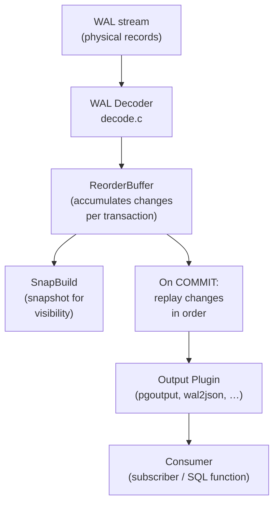

# Logical Decoding Internals

Logical decoding transforms the physical WAL stream — a sequence of page modifications — into a logical stream of row-level changes (INSERT/UPDATE/DELETE/TRUNCATE) ordered by commit sequence. Logical replication and `pg_logical_slot_get_changes` consume this stream.

## Architecture overview

## LogicalDecodingContext

`LogicalDecodingContext` is the top-level struct that ties everything together. `CreateInitDecodingContext` creates it at startup; `CreateDecodingContext` creates it when resuming from a slot. It contains:

- `ReorderBuffer *reorder` — the change accumulator
- `SnapBuild *snapshot_builder` — the snapshot reconstructor
- `XLogReaderState *reader` — the WAL reader
- `OutputPluginCallbacks callbacks` — the active output plugin's function pointers
- `LogicalSlot *slot` — the replication slot providing WAL retention

## ReorderBuffer

The ReorderBuffer accumulates row changes from WAL records for in-progress transactions. It replays them in commit order when a COMMIT record is decoded.

### ReorderBufferChange

Each row-level change is represented as a `ReorderBufferChange`:

| Field | Purpose |
|---|---|
| `action` | `REORDER_BUFFER_CHANGE_INSERT`, `_UPDATE`, `_DELETE`, `_TRUNCATE`, `_MESSAGE` |
| `data.tp.oldtuple` | Old tuple image (for UPDATE/DELETE with replica identity) |
| `data.tp.newtuple` | New tuple image (for INSERT/UPDATE) |
| `data.tp.relid` | Relation OID |
| `lsn` | LSN of the WAL record that produced this change |

### Per-transaction accumulation

The ReorderBuffer keys changes by XID in a hash table. As WAL records arrive:

- The decoder decodes `XLOG_HEAP_INSERT` / `XLOG_HEAP_UPDATE` / `XLOG_HEAP_DELETE` records and appends them to the transaction's change list.
- The ReorderBuffer accumulates subtransaction changes separately and merges them into the top-level transaction when the subtransaction commits.

### Transaction flags

`ReorderBufferTXN` carries a `txn_flags` bitmask that drives the buffer's internal state machine:

| Flag | Meaning |
|---|---|
| `RBTXN_HAS_CATALOG_CHANGES` | Transaction touched system catalogs |
| `RBTXN_IS_SUBXACT` | This is a subtransaction node |
| `RBTXN_IS_SERIALIZED` | Changes spilled to disk |
| `RBTXN_IS_STREAMED` | Changes sent via streaming mode |
| `RBTXN_PREPARE` | Two-phase prepared transaction |
| `RBTXN_HAS_STREAMABLE_CHANGE` | Has at least one change eligible for streaming |
| `RBTXN_DISTR_INVAL_OVERFLOWED` | Distributed invalidation messages truncated |

### Spill to disk

The ReorderBuffer serializes large transactions that exceed `logical_decoding_work_mem` (default 64MB) to disk in `$PGDATA/pg_logical/snapshots/` as `.snap` files. It reads them back and replays them from disk when the transaction commits. This bounds memory usage at the cost of disk I/O for very large transactions.

### Replay on COMMIT

When the decoder decodes a `COMMIT` record, `ReorderBufferCommit` replays the accumulated changes in order, calling the output plugin's `change_cb` for each one. After replay, the buffer frees the transaction's memory.

### Transaction streaming

For very large transactions, spilling to disk and replaying everything at commit still creates a latency spike on the subscriber. PostgreSQL 14 introduced streaming mode. In streaming mode, the ReorderBuffer can start sending a transaction's changes to the output plugin before commit, using `stream_start` / `stream_stop` / `stream_commit` callbacks. The consumer buffers or applies these changes speculatively. It then commits or rolls back when the final outcome arrives. The `RBTXN_IS_STREAMED` flag and the `ReorderBufferCanStartStreaming()` predicate control streaming.

## SnapBuild

SnapBuild reconstructs consistent snapshots so the output plugin can determine whether referenced catalog rows are visible (e.g. to look up the table's column definitions at the time of the change).

### The consistency problem

To decode a row change, the decoder needs to know the table's schema at the time the change occurred. This requires a snapshot consistent with the transaction that made the change. SnapBuild reconstructs this from WAL without re-running the original transactions.

### RUNNING_XACTS records

At each checkpoint, PostgreSQL writes a `XLOG_RUNNING_XACTS` WAL record listing all in-progress transactions. SnapBuild uses these to fast-forward to a consistent state:

1. At startup, SnapBuild enters `SNAPBUILD_START` state.
2. It waits for a `RUNNING_XACTS` record where all listed XIDs later commit or abort.
3. Once all those XIDs resolve, it enters `SNAPBUILD_CONSISTENT`. Decoding can then begin producing output.

Before reaching `SNAPBUILD_CONSISTENT`, changes accumulate in the ReorderBuffer, but the decoder does not call the output plugin's `change_cb`.

### Snapshot serialization

SnapBuild serializes consistent snapshots to `$PGDATA/pg_logical/snapshots/` so that a replication slot can resume decoding after a server restart without waiting for a new consistent point.

## WAL decoder (decode.c)

`LogicalDecodingProcessRecord` dispatches each WAL record to a resource-manager-specific decoder:

| RM | Decoder function | Handles |
|---|---|---|
| Heap | `DecodeHeapOp` | INSERT, UPDATE, DELETE, HOT_UPDATE, LOCK, INPLACE |
| Heap2 | `DecodeHeap2Op` | MULTI_INSERT, VISIBLE |
| Transaction | `DecodeXactOp` | COMMIT, ABORT, PREPARE, COMMIT_PREPARED |
| Standby | `DecodeStandbyOp` | RUNNING_XACTS (feeds SnapBuild) |
| LogicalMessage | `DecodeLogicalMsgOp` | `pg_logical_emit_message` records |

HOT chains: when decoding a heap update, the decoder follows HOT chains to find the root tuple that the index entry points to. This ensures the output reflects the logical row identity.

## Output plugins

An output plugin is a shared library that implements `OutputPluginCallbacks`:

| Callback | Called when |
|---|---|
| `startup_cb` | Decoding context created |
| `begin_cb` | Transaction about to be replayed |
| `change_cb` | Each INSERT/UPDATE/DELETE/TRUNCATE |
| `truncate_cb` | TRUNCATE (separate from change_cb) |
| `commit_cb` | Transaction committed |
| `message_cb` | `pg_logical_emit_message` record |
| `filter_by_origin_cb` | Optionally skip changes from a replication origin |
| `shutdown_cb` | Decoding context destroyed |

Output plugins use `OutputPluginPrepareWrite` / `OutputPluginWrite` to produce output as a `StringInfo` buffer. The format is entirely plugin-defined.

### Plugin implementations

**pgoutput** (`src/backend/replication/pgoutput/pgoutput.c`) is the built-in plugin that native logical replication uses. It encodes changes in a binary protocol (Publication/Subscription message types: `B`egin, `R`elation, `I`nsert, `U`pdate, `D`elete, `T`runcate, `C`ommit) and filters changes by publication membership. It also caches per-relation publishing decisions in a `RelationSyncEntry` hash table (`RelationSyncCache`) to avoid re-evaluating publication membership on every row.

**wal2json** (a popular extension, not in core) emits a JSON stream where each committed transaction is an object with an array of change objects — useful for feeding change streams to message queues or event-driven systems.

**Custom plugins** can target any output format. The API in `output_plugin.h` is intentionally stable, so third-party plugins like `decoderbufs` (Protobuf) and `wal2mongo` work without patching core.

## Replication slots and WAL retention

Logical decoding is always associated with a **replication slot**. The slot:

- Prevents WAL segment deletion until `confirmed_flush_lsn` advances past that segment.
- Tracks `catalog_xmin`: the oldest transaction whose catalog rows might still be needed for decoding; this prevents VACUUM from removing those catalog rows.

An unconsumed logical slot can therefore cause both WAL accumulation and bloat in the catalog tables.

## See also

- [[subsystems/replication/logical]] — the logical replication protocol built on top of logical decoding
- [[subsystems/replication/slots]] — slot lifecycle, WAL retention, catalog_xmin
- [[subsystems/wal/overview]] — WAL architecture and the WAL reader
- [[subsystems/transactions/mvcc]] — snapshot visibility used by the output plugin
