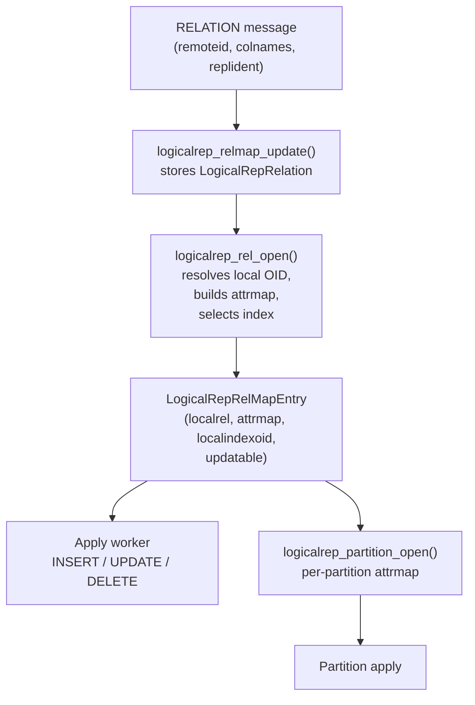

Logical replication relies on two orthogonal mechanisms that sit between the WAL decoder and the apply worker. Generic logical messages let any code path embed arbitrary binary payloads into the WAL stream. These payloads then surface to output plugins. The relation map cache solves a different problem. When a decoded `RELATION` message arrives from the publisher, the subscriber must translate a remote relation descriptor — described only by schema name, table name, and column names — into a live local `Relation` pointer with a validated attribute mapping and a usable index for row lookups.

## Generic Logical Messages

`pg_logical_emit_message()` (the SQL-callable wrapper for `LogLogicalMessage()`, `message.c`) writes a WAL record of type `XLOG_LOGICAL_MESSAGE` under the `RM_LOGICALMSG_ID` resource manager. The record carries an `xl_logical_message` header followed immediately by a null-terminated prefix string and a raw binary payload:

| Field | Type | Purpose |
|---|---|---|
| `dbId` | `Oid` | Database that emitted the message; used by decoders to filter cross-database noise |
| `transactional` | `bool` | Whether the message participates in the enclosing transaction |
| `prefix_size` | `Size` | Length of the prefix including the trailing null byte |
| `message_size` | `Size` | Length of the binary payload |

The prefix exists purely as a namespacing convention. Because any extension or application code can emit logical messages, without a prefix there would be no way for an output plugin to distinguish its own messages from those of unrelated consumers. Extension authors should use a unique prefix — typically the extension name — to avoid collisions.

### Transactional vs non-transactional delivery

The transactional flag has a concrete effect on delivery semantics. The `ReorderBuffer` buffers a transactional message along with DML changes from the same transaction. The output plugin sees it only after the transaction commits, and only in LSN order alongside the other changes. A non-transactional message bypasses the buffer entirely. The WAL decoder delivers it to the output plugin the moment it reads the record, regardless of any surrounding transaction state. This means the decoder always delivers a non-transactional message, even if the surrounding transaction later rolls back. It also delivers the message before the commit of any concurrent transaction in flight at the time of writing.

When the message is transactional, `LogLogicalMessage()` forces XID assignment with `GetCurrentTransactionId()` before writing the record (`message.c`). This ensures the ReorderBuffer can attribute the record to a specific transaction. The redo function `logicalmsg_redo()` is a deliberate no-op: these records carry no information that matters for crash recovery, only for logical decoding.

`LogLogicalMessage()` always sets the `XLOG_INCLUDE_ORIGIN` flag on the record. This allows origin-aware output plugins and replication origin filters to suppress re-delivery of messages that were themselves replicated from elsewhere.

## Relation Map Cache

The apply worker on a subscriber receives `RELATION` messages from the publisher whenever it encounters a relation for the first time or after a schema change. Each `RELATION` message describes a `LogicalRepRelation` — schema name, table name, column names and types, replica identity, and a bitmask of key columns. The relation map cache (`relation.c`) bridges this remote descriptor to the subscriber's local catalog.

### The LogicalRepRelMapEntry structure

The central data structure is `LogicalRepRelMapEntry` (`logicalrelation.h`):

| Field | Purpose |
|---|---|
| `remoterel` | Copy of the publisher's `LogicalRepRelation` descriptor |
| `localreloid` | OID of the matching local table |
| `localrel` | Open `Relation` pointer (non-NULL only while in use) |
| `attrmap` | Maps local attribute numbers to remote attribute numbers |
| `updatable` | Whether this table can accept UPDATE/DELETE changes |
| `localindexoid` | OID of the index to use for row lookups, or `InvalidOid` |
| `localrelvalid` | Validity flag; cleared by relcache invalidation callbacks |
| `state` / `statelsn` | Per-table sync state from `pg_subscription_rel` |

The map is a hash table keyed by the remote relation's `LogicalRepRelId` (a `uint32` assigned by the publisher), held in a dedicated [[subsystems/memory/contexts|memory context]] named `LogicalRepRelMapContext`. A relcache invalidation callback (`logicalrep_relmap_invalidate_cb`) clears `localrelvalid` for any entry whose local table is invalidated. This triggers a full rebuild the next time the entry is opened.

### Opening a relation

`logicalrep_rel_open()` is the entry point for every apply operation (`relation.c`). Its logic has two phases:

First, if the entry's `localrelvalid` flag is true, it attempts to open the table by stored OID. Because opening a relation can process pending invalidation messages that may invalidate the entry mid-call, the code checks `localrelvalid` again after `try_table_open()` returns. If the entry became invalid during the open, it closes the table and falls through to the rebuild path.

Second, if the entry is invalid, `logicalrep_rel_open()` looks up the table by schema-qualified name, rebuilds the `attrmap`, validates that no replicated columns are missing from the local schema, assesses updatability, and selects an index. The rebuild stores all derived data in `LogicalRepRelMapContext` so it survives across individual apply operations.

### Attribute mapping

`logicalrep_rel_open()` builds the `attrmap` by matching each local column by name against the publisher's column list. It maps dropped columns and generated columns in the local table to `-1` (ignored). If any remote column has no corresponding local column after the full scan, `logicalrep_rel_open()` reports a fatal error. Receiving data for a column that does not exist on the subscriber would silently discard values. PostgreSQL treats this as data loss.

The direction of the mapping matters: `attrmap->attnums[local_attno]` gives the index into the remote column array for local column `local_attno`. This layout suits the apply worker, which iterates local tuple slots. The worker needs to know which remote column supplies each local column's value.

### Updatability and replica identity

`logicalrep_rel_mark_updatable()` (`relation.c`) determines whether the apply worker can apply UPDATE and DELETE to a given table. The function checks whether every column in the local replica identity index — or the primary key if no explicit replica identity is configured — has a corresponding entry in the publisher's bitmap of key columns (`remoterel->attkeys`). If any identity column on the subscriber lacks a remote counterpart, the function marks the entry non-updatable. The apply worker defers the actual error to apply time, because INSERT operations on a non-updatable table are still valid.

The logic deliberately accepts a stricter local identity than the remote one. If the publisher identifies rows by `(id, timestamp)` but the subscriber's replica identity uses only `(id)`, the subscriber can still locate unique rows — the narrower key is sufficient. The reverse is not true: if the subscriber's identity includes a column not in the publisher's key bitmap, the subscriber cannot guarantee uniqueness from the incoming data.

### Index selection

`FindLogicalRepLocalIndex()` (`relation.c`) picks the index the apply worker will use for UPDATE and DELETE row lookups. The preference order is:

1. The explicit replica identity index (`RelationGetReplicaIndex()`).
2. The primary key (`RelationGetPrimaryKeyIndex()`), if no replica identity index is set.
3. For `REPLICA_IDENTITY_FULL` remote relations: any local btree index whose leftmost column is a non-expression column mapping to a remote column (`FindUsableIndexForReplicaIdentityFull()`).
4. `InvalidOid` — sequential scan.

For case 3, `IsIndexUsableForReplicaIdentityFull()` enforces three constraints: the index must be btree, it must not be partial, and its leftmost key column must reference a remote attribute. The btree and non-partial restrictions keep the scan semantics close to those of primary key lookups. The leftmost-column constraint is a selectivity heuristic: an index whose leading column has no remote counterpart is unlikely to be more selective than a sequential scan.

Partitioned tables always return `InvalidOid` from `FindLogicalRepLocalIndex()` because routing goes to leaf partitions. Each leaf partition maintains its own index selection.

### Partition handling

When a subscription targets a partitioned table, the apply worker must route each incoming row to the correct leaf partition. `logicalrep_partition_open()` (`relation.c`) maintains a separate `LogicalRepPartMap` hash table keyed by partition OID. Each `LogicalRepPartMapEntry` wraps a `LogicalRepRelMapEntry` and holds the remote relation descriptor copied from the root entry plus a partition-specific `attrmap`.

`logicalrep_partition_open()` computes the partition attrmap by composing two mappings: the root table's `attrmap` (remote column → root local column) and the partition routing map (root local column → partition local column). The composition produces a direct mapping from partition attribute numbers to remote attribute numbers. This is what the apply worker needs when constructing tuples for the leaf partition.

## Related Topics

- [[subsystems/replication/logical|Logical Replication]] — the full publication/subscription pipeline, apply workers, and initial sync
- [[subsystems/replication/logical-decoding|Logical Decoding Internals]] — ReorderBuffer, SnapBuild, and output plugin callbacks
- [[subsystems/memory/contexts|memory context]] — memory context lifecycle used by the relation map cache
