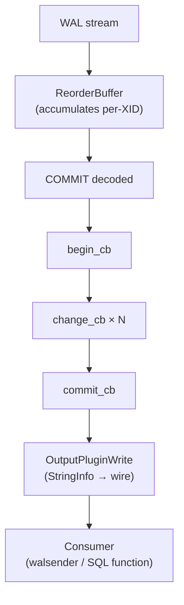

# Logical Decoding Output Plugins

An output plugin is the consumer-facing boundary of the [[subsystems/replication/logical-decoding|logical decoding]] pipeline. It is a shared library. The decoding subsystem loads it into the backend process and drives it through a set of callbacks, one per logical event: transaction lifecycle, row changes, truncations, and arbitrary messages. The plugin decides what format the decoded stream takes — SQL-like text (`test_decoding`), a binary replication protocol (`pgoutput`), JSON (`wal2json`), Avro, Protocol Buffers, or anything else. It writes that stream into a buffer that the replication subsystem forwards to the consumer. Nothing in core dictates wire format. The plugin owns that entirely.

This design decouples the hard work of WAL decoding and transaction reordering, which happens in `reorderbuffer.c` and `decode.c`, from the application-specific serialization concern. A new output format needs only a shared library with the right callbacks — no core changes required.

## Plugin lifecycle and the entry point

PostgreSQL loads a plugin by looking up the symbol `_PG_output_plugin_init` in the shared library named by the replication slot's `plugin` column. The function receives a pointer to `OutputPluginCallbacks` and must populate whichever callbacks it supports:

```c
void
_PG_output_plugin_init(OutputPluginCallbacks *cb)
{
    cb->startup_cb  = my_startup;
    cb->begin_cb    = my_begin;
    cb->change_cb   = my_change;
    cb->commit_cb   = my_commit;
    /* optional callbacks left NULL are simply not called */
}
```

The decoding machinery ignores any callback left `NULL`. The two-phase commit and streaming callbacks are all optional. A plugin that does not set them signals that it cannot participate in those modes.

## OutputPluginCallbacks

`output_plugin.h` defines the full callback table. The callbacks divide into four groups:

**Transaction lifecycle** — called in commit order once the ReorderBuffer has assembled a complete transaction:

| Callback | Signature key arguments | Called when |
|---|---|---|
| `startup_cb` | `OutputPluginOptions *options`, `bool is_init` | Plugin loaded for a slot; plugin sets output type and streaming support |
| `begin_cb` | `ReorderBufferTXN *txn` | Transaction about to be replayed |
| `commit_cb` | `ReorderBufferTXN *txn`, `XLogRecPtr commit_lsn` | Transaction committed; plugin should flush accumulated output |
| `shutdown_cb` | — | Decoding context torn down |

**Row changes** — called once per decoded change inside a transaction:

| Callback | Signature key arguments | Called when |
|---|---|---|
| `change_cb` | `Relation relation`, `ReorderBufferChange *change` | INSERT, UPDATE, or DELETE on a row |
| `truncate_cb` | `int nrelations`, `Relation relations[]`, `ReorderBufferChange *change` | TRUNCATE on one or more tables |
| `message_cb` | `XLogRecPtr lsn`, `bool transactional`, `const char *prefix`, `Size sz`, `const char *message` | `pg_logical_emit_message()` record |

**Two-phase commit** — optional group for plugins that want to observe PREPARE/COMMIT PREPARED/ROLLBACK PREPARED as discrete events rather than waiting for the final outcome:

`filter_prepare_cb`, `begin_prepare_cb`, `prepare_cb`, `commit_prepared_cb`, `rollback_prepared_cb`

If `filter_prepare_cb` returns `true` for a given GID, the decoding machinery holds the prepared transaction until `COMMIT PREPARED` or `ROLLBACK PREPARED` and then delivers it as a plain transaction — the same behavior a plugin gets by not registering any 2PC callbacks at all.

**Transaction streaming** — for very large transactions, PostgreSQL 14+ can stream changes before commit rather than accumulating everything in memory or spilling to disk:

`stream_start_cb`, `stream_stop_cb`, `stream_commit_cb`, `stream_abort_cb`, `stream_change_cb`, `stream_message_cb`, `stream_truncate_cb`

A plugin declares streaming support during `startup_cb` by setting `ctx->streaming = true` (after checking that the decoding context supports it). The ReorderBuffer then calls `stream_start_cb` / `stream_stop_cb` pairs around each chunk. Eventually it calls `stream_commit_cb` or `stream_abort_cb` for the transaction's final outcome. Without streaming callbacks the buffer falls back to accumulating and spilling.

**Origin filtering**:

`filter_by_origin_cb` — return `true` to suppress changes that originated from a specific replication origin, used for loop prevention in multi-master setups.

## The startup callback and OutputPluginOptions

`startup_cb` is where the plugin establishes its identity. It receives an `OutputPluginOptions` struct and must set `output_type` to either `OUTPUT_PLUGIN_BINARY_OUTPUT` or `OUTPUT_PLUGIN_TEXTUAL_OUTPUT`. This tells the replication machinery whether to send chunks as raw bytes or as text. That choice affects how the walsender frames each write for the consumer. The `receive_rewrites` field controls whether the plugin sees heap rewrites (e.g. from `CLUSTER`).

The `is_init` flag distinguishes first-time slot creation from slot resumption. A plugin may use it to skip expensive initialization on resumption, but must be careful: it must rebuild the catalog snapshot and per-relation caches regardless, since WAL replay always starts fresh.

The plugin typically allocates a private state struct in `startup_cb` and stores it in `ctx->output_plugin_private`:

```c
static void my_startup(LogicalDecodingContext *ctx,
                       OutputPluginOptions *opt, bool is_init)
{
    MyState *state = palloc0(sizeof(MyState));
    state->context = AllocSetContextCreate(ctx->context, "my plugin",
                                           ALLOCSET_DEFAULT_SIZES);
    ctx->output_plugin_private = state;
    opt->output_type = OUTPUT_PLUGIN_TEXTUAL_OUTPUT;
}
```

## Output buffering

Plugins never write directly to the wire. The decoding context maintains a `StringInfo` buffer (`ctx->out`) and a pair of functions to frame writes:

- `OutputPluginPrepareWrite(ctx, last_write)` — signals that the plugin is about to append to `ctx->out`
- `OutputPluginWrite(ctx, last_write)` — delivers the accumulated buffer content to the replication machinery as one logical chunk

The `last_write` flag tells the machinery whether more writes follow within the same callback invocation. Setting it `true` on the final write of a callback allows the sender to flush without waiting. A plugin can call the pair multiple times per callback to emit multiple chunks, or accumulate across callbacks and flush only in `commit_cb`.

`test_decoding` emits one chunk per row change, passing `last_write = true` immediately:

```c
OutputPluginPrepareWrite(ctx, true);
appendStringInfo(ctx->out, "table %s: INSERT: ...", relname);
OutputPluginWrite(ctx, true);
```

## Accessing tuple data

Inside `change_cb`, the plugin receives a `ReorderBufferChange` whose `data.tp` union holds `newtuple` (present for INSERT and UPDATE) and `oldtuple` (present for UPDATE and DELETE when replica identity is set). Both are `ReorderBufferTupleBuf` pointers containing a `HeapTupleData`.

To decode column values, the plugin uses the `Relation`'s `TupleDesc` (from `RelationGetDescr(relation)`) to iterate over attributes. It then calls `heap_getattr()` or `OidOutputFunctionCall()` with the type's output function:

```c
TupleDesc tupdesc = RelationGetDescr(relation);
for (int i = 0; i < tupdesc->natts; i++) {
    Form_pg_attribute attr = TupleDescAttr(tupdesc, i);
    Datum val = heap_getattr(&change->data.tp.newtuple->tuple,
                             i + 1, tupdesc, &isnull);
    /* serialize val using attr->atttypid */
}
```

The decoding subsystem resolves type OIDs through the catalog snapshot it built via `snapbuild.c`. That snapshot is consistent with the transaction being replayed, so catalog lookups return the schema as it existed when the change was made.

## test_decoding: the reference implementation

`contrib/test_decoding/test_decoding.c` is the canonical example plugin shipped with PostgreSQL. It registers every available callback, outputs human-readable SQL-like strings (`table public.t: INSERT: id[integer]:1 name[text]:'foo'`), and demonstrates the full plugin structure: state allocated in `startup_cb`, one `OutputPluginPrepareWrite` / `OutputPluginWrite` pair per row in `change_cb`, and a simple commit line in `commit_cb`. Reading this file is the fastest way to understand how the API fits together in practice.

`test_decoding` also shows the common pattern for skipping empty transactions: `begin_cb` delays its `BEGIN` line until `change_cb` is actually called. It tracks this with a per-transaction flag stored in `txn->output_plugin_private`.

## pgoutput: the built-in plugin

`pgoutput` (`src/backend/replication/pgoutput/pgoutput.c`) is PostgreSQL's built-in plugin that native logical replication uses. It selects `OUTPUT_PLUGIN_BINARY_OUTPUT` and serializes changes in the logical replication wire protocol — `B`egin, `R`elation, `I`nsert, `U`pdate, `D`elete, `T`runcate, `C`ommit message types. It filters changes against publication membership before emitting anything, caching per-relation decisions in a `RelationSyncEntry` hash table to avoid re-evaluating publication rules on every row.

## wal2json: accumulate-then-emit

`wal2json` is a widely used community plugin that illustrates an alternative structure. Rather than emitting one chunk per row, it accumulates changes across `change_cb` calls into an in-memory JSON array. It then serializes the entire transaction as a single JSON object in `commit_cb`. This makes the output atomically consistent per transaction at the cost of holding more state in memory. The pattern demonstrates that the plugin API imposes no structure on when writes happen. Only the `commit_cb` is a natural flush point, but even that is optional if the consumer reads per-change.

## SQL access via pg_logical_slot functions

Two SQL functions invoke an output plugin synchronously without a persistent walsender connection:

- `pg_logical_slot_get_changes(slot_name, upto_lsn, upto_nchanges, ...)` — decodes and advances the slot's `confirmed_flush_lsn`
- `pg_logical_slot_peek_changes(slot_name, upto_lsn, upto_nchanges, ...)` — decodes but does not advance `confirmed_flush_lsn`

These are useful for testing and simple CDC consumers that do not need a streaming connection. `peek` is safe to call repeatedly on the same slot. `get` commits the advance. Both accept plugin-specific options as variadic `text` key-value pairs passed through to `startup_cb`.

## Slot management and operational hazards

Every output plugin operates within a [[subsystems/replication/logical-decoding|replication slot]]. The slot prevents WAL recycling behind the plugin's current position. `restart_lsn` marks the oldest WAL that might still be needed for decoding. `confirmed_flush_lsn` marks the latest position the consumer has acknowledged. The server will not recycle WAL segments ahead of any slot's `restart_lsn`.

A plugin whose consumer stops advancing `confirmed_flush_lsn` — because the consumer is down, slow, or simply abandoned — causes WAL to accumulate indefinitely. The slot also pins `catalog_xmin`, preventing VACUUM from removing old catalog rows needed for type resolution. Both effects compound over time and can fill disk or bloat `pg_catalog` tables. See [[troubleshooting/replication-lag]] for mitigation strategies.



## See also

- [[subsystems/replication/logical-decoding]] — ReorderBuffer, SnapBuild, and how WAL becomes a change stream
- [[subsystems/replication/logical]] — publications, subscriptions, and the apply worker
- [[subsystems/replication/slots]] — slot lifecycle and WAL retention mechanics
- [[troubleshooting/replication-lag]] — diagnosing and resolving WAL accumulation from stalled slots
