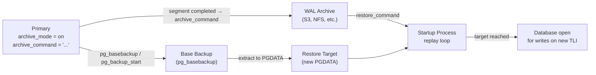
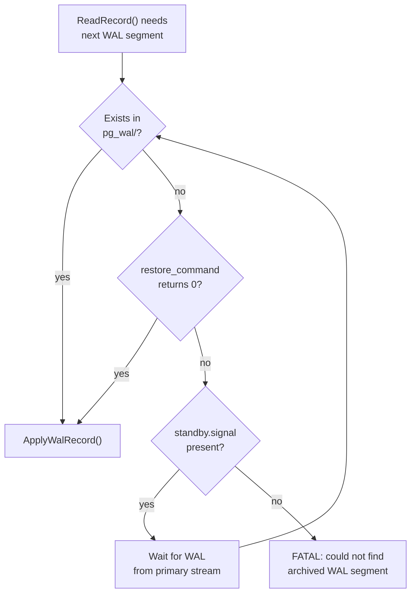
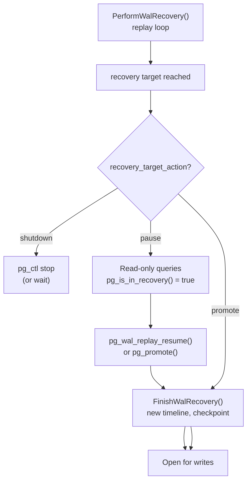

# Point-in-Time Recovery (PITR)

Point-in-time recovery lets you restore a PostgreSQL cluster to any moment within an archiving window by replaying WAL records on top of a base backup. The recovered cluster is byte-for-byte correct at the chosen instant — it is not a logical reconstruction but an exact replay of the same record stream the primary applied during normal operation.

## How PITR Works: The Big Picture

Three independent mechanisms combine to make PITR possible:

1. **Continuous WAL archiving** copies completed 16 MB WAL segments to a durable external location before the primary can recycle them. See [[subsystems/wal/archiving]].
2. **A base backup** captures a consistent binary snapshot of `PGDATA` at some moment, recording the WAL location from which replay must begin. See [[subsystems/replication/base-backup]].
3. **The startup process** reads the base backup, fetches archived WAL via `restore_command`, and replays records until it reaches a recovery target.

The guarantee: any row that was committed before the recovery target will be present; any row committed after it will not. Uncommitted data at the target moment never appears. MVCC makes it invisible. Recovery also replays only commit records to advance the transaction status.



## Prerequisites

### WAL Archiving

Set these in `postgresql.conf` on the primary before taking any base backup:

```text
wal_level = replica          # minimum; logical also works
archive_mode = on
archive_command = 'rsync -a %p /mnt/wal-archive/%f'
```

`archive_mode = on` starts the archiver process. The archiver invokes the command once per completed segment. Exit status 0 means success; anything else triggers a retry. The command must be idempotent — after a crash the archiver may re-archive a segment that already reached the destination.

`archive_status/` marker files (`.ready`, `.done`) in `pg_wal/` drive the handshake. PostgreSQL does not recycle a segment until its `.done` marker exists. As a result, a persistently failing `archive_command` will cause `pg_wal/` to grow without bound. Monitor `pg_stat_archiver` in production.

### Base Backup

```bash
pg_basebackup -h primary -D /var/lib/postgresql/restore -Xs -P
```

`pg_basebackup` uses the replication protocol (`BASE_BACKUP` command) to stream a tar of PGDATA. It calls `do_pg_backup_start()` server-side. This function forces a checkpoint, increments `XLogCtl->Insert.runningBackups` (enabling full-page writes for the duration), and records the start WAL position. The client receives a `backup_label` file containing that position. This file overrides `pg_control` when recovery starts and tells the startup process exactly where WAL replay must begin.

Key relationship: the base backup must be older than the recovery target. The WAL archive must also contain an unbroken chain of segments from the backup's `START WAL LOCATION` to the target. Any gap is fatal.

## Configuring Recovery

### PostgreSQL 12+ Signal Files

Before PG 12, a `recovery.conf` file alongside `postgresql.conf` configured recovery. PG 12 eliminated `recovery.conf` entirely. An operator now triggers recovery by dropping a signal file in `PGDATA` and setting GUCs in `postgresql.conf` or `postgresql.auto.conf`.

| Signal file | Mode |
|---|---|
| `recovery.signal` | Archive recovery — replay WAL to a target, then promote |
| `standby.signal` | Standby mode — replay continuously, wait for promotion |

`readRecoverySignalFile()` in `xlogrecovery.c` checks for both at startup. If both are present, `standby.signal` wins.

### Core Recovery GUCs

| GUC | Default | Purpose |
|---|---|---|
| `restore_command` | `''` | Shell command to fetch a WAL segment from the archive; `%f` = filename, `%p` = destination path |
| `recovery_target_time` | — | Timestamp; stop after committing all transactions up to this moment |
| `recovery_target_lsn` | — | LSN string (`'0/15D60A8'`); stop at or after this WAL location |
| `recovery_target_xid` | — | Transaction ID; stop after applying this transaction's commit |
| `recovery_target_name` | — | Named restore point; stop at the matching `pg_create_restore_point()` record |
| `recovery_target` | — | Set to `'immediate'` to stop at the earliest point of consistency |
| `recovery_target_inclusive` | `on` | Whether to include the transaction that matches the target |
| `recovery_target_timeline` | `'latest'` | Which timeline to follow; `'latest'` auto-follows the newest available |
| `recovery_target_action` | `'pause'` | What to do when the target is reached: `pause`, `promote`, or `shutdown` |

An operator may set only one `recovery_target_*` specifier at a time. The server will error on startup if multiple are present.

### Minimal Recovery Configuration

```text
# postgresql.conf
restore_command = 'cp /mnt/wal-archive/%f %p'
recovery_target_time = '2026-06-14 18:30:00 UTC'
recovery_target_action = 'promote'
```

```bash
touch $PGDATA/recovery.signal
pg_ctl start -D $PGDATA
```

## The Recovery Process in Detail

### Startup Process Entry Point

The postmaster forks a **startup process** (`postmaster/startup.c`) as the first auxiliary process. The startup process calls `StartupXLOG()` in `xlog.c`. This function drives the entire recovery sequence:

```
StartupXLOG()
  ├── read pg_control → determine DBState
  ├── InitWalRecovery()        ← reads backup_label or pg_control for REDO LSN
  ├── PerformWalRecovery()     ← the WAL replay loop
  └── FinishWalRecovery()      ← end-of-recovery checkpoint, timeline promotion
```

`InitWalRecovery()` is in `xlogrecovery.c`. It detects the signal files, reads `backup_label` (if present) to override the REDO start LSN, validates that the configured archive mode is consistent with the signal file, and sets `InRecovery = true`. When `backup_label` is present, `InitWalRecovery()` sets `RedoStartLSN` from the file's `START WAL LOCATION` line. Otherwise, `RedoStartLSN` comes from `ControlFile->checkPointCopy.redo`. The `backup_label` override is critical. `pg_control` records the checkpoint that was current when the backup was taken. However, subsequent checkpoints may have run and advanced the control file. Replaying from a later checkpoint would skip WAL records needed to repair torn pages captured mid-backup.

### WAL Fetch: `restore_command` and the Archive Gap Problem

`PerformWalRecovery()` positions an `XLogReaderState` at `RedoStartLSN` and enters a tight loop calling `ReadRecord()`. `ReadRecord()` tries to fetch WAL from three sources in order:

1. **Local `pg_wal/`** — if the segment file exists locally, `ReadRecord()` reads it directly.
2. **The archive** — if the segment is absent locally, `RestoreArchivedFile()` calls `restore_command` via `ExecuteRecoveryCommand()` (in `xlogarchive.c`) and copies the segment into `pg_wal/`.
3. **Streaming replication** — in standby mode only; if both local and archive sources fail, the WAL receiver waits for WAL to arrive from the primary via `primary_conninfo`.

```c
/* xlogarchive.c — simplified */
bool
RestoreArchivedFile(char *path, const char *xlogfname, ...)
{
    snprintf(xlogpath, MAXPGPATH, XLOGDIR "/%s", xlogfname);
    /* expand %f → xlogfname, %p → xlogpath in restore_command */
    rc = ExecuteRecoveryCommand(recoveryRestoreCommand, "restore_command", false, ...);
    if (rc == 0)
    {
        /* verify segment size matches expectations */
        return true;
    }
    return false;
}
```

If `restore_command` exits non-zero for a segment that is genuinely needed, recovery halts with:

```
FATAL:  could not find file "000000010000000100000042": no such file or directory
```

This is the **archive gap problem**: the chain from base backup to target must be complete. Common causes are a misconfigured `archive_command` that silently discarded segments, premature archive cleanup, or a base backup taken before archiving was enabled (making the initial segments unavailable).



### The WAL Replay Loop

`PerformWalRecovery()` reads records one at a time, dispatching each through `ApplyWalRecord()`:

```c
/* xlogrecovery.c — simplified replay loop */
void
PerformWalRecovery(void)
{
    record = ReadRecord(xlogreader, PANIC, false);
    do {
        if (recoveryStopsBefore(xlogreader))
            break;

        ApplyWalRecord(xlogreader, record, &replayTLI);

        if (recoveryStopsAfter(xlogreader))
            break;

        record = ReadRecord(xlogreader, LOG, false);
    } while (record != NULL);
}
```

`ApplyWalRecord()` calls `GetRmgr(record->xl_rmid).rm_redo(xlogreader)` — dispatching to the resource manager that owns the record type. Heap inserts go to `heap_redo()`, B-tree page splits to `btree_redo()`, transaction commits to `xact_redo()`, and so on. PITR recovery is identical to crash recovery at this level. The only difference is that it can stop early.

## Recovery Targets

### `recovery_target_time`

The most common target for production PITR. When the replay loop encounters a commit record, `recoveryStopsAfter()` checks whether the commit timestamp is at or past the target. The comparison uses the `xl_xact_commit.xact_time` field written into the commit WAL record — the wall-clock time the transaction committed on the primary, stored as `TimestampTz`.

```text
recovery_target_time = '2026-06-14 18:30:00+00'
```

`recovery_target_inclusive = on` (the default) means recovery includes the transaction that committed at exactly the target time. Setting it `off` excludes that transaction.

A subtle trap: if the primary's clock jumped (NTP correction, DST, or a live migration), commit timestamps may not be strictly monotonic within a few seconds of the jump. Recovery will still stop correctly because it checks each commit in WAL order, but the "recovered through" moment may differ from what you expect.

### `recovery_target_lsn`

```text
recovery_target_lsn = '0/15D60A8'
```

Stops replay when recovery reaches the record starting at or past the given LSN. This is the most precise target — there is no ambiguity from clock skew or multi-transaction timestamps. The LSN must be a commit or abort record. PostgreSQL does not support stopping at an arbitrary record inside a transaction, because the database would be inconsistent.

`pg_current_wal_lsn()` and the WAL positions in `pg_stat_replication` give LSNs you can use as targets on a running primary.

### `recovery_target_xid`

```text
recovery_target_xid = '1234567'
```

Stops after applying the commit of transaction ID 1234567. Useful when you can identify the exact XID of a bad transaction from the logs (`log_line_prefix = '%x'`) and want to stop just before or just after it. `TransactionIdPrecedes()` performs the XID comparison — it handles wrap-around correctly, though in practice PITR windows are short enough that wrap-around is not a concern.

### `recovery_target_name`

```sql
-- Run on the primary to plant a named marker in the WAL stream
SELECT pg_create_restore_point('before_bulk_load');
```

```text
recovery_target_name = 'before_bulk_load'
```

`pg_create_restore_point()` writes an `XLOG_RESTORE_POINT` record containing the label string. During recovery, `recoveryStopsAfter()` compares each `XLOG_RESTORE_POINT` record's name against `recovery_target_name`. This is the cleanest target type for planned operations: plant a marker before a risky migration, and recover to it by name if the migration goes wrong. No clock skew, no XID tracking needed.

```c
/* xlogfuncs.c */
XLogRecPtr
pg_create_restore_point(PG_FUNCTION_ARGS)
{
    char   *restore_name = text_to_cstring(PG_GETARG_TEXT_PP(0));
    XLogRecPtr restorepoint;

    XLogBeginInsert();
    XLogRegisterData((char *) restore_name, strlen(restore_name) + 1);
    restorepoint = XLogInsert(RM_XLOG_ID, XLOG_RESTORE_POINT);
    XLogFlush(restorepoint);   /* flush immediately so it reaches archive */
    return restorepoint;
}
```

Restore points survive archiving like any other WAL record and cost almost nothing to insert.

### `recovery_target = 'immediate'`

Stops recovery as soon as the cluster reaches a consistent state — the earliest moment after the end-of-backup WAL record. This is the fastest way to start a read-only clone from a base backup with no particular target in mind.

### `recovery_target_inclusive`

Controls whether the stopping check uses `recoveryStopsAfter()` or `recoveryStopsBefore()`:

- `on` (default): `recoveryStopsAfter()` fires — recovery applies the matching transaction, then stops.
- `off`: `recoveryStopsBefore()` fires — recovery stops before applying the matching transaction.

For `recovery_target_lsn`, `inclusive = on` means stop at the first record at or past the LSN. `inclusive = off` stops before it.

## `recovery_target_action`

When recovery reaches the target, the `recovery_target_action` GUC determines what happens next:

| Value | Behaviour |
|---|---|
| `pause` (default) | Replay halts. The postmaster accepts connections, but the cluster is still in recovery mode (`pg_is_in_recovery()` returns true). Useful for inspecting data before deciding whether to promote. |
| `promote` | Replay immediately promotes to a new timeline. The cluster opens for writes. |
| `shutdown` | The postmaster exits cleanly. No connections are accepted. Useful for scripted workflows that need to restart with a different target if the first attempt was wrong. |

### The Pause/Promote Workflow

`pause` is the safe default for interactive PITR. The cluster halts at the target, opens for read-only queries, and waits for operator input:

```sql
-- On the paused recovered cluster:
-- Verify the data looks right
SELECT count(*) FROM orders WHERE created_at <= '2026-06-14 18:30:00';

-- If satisfied, promote the cluster
SELECT pg_wal_replay_resume();
```

`pg_wal_replay_resume()` sets `XLogRecoveryCtl->recoveryPauseState` to `RECOVERY_NOT_PAUSED` and wakes the startup process via `recoveryWakeupLatch`. The startup process picks up where it left off. If more WAL is available, it continues replaying. Otherwise, it calls `FinishWalRecovery()` and promotes.

Alternatively, `pg_promote()` triggers a full promotion even if the cluster is not paused — it creates a `promote` trigger file and signals the startup process.



## `recovery_target_timeline`

`recovery_target_timeline` defaults to `'latest'`. This instructs `InitWalRecovery()` to call `findNewestTimeLine()` and follow the most recent timeline available in the archive. This is almost always correct for PITR from a primary.

Setting it to a specific integer (e.g., `recovery_target_timeline = 2`) stops following WAL at the point where timeline 2 branched to its successor. This is useful for "re-doing" history: if you promoted once and now want to go back and promote to a different point, you can recover to timeline 1 up to a different LSN by explicitly targeting timeline 1.

During recovery, the WAL reader calls `readTimeLineHistory()` to build the ancestry chain of the target timeline. It then requests each segment on the appropriate timeline. A segment name encodes the timeline in its first eight hex digits. As a result, `000000010000000100000042` is segment 0x42 on timeline 1, and `000000020000000100000042` is the same position on timeline 2.

## Tablespace Maps and Relocating Data Directories

When a base backup includes non-default tablespaces (out-of-directory symlinks under `pg_tblspc/`), `pg_basebackup` captures their absolute paths in `tablespace_map`:

```
16384 /data/tbs/fast_ssd
16385 /data/tbs/slow_hdd
```

When restoring to a different host or directory layout, edit `tablespace_map` before starting the server. If the paths do not exist, the startup process will fail. This happens when it tries to access the tablespace directories during recovery. The server reads `tablespace_map` during `InitWalRecovery()` and reconstructs the symlinks in `pg_tblspc/` from it. As a result, `pg_tblspc/` in the restored directory does not need to contain correct symlinks.

## Monitoring Recovery Progress

### Key Functions

| SQL Function | Returns | Notes |
|---|---|---|
| `pg_is_in_recovery()` | `bool` | True while the startup process is replaying WAL |
| `pg_last_wal_replay_lsn()` | `pg_lsn` | LSN of the last successfully replayed record |
| `pg_last_wal_receive_lsn()` | `pg_lsn` | In standby mode: LSN received from streaming; null in pure archive recovery |
| `pg_last_xact_replay_timestamp()` | `timestamptz` | Wall-clock commit time of the last replayed transaction |
| `recovery_target_lsn` (GUC) | — | Compare against `pg_last_wal_replay_lsn()` to see progress |

### `pg_stat_recovery_prefetch`

PostgreSQL 14 introduced a recovery prefetcher that reads ahead in the WAL stream and issues asynchronous I/O for data pages before `ApplyWalRecord()` needs them. `pg_stat_recovery_prefetch` exposes its activity:

| Column | Meaning |
|---|---|
| `prefetch` | Blocks prefetched (I/O initiated before needed) |
| `skip_init` | Blocks skipped because a full-page image is about to be applied anyway |
| `skip_new` | Blocks skipped because the relation did not exist yet |
| `skip_fpw` | Blocks skipped because a full-page write covers them |
| `wal_distance` | How many bytes ahead the prefetcher is looking |
| `block_distance` | How many blocks ahead |

`recovery_prefetch` (default `try`) controls the prefetcher. `maintenance_io_concurrency` controls its read-ahead window. On I/O-bound recoveries with large shared_buffers relative to the dataset, enabling prefetch can cut recovery time significantly.

```sql
SELECT prefetch, skip_fpw, wal_distance FROM pg_stat_recovery_prefetch;
```

### Estimating Time to Target

During recovery you can approximate elapsed WAL time vs total WAL time:

```sql
SELECT
    pg_last_xact_replay_timestamp()           AS replayed_through,
    '2026-06-14 18:30:00+00'::timestamptz     AS target,
    '2026-06-14 18:30:00+00'::timestamptz
        - pg_last_xact_replay_timestamp()     AS remaining_wal_time;
```

This gives a rough time-domain estimate. Actual replay speed depends on I/O and CPU, not wall-clock interval.

## `pg_create_restore_point()` in Practice

Named restore points cost nothing to create and require no operator tracking of XIDs or LSNs. A sensible policy for risky operations:

```sql
-- Before the operation
SELECT pg_create_restore_point('pre_migration_20260614');

-- Run the migration
ALTER TABLE orders ADD COLUMN new_col text;
UPDATE orders SET new_col = compute_value(id);

-- If something went wrong, on the recovered cluster:
-- recovery_target_name = 'pre_migration_20260614'
```

Restore points do not create a checkpoint. They simply inject a named marker. For PITR to stop at the right moment, the archiver must archive the WAL segment containing the restore point record before PITR needs it. This happens automatically if `archive_mode = on` and archiving is healthy.

## End of Recovery: Timeline Promotion

When PostgreSQL calls `FinishWalRecovery()`, it promotes the cluster to a new timeline. The new TLI is `findNewestTimeLine() + 1` in the archive. This is not optional — it ensures that new WAL written after promotion does not silently overwrite archived segments on the old timeline that other recoveries may still reference.

PostgreSQL writes a timeline history file to `pg_wal/` and immediately archives it:

```
# 00000003.history (if recovering to timeline 3)
1	0/5000000	no recovery target specified
2	0/15D60A8	recovery target reached: time "2026-06-14 18:30:00+00"
```

Each line: ancestor TLI, the LSN where that TLI ended, reason string. The history file lets future PITR operations navigate the branch correctly.

After `FinishWalRecovery()`, `StartupXLOG()` writes a `CHECKPOINT_END_OF_RECOVERY` checkpoint, advances `pg_control` to `DB_IN_PRODUCTION`, deletes the signal file, and sets `InRecovery = false`. The postmaster then accepts read-write connections.

## PITR vs Streaming Replication

| Dimension | PITR from Archive | Streaming Replication |
|---|---|---|
| Latency to apply WAL | Minutes to hours (segment-level, 16 MB each) | Milliseconds (record-level) |
| Recovery time window | Entire archive (weeks or months) | Limited by `wal_keep_size` and slot lag |
| Network dependency | Batch fetch; tolerates outages | Continuous connection; gap → catch-up |
| Any-point recovery | Yes — any commit within archive window | Only if combined with archiving |
| Promotes on demand | Yes — `recovery_target_action = promote` | Yes — `pg_promote()` |
| Used for HA | No (too slow for failover) | Yes — primary mechanism |

For production deployments these are complementary: streaming replication provides near-zero RPO for HA failover, while continuous archiving provides the time-window flexibility for PITR. Standbys configured with `archive_mode = always` can archive WAL even if the primary's archive is unavailable.

## Common Pitfalls

### Base Backup Newer Than Oldest Needed WAL

The base backup's `START WAL LOCATION` must be present in the archive. If the backup was taken before archiving was enabled, or if `archive_cleanup_command` deleted the initial segments, recovery will fail immediately. This happens when `restore_command` cannot fetch the first segment.

Check the archive first:

```bash
ls /mnt/wal-archive/ | grep "^$(cat $PGDATA/backup_label | grep 'START WAL' | awk '{print $4}' | tr -d '()')"
```

### Sequence Values After Recovery

PostgreSQL does not fully WAL-log sequences. It writes sequence allocations in chunks (controlled by `cache` pages). The WAL record only covers the upper bound of the currently allocated chunk. After PITR, a sequence's next value is the upper bound of the last logged chunk — meaning values from partway through the last chunk are skipped. Applications must not assume sequence values are gapless. They must also not assume that a sequence value observed before the target time will not be re-used.

This is a PITR-specific manifestation of a general sequence property. The workaround is to `setval()` sequences to a safe high-water mark after recovery if uniqueness is critical.

### Clock Skew and `recovery_target_time`

`recoveryStopsAfter()` compares the timestamp in `recovery_target_time` against commit timestamps recorded in WAL by the primary. If the primary's clock was skewed (NTP step, DST, VM live migration), the effective recovery point may differ from wall-clock expectation. Use `recovery_target_lsn` or `recovery_target_name` when precision is essential.

### WAL Compression in the Archive

If the archive contains compressed WAL (via `archive_command` using `gzip` or similar), `restore_command` must decompress on fetch:

```text
restore_command = 'gunzip -c /mnt/wal-archive/%f.gz > %p'
```

PostgreSQL itself has no awareness of archive compression. The restore command is a black box that must place an uncompressed, valid WAL segment at the `%p` path.

### Missing `recovery.signal`

A common mistake after copying GUCs into `postgresql.conf` is forgetting to create the signal file. Without it, PostgreSQL starts in normal production mode, ignores `restore_command` and `recovery_target_*`, and may overwrite the data directory you intended to use as a recovery target.

```bash
ls -la $PGDATA/recovery.signal   # must exist before pg_ctl start
```

## GUC Reference

| GUC | Type | Default | Description |
|---|---|---|---|
| `restore_command` | `string` | `''` | Shell command to fetch a segment; `%f` filename, `%p` destination |
| `archive_cleanup_command` | `string` | `''` | Called after each restartpoint to prune stale archive segments |
| `recovery_end_command` | `string` | `''` | Called once when recovery completes (success or target reached) |
| `recovery_target` | `enum` | — | Only valid value: `'immediate'` |
| `recovery_target_name` | `string` | `''` | Named restore point from `pg_create_restore_point()` |
| `recovery_target_time` | `timestamp with time zone` | — | Stop at this commit timestamp |
| `recovery_target_xid` | `string` | `''` | Stop after committing this transaction ID |
| `recovery_target_lsn` | `pg_lsn` | — | Stop at or after this WAL location |
| `recovery_target_inclusive` | `bool` | `on` | Include the matching transaction in recovery |
| `recovery_target_timeline` | `string` | `'latest'` | Target timeline; integer or `'current'` or `'latest'` |
| `recovery_target_action` | `enum` | `'pause'` | Action on reaching the target: `pause`, `promote`, `shutdown` |
| `recovery_min_apply_delay` | `integer` | `0` | Milliseconds to delay WAL application (standby only); useful for a delayed replica |

## Related Topics

- [[subsystems/replication/incremental-backup|Incremental Backup]] — page-level incremental backups that reduce base backup size and can anchor PITR chains
- [[subsystems/replication/hot-standby|Hot Standby]] — read-only query execution during recovery, closely tied to the same startup process that drives PITR replay
- [[subsystems/replication/failover|Failover]] — promotion mechanics that PITR shares when `recovery_target_action = promote` completes replay
- [[subsystems/wal/checkpoint|Checkpoint]] — checkpoints determine the REDO start LSN and influence how much WAL must be replayed during any recovery
- [[subsystems/transactions/mvcc|MVCC]] — the visibility model that guarantees recovered data is consistent at the chosen target point
- [[troubleshooting/replication-lag|Replication Lag]] — diagnosing slow WAL apply rates, relevant when estimating PITR duration or debugging delayed archive delivery
- [[subsystems/storage/tablespaces|Tablespaces]] — tablespace map handling during restore when data directories differ from the original host
- [[subsystems/wal/overview|WAL Overview]] — WAL structure, LSNs, segments, and the resource managers that own each record type
- [[subsystems/wal/archiving|WAL Archiving]] — `archive_command`, the archiver process, and the `archive_status/` handshake that PITR's WAL retention depends on
- [[subsystems/wal/recovery|WAL Recovery]] — the crash recovery machinery, startup process, and hot standby conflict handling shared with PITR replay
- [[subsystems/replication/base-backup|Base Backup]] — `pg_basebackup`, `backup_label`, and `do_pg_backup_start`, the mechanism that anchors the starting point for PITR replay
- [[subsystems/replication/streaming|Streaming Replication]] — WAL sender/receiver mechanics, and how PITR and streaming replication complement each other for HA and time-window recovery
