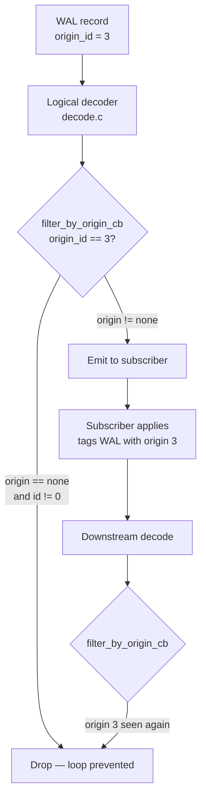
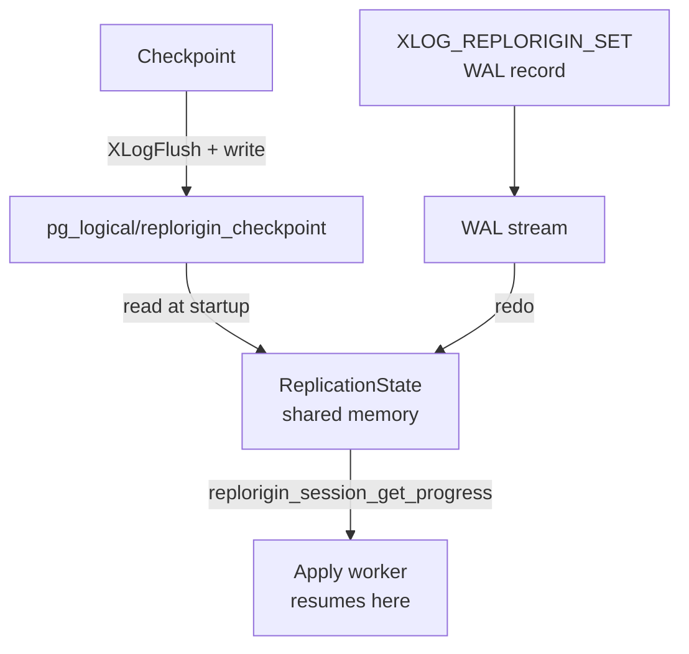

# Replication Origins

Replication origins give PostgreSQL a way to label WAL records with a source identifier — a short answer to the question "where did this change come from?" It solves two related problems that arise in logical replication topologies: infinite replication loops in multi-node setups, and the need for crash-safe progress tracking in apply workers.

## The loop problem

In a simple publisher-subscriber pair, changes flow in one direction. There is no ambiguity. The moment a second subscriber is added that also publishes — or when changes need to propagate across more than two nodes — the same row modification can circle back to its origin. A row inserted on node A replicates to node B. If B publishes to C and C publishes back to A, the insert arrives at A again and replicates indefinitely.

The standard solution is to tag each WAL record with an origin identifier and teach the logical decoding layer to drop records that originated at the current node. Replication origins are that tagging mechanism.

## Naming and identity

Every origin has two representations, both stored in the `pg_replication_origin` system catalog: a human-readable `roname` chosen by the administrator, and a compact two-byte integer `roident` assigned automatically. The split exists because the identifier must appear in WAL records and in shared memory. A 16-bit integer costs almost nothing there, while a free-form string would balloon every commit record that carries one (origin.c).

The `roident` is a `uint16` (`RepOriginId`). PostgreSQL reserves two values and never assigns them to user origins. `InvalidRepOriginId` (0) means "no origin". `DoNotReplicateId` (65535, `PG_UINT16_MAX`) is a sentinel that instructs the system to suppress changes from reaching any replication slot — useful for administrative bulk loads that should not replicate at all.

The system also reserves the origin names `"none"` and `"any"` (used as filter keywords in publications). PostgreSQL reserves names beginning with `pg_` for internal use. The SQL functions `pg_replication_origin_create(name)` and `pg_replication_origin_drop(name)` manage catalog entries.

ID assignment scans `pg_replication_origin` for the lowest unused value using a dirty snapshot under an exclusive lock (origin.c, `replorigin_create`). As a result, concurrent creations cannot race. The scan is a linear walk starting at 1. This is acceptable because the number of origins in any realistic topology is small, and creation is infrequent.

## Tagging WAL records with an origin

A backend declares its identity for the current session by calling `pg_replication_origin_session_setup(name)`. This function resolves the name to a `roident` and records it in the module-global variable `replorigin_session_origin`. The WAL insertion machinery checks this variable. If it is set, the machinery embeds the origin ID in WAL records emitted during the session. In practice, the logical apply worker calls this at startup after resolving or creating the origin for its subscription (worker.c).

Once the session origin is set, `pg_replication_origin_xact_setup(lsn, timestamp)` allows the apply worker to also record the original commit LSN and commit timestamp from the upstream node. These values travel along with the WAL record. The decoding subsystem exposes them to output plugins and to `pg_replication_origin_status`.

A backend clears the session origin with `pg_replication_origin_session_reset()`. PostgreSQL also automatically calls the cleanup function `ReplicationOriginExitCleanup` at process exit to release the in-memory slot.

## How loops are broken

The key integration point with [[subsystems/replication/logical-decoding|logical decoding]] is the `filter_by_origin_cb` callback registered by the output plugin. When the logical decoding layer replays a WAL record, it extracts the origin ID via `XLogRecGetOrigin` and calls this callback with the result. If the callback returns true, the decoding layer silently drops the change from the output stream (decode.c, `FilterByOrigin`).

The built-in `pgoutput` plugin implements this as `pgoutput_origin_filter`. When the subscription's origin option specifies `"none"`, the filter returns true for every record whose origin is not `InvalidRepOriginId` — that is, for every change that arrived from somewhere else (pgoutput.c). This is the default behaviour for logical subscriptions: changes applied by the subscriber's own apply worker carry the publisher's origin ID. As a result, if those changes are re-decoded for a downstream replica, the filter removes them.

The special value `DoNotReplicateId` bypasses the shared memory tracking entirely (`replorigin_advance` returns immediately for this ID). It also causes output plugins to drop every change with that origin. A session can use it for bulk data loads that should never appear in any replication stream.

## Progress tracking

Beyond loop prevention, origins provide a durable record of how far an apply worker has consumed the upstream WAL. This is essential for crash recovery: without it, an apply worker that dies mid-stream has no reliable way to know where to resume.

PostgreSQL maintains progress in a shared memory array of `ReplicationState` structs, sized by `max_replication_slots`. Each slot holds the `roident` it tracks along with two LSN values (origin.c):

- `remote_lsn`: the latest commit LSN from the upstream node that this node has successfully applied. This is the upstream's coordinate.
- `local_lsn`: the LSN in the local WAL at which the apply was recorded. This is the local coordinate.

The apply worker advances progress with `replorigin_session_advance(remote_commit, local_commit)`. This function updates both LSNs in the session's cached slot under a per-slot [[subsystems/locking/lwlocks|LWLock]]. Because 8-byte writes to LSN values are not guaranteed to be atomic on all platforms, the code uses the LWLock even for the read path (origin.c).

The `pg_replication_origin_advance(name, lsn)` SQL function serves a different purpose: it performs a "manual" advance with WAL logging, allowing administrators to set an initial replication position or to skip over a range of changes. It emits an `XLOG_REPLORIGIN_SET` WAL record. This allows standbys and recovery to replay the advance.

The `pg_replication_origin_status` view materialises the live shared memory table, showing `remote_lsn` and `local_lsn` for every active origin. The function backing it (`pg_show_replication_origin_status`) reads the array under the global `ReplicationOriginLock` but does not guarantee perfectly consistent LSN pairs for a given origin, since it does not hold the per-slot lock across the full scan.

## Durability across crashes

Shared memory is volatile. PostgreSQL persists origin progress through two complementary mechanisms.

At every checkpoint, `CheckPointReplicationOrigin` writes a binary snapshot of all active `ReplicationState` entries to `pg_logical/replorigin_checkpoint`. The file format is a fixed magic number followed by a sequence of `(roident, remote_lsn)` pairs and a CRC32C checksum. Before writing an entry, the code calls `XLogFlush(local_lsn)` to ensure that the local WAL record confirming the apply has actually reached disk. As a result, the checkpoint file never points ahead of durable WAL (origin.c).

At startup, `StartupReplicationOrigin` reads this file back into shared memory. PostgreSQL then recovers any progress that occurred after the last checkpoint but before the crash, by replaying the `XLOG_REPLORIGIN_SET` WAL records emitted during `replorigin_advance` or the per-transaction origin LSN embedded in commit records. The apply worker reads the recovered progress with `replorigin_session_get_progress` to determine its resume point (worker.c).

This design intentionally supports asynchronous commit. Because the system tracks both the remote LSN and the local WAL record together, a crash between the WAL write and the checkpoint does not cause lost progress — the WAL replay restores the exact state.

## Locking discipline

The origin subsystem uses three levels of locking:

1. **`ReplicationOriginLock` (LWLock, exclusive)**: held when creating or dropping in-memory slots, and when scanning the array during `replorigin_session_setup`. A shared mode is sufficient for read-only iteration, such as in checkpoint or the status view.

2. **Per-slot LWLock (`state->lock`)**: protects `remote_lsn` and `local_lsn` within a single `ReplicationState`. This avoids holding the global lock across WAL writes. That would create contention between checkpointing and active apply workers.

3. **`pg_replication_origin` table lock**: `replorigin_create` takes an exclusive lock on the catalog when assigning a new `roident`. `replorigin_drop_by_name` takes a shared-object lock at the `roident` level to prevent concurrent drops.

Parallel apply workers — multiple workers sharing the same subscription — can legitimately share an origin slot. The first worker acquires it with `acquired_by = 0`. Additional workers pass the PID of the first worker. Only one worker may commit at a time. This maintains the monotonic advance of `remote_lsn` (origin.c, `replorigin_session_setup`).

## Configuration

`max_replication_slots` bounds the number of origins that can track progress simultaneously. PostgreSQL reuses that GUC rather than introducing a separate parameter. Exceeding the limit raises an error suggesting an increase (origin.c). In practice, the limit is generous for the number of distinct upstream nodes most topologies involve.

## Relation to replication slots

Origins and [[subsystems/replication/slots|replication slots]] are complementary but independent concepts. A replication slot tracks how far a downstream consumer has received the WAL from the current node — it prevents PostgreSQL from recycling WAL segments until the consumer has caught up. A replication origin tracks how far the current node has applied WAL from an upstream node. The two together enable durable, bidirectional logical replication. The slot ensures the publisher retains WAL the subscriber has not yet read. The origin ensures the subscriber can resume after a crash without re-applying already-committed changes.

## User-facing SQL interface

| Function | Purpose |
|---|---|
| `pg_replication_origin_create(name)` | Register a new origin; returns `roident` |
| `pg_replication_origin_drop(name)` | Remove an origin and its progress state |
| `pg_replication_origin_oid(name)` | Look up the `roident` for a name |
| `pg_replication_origin_session_setup(name)` | Attach this session to an origin |
| `pg_replication_origin_session_reset()` | Detach the session origin |
| `pg_replication_origin_session_is_setup()` | Check whether a session origin is active |
| `pg_replication_origin_xact_setup(lsn, ts)` | Set per-transaction remote LSN and timestamp |
| `pg_replication_origin_xact_reset()` | Clear per-transaction state |
| `pg_replication_origin_advance(name, lsn)` | Manually advance progress (WAL-logged) |
| `pg_replication_origin_progress(name, flush)` | Read current `remote_lsn` for an origin |
| `pg_replication_origin_session_progress(flush)` | Read `remote_lsn` for the session origin |

The `flush` parameter on the progress functions forces a `XLogFlush` of the corresponding `local_lsn` before returning, giving callers a guarantee that the reported progress corresponds to durable local WAL.

## Related Topics

- [[subsystems/replication/logical-decoding|Logical Decoding]] — the layer that reads WAL and calls the `filter_by_origin_cb` callback to suppress looping changes based on their origin ID.
- [[subsystems/replication/slots|Replication Slots]] — the complementary mechanism that tracks how far a downstream consumer has read the local WAL; origins and slots together enable crash-safe bidirectional logical replication.
- [[subsystems/replication/logical|Logical Replication]] — the high-level subsystem that uses replication origins in apply workers to tag incoming changes and prevent infinite propagation loops.
- [[subsystems/replication/subscriptions|Subscriptions]] — the subscriber-side objects whose apply workers call `replorigin_session_setup` at startup and `replorigin_session_advance` after each commit.
- [[subsystems/replication/output-plugins|Output Plugins]] — implement `filter_by_origin_cb` (e.g., `pgoutput_origin_filter`) to decide which origin IDs are forwarded or suppressed in the decoded stream.
- [[subsystems/wal/checkpoint|Checkpoint]] — triggers `CheckPointReplicationOrigin`, which flushes the binary `replorigin_checkpoint` snapshot so progress survives a crash.
- [[subsystems/locking/lwlocks|LWLocks]] — used at two granularities (global `ReplicationOriginLock` and per-slot `state->lock`) to protect the shared-memory `ReplicationState` array during concurrent reads and advances.
