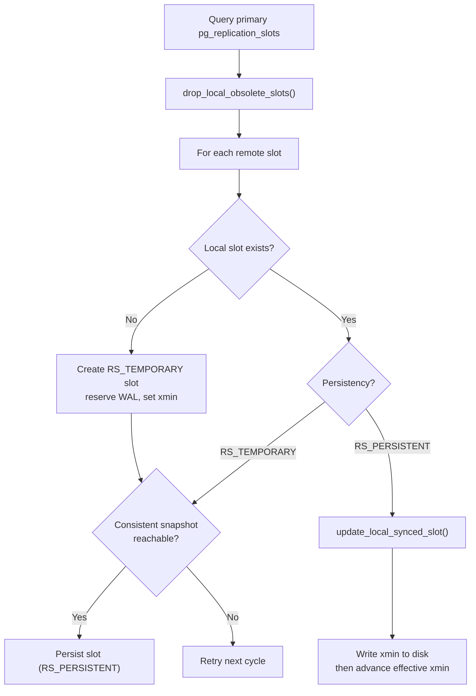

Logical slot synchronization is a PostgreSQL 17 feature that keeps logical [[subsystems/replication/slots|replication slots]] on a physical standby in sync with their counterparts on the primary. When an operator promotes the standby, subscribers can resume consuming from the replicated slots without a full resync — the slot positions are already current. The machinery lives in `slotsync.c` and runs either as a dedicated background worker (the slot sync worker) or on demand via the SQL function `pg_sync_replication_slots()`.

Before PG17, PostgreSQL never replicated slot state: a promoted standby had no logical slots at all, forcing every subscriber to drop its connection, recreate a slot, and retake a snapshot. Native slot sync eliminates that disruption for planned failovers.

## Prerequisites

Slot sync imposes a set of conditions that must all hold simultaneously (`ValidateSlotSyncParams()`):

- `wal_level` must be at least `logical` — the standby needs to produce logical WAL to serve decoders after promotion.
- `primary_slot_name` must name an existing physical slot on the primary — the physical slot prevents the primary from discarding WAL that the standby has not yet received. Discarding that WAL would otherwise undermine the catalog xmin guarantee.
- `hot_standby_feedback` must be enabled — this is what carries the standby's `xmin` and `catalog_xmin` back to the primary so the primary does not vacuum away catalog rows the standby's decoders still need.
- `primary_conninfo` must be set — the slot sync process connects to the primary over this connection to query `pg_replication_slots`.

The slot sync worker copies only slots that were created with `failover = true` on the primary.

## The Slot Sync Worker

When `sync_replication_slots = on`, the postmaster starts the slot sync worker. The worker connects to the primary database (the `dbname` extracted from `primary_conninfo` via `CheckAndGetDbnameFromConninfo()`), validates remote server state, and then loops indefinitely:

1. Query the primary's `pg_replication_slots` for all non-temporary failover-enabled slots.
2. Drop local synced slots that no longer exist on the primary or are locally invalidated while still valid on the primary (`drop_local_obsolete_slots()`).
3. For each remote slot, create or update the corresponding local slot (`synchronize_one_slot()`).
4. Sleep between cycles — the sleep duration adapts between 200 ms and 30 s depending on whether any slots were updated in the last cycle (`wait_for_slot_activity()`).

The sleep adapts to activity. When slots are advancing frequently, the worker polls at minimum 200 ms intervals to stay close to the primary. When slots are quiet, it backs off exponentially to 30 s to avoid unnecessary load.

The worker shares a small `SlotSyncCtxStruct` in shared memory to coordinate with the startup process. When the startup process triggers promotion, it sets `stopSignaled` and sends `PROCSIG_SLOTSYNC_MESSAGE` to the worker's PID, causing the worker to exit cleanly. The SQL function `pg_sync_replication_slots()` also checks `stopSignaled` and aborts if promotion is in progress.

## Synchronizing a Single Slot

`synchronize_one_slot()` handles the full lifecycle of one slot:

**New slot (not yet present locally):** `synchronize_one_slot()` creates a temporary slot and reserves WAL at the appropriate LSN. The initial WAL reservation (`reserve_wal_for_local_slot()`) uses the greater of the primary's `restart_lsn` and the local redo pointer, ensuring the standby does not reserve WAL that has already been removed. `synchronize_one_slot()` sets the `catalog_xmin` to the oldest safe decoding transaction ID on the standby, protecting catalog rows from local vacuuming.

**Slot not yet sync-ready (persistency = RS_TEMPORARY):** `synchronize_one_slot()` can only promote the slot to persistent when two conditions hold: (a) the local standby has received enough WAL that decoding can reach the primary's `confirmed_flush_lsn` from `restart_lsn`; and (b) a serialized snapbuilder snapshot exists at `restart_lsn`, confirming that decoding can reach a consistent state without replaying from scratch. If these conditions are not met yet, the slot stays temporary. `synchronize_one_slot()` retries it next cycle.

**Slot sync-ready (persistency = RS_PERSISTENT):** `update_local_synced_slot()` compares the primary's `confirmed_lsn`, `restart_lsn`, and `catalog_xmin` against the local values and advances the local slot if the primary is ahead. If a serialized snapshot already exists for the remote `restart_lsn`, `update_local_synced_slot()` copies the values directly. Otherwise, slot advance machinery (`LogicalSlotAdvanceAndCheckSnapState()`) replays WAL to reach the target LSN and update the snapbuilder state correctly.

The update protocol is careful about ordering: `update_local_synced_slot()` writes the new `catalog_xmin` to disk before it updates the in-memory effective value. As a result, a crash between the two steps always leaves the stricter value in effect.

## Promotion Handoff

When the startup process calls `ShutDownSlotSync()` during promotion, it sets `stopSignaled` and signals any running sync process. It then waits until the worker or SQL function clears the `syncing` flag in `SlotSyncCtxStruct`. It resets this flag only after releasing all active and temporary slots. Once the wait completes, `ShutDownSlotSync()` stamps `inactive_since` on all synced slots to mark the moment synchronization stopped. This timestamp will be visible in `pg_replication_slots` after promotion, giving operators a clear indication of how recently each slot was last brought up to date.

## Concurrency Protection

Only one sync process may run at a time. The `syncing` flag in `SlotSyncCtxStruct` (protected by a spinlock) prevents concurrent slot sync from the SQL function and the worker from overwriting each other's slot state. The slot sync worker itself uses the same slot acquire/release lifecycle as other slot holders. This prevents invalidation races with `InvalidatePossiblyObsoleteSlot()`.

## Related Topics

- [[subsystems/replication/slots]] — replication slot internals and the `failover` flag
- [[subsystems/replication/logical]] — logical decoding and how slots feed decoders
- [[subsystems/replication/failover]] — failover and switchover mechanics
- [[subsystems/replication/streaming]] — physical replication and `primary_slot_name`
- [[subsystems/wal/wal-summarizer]] — WAL summarizer, another PG17 background worker
