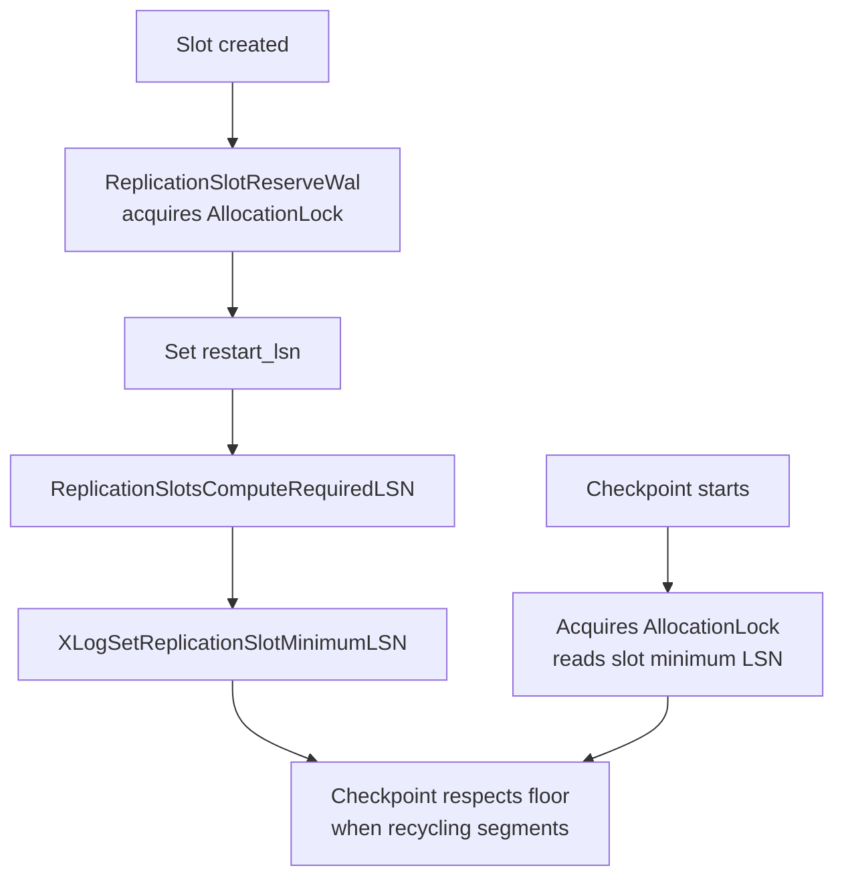

# Replication Slots

A replication slot is a named, persistent token on a PostgreSQL server that records how far a particular consumer — a standby or a logical decoding client — has consumed the WAL stream. Without a slot, the primary has no idea which WAL segments any given consumer still needs. The WAL recycler uses the checkpoint redo pointer and the oldest connected standby's reported flush position as guidance. A standby that disconnects stops sending those reports, so the WAL recycler can recycle segments while the standby is offline. When the standby reconnects, it may find that the WAL it needs is gone. Slots close this gap: a slot's state is durable and survives server restarts, so the primary can protect WAL on behalf of a consumer even when that consumer is not connected.

The requirement that slots be usable on standbys (for cascading replication setups) precludes storing them in the system catalogs. Instead, each slot gets its own directory under `$PGDATA/pg_replslot/` with a flat state file. PostgreSQL reconstructs each slot in shared memory at startup before crash recovery begins (slot.c).

## Physical vs Logical Slots

The distinction between physical and logical slots reflects two fundamentally different things a consumer might need preserved: raw WAL bytes versus decoded row changes with their catalog context.

A **physical slot** serves streaming replication standbys. Its only job is to prevent WAL segment recycling so the standby can replay segments it has not yet applied. The slot stores `InvalidOid` in the `database` field of `ReplicationSlotPersistentData`; the `SlotIsPhysical` macro tests for this. Physical slots have no `catalog_xmin` and impose no constraint on VACUUM — they cannot hold back old row versions, only WAL files.

A **logical slot** serves the logical decoding machinery. The machinery replays WAL to reconstruct row-level changes for consumers like logical replication subscribers or `pg_logical`-style tools. Logical decoding needs more than just the raw WAL: it also needs the catalog state — table definitions, type OIDs, constraint metadata — that was current at the time each transaction committed. VACUUM can remove those catalog rows after they are no longer visible to any live transaction, but the decoder's replay can lag the live database by an arbitrary amount. To prevent premature catalog cleanup, every logical slot carries a `catalog_xmin` field. This is the oldest transaction ID whose catalog rows the decoder may still need. It participates in the global xmin horizon. VACUUM consults that horizon when deciding whether a dead catalog tuple is safe to remove. The `database` field holds the OID of the database the slot decodes; hence the `SlotIsLogical` macro.

Logical slots are created by calling `pg_create_logical_replication_slot()` or by the built-in logical replication infrastructure when a subscription is set up. Physical slots are created by `pg_create_physical_replication_slot()`, or implicitly by a standby's WAL receiver when `primary_slot_name` is configured.

## The Two LSN Fields

Every slot tracks two position pointers whose semantics are precise enough to matter in operations.

`restart_lsn` is the oldest WAL position the consumer still needs. The WAL recycler will not remove any segment that contains or follows this LSN. When a physical slot is first created, `ReplicationSlotReserveWal()` (slot.c) sets `restart_lsn` to the current redo pointer — the start of the last checkpoint — because a fresh standby must replay from there. For a logical slot created on a primary, `ReplicationSlotReserveWal()` sets it to the current WAL insert position. It then flushes a standby snapshot record (`LogStandbySnapshot()`) so the decoder can find a consistent starting point. For a logical slot created on a standby (during recovery), `ReplicationSlotReserveWal()` sets it to the current replay pointer. The decoder finds a consistent point from an `xl_running_xact` record logged independently by the primary.

`confirmed_flush_lsn` (stored as `data.confirmed_flush` in the persistent struct) tracks where the logical decoding client has durably acknowledged receipt of decoded changes. This is the position from which decoding will resume if the client reconnects, avoiding re-sending already-confirmed data. It advances only when the client explicitly confirms, making it an end-to-end durable progress marker. Physical slots do not use `confirmed_flush_lsn` in a meaningful way.

These two fields can diverge significantly. A logical slot's `restart_lsn` may be far behind `confirmed_flush_lsn`. The decoder needs WAL earlier than the confirmed flush position to reconstruct catalog state for long-running transactions, or to decode changes whose catalog rows were modified well before the transaction committed.

Advancing a slot's `confirmed_flush_lsn` explicitly — via `pg_replication_slot_advance()` — moves the decoding start forward but does not immediately move `restart_lsn` by the same amount. The restart position only catches up as the decoder internally determines it no longer needs older WAL for catalog reconstruction.

## How Slots Pin WAL

After a slot is created and `restart_lsn` is set, the mechanism that actually prevents segment recycling is straightforward. `ReplicationSlotsComputeRequiredLSN()` (slot.c) scans all in-use, non-invalidated slots under `ReplicationSlotControlLock` and finds the minimum `restart_lsn` across all of them. It then calls `XLogSetReplicationSlotMinimumLSN()` to record this floor in the WAL subsystem. The checkpoint code respects this floor when deciding which segments may be removed.

The interaction with checkpoint is carefully ordered. When a new slot is created, `ReplicationSlotReserveWal()` (slot.c) acquires `ReplicationSlotAllocationLock` exclusively before setting `restart_lsn` and recomputing the minimum. Checkpoint also acquires this lock before consulting the slot minimum LSN. This mutual exclusion guarantees one of two outcomes: either the slot's `restart_lsn` is visible to the checkpoint before the checkpoint removes any segment, or the checkpoint has already completed and the slot's start position is at or beyond the new redo pointer. In either case, no needed WAL is lost.

`ReplicationSlotsComputeLogicalRestartLSN()` (slot.c) provides a narrower variant that considers only logical slots. Callers that need to distinguish between WAL required by physical versus logical consumers use this variant.

## The catalog_xmin and How It Restrains VACUUM

The `catalog_xmin` field on a logical slot is the mechanism by which logical decoding prevents VACUUM from removing catalog rows the decoder still needs. When the decoder processes WAL, it may need to look up type definitions, table OIDs, or column names from catalog tables as they existed at the time of each original transaction — not as they exist now. If VACUUM removes those old catalog tuples, the decoder will either produce wrong answers or fail entirely.

`ReplicationSlotsComputeRequiredXmin()` (slot.c) aggregates the minimum `effective_xmin` and `effective_catalog_xmin` across all non-invalidated slots, then publishes the result into the ProcArray via `ProcArraySetReplicationSlotXmin()`. The ProcArray uses these values when computing the global `xmin` horizon. VACUUM consults that horizon before deciding any dead tuple is safe to remove. This is why a lagging logical slot can cause table bloat even on tables that are vacuumed regularly. The slot's `catalog_xmin` prevents cleanup of old catalog versions. Its `xmin` (for data rows) can prevent cleanup of dead rows in user tables the slot's transactions have touched.

The distinction between `effective_xmin` and `data.xmin` (and similarly `effective_catalog_xmin` vs `data.catalog_xmin`) matters for logical slots: for correctness during logical decoding, the effective value must not be weakened until it has been written to disk. The comment in `ReplicationSlot` explains that for streaming replication the two are identical. For logical decoding, the effective value tracks the last disk-written xmin. This avoids a window where a crash could leave the decoder with a weaker xmin than it wrote out (slot.h).

## Slot Persistence and the On-Disk Format

Every persistent slot gets its own subdirectory under `$PGDATA/pg_replslot/<slotname>/`. The state file at `pg_replslot/<slotname>/state` holds a `ReplicationSlotOnDisk` struct (slot.c). This struct wraps `ReplicationSlotPersistentData` with a version-independent header:

- A magic number (`0x1051CA1`) identifies the file format.
- A `pg_crc32c` checksum covers the version, length, and all slot data fields.
- A version number (`3` for PG 16) and length field allow future format changes.

Writes use the rename-into-place pattern: PostgreSQL writes the new state to `state.tmp`, fsyncs it, renames it to `state`, then fsyncs the directory and the `pg_replslot` parent directory. This ensures that a crash during a write leaves either the old complete file or the new complete file, never a partial state. On startup, `StartupReplicationSlots()` (slot.c) iterates `pg_replslot/`, validates magic and checksum for each entry, and re-instantiates valid slots in shared memory before crash recovery proceeds. Entries ending in `.tmp` are remnants of interrupted create or drop operations. PostgreSQL deletes them during this scan.

PostgreSQL caches slot state in shared memory and writes it to disk lazily. `ReplicationSlotMarkDirty()` (slot.c) sets a dirty flag. PostgreSQL defers the actual disk write until a checkpoint runs `CheckPointReplicationSlots()` (slot.c), or until an explicit `ReplicationSlotSave()` call. The `just_dirtied` and `dirty` fields in the in-memory struct coordinate this: if the slot is dirtied again while a write is in progress, `just_dirtied` remains set. This tells the write loop not to clear the `dirty` flag.

The three values of `ReplicationSlotPersistency` govern lifetime:

| Value | Lifetime |
|---|---|
| `RS_PERSISTENT` | Survives crashes and server restarts; must be dropped explicitly |
| `RS_EPHEMERAL` | Transient state used only during slot creation; upgraded to `RS_PERSISTENT` by `ReplicationSlotPersist()` or dropped on release |
| `RS_TEMPORARY` | Dropped automatically when the owning session disconnects |

The ephemeral state exists so that slot creation is atomic from the on-disk perspective. PostgreSQL creates and fsyncs the slot directory before marking the slot persistent, ensuring that a crash during creation leaves either a complete slot or nothing.

## Temporary Slots

Temporary slots (`RS_TEMPORARY`) serve clients that want logical decoding for a short-lived purpose — extracting a snapshot for a point-in-time export, running a one-off logical decoding session, or streaming changes for the duration of a migration — without the risk of an abandoned persistent slot accumulating WAL indefinitely.

The session that creates a temporary slot owns it exclusively. The `before_shmem_exit` callback registered in `ReplicationSlotInitialize()` (slot.c) drops the slot automatically when the session disconnects or errors out. Because temporary slots are dropped on disconnect rather than surviving restarts, they cannot accumulate WAL across downtime periods. `ReplicationSlotCleanup()` (slot.c) handles the cleanup pass, walking the slot array and dropping any temporary slot whose `active_pid` matches the current process.

Temporary slots are the right choice whenever the consumer does not need to resume after a disconnect. Persistent slots make sense only when continuity of the decoded stream across disconnects genuinely matters.

## The WAL Accumulation Hazard

The same mechanism that makes slots reliable also makes them dangerous when neglected. If a slot's consumer disconnects and never reconnects, `restart_lsn` does not advance. The WAL directory grows without bound, accumulating every segment produced since the consumer fell behind. On busy write-heavy systems this can exhaust disk space and halt the server.

PostgreSQL 13 introduced `max_slot_wal_keep_size` to cap this accumulation. When the checkpoint process evaluates which segments to remove, it checks whether any slot's `restart_lsn` is so far behind that keeping the required WAL would exceed the configured limit. If so, it calls `InvalidateObsoleteReplicationSlots()` (slot.c). This function marks the offending slot with `RS_INVAL_WAL_REMOVED` and clears `restart_lsn` to `InvalidXLogRecPtr`. An invalidated slot no longer pins any WAL, allowing the recycler to proceed. The slot itself remains on disk in an invalidated state. Any attempt to use the slot will fail with an error. The slot must be dropped and recreated — typically after the consumer takes a fresh base backup — because the WAL the decoder needed is gone.

If the slot is currently active (a process holds it), `InvalidatePossiblyObsoleteSlot()` (slot.c) sends a SIGTERM to that process and waits for it to release the slot before marking it invalid. It then fsyncs the invalidated state to disk immediately, so it persists across a crash.

Three causes can invalidate a slot, captured in the `ReplicationSlotInvalidationCause` enum:

| Cause | Meaning |
|---|---|
| `RS_INVAL_WAL_REMOVED` | The slot's `restart_lsn` fell behind `max_slot_wal_keep_size`; the WAL it required has been removed |
| `RS_INVAL_HORIZON` | The slot's `xmin` or `catalog_xmin` conflicted with the snapshot horizon during a vacuum on a standby |
| `RS_INVAL_WAL_LEVEL` | The primary's `wal_level` was changed below `logical` after a logical slot was created |

`RS_INVAL_HORIZON` only applies to logical slots on standbys. Hot standby can run queries. If VACUUM on the standby needs to remove rows but a logical slot's xmin prevents it, the standby may choose to invalidate the slot rather than block vacuum indefinitely. `RS_INVAL_WAL_LEVEL` is set when the server restarts with a reduced `wal_level`. Logical slots found on disk during `RestoreSlotFromDisk()` will trigger a FATAL error (not just invalidation), because the server cannot safely decode without the required WAL level.

**PostgreSQL 18:** The `idle_replication_slot_timeout` GUC automatically invalidates replication slots that have had no active consumer for the configured duration. This closes the most common failure mode — a subscriber process dies, nobody notices, and WAL accumulates for days — without requiring operators to manually poll `inactive_since` or set up external monitoring scripts.

## Slot Invalidation and Monitoring

The `wal_status` column in `pg_replication_slots` provides an operator-friendly summary of how close a slot is to being invalidated or how far it has already fallen:

| `wal_status` | Meaning |
|---|---|
| `reserved` | Slot's WAL fits within `wal_keep_size`; normal operation |
| `extended` | Slot requires more WAL than `wal_keep_size` but is within `max_slot_wal_keep_size` |
| `unreserved` | Slot has exceeded `max_slot_wal_keep_size`; will be invalidated at next checkpoint |
| `lost` | Slot has already been invalidated; `restart_lsn` is null |

A slot in `unreserved` state is living on borrowed time: the next checkpoint will invalidate it. A slot in `lost` state is already dead and must be dropped before the consumer can resume.

The `safe_wal_size` column (added in PG 13) reports how many bytes of additional WAL can be written before a slot transitions from `extended` to `unreserved`, giving an advance warning before the invalidation threshold is crossed.

Proactive monitoring should alert on:
- Any slot where `active = false` and `restart_lsn` is significantly behind the current WAL position.
- Any slot where `wal_status = 'unreserved'` or `wal_status = 'lost'`.
- Any slot where `confirmed_flush_lsn` lags far behind current LSN (for logical slots).
- Logical slots with a very old `catalog_xmin`, which indicates table bloat risk even if WAL retention is bounded.

**PostgreSQL 17:** `pg_replication_slots` gains two columns that directly address the monitoring gap for abandoned slots. `inactive_since` records the timestamp when the slot last had an active consumer. This makes it straightforward to identify slots idle for an unexpectedly long time, before they cause disk exhaustion. `invalidation_reason` exposes the specific cause of invalidation (`wal_removed`, `horizon`, or `wal_level`) in a queryable form rather than requiring operators to correlate log messages with slot state.

## The pg_replication_slots View

The `pg_replication_slots` view exposes the shared memory state of all slots. Its key columns map directly to the fields described above:

| Column | Source | Meaning |
|---|---|---|
| `slot_name` | `data.name` | Identifier |
| `slot_type` | `data.database` | `physical` if `InvalidOid`, else `logical` |
| `database` | `data.database` | Database OID for logical slots; null for physical |
| `temporary` | `data.persistency` | True for `RS_TEMPORARY` slots |
| `active` | `active_pid != 0` | Whether a backend currently holds the slot |
| `active_pid` | `active_pid` | PID of the current holder, or null |
| `restart_lsn` | `data.restart_lsn` | Oldest WAL the slot requires |
| `confirmed_flush_lsn` | `data.confirmed_flush` | Furthest acknowledged position (logical only) |
| `catalog_xmin` | `data.catalog_xmin` | Oldest catalog xmin held back by this slot (logical only) |
| `xmin` | `data.xmin` | Oldest data xmin held back by this slot (logical only) |
| `wal_status` | derived | `reserved`, `extended`, `unreserved`, or `lost` |
| `safe_wal_size` | derived | Bytes before invalidation threshold is crossed |
| `invalidation_reason` | `data.invalidated` | Non-null when the slot has been invalidated; PG 17 exposes the specific cause as a text column |
| `inactive_since` | `data.inactive_since` | Timestamp when the slot last had an active consumer (PG 17+) |
| `two_phase` | `data.two_phase` | Whether prepared-transaction decoding is enabled |

## Shared Memory Layout and Locking

PostgreSQL allocates all slots in a fixed-size shared memory array (`ReplicationSlotCtlData.replication_slots[]`), sized at startup based on `max_replication_slots`. This fixed allocation is why operators must pre-reserve slots and cannot create them beyond the configured maximum at runtime. The global `MyReplicationSlot` pointer identifies the slot held by the current backend.

The locking model uses three primitives:

- `ReplicationSlotAllocationLock` ([[subsystems/locking/lwlocks|LWLock]], exclusive) guards slot creation and deletion, ensuring name-uniqueness checks and directory operations are serialized. It is also held in shared mode by `CheckPointReplicationSlots()` to prevent concurrent drops during checkpoint.
- `ReplicationSlotControlLock` (LWLock) protects the `in_use` flag: shared mode for scanning the array, exclusive mode for flipping a slot into or out of use.
- A per-slot spinlock (`mutex`) protects individual fields like `active_pid`, `restart_lsn`, and `invalidated` for short critical sections.

The `active_pid` field identifies the backend currently streaming from the slot. Only one backend can hold a slot at a time. A condition variable (`active_cv`) allows a backend waiting for a slot that is in use to sleep until the current owner releases it. PostgreSQL also uses the same condition variable to signal waiters during slot invalidation.

Slot name validation enforces that names consist only of lowercase letters, digits, and underscores (`[a-z0-9_]`), ensuring the name is safe to use as a directory name on all supported operating systems (slot.c).

## Failover Slots and the Standby Gap

PostgreSQL does not natively replicate replication slot state to standbys. When a standby is promoted, it has no knowledge of what slots existed on the old primary, what their `restart_lsn` and `confirmed_flush_lsn` values were, or whether they were invalidated. Logical replication subscribers connected to the primary through a slot must therefore reconnect to the new primary and establish new slots. This means they must negotiate a new starting point — typically requiring a resync from scratch.

This is a significant operational gap for logical replication setups that need to survive a primary failover without losing subscriber state. The community-maintained `pg_failover_slots` extension addresses this by periodically copying slot state from the primary to each standby over a logical replication channel. When the standby is promoted, the extension's tracking ensures slots exist with approximately correct positions. The word "approximately" matters. Because slot advancement on the primary and copying to the standby are not atomic, a promoted standby's slots may not perfectly match the primary's last known state. As a result, consumers may receive a small number of duplicate changes upon reconnection.

**PostgreSQL 17:** Native failover slot support is built into core. A logical slot can be designated as a failover candidate at creation time via `pg_create_logical_replication_slot(..., failover => true)`, or a subscription can be created with `CREATE SUBSCRIPTION ... FAILOVER = true`. The `pg_sync_replication_slots()` function manually copies such slots to a physical standby. The `sync_replication_slots` GUC enables an automatic slot-sync worker on standbys that keeps failover-designated slots continuously up to date. When the standby is promoted, these slots are available immediately with accurate position state, eliminating the need for subscriber resyncs in planned failovers.

## Related Topics

- [[subsystems/replication/logical-decoding|Logical Decoding]] — the machinery that consumes logical slot WAL to reconstruct row-level changes for downstream consumers
- [[subsystems/replication/slot-sync|Slot Sync]] — the PG 17 worker that continuously copies failover-designated slot state from a primary to physical standbys
- [[subsystems/replication/replication-origins|Replication Origins]] — tracks which changes originated from a given replication stream, used alongside logical slots to avoid replication loops
- [[subsystems/wal/checkpoint|Checkpoint]] — the checkpoint process consults slot `restart_lsn` values when deciding which WAL segments may be recycled
- [[subsystems/transactions/xid-wraparound|XID Wraparound]] — a lagging logical slot's `catalog_xmin` can age out transactions and contribute to wraparound pressure
- [[troubleshooting/replication-lag|Replication Lag]] — diagnosing consumers that fall behind and push slots toward WAL accumulation or invalidation
- [[subsystems/observability/pg-stat-replication|pg_stat_replication]] — the companion view that reports active WAL sender state alongside the slot positions exposed by `pg_replication_slots`
- [[subsystems/wal/overview|WAL Overview]] — how WAL segments are managed and recycled, the space that replication slots pin against
- [[subsystems/replication/logical|Logical Replication]] — how logical slots feed the decoding machinery that reconstructs row-level changes
- [[subsystems/replication/streaming|Streaming Replication]] — streaming replication and how physical slots pin WAL for connected standbys
- [[subsystems/replication/hot-standby|Hot Standby]] — how slot invalidation interacts with standby queries and recovery conflicts
- [[subsystems/transactions/mvcc|MVCC]] — how `catalog_xmin` interacts with the visibility horizon that VACUUM consults
- [[code-paths/vacuum|VACUUM]] — how VACUUM respects slot xmin values before removing dead tuples
- [[architecture/overview|Architecture Overview]] — where replication fits in the broader server architecture
