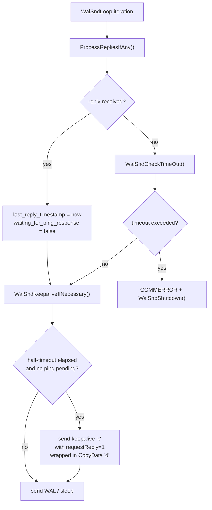
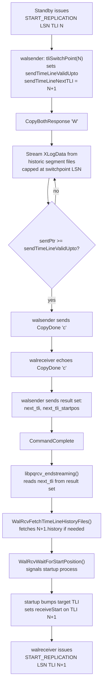

# Streaming Replication

Streaming replication keeps a standby server continuously synchronized with a primary by shipping raw WAL bytes across a persistent TCP connection. Unlike log-shipping (where completed WAL segment files are archived and fetched), streaming replication can deliver WAL within milliseconds of it being written — frequently well under one WAL write cycle. This near-real-time delivery is what makes streaming replication the default and preferred high-availability mechanism in modern PostgreSQL deployments.

The design is deliberately physical: the standby receives the same bytes that the primary wrote to its WAL files and replays them identically. There is no interpretation or transformation of individual changes. The result is a byte-for-byte replica of the primary's data directory, including the exact same page layout, transaction IDs, and on-disk structures. This fidelity is why a physical standby can be promoted to a fully operational primary within seconds. It is also why hot standby queries can use the same index structures as the primary.

## Process Architecture

Two dedicated processes drive streaming replication: a WAL sender (`walsender.c`) on the primary for each connected standby, and a single WAL receiver (`walreceiver.c`) on each standby.

The postmaster spawns a WAL sender when a standby connects on a replication-protocol connection. It behaves like a regular backend in that it owns a `PGPROC` slot, appears in `pg_stat_activity`, and communicates over the standard libpq protocol — but instead of executing SQL it understands a small grammar of replication commands. The `am_walsender` flag distinguishes it from a regular backend. When the standby is itself serving further standbys, `am_cascading_walsender` is set to true. The sender then reads from the standby's replay position rather than from a primary flush pointer.

Each walsender's runtime state is recorded in a shared-memory slot of type `WalSnd` (`walsender_private.h`). The cluster holds an array of these in `WalSndCtlData`, sized by `max_wal_senders`. The fields that matter most for observability and synchronous replication are:

| Field | Meaning |
|---|---|
| `state` | `WALSNDSTATE_STARTUP / BACKUP / CATCHUP / STREAMING / STOPPING` |
| `sentPtr` | LSN of the last byte sent to this standby |
| `write` | write LSN last reported by the standby |
| `flush` | flush LSN last reported by the standby |
| `apply` | replay/apply LSN last reported by the standby |
| `writeLag` | computed interval between primary flush and standby write acknowledgment |
| `flushLag` | interval between primary flush and standby flush acknowledgment |
| `applyLag` | interval between primary flush and standby apply acknowledgment |
| `sync_standby_priority` | 0 if not in `synchronous_standby_names`, else priority rank |

On the standby side, the WAL receiver is a single auxiliary process started by the postmaster on instruction from the startup process. It connects to the primary using the `primary_conninfo` connection string (loaded from shared memory, not read directly from GUC, to coordinate with the startup process). The receiver maintains a `WalRcvData` shared-memory struct, exposed through the `WalRcv` global. The startup process consults this struct to learn how far WAL has been flushed locally.

## The Replication Protocol

The connection between a WAL receiver and its WAL sender uses PostgreSQL's standard libpq wire protocol, but the session immediately switches into replication mode. Authentication follows the normal `pg_hba.conf` rules, except that the connection type is `replication` — a distinct entry type that allows or denies replication clients separately from regular database connections.

After connecting, the receiver sends `IDENTIFY_SYSTEM` to verify it is talking to the correct cluster (by checking the system identifier) and to learn the primary's current timeline. It then issues `START_REPLICATION LSN TIMELINE` to begin the WAL stream. The walsender responds with a `CopyBothResponse` message (`'W'`) and enters COPY mode. After that, the two sides exchange messages within a symmetric COPY sub-protocol.

The primary sends two kinds of messages to the standby:

- **XLogData (`'w'`)** — carries a contiguous range of WAL bytes. The header contains the starting LSN, the current WAL end LSN known to the primary, and a send timestamp. The body is raw WAL, up to `MAX_SEND_SIZE` bytes per message (128 kB by default, `XLOG_BLCKSZ * 16`). The walsender reads flushed WAL with `XLogSendPhysical()` and sends it in a loop driven by `WalSndLoop()`.
- **Primary keepalive (`'k'`)** — sent when the walsender has no new data to send, or when it needs to probe the standby for liveness. The message carries the current WAL end LSN, a send timestamp, and a flag requesting an immediate reply.

The standby sends one kind of reply back to the primary:

- **Standby status update (`'r'`)** — carries three LSN positions: `writePtr` (bytes written to the OS), `flushPtr` (bytes fsync'd to disk), and `applyPtr` (bytes replayed by the startup process). It also carries a timestamp and a flag requesting a keepalive echo. The receiver constructs this message in `XLogWalRcvSendReply()` and sends it periodically (every `wal_receiver_status_interval` seconds) and immediately when a reply is requested.

There is also an optional **hot standby feedback (`'h'`)** message from standby to primary, which carries the standby's oldest active transaction ID (`xmin`). The primary uses this to prevent vacuum from removing rows that a standby query might still need (see [[subsystems/replication/streaming#Hot Standby and Recovery Conflicts]]).

The symmetry of CopyBoth mode lets both sides send and receive concurrently without polling. The walsender processes incoming messages with `ProcessRepliesIfAny()` between WAL-send iterations. The walreceiver drives a similar event loop, waiting on the network socket and its process latch.

## COPY Sub-protocol Framing

Understanding what the wire actually looks like between walsender and walreceiver requires looking one level below the replication-specific messages and into the libpq COPY framing that carries them.

When the walsender sends an XLogData or keepalive payload, it wraps the bytes in a libpq `CopyData` frame — a message type `'d'` — so the full wire sequence for a single WAL chunk is: the libpq `'d'` byte, a four-byte big-endian payload length, and then the replication-message bytes that begin with the `'w'` or `'k'` tag. The standby's reply messages work the same way: the `'r'` (status update) and `'h'` (hot standby feedback) bytes are themselves the first byte of the payload inside a `CopyData` frame sent back from receiver to sender. This indirection is what makes the bidirectional CopyBoth mode work: both sides run the COPY sub-protocol simultaneously over the same TCP connection. Each message is unambiguously typed by the outer libpq frame.

The natural way to terminate a COPY stream is for either side to send a `CopyDone` message (`'c'`), which is an empty libpq frame with no payload. In normal operation the walsender initiates the close: when it detects that it has drained a historic timeline to its switchpoint LSN, it sends `CopyDone` and sets `streamingDoneSending = true`. After that, it must not emit any further `CopyData` frames. Meanwhile, it keeps reading incoming data from the standby until the standby echoes `CopyDone` back. At that point, `streamingDoneReceiving = true`. Only when both flags are true and the output buffer is empty does the main loop exit COPY mode. The walsender then sends the next-timeline result set (described below), followed by a `CommandComplete`. The session then returns to command mode.

The standby can also initiate an early exit — for example, when the startup process instructs it to switch timelines or stop — by sending `CopyDone` from its side. The walsender sees the `'c'` byte in `ProcessRepliesIfAny()` and mirrors it back if it has not already done so. The receiver also passes a bare `'X'` (connection-close) message during process exit. This causes the walsender to call `proc_exit(0)` immediately.

If the connection breaks without an orderly `CopyDone` exchange — the TCP socket returns an error or unexpected EOF — the walsender treats this as `COMMERROR` and exits. The standby's `libpqrcv_receive()` returns `-1` from `PQgetCopyData()` to signal end-of-streaming, then calls `PQgetResult()` to drain any pending error message from the server before the walreceiver loop decides whether to reconnect or wait for new instructions from the startup process. An `ErrorResponse` from the primary (for example, when the walsender kills itself due to `wal_sender_timeout`) surfaces through `PQresultStatus()` returning `PGRES_FATAL_ERROR`. The walreceiver then raises a `LOG`-level message before exiting the streaming loop.

## Dead-standby Detection and `wal_sender_timeout`

The keepalive mechanism doubles as a dead-standby detector. The walsender tracks the timestamp of the last reply it received from the standby in `last_reply_timestamp`. As long as the connection is healthy the standby sends a status update at least every `wal_receiver_status_interval` seconds (default 10 s), so `last_reply_timestamp` advances continuously.

When half of `wal_sender_timeout` has elapsed since the last reply and no keepalive has yet been sent, `WalSndKeepaliveIfNecessary()` constructs a keepalive message with the `requestReply` flag set to 1, wraps it in a `CopyData` frame, and flushes it. `WalSndKeepaliveIfNecessary()` then sets the `waiting_for_ping_response` flag to true, so that subsequent trips through the loop do not send another redundant probe. The standby is expected to respond within the remaining half of the timeout window. Its `wal_receiver_timeout` is typically matched to `wal_sender_timeout` (both default to 60 s), so the standby's own timeout fires first if it stops hearing from the primary.

On each iteration of the main loop `WalSndCheckTimeOut()` compares `last_processing` (the timestamp of the most recent `ProcessRepliesIfAny()` call) against `last_reply_timestamp + wal_sender_timeout`. If the deadline has passed, the walsender logs `"terminating walsender process due to replication timeout"` at `COMMERROR` severity. Crucially, it does not attempt to send the error back to the standby, because by this point the network is presumed to be broken. It then calls `WalSndShutdown()` and exits. The use of `last_processing` rather than the wall clock as the reference point means that a long server-side stall (for example, a checkpoint that holds the walsender off the CPU) is not counted against the standby's reply window. This prevents spurious disconnections under load.

Setting `wal_sender_timeout = 0` disables the mechanism entirely. This is occasionally useful in debugging scenarios where stepping through code in a debugger would otherwise kill the connection, but it leaves dead standbys attached indefinitely and is not recommended for production.

## Writing and Flushing on the Standby

When an XLogData message arrives, the walreceiver writes the payload into the appropriate WAL segment file in `pg_wal` using `XLogWalRcvWrite()`. The write is a straight `pg_pwrite()` into a pre-opened file descriptor; the receiver maintains `recvFile`, `recvSegNo`, and `recvFileTLI` to track which segment is open. The walreceiver tracks the written extent in `LogstreamResult.Write` and publishes it atomically to `WalRcv->writtenUpto`, so that the startup process can see how much WAL has arrived even before it is durable.

Durability comes from `XLogWalRcvFlush()`, which calls `issue_xlog_fsync()` on the current segment and advances `WalRcv->flushedUpto`. After each flush, the receiver wakes the startup (recovery) process with `WakeupRecovery()`. If cascading replication is enabled, it also wakes any local walsenders so they can forward the newly-arrived WAL to their own downstream standbys.

The apply LSN reported back to the primary comes from `GetXLogReplayRecPtr()`, which reflects how far the startup process has actually replayed records from the WAL buffer into heap and index pages.

## Replication Lag and `pg_stat_replication`

The `pg_stat_replication` view surfaces the `write`, `flush`, and `apply` LSNs from each `WalSnd` slot alongside computed lag intervals. Computing a lag *duration* rather than just a byte distance requires matching an LSN on the standby to the timestamp at which the primary originally flushed that LSN. The walsender maintains a circular ring buffer called `LagTracker` for this purpose: each time the primary flushes WAL it records a `(lsn, timestamp)` sample. When a standby reply arrives with a confirmed LSN, the walsender scans the ring to find the matching sample and subtracts timestamps to produce `writeLag`, `flushLag`, and `applyLag`.

The three lag figures measure different stages of the pipeline:

| Column | What it measures |
|---|---|
| `write_lsn` / `write_lag` | Standby has received and written to OS buffer; not yet durable |
| `flush_lsn` / `flush_lag` | Standby has fsync'd to disk; durable on standby |
| `replay_lsn` / `replay_lag` | Standby startup process has applied to data files; queries can see the changes |

In the common asynchronous case the three LSNs advance together in bursts. In a synchronous configuration they take on additional meaning because the primary blocks on one of them before acknowledging a commit.

## Synchronous Replication

Asynchronous replication allows the primary to acknowledge a commit to the client without waiting for any standby to confirm receipt. The standby may lag by roughly `WalWriterDelay` plus network round-trip time. For workloads where that window is acceptable, this is the correct choice — it imposes no latency on the commit path.

Synchronous replication changes the commit path. When `synchronous_commit` is set to anything other than `off` or `local`, the committing backend calls `SyncRepWaitForLSN()` after writing its commit record. It places itself on one of three sorted wait queues in `WalSndCtlData.SyncRepQueue[]` — one for each wait mode — and blocks on its process latch. The queues are ordered by LSN. This lets a walsender waking waiters stop scanning as soon as it finds an LSN beyond the confirmed position.

The wait modes correspond to `synchronous_commit` levels:

| `synchronous_commit` value | Waits until |
|---|---|
| `remote_write` | Standby has written WAL to OS (not yet fsync'd) |
| `on` (= `remote_flush`) | Standby has fsync'd WAL to disk |
| `remote_apply` | Standby startup process has replayed the commit record |

When a standby reply arrives via `ProcessStandbyReplyMessage()`, the walsender updates its `WalSnd.write/flush/apply` fields and then calls `SyncRepReleaseWaiters()`. That function acquires `SyncRepLock`, determines the confirmed LSN across all required sync standbys, advances `WalSndCtl.lsn[mode]`, and wakes every backend in the queue whose `waitLSN` is now satisfied. The backend wakes, verifies its state has advanced to `SYNC_REP_WAIT_COMPLETE`, and returns from `SyncRepWaitForLSN()` — only then does it send the commit acknowledgment to the client.

The `synchronous_standby_names` GUC controls which standbys count. It supports two selection methods: `FIRST N (list)` picks the N highest-priority standbys from the list in order, while `ANY N (list)` requires acknowledgment from any N standbys in the list (quorum-based). A standby not in the list never participates in release decisions. If a listed standby disconnects, the next candidate immediately replaces it. All of this priority and quorum logic lives in `syncrep.c`; the physical transport through walsender and walreceiver is entirely unaware of durability requirements.

Synchronous replication can block commits indefinitely if no qualifying standby is connected. To avoid this, PostgreSQL cancels the wait gracefully when the postmaster signals shutdown or when the session receives a query-cancel. In those cases `SyncRepCancelWait()` removes the backend from the queue and issues a `WARNING` noting that the transaction committed locally but may not have been replicated.

## Hot Standby and Recovery Conflicts

A standby with `hot_standby = on` can serve read-only queries while simultaneously replaying WAL from the primary. This creates a fundamental tension: WAL replay may need to remove or lock heap tuples that a standby query is currently reading.

PostgreSQL resolves this through recovery conflicts. When the startup process encounters a WAL record that would conflict with a running standby query — for example, a heap page cleanup that needs to remove tuples the query's snapshot still considers visible — it can either cancel the conflicting query or wait. The wait time is bounded by `max_standby_streaming_delay` before the query is forcibly cancelled.

Hot standby feedback provides a softer mitigation. When `hot_standby_feedback = on`, the walreceiver periodically sends the standby's oldest transaction `xmin` to the primary in a feedback message. The walsender stores this in `MyProc->xmin` (or in a replication slot if one is in use). This value participates in the cluster-wide `xmin` horizon computation. Vacuum on the primary then avoids removing rows that the standby's active queries might still need — preventing many conflict situations from arising in the first place, at the cost of delaying dead-tuple cleanup on the primary.

## Replication Slots

Without a replication slot, the primary recycles WAL segments according to `wal_keep_size` and the needs of its own checkpoint cycle. If a standby falls behind far enough, the segments it needs may be recycled before it can consume them. This causes the standby to fall out of sync irrecoverably.

A physical replication slot pins the primary's WAL recycling point at the slot's `restart_lsn` — the oldest LSN the connected standby has not yet received. As long as the slot exists, the primary keeps all WAL from that point forward. This guarantee comes with a risk: a slot whose standby has been gone for a long time will cause unbounded WAL accumulation. The `max_slot_wal_keep_size` GUC limits how much WAL a slot may retain before the slot is invalidated. See [[subsystems/replication/slots]] for the full slot lifecycle.

## Cascading Replication

A standby can itself be a streaming source for further standbys. The `am_cascading_walsender` flag (set to true when `RecoveryInProgress()` returns true at walsender startup) changes how the walsender computes the sendable WAL horizon: instead of calling `GetFlushRecPtr()` it calls `GetStandbyFlushRecPtr()`, which returns the minimum of the locally replayed LSN and the locally received-but-not-yet-replayed LSN from the upstream. This means a cascading walsender can forward WAL it has received but not yet applied, achieving the same low latency as a direct connection to the primary.

Promotion of a cascading standby to a primary terminates any of its downstream streaming connections gracefully: when `RecoveryInProgress()` returns false, the walsender clears `am_cascading_walsender` and switches to reading from the new primary's own WAL flush pointer, sealing off the old timeline at the right switchpoint.

## Promotion and Timelines

When a standby is promoted it stops replaying incoming WAL and becomes a writable primary. The presence of a `standby.signal` file in the data directory, combined with either a `pg_promote()` call or the `pg_ctl promote` command (which writes a trigger to `promote_trigger_file`), triggers promotion. The startup process detects the promotion trigger, exits recovery mode, and increments the timeline ID.

Timelines are the mechanism that lets PostgreSQL distinguish between diverging histories sharing the same LSN space. After promotion the new primary begins writing WAL on timeline N+1, starting from the LSN where it diverged. A timeline history file (`NNNNNNNN.history`) records the switchpoint so that future standbys can follow the correct branch. Each line in the history file records a `(parentTLI, switchpoint, reason)` triple, building a complete ancestry chain back to timeline 1 (which has no history file).

## Streaming a Historic Timeline

The most nuanced aspect of the replication protocol is how a lagging standby handles a primary that has already switched to a newer timeline. This situation arises naturally after a promotion: old standbys that were following the pre-promotion primary are now behind a server writing on a higher timeline, with the old timeline in its history.

When a standby issues `START_REPLICATION` with a specific timeline number, the walsender checks whether that timeline is the current one or a historic one. If it is historic — that is, if the timeline ID in the command is lower than the current `FlushTLI` — the walsender reads the current timeline history by calling `readTimeLineHistory()` and locates the switchpoint for the requested timeline using `tliSwitchPoint()`. This call returns the exact LSN at which the server diverged away from the requested timeline. It also populates `sendTimeLineNextTLI` with the ID of the timeline that superseded it. The walsender sets `sendTimeLineIsHistoric = true` and `sendTimeLineValidUpto = switchpoint`.

From this point `XLogSendPhysical()` reads WAL from the old segment files on disk — the requested timeline's segment files in `pg_wal` — rather than from the current live WAL. The sendable horizon is capped at `sendTimeLineValidUpto` rather than the current flush pointer. The WAL data travels over the wire in ordinary `XLogData` frames. The standby cannot tell from the payload alone that it is receiving from a historic timeline. What matters is that the walsender never reads past the switchpoint. This ensures the standby receives exactly the bytes that constituted the old timeline's committed history.

Once `sentPtr` reaches `sendTimeLineValidUpto`, `XLogSendPhysical()` closes the currently open WAL segment file, sends a `CopyDone` frame to initiate the end-of-stream handshake, and sets `streamingDoneSending = true`. After the standby echoes `CopyDone` back, the COPY session exits cleanly. The walsender then sends a two-column result set — `(next_tli bigint, next_tli_startpos text)` — containing `sendTimeLineNextTLI` and the LSN text of `sendTimeLineValidUpto`. A `CommandComplete` message follows this result set and terminates the `START_REPLICATION` command.

On the walreceiver side, `libpqrcv_endstreaming()` calls `PQputCopyEnd()` to send its own `CopyDone`, then calls `PQgetResult()` to collect the pending result. If `PQresultStatus()` returns `PGRES_TUPLES_OK`, the receiver parses the first column of the single returned row as the next timeline ID. It reads the second column (the start LSN) but otherwise ignores it. The receiver stores the timeline ID in `*next_tli` and returns to the walreceiver main loop.

The walreceiver main loop then calls `WalRcvFetchTimeLineHistoryFiles()` to pull the history file for the new timeline from the primary if the standby does not already have it. It then falls into the `WalRcvWaitForStartPosition()` wait, signalling the startup process that streaming has ended. The startup process, if configured with `recovery_target_timeline = 'latest'`, will scan `pg_wal` for the newly fetched history file, bump its target timeline to `sendTimeLineNextTLI`, set `receiveStart` and `receiveStartTLI` in the `WalRcv` shared memory struct to the switchpoint LSN on the new timeline, and transition `walRcvState` from `WALRCV_WAITING` to `WALRCV_RESTARTING`. The walreceiver wakes from its latch, reads the new start parameters, and loops back to issue a fresh `START_REPLICATION` on the new timeline — completing the timeline switch without spawning a new process.

There is one edge case the code handles carefully: if the start LSN requested by the standby is already past the switchpoint (which can happen when the standby already has WAL up to the switchpoint from an earlier connection), there is nothing to stream on the historic timeline. In that case the walsender skips entering COPY mode entirely — the `if (!sendTimeLineIsHistoric || cmd->startpoint < sendTimeLineValidUpto)` guard in `StartReplication()` is false — and immediately emits the next-timeline result set and `CommandComplete`. The walreceiver receives `PGRES_COMMAND_OK` rather than `PGRES_COPY_BOTH` from its `START_REPLICATION` call. `libpqrcv_startstreaming()` interprets this as a false return value, signalling the caller to skip the streaming loop and go straight to the timeline-switch logic.

## Shutdown Coordination

The walsender participates in the orderly shutdown sequence. When the postmaster wants to shut down, it sends `PROCSIG_WALSND_INIT_STOPPING` to all walsenders after regular backends have exited. A walsender that is actively streaming marks itself as stopping but continues to send any remaining WAL. The checkpointer waits until all walsenders have acknowledged the stopping state before writing the shutdown checkpoint. Once the shutdown checkpoint is written, the postmaster sends `SIGUSR2` to instruct walsenders to flush any final WAL — including the shutdown checkpoint record itself — wait for it to be confirmed by the standby, and then exit cleanly. This sequencing ensures that standbys can reach a consistent state matching the primary's final checkpoint.

## Related Topics

- [[subsystems/replication/synchronous-replication|Synchronous Replication]] — covers the commit-path blocking mechanics and `synchronous_standby_names` quorum configuration that build on the LSN acknowledgment messages described here
- [[subsystems/replication/hot-standby|Hot Standby]] — details how the startup process replays WAL while serving read-only queries and how recovery conflicts are managed
- [[subsystems/replication/logical-decoding|Logical Decoding]] — uses the same replication-protocol connection and CopyBoth framing but decodes WAL into row-level change streams rather than shipping raw bytes
- [[subsystems/replication/slots|Replication Slots]] — explains the slot lifecycle that pins the WAL recycling horizon used by physical standbys
- [[subsystems/wal/overview|WAL Overview]] — describes LSN addressing, WAL segment files, and the flush lifecycle that the walsender reads from
- [[subsystems/observability/pg-stat-replication|pg_stat_replication]] — the view that exposes per-walsender `WalSnd` fields including write/flush/replay LSNs and computed lag intervals
- [[troubleshooting/replication-lag|Replication Lag]] — practical guidance for diagnosing and reducing standby lag using the metrics produced by the streaming replication protocol
- [[subsystems/transactions/mvcc|MVCC]] — snapshot isolation on the standby and why recovery conflicts arise during hot standby queries
- [[subsystems/storage/buffer-manager|Buffer Manager]] — shared buffer management that standby queries rely on during hot standby reads
- [[architecture/overview|Architecture Overview]] — the postmaster process tree that includes the walsender and walreceiver processes
