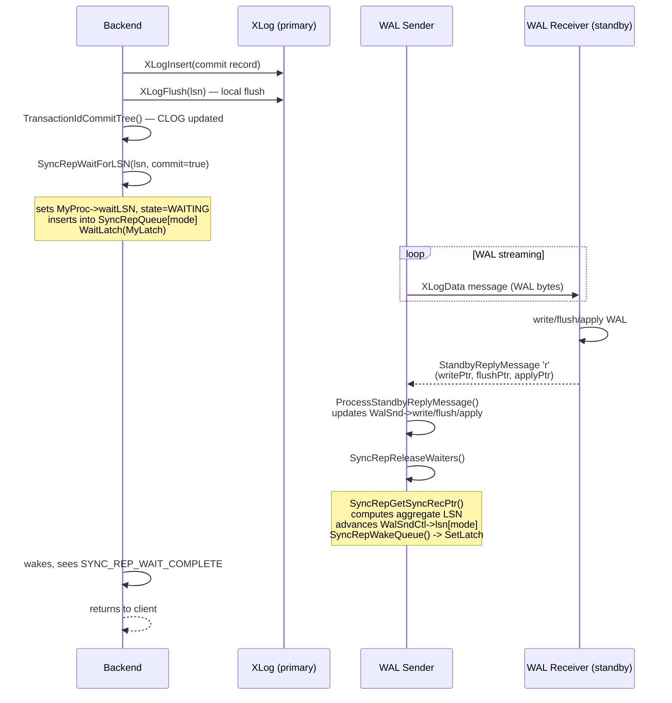
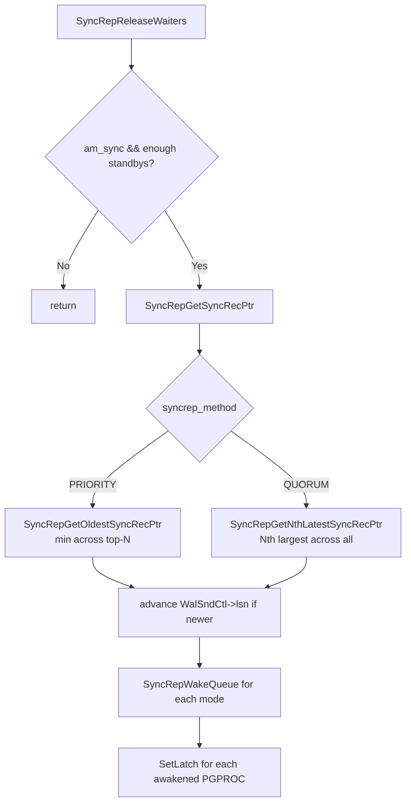

# Synchronous Replication

Synchronous replication (introduced in PostgreSQL 9.1, extended in 9.6 and 10.0) allows a committing backend to delay returning to the client until one or more standby servers have confirmed receipt of the transaction's WAL records at a configurable durability level. All coordination logic lives entirely on the primary. Standbys are unaware of per-transaction durability requirements, keeping standby code simple.

## synchronous_commit Levels

The `synchronous_commit` GUC controls when the primary considers the commit durable enough to acknowledge the client. Five levels are defined in `src/include/access/xact.h`:

| GUC value | Enum | Guarantee |
|---|---|---|
| `off` | `SYNCHRONOUS_COMMIT_OFF` | WAL written to kernel buffers, not flushed. Crash may lose recent commits. |
| `local` | `SYNCHRONOUS_COMMIT_LOCAL_FLUSH` | WAL flushed to primary's disk. No standby wait. |
| `remote_write` | `SYNCHRONOUS_COMMIT_REMOTE_WRITE` | Primary flushed + standby has written WAL to OS buffers (not necessarily fdisk'd). Survives primary crash, not standby OS crash. |
| `on` / `remote_flush` | `SYNCHRONOUS_COMMIT_REMOTE_FLUSH` | Primary flushed + standby has flushed WAL to disk. Default for "on". |
| `remote_apply` | `SYNCHRONOUS_COMMIT_REMOTE_APPLY` | Primary flushed + standby has flushed + applied WAL (changes visible to queries on the standby). |

The mapping to internal wait modes is performed in `assign_synchronous_commit()` in `syncrep.c`:

```c
case SYNCHRONOUS_COMMIT_REMOTE_WRITE:  SyncRepWaitMode = SYNC_REP_WAIT_WRITE;
case SYNCHRONOUS_COMMIT_REMOTE_FLUSH:  SyncRepWaitMode = SYNC_REP_WAIT_FLUSH;
case SYNCHRONOUS_COMMIT_REMOTE_APPLY:  SyncRepWaitMode = SYNC_REP_WAIT_APPLY;
default:                               SyncRepWaitMode = SYNC_REP_NO_WAIT;
```

`SyncRepRequested()` (macro in `syncrep.h`) returns true only when `synchronous_commit > SYNCHRONOUS_COMMIT_LOCAL_FLUSH`, meaning `local` and `off` fast-path out of all synchronous replication code.

PostgreSQL caps non-commit WAL records (e.g., from `PREPARE TRANSACTION`) at `SYNC_REP_WAIT_FLUSH`. It skips `remote_apply` for them, because only commit records generate apply-side feedback (`SyncRepWaitForLSN()`, line 188).

## synchronous_standby_names

`synchronous_standby_names` is parsed by a dedicated Bison/flex grammar (`syncrep_gram.y`, `syncrep_scanner.l`) into a flat `SyncRepConfigData` struct stored as the GUC's "extra" pointer.

### SyncRepConfigData

Defined in `src/include/replication/syncrep.h`:

```c
typedef struct SyncRepConfigData {
    int     config_size;     /* total byte size including member_names */
    int     num_sync;        /* N: number of standbys to wait for */
    uint8   syncrep_method;  /* SYNC_REP_PRIORITY (0) or SYNC_REP_QUORUM (1) */
    int     nmembers;        /* count of names in the list */
    char    member_names[FLEXIBLE_ARRAY_MEMBER]; /* nmembers NUL-terminated strings */
} SyncRepConfigData;
```

### Format Grammar

```
synchronous_standby_names =
    [ FIRST | ANY ] num_sync ( name [, ...] )
  | name [, ...]           -- shorthand for FIRST 1 (name, ...)
  | *                      -- wildcard: matches any application_name
```

### FIRST N vs ANY N Semantics

| Method | Constant | Behaviour |
|---|---|---|
| `FIRST N` | `SYNC_REP_PRIORITY` | Priority-based. Top-N standbys (by list position) must all acknowledge. Others are "potential" hot-standbys that auto-promote if a sync standby disconnects. |
| `ANY N` | `SYNC_REP_QUORUM` | Quorum-based. Any N standbys from the full list suffice. All candidates share the same priority = 1. |

Priority assignment (`SyncRepGetStandbyPriority()`): each WAL sender compares its `application_name` against the parsed member list in order. Its priority equals its 1-based list position for `FIRST`, or always 1 for `ANY`. A wildcard `*` matches any name. Cascading WAL senders always get priority 0 (ineligible).

## Commit Pipeline



Key invariant from `xact.c` line 1524–1525: the backend calls `SyncRepWaitForLSN()` **after** the local flush and [[subsystems/storage/clog|CLOG]] update, so the transaction is durable on the primary before the standby wait begins. The client never receives an acknowledgement for a transaction that is not locally committed.

## SyncRepWaitForLSN: The Waiting Backend

`SyncRepWaitForLSN(XLogRecPtr lsn, bool commit)` in `syncrep.c`:

1. **Fast exit**: if `!SyncRepRequested()` or `SYNC_STANDBY_DEFINED` flag not set in `WalSndCtl->sync_standbys_status`, return immediately.
2. **Lock**: acquire `SyncRepLock` ([[subsystems/locking/lwlocks|LWLock]], exclusive).
3. **Already satisfied?**: if `lsn <= WalSndCtl->lsn[mode]`, the standby has already passed this point; return without waiting.
4. **Enqueue**: set `MyProc->waitLSN = lsn`, `MyProc->syncRepState = SYNC_REP_WAITING`, call `SyncRepQueueInsert(mode)`.
5. **Release lock** and enter latch wait loop.
6. **Latch loop**: `WaitLatch(MyLatch, WL_LATCH_SET | WL_POSTMASTER_DEATH, -1, WAIT_EVENT_SYNC_REP)`. Woken by WAL sender via `SetLatch(&proc->procLatch)`. Exits when `syncRepState == SYNC_REP_WAIT_COMPLETE` or on `ProcDiePending` / `QueryCancelPending` / postmaster death (all emit a `WARNING` rather than `ERROR` because the transaction is already locally committed).
7. **Cleanup**: reset `syncRepState = SYNC_REP_NOT_WAITING`, `waitLSN = 0`.

### PGPROC Sync Rep Fields

Defined in `src/include/storage/proc.h`:

| Field | Type | Purpose |
|---|---|---|
| `waitLSN` | `XLogRecPtr` | LSN this backend is waiting for; `InvalidXLogRecPtr` when not waiting. Written only by owner process. |
| `syncRepState` | `int` | `SYNC_REP_NOT_WAITING` / `SYNC_REP_WAITING` / `SYNC_REP_WAIT_COMPLETE`. Read by WAL sender, written by both. |
| `syncRepLinks` | `dlist_node` | Intrusive list link; held in `SyncRepQueue[mode]` while waiting. Protected by `SyncRepLock`. |

### SyncRepQueue

`WalSndCtl->SyncRepQueue[NUM_SYNC_REP_WAIT_MODE]` holds three `dlist_head` lists, one per wait mode (write=0, flush=1, apply=2). Entries are kept **sorted by ascending `waitLSN`** — `SyncRepQueueInsert()` walks from the tail backwards to find the insertion point. This ordering allows `SyncRepWakeQueue()` to stop as soon as it encounters a `waitLSN` that exceeds the current acknowledged LSN, avoiding a full scan.

## WalSndCtlData: Shared Memory Control Structure

```
WalSndCtl (WalSndCtlData)
├── SyncRepQueue[0..2]       — dlist_head per wait mode (SyncRepLock)
├── lsn[0..2]                — highest acknowledged LSN per mode (SyncRepLock)
├── sync_standbys_status     — bitmask: SYNC_STANDBY_INIT | SYNC_STANDBY_DEFINED
├── wal_flush_cv             — ConditionVariable for physical walsenders
├── wal_replay_cv            — ConditionVariable for logical walsenders
└── walsnds[]                — per-walsender WalSnd structs (spinlock-protected)
```

`sync_standbys_status` flags (from `walsender_private.h`):

| Flag | Bit | Meaning |
|---|---|---|
| `SYNC_STANDBY_INIT` | `1 << 0` | Checkpointer has initialized the status from the GUC at least once. |
| `SYNC_STANDBY_DEFINED` | `1 << 1` | `synchronous_standby_names` is currently non-empty. |

The checkpointer (not backends) updates this flag via `SyncRepUpdateSyncStandbysDefined()`, preventing a race where a backend reads the GUC directly while config reload is in progress. When `SYNC_STANDBY_DEFINED` is cleared, this wakes all queue members unconditionally.

## WAL Sender: Receiving Replies and Releasing Waiters

### StandbyReplyMessage Wire Format

The walreceiver sends message type `'r'` (`walreceiver.c` line 1136):

| Offset | Type | Field | Meaning |
|---|---|---|---|
| 0 | `int64` | `writePtr` | LSN written to standby's OS write buffer. |
| 8 | `int64` | `flushPtr` | LSN flushed to standby's disk (fdatasync'd). |
| 16 | `int64` | `applyPtr` | LSN applied (replayed) on standby. |
| 24 | `int64` | `replyTime` | Standby's current timestamp. |
| 32 | `byte` | `replyRequested` | Non-zero if standby wants a keepalive reply. |

`ProcessStandbyReplyMessage()` in `walsender.c` decodes this message and updates `MyWalSnd->write`, `->flush`, `->apply` under the walsender spinlock, then immediately calls `SyncRepReleaseWaiters()`.

### Releasing waiters once acknowledgment thresholds are met

Called by every WAL sender after processing a standby reply (non-cascading senders only) (`SyncRepReleaseWaiters()`, `syncrep.c`). The logic:

1. Fast exit if `sync_standby_priority == 0` (not in sync list) or walsender not in `STREAMING`/`STOPPING` state.
2. Acquire `SyncRepLock` exclusive.
3. Call `SyncRepGetSyncRecPtr()` to compute the aggregate acknowledged positions across all eligible sync standbys, and check whether this sender is itself among the sync set (`am_sync`).
4. If `!am_sync` or insufficient standbys, release lock and return.
5. For each mode where the new aggregate LSN exceeds `WalSndCtl->lsn[mode]`, update the shared value and call `SyncRepWakeQueue(false, mode)`.
6. Release lock.

### Aggregate LSN Computation

`SyncRepGetSyncRecPtr()` calls `SyncRepGetCandidateStandbys()` to collect all active, eligible walsenders into a `SyncRepStandbyData[]` array (spinlock-protected reads from each `WalSnd`).

Then, depending on `syncrep_method`:

- **FIRST N (priority)**: `SyncRepGetOldestSyncRecPtr()` — takes the minimum (oldest) write/flush/apply across the top-N standbys. Every one of them must have reached that point.
- **ANY N (quorum)**: `SyncRepGetNthLatestSyncRecPtr()` — sorts each LSN array descending, picks the Nth element. This is the highest LSN that at least N standbys have reached.



## Quorum Commit (ANY N) in Detail

`ANY N (s1, s2, ..., sM)` requires M >= N connected standbys. All are assigned the same priority = 1. `SyncRepGetCandidateStandbys()` returns all M in quorum mode (no truncation to N). `SyncRepGetNthLatestSyncRecPtr()` then picks the Nth-largest LSN from the sorted array:

```
standbys sorted by flush_lsn descending: [L1, L2, ..., LM]
quorum_flush_lsn = L[N-1]   (0-indexed: the Nth largest)
```

`SyncRepWakeQueue()` releases a commit waiter as soon as `quorum_flush_lsn >= waitLSN`, meaning at least N standbys have flushed past the transaction's commit LSN. The N standbys that contribute are not fixed — they can vary per reply round.

In `pg_stat_replication`, quorum standbys always appear as `sync_state = 'quorum'` rather than alternating between `sync` and `potential`, because membership in the quorum is instantaneous and per-LSN (see `walsender.c` line 3724).

## Group Commit Behaviour

Multiple backends can enqueue simultaneously for the same or different LSNs. `SyncRepWakeQueue()` iterates the sorted queue and calls `SetLatch()` on every `PGPROC` whose `waitLSN <= WalSndCtl->lsn[mode]`. `SyncRepWakeQueue()` releases all transactions waiting for LSNs that have already been acknowledged in a single pass, without any intervening I/O. This means a burst of concurrent commits shares the replication round-trip latency rather than serialising it.

## Failover and synchronous_commit=local

If all synchronous standbys disconnect, `SyncRepGetSyncRecPtr()` returns false (insufficient standbys), and `SyncRepReleaseWaiters()` exits without waking any waiter. The committing backend sleeps indefinitely on its latch.

Operators have two immediate remedies:

1. **Set `synchronous_commit = local`** (or `off`) for the affected session or globally — `SyncRepWaitMode` becomes `SYNC_REP_NO_WAIT`, bypassing the queue entirely on the next commit.
2. **Reset `synchronous_standby_names = ''`** — the checkpointer detects the change, sets `SYNC_STANDBY_DEFINED = 0`, and calls `SyncRepWakeQueue(true, i)` for all modes, releasing all waiters immediately (`SyncRepUpdateSyncStandbysDefined()`, line 984–989).

Both actions are hot-reloadable (`SIGHUP` / `ALTER SYSTEM`).

Note that `synchronous_commit = local` still flushes WAL locally (mode `SYNCHRONOUS_COMMIT_LOCAL_FLUSH`) and still commits CLOG. It merely skips the standby wait (`SyncRepRequested()` returns false).

## pg_stat_replication

The `pg_stat_replication` view is populated by `walsender.c` from each `WalSnd` entry:

| Column | Source field | Notes |
|---|---|---|
| `sent_lsn` | `WalSnd.sentPtr` | Last LSN the walsender transmitted. |
| `write_lsn` | `WalSnd.write` | From standby reply: written to OS buffer. |
| `flush_lsn` | `WalSnd.flush` | From standby reply: flushed to disk. |
| `replay_lsn` | `WalSnd.apply` | From standby reply: applied/replayed. |
| `write_lag` | `WalSnd.writeLag` | Round-trip time to write acknowledgement. |
| `flush_lag` | `WalSnd.flushLag` | Round-trip time to flush acknowledgement. |
| `replay_lag` | `WalSnd.applyLag` | Round-trip time to apply acknowledgement. |
| `sync_priority` | `WalSnd.sync_standby_priority` | List position (FIRST) or 1 (ANY) or 0 (async). |
| `sync_state` | computed | `async` / `sync` / `potential` / `quorum` |

`sync_state` rules (from `walsender.c` lines 3726–3732):

| `sync_standby_priority` | `is_sync_standby` | `syncrep_method` | `sync_state` |
|---|---|---|---|
| 0 | — | — | `async` |
| >0 | true | `PRIORITY` | `sync` |
| >0 | true | `QUORUM` | `quorum` |
| >0 | false | `PRIORITY` | `potential` |

`SyncRepGetCandidateStandbys()` determines `is_sync_standby` by marking the top-N priority standbys as sync. Others are potential. In quorum mode, `SyncRepGetCandidateStandbys()` returns all eligible standbys as candidates, so all report `quorum`.

## Key Locking Summary

| Lock | Type | Held by | Protects |
|---|---|---|---|
| `SyncRepLock` (LWLock) | Exclusive | Committing backend during enqueue; WAL sender during release | `SyncRepQueue[]`, `WalSndCtl->lsn[]`, `sync_standbys_status` |
| `WalSnd->mutex` (spinlock) | Brief spin | WAL sender (write) + any reader | `WalSnd.write/flush/apply/state/sync_standby_priority` |

The latch mechanism (`WaitLatch` / `SetLatch`) provides the cross-process wake-up without requiring `SyncRepLock` to be held during the sleep.

## See also

- [[subsystems/replication/streaming]]
- [[subsystems/wal/overview]]
- [[subsystems/transactions/two-phase-commit]]
- [[subsystems/replication/hot-standby]]
- [[subsystems/replication/slots]]
