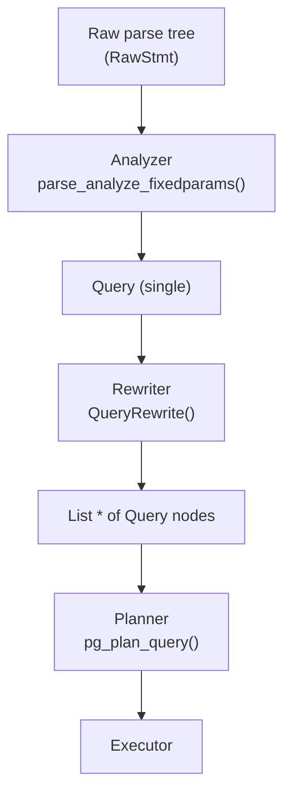
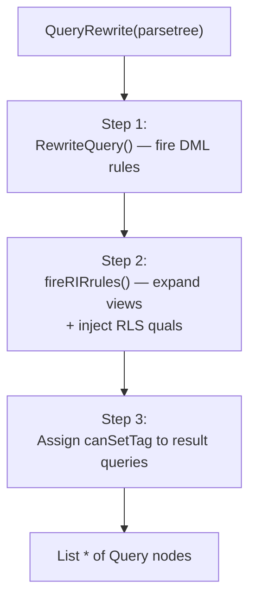
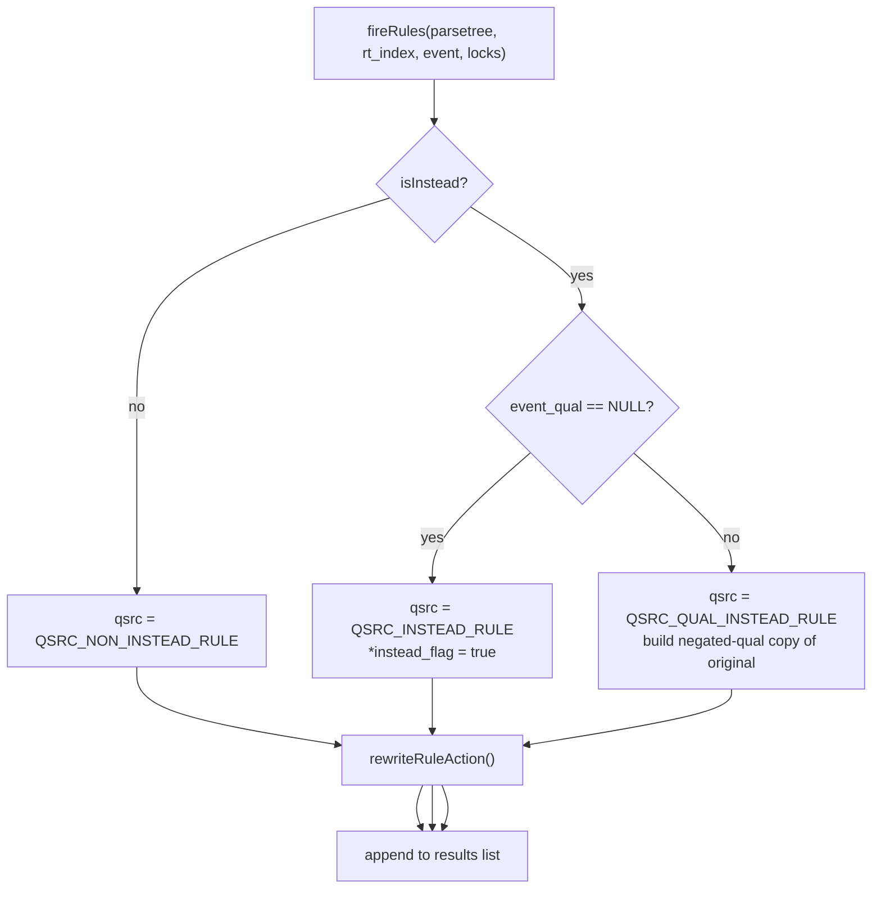
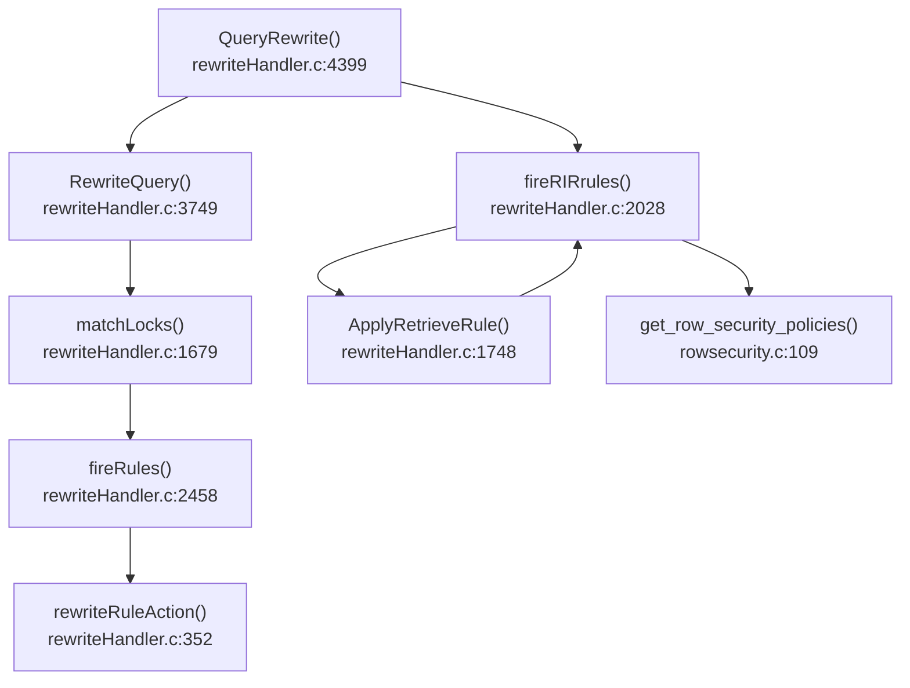

# Query Rewriter Overview

The query rewriter is the third stage of the PostgreSQL query pipeline, sitting between the semantic analyzer and the planner. It receives a single `Query` node that the analyzer has validated and resolved. It returns a `List *` of zero or more `Query` nodes that the planner will process. Under normal circumstances the list contains exactly one query. Rules and views can expand it into many.

## Position in the pipeline



The rewriter is invoked from `exec_simple_query()` and from the extended-query protocol via `pg_plan_queries()`. See [[code-paths/simple-select]] for the full call chain.

The rewriter performs **only structural transformations**: it substitutes rule bodies, injects view definitions, and appends row-security qualifiers. It performs no cost estimation, no access-path selection, and makes no decisions about join ordering. Those are entirely the planner's domain (see [[subsystems/planner/overview]]).

## The `pg_rewrite` catalog

Every rule — including the hidden rules that implement views — is stored as a row in `pg_rewrite` (`src/include/catalog/pg_rewrite.h`, OID 2618).

| Column | Type | Meaning |
|---|---|---|
| `oid` | `Oid` | Unique rule OID |
| `rulename` | `name` | Rule name; views use the reserved name `_RETURN` |
| `ev_class` | `Oid` | OID of the relation the rule is attached to (FK → `pg_class`) |
| `ev_type` | `char` | Event: `'1'`=SELECT, `'2'`=UPDATE, `'3'`=DELETE, `'4'`=INSERT |
| `ev_enabled` | `char` | Firing mode: `'O'`=on-origin, `'A'`=always, `'R'`=on-replica, `'D'`=disabled |
| `is_instead` | `bool` | `true` → INSTEAD rule, `false` → DO ALSO rule |
| `ev_qual` | `pg_node_tree` | Rule condition (serialised `Node *`); `<>` means unconditional |
| `ev_action` | `pg_node_tree` | Serialised list of rule-action `Query` nodes |

The constants `RULE_FIRES_ON_ORIGIN`, `RULE_FIRES_ALWAYS`, `RULE_FIRES_ON_REPLICA`, and `RULE_DISABLED` are defined in `src/include/rewrite/rewriteDefine.h`.

PostgreSQL applies the encoding `ev_type = evtype + '0'` when inserting a rule (`rewriteDefine.c:86`), so the stored value is the ASCII digit corresponding to the `CmdType` integer.

The relcache keeps a pre-parsed `RuleLock` structure for every relation, so the rewriter never re-parses `ev_action` at query time.

## Views as rules

PostgreSQL does not have a native view-scan operator. PostgreSQL physically represents a view as a regular dummy table (relkind `v`) with a single ON SELECT INSTEAD rule stored in `pg_rewrite`.

### How a view is created

When a view is created, the system parses its SELECT statement into a `Query`, creates a dummy relation via `DefineVirtualRelation()`, and registers a single ON SELECT INSTEAD rule named `_RETURN` against it (`DefineView()` and `DefineViewRules()`, `src/backend/commands/view.c`):

```c
DefineQueryRewrite(pstrdup(ViewSelectRuleName),  /* "_RETURN" */
                   viewOid,
                   NULL,          /* unconditional */
                   CMD_SELECT,
                   true,          /* isInstead */
                   replace,
                   list_make1(viewParse));
```

`ViewSelectRuleName` is the macro `"_RETURN"` (`src/include/rewrite/rewriteSupport.h:18`). The system enforces that a relation can have at most one `_RETURN` rule. It also enforces that any ON SELECT rule on a view must be named `_RETURN`.

### View expansion at rewrite time

The planner never sees a reference to a view relation directly. During the second phase of rewriting, the rewriter inspects each range table entry. It converts any `RTE_RELATION` entry that refers to a view (relkind `v`) in-place into an `RTE_SUBQUERY` pointing at the body of the relation's `_RETURN` rule. It performs this splice by taking a deep copy of the cached rule action, acquiring any necessary locks, and then recursively expanding any views that appear inside that rule body, before weaving it in (`ApplyRetrieveRule()` inside `fireRIRrules()`, `rewriteHandler.c`). The recursive expansion handles views on top of views layer by layer.

### Protection against circular view definitions

Because view expansion is recursive, the rewriter must detect circular view definitions before the stack overflows. It maintains a list of relation OIDs whose `_RETURN` rules are currently being expanded — the `activeRIRs` list — throughout the traversal. If the same OID appears twice, expansion raises:

```
ERROR: infinite recursion detected in rules for relation "..."
```

(`rewriteHandler.c:2168`)

## How rewriting is structured

The sole public entry point is `QueryRewrite()` (`rewriteHandler.c:4399`, declared in `src/include/rewrite/rewriteHandler.h`). Internally it organises work into three sequential phases:



The first phase handles INSERT/UPDATE/DELETE rules and may produce multiple product queries. The second phase expands view references and injects row-level security qualifiers into every query in the result list. The final step decides which query in the result list gets to set the command-result tag (important for row-count reporting): if the original query survived (no unconditional INSTEAD rule consumed it), it sets the tag; otherwise, the rewriter assigns `canSetTag = true` to the last unconditional INSTEAD query of matching command type.

## DML rule matching and firing

### Selecting which rules apply

Not every rule attached to a relation fires on every statement. Before applying any rule body, `matchLocks()` (`rewriteHandler.c`) determines the set of applicable rules by filtering the relation's `RuleLock` array against the command's event type. `matchLocks()` always applies ON SELECT rules. For other event types, the `ev_enabled` field and the current `SessionReplicationRole` together control which rules fire:

- In REPLICA role, `RULE_FIRES_ON_ORIGIN` (`'O'`) and `RULE_DISABLED` (`'D'`) rules are skipped.
- In ORIGIN or LOCAL role, `RULE_FIRES_ON_REPLICA` (`'R'`) and `RULE_DISABLED` (`'D'`) rules are skipped.

### Building the product query list

Each applicable rule produces one or more product queries that collectively replace or augment the original statement. INSTEAD rules replace the triggering query; DO ALSO rules append new queries alongside it. A **qualified INSTEAD** rule (one with a condition) requires slightly more work: the rewriter also keeps the original query, but appends the negated rule qualification to it — this residual query handles only the rows the INSTEAD rule did not claim. When multiple qualified INSTEAD rules are present, `CopyAndAddInvertedQual()` (`rewriteHandler.c`) ANDs their negated quals together into a single residual query. The overall logic is captured in `fireRules()` (`rewriteHandler.c`):



For non-SELECT commands, `RewriteQuery()` (`rewriteHandler.c`) rewrites the targetlist at this stage to fill defaults and handle generated columns before rule matching occurs. It also recursively processes any product queries through the same rule-firing machinery, tracking which `(relation, command)` pairs are in progress in a `rewrite_events` list to detect loops.

## Splicing a rule body into the triggering query

Merging a rule action into the context of the query that triggered it requires careful renaming to avoid Var-number collisions. `OffsetVarNodes()` (`rewriteManip.c`) shifts all Var references in the rule action by the number of RTEs already present in the triggering query, so they continue to point at the rule body's own range table entries after both tables are merged. `ChangeVarNodes()` (`rewriteManip.c`) then redirects OLD references in the rule body to point at the triggering query's result relation.

Once Var numbers are adjusted, `rewriteRuleAction()` (`rewriteHandler.c`) prepends the triggering query's range table to the rule action's range table and combines their join trees. If the rule is conditional, it appends the rule's qualification to the combined `WHERE` clause. It also preserves permission-check information from the triggering query in the merged tree, so that the executor still verifies the caller's access rights on the original relation. This holds even when that relation's RTE no longer appears directly in the final query tree.

The result is a self-contained `Query` node that the planner can process without any knowledge that a rule was involved.

## DO INSTEAD vs DO ALSO

### DO INSTEAD

An INSTEAD rule completely replaces the triggering query. PostgreSQL discards the triggering query (unless the rule has a condition — see qualified INSTEAD above). Updatable-view rewrites use an unconditional ON INSERT/UPDATE/DELETE DO INSTEAD rule.

`fireRules()` sets `*instead_flag` to `true` for unqualified INSTEAD rules. `RewriteQuery()` uses this flag to decide whether to include the original query in its output:

```c
/* rewriteHandler.c:4283 */
if (!instead)
    rewritten = lcons(parsetree, rewritten);
```

### DO ALSO

A DO ALSO (non-INSTEAD) rule appends additional queries to the execution list without removing the original. The original query runs. The extra queries run alongside it. This is the mechanism used for audit-logging rules, where you want a write to the real table **and** an insert into a log table:

```sql
CREATE RULE log_orders AS ON INSERT TO orders
    DO ALSO INSERT INTO order_log VALUES (NEW.id, now());
```

The extra query gets `querySource = QSRC_NON_INSTEAD_RULE` and `canSetTag = false`.

The table below shows how the two modes compare:

| Mode | `is_instead` | Original query | Product queries |
|---|---|---|---|
| DO ALSO | `false` | executed | appended, also executed |
| DO INSTEAD (unconditional) | `true`, `ev_qual IS NULL` | discarded | replace the original |
| DO INSTEAD (conditional) | `true`, `ev_qual IS NOT NULL` | runs with negated qual | run with rule qual |

## Row-level security

The rewriter injects row-level security (RLS) at the end of the view-expansion phase, after all view expansions are complete. For each `RTE_RELATION` entry that refers to a normal table or partitioned table, `get_row_security_policies()` (`src/backend/rewrite/rowsecurity.c`) gathers the applicable RLS policies and weaves them into the query tree.

### When RLS applies

Before fetching any policy, `check_enable_rls()` (`src/backend/utils/misc/rls.c`) determines whether RLS is actually active for the relation and the current user:

- `check_enable_rls()` returns `RLS_NONE` if the table has no `relrowsecurity` flag, or if the relation is a system catalog.
- It returns `RLS_NONE_ENV` if the current user has the `BYPASSRLS` privilege (or is a superuser) **and** `relforcerowsecurity` is not set. The query is still marked `hasRowSecurity = true` so the plan cache is invalidated if the role changes.
- It returns `RLS_ENABLED` if RLS is active for this query.

The `row_security` GUC (`src/include/utils/rls.h:17`) does **not** bypass RLS for normal users. It only controls whether a non-superuser who has `SET SESSION AUTHORIZATION` can pretend to bypass RLS. It primarily affects `pg_dump`.

### Policy lookup and qual construction

The rewriter separates applicable policies into two lists: *permissive* (combined with OR) and *restrictive* (combined with AND on top of the permissive result). The command type governs which policies apply:

- For `CMD_SELECT` (and non-result-relation RTEs in any query): SELECT USING policies.
- For `CMD_UPDATE`/`CMD_DELETE`: UPDATE/DELETE USING policies + optionally SELECT USING policies when `ACL_SELECT` is required.
- For `CMD_INSERT`/`CMD_UPDATE`: WITH CHECK expressions are generated in addition to USING quals.

### Injecting policies into the query tree

The rewriter places the resulting quals deliberately close to their source relation rather than at the top-level WHERE clause. It prepends USING quals to `rte->securityQuals`, while WITH CHECK expressions go into `parsetree->withCheckOptions` for the executor to enforce after each modified row. Placing quals on the RTE rather than the top-level `WHERE` causes the planner to treat them as security barriers: the planner does not push them below joins and cannot inline them in ways that would expose data.

If the new quals contain sublinks (e.g., a policy that does a sub-`SELECT`), the same `activeRIRs` recursion-detection mechanism used for views prevents infinite loops (`rewriteHandler.c:2270`).

## Infinite loop prevention

Two separate mechanisms exist, one for each phase.

### DML-rule loops

The danger in DML rules is a rule that triggers itself — an INSERT rule that fires on the table it also inserts into, for example. `RewriteQuery()` guards against this by carrying a `rewrite_events` list (type `List *` of `rewrite_event` structs, `rewriteHandler.c:51`). Each entry records the `(relation OID, CmdType)` pair of a currently-in-progress rule expansion. Before recursing into product queries, `RewriteQuery()` scans the list and raises an error if the same pair is already present (`rewriteHandler.c:4175`).

### View and RLS loops

The rewriter catches circular view definitions through the `activeRIRs` list of `Oid` values, threaded through view expansion. Before expanding a view's `_RETURN` rule, it checks the relation's OID against the list and raises an error if found. It appends the OID before the recursive call and removes it after (`list_delete_last()`).

```c
/* rewriteHandler.c:2165-2183 */
if (list_member_oid(activeRIRs, RelationGetRelid(rel)))
    ereport(ERROR, ...);
activeRIRs = lappend_oid(activeRIRs, RelationGetRelid(rel));
/* ... expand the rule ... */
activeRIRs = list_delete_last(activeRIRs);
```

The rewriter re-uses the same `activeRIRs` list for RLS sublink recursion detection (`rewriteHandler.c:2270`).

## What the rewriter does not do

The rewriter is a purely structural pass. It does **not**:

- Estimate row counts or compute costs.
- Choose access paths (sequential scans, index scans, hash joins, etc.).
- Decide join order.
- Evaluate constant expressions.
- Apply constraint exclusion or partition pruning.
- Check authorization beyond noting which tables need permission checks.

All of those responsibilities belong to the planner (see [[subsystems/planner/overview]]).

## Key data structures

| Name | Location | Role |
|---|---|---|
| `Query` | `src/include/nodes/parsenodes.h` | Single parsed-and-rewritten query node |
| `RangeTblEntry` | `src/include/nodes/parsenodes.h` | One FROM-clause item; kind changes from `RTE_RELATION` to `RTE_SUBQUERY` when a view is expanded |
| `RuleLock` | `src/include/utils/relcache.h` | Relcache structure holding all rules for a relation |
| `RewriteRule` | `src/include/rewrite/prs2lock.h` | In-memory decoded form of one `pg_rewrite` row |
| `rewrite_event` | `rewriteHandler.c:51` | Stack frame for DML-rule recursion detection |
| `QuerySource` | `src/include/nodes/parsenodes.h:41` | Enum tagging each output query as `QSRC_ORIGINAL`, `QSRC_INSTEAD_RULE`, `QSRC_QUAL_INSTEAD_RULE`, or `QSRC_NON_INSTEAD_RULE` |

## Call graph



## Related Topics

- [[subsystems/rewriter/rules-vs-triggers|Rules vs Triggers]] — contrasts the rewriter's rule system with trigger-based approaches for the same DML interception patterns.
- [[subsystems/rewriter/updatable-views|Updatable Views]] — covers how auto-updatable views generate their INSTEAD rules and when manual `INSTEAD OF` triggers are required.
- [[subsystems/rewriter/rewriter-utilities|Rewriter Utilities]] — documents the low-level helper functions (`OffsetVarNodes`, `ChangeVarNodes`, `CopyAndAddInvertedQual`) used when splicing rule bodies into query trees.
- [[subsystems/parser/overview|Parser Overview]] — describes the semantic-analysis phase that produces the single `Query` node the rewriter receives as input.
- [[subsystems/planner/overview|Planner Overview]] — explains the planning phase that consumes the rewriter's output list of `Query` nodes.
- [[subsystems/row-level-security|Row-Level Security]] — higher-level view of RLS policy creation and management that the rewriter enforces structurally via `securityQuals`.
- [[subsystems/catalog/relcache|Relcache]] — explains the `RuleLock` cache that the rewriter reads at query time to avoid re-parsing rule actions from `pg_rewrite`.
