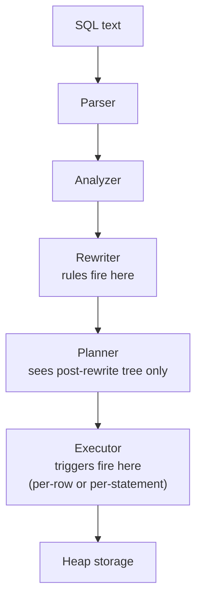

# Rules vs Triggers

Rules and triggers both attach automatic behavior to a relation, but they
operate at entirely different points in the query lifecycle. The choice between
them is not a style preference — it determines what the planner sees, when the
logic runs, and how errors propagate.

## Where Each Mechanism Lives in the Pipeline

The rule system runs during the rewrite phase, between semantic analysis and
planning. `QueryRewrite()` in `rewriteHandler.c` transforms the incoming
`Query` node before any plan is generated. By the time the planner runs, a rule
may have completely replaced the original query tree — the relation the user
wrote may not appear in the plan at all.

Triggers run during execution, deep inside `nodeModifyTable.c`, interleaved
with the actual heap writes. The planner sees none of this. It produces a plan
as if no triggers exist. The executor calls into `trigger.c` at defined points
— before or after each row, or before or after each statement. The executor
determines at runtime, not at plan time, whether a trigger fires at all, by
consulting `TriggerDesc` cached on the relation's `ResultRelInfo`.

This placement is the fundamental distinction. Performance characteristics,
error behavior, `EXPLAIN` visibility, and support for multiple output queries
all follow from it.

## Query Transformation vs Row-Level Invocation

A rule transforms the query tree. It can produce multiple product queries from
a single input statement. A `DO ALSO` rule appends additional queries to the
execution list. The original runs, and so do the extras. A `DO INSTEAD` rule
discards the original and substitutes a different one. A single `INSERT`
statement can produce an `INSERT` into the real table, an `INSERT` into an
audit log table, and a `NOTIFY` call — all from one rule. The planner receives
each product query as a separate unit and plans them independently. The result
list coming out of `QueryRewrite()` is a `List *` of `Query` nodes, each of
which gets its own call to `pg_plan_query()` and then its own executor run.

A trigger cannot produce multiple queries from one statement. It is a callback
invoked by the executor at a fixed point, receiving a single row context
(`TriggerData` in `trigger.h`) or a statement-level signal. It can execute
arbitrary SQL through SPI, but from the executor's perspective it is still one
trigger invocation per row (or per statement), not a query split. Whatever the
trigger does is contained within its own execution context.

## What the Planner Sees

Because rules rewrite the query before planning, the planner works entirely on
the post-rewrite tree. If an unconditional `DO INSTEAD` rule redirects an
`INSERT` into a different table, the planner never knows the original target
existed. It plans the rewritten query using actual statistics for the tables
named in that query. The access paths, join order, and cost estimates are all
for the rewritten form.

This has a subtle consequence: if a rule routes writes from a logical table to a
set of physical tables (a hand-rolled partition scheme built before declarative
partitioning existed), the planner can optimize each product query against the
physical tables. But it also means any `EXPLAIN` output describes the rewritten
query, not the query the user wrote. The connection between what was typed and
what was planned can be invisible without `EXPLAIN VERBOSE` and careful reading.
A query that touches a view will show a plan against the base tables with no
indication that the view name was ever involved.

Triggers are completely invisible to the planner. The planner generates the plan as if
no triggers are registered. `EXPLAIN ANALYZE` reports trigger invocation time as
a separate `Trigger` annotation in the output, making it easy to see which
triggers fired and how long they took. Plain `EXPLAIN` shows nothing
trigger-related at all — the plan looks identical whether triggers are present
or absent. Trigger costs are always visible in `EXPLAIN ANALYZE`, while
rule-expansion costs are folded into the plan for the rewritten query and can
only be attributed by comparing execution with and without the rule.

## Granularity: Whole Query vs Individual Rows

The rewriter applies a rule once to the query tree, regardless of how many rows the
statement will ultimately touch. A `DO ALSO` rule that appends an audit-log
insert produces exactly one additional product query — a single `INSERT` into
the audit log — which the executor runs as its own statement. The number of rows
in the original statement does not affect how many product queries are produced.
This makes rules an attractive choice when you need a side-effect that does not
require per-row data: the overhead is constant per statement.

A row-level trigger fires once per affected row. For a bulk `INSERT` of 100,000
rows, the executor invokes a `BEFORE ROW` trigger 100,000 times, each time passing the
current row as a `HeapTuple`. The per-invocation overhead — function call setup,
[[subsystems/memory/contexts|memory context]] management, SPI if the trigger executes SQL — accumulates with
row count in a way that rule overhead does not. Statement-level triggers
(`FOR EACH STATEMENT`) provide an intermediate option: they fire once regardless
of row count but can only access transition tables (captured tuplestores built
up during the row loop), not individual rows directly.

## Error Handling and Partial State

A `DO ALSO` rule appends product queries that run as separate statements within
the same transaction. If the third product query fails, the earlier ones have
already executed. The transaction will roll back entirely — PostgreSQL is fully
transactional — but the failure point is mid-way through a set of logically
related writes. Error reporting attributes the failure to one of the product
queries, which may look different from the original user-issued statement.

A trigger that raises an error rolls back the triggering row's work and unwinds
to the calling executor context. If the trigger aborts the statement, no rows
from that statement have been permanently committed to the heap. The rollback is
clean at the statement level. Deferred constraint triggers and foreign key
enforcement rely on this: a trigger firing at commit time that raises an error
causes the entire transaction to roll back cleanly.

## View Updateability

The most practically significant divergence is how PostgreSQL implements
updatable views.

Before INSTEAD OF triggers were added (PostgreSQL 9.1), the only way to make a
view accept `INSERT`, `UPDATE`, or `DELETE` was to write `ON INSERT DO INSTEAD`,
`ON UPDATE DO INSTEAD`, and `ON DELETE DO INSTEAD` rules that redirected each
operation to the underlying table(s). This works, but the rewriter merges the
rule body into the triggering query. This means the plan for an `INSERT`
through an updatable view is not simply "insert into the base table" but a
fully rewritten query tree that may be hard to read. Debugging such queries
requires understanding both the original statement and the rule body together.

PostgreSQL 9.3 also introduced automatic simple-view updateability for views
meeting certain structural criteria (no aggregation, no DISTINCT, single base
table, etc.). For more complex views, INSTEAD OF triggers are simpler. They fire
on the view relation at the point where the executor would otherwise fail
(because a view has no heap to write). The trigger function receives the row
being written and can do whatever is needed: insert into the base table, validate
conditions, update multiple tables. The plan for the outer query is
straightforward. The complexity lives inside the trigger function, where it can be
tested in isolation and where `EXPLAIN ANALYZE` reports its execution time.

For new code, INSTEAD OF triggers are the recommended approach for views that
cannot be made automatically updatable. Rules remain appropriate only when the
transformation must happen at the query-tree level.

## Replication Role

Both rules and triggers have a column controlling behavior under
`session_replication_role` — `ev_enabled` in `pg_rewrite`, `tgenabled` in
`pg_trigger`. A rule or trigger set to `FIRES_ON_ORIGIN` (the default) does not
fire on a replica; `FIRES_ON_REPLICA` fires only on replicas; `FIRES_ALWAYS`
fires everywhere.

Operators commonly disable triggers on logical replication subscribers to avoid
double-applying logic that already ran on the origin. Rules on subscriber-side
relations behave identically under this setting. But because rules transform the
query tree before execution, disabling a view's `_RETURN` rule makes the view
inaccessible, not just passive. Disabling a trigger leaves the relation readable
and writable. The trigger simply does not fire. This asymmetry means
replication-role gating is more practical for triggers than for rules.

## When Rules Are Still the Right Tool

Rules remain useful in a narrow set of scenarios:

- **Query routing in legacy schemas.** Pre-partitioning systems often routed
  writes to physical tables via rules. Replacing the rules with per-row triggers
  would add invocation overhead without improving behavior; a proper migration
  to native declarative partitioning is the right long-term path.
- **Audit logging with constant overhead.** A `DO ALSO` rule appends one
  additional planned statement per triggering statement regardless of row count.
  A row-level trigger doing the same fires once per row, which matters for large
  bulk operations.
- **Blocking operations at zero cost.** An unconditional `DO INSTEAD NOTHING`
  rule on `DELETE` makes a table append-only with no per-row invocation cost.
- **Conditional query redirection.** A qualified INSTEAD rule applies only for
  rows matching its condition, falling back to the original query for the rest.
  Triggers cannot split a query this way.

For everything else — referential integrity, row validation, cross-table writes
driven by individual row values — triggers are the appropriate tool. They are
simpler to reason about, easier to test, and their costs are visible in
`EXPLAIN ANALYZE`.

## Comparison by Dimension

| Dimension | Rules | Triggers |
|---|---|---|
| **Execution phase** | Rewrite (before planning) | Execution (during heap write) |
| **Planner visibility** | Planner sees only the rewritten query | Planner sees no trigger logic |
| **Can produce multiple queries** | Yes (`DO ALSO`, multiple `DO INSTEAD`) | No |
| **Granularity** | Whole query tree, once | Per row or per statement |
| **Applies to views** | ON SELECT (view definition), ON INSERT/UPDATE/DELETE | INSTEAD OF (on views only) |
| **Error isolation** | Failure mid-product-query; transaction rolls back, but failure point is mid-sequence | Clean rollback at row or statement boundary |
| **EXPLAIN visibility** | Rewritten query tree visible; no rule annotation | `EXPLAIN ANALYZE` shows trigger timing |
| **Overhead model** | Fixed per statement (one rewrite) | Scales with row count for row-level triggers |
| **Recommended for view updateability** | Legacy approach | Yes (INSTEAD OF) |
| **Superseded by** | Native partitioning, INSTEAD OF triggers | Still primary mechanism for row-level logic |

## Related Topics

- [[subsystems/rewriter/overview|Rewriter Overview]] — Covers `QueryRewrite()` internals, rule qualification, and how product query lists are assembled before planning.
- [[subsystems/rewriter/updatable-views|Updatable Views]] — Explains how simple-view auto-updateability and INSTEAD OF triggers together replaced the older DO INSTEAD rule pattern.
- [[subsystems/views|Views]] — How view definitions are stored as `_RETURN` rules and what makes a view automatically updatable.
- [[subsystems/triggers|Triggers]] — Detailed coverage of trigger firing order, `TriggerDesc`, statement-level vs row-level semantics, and deferred constraint triggers.
- [[subsystems/plpgsql/trigger-functions|PL/pgSQL Trigger Functions]] — Writing trigger function bodies in PL/pgSQL, including access to `NEW`/`OLD` and returning modified rows.
- [[subsystems/replication/logical|Logical Replication]] — Explains `session_replication_role` and why triggers are commonly disabled on subscribers to prevent double-application of origin-side logic.
- [[subsystems/observability/auto-explain|auto_explain]] — How `EXPLAIN ANALYZE` surfaces trigger timing in output and why rule-rewritten query costs appear folded into the plan.
- [[subsystems/planner/overview|Planner Overview]] — What the planner receives after rewriting.
- [[subsystems/executor/overview|Executor Overview]] — Where trigger calls sit in the execution loop.
