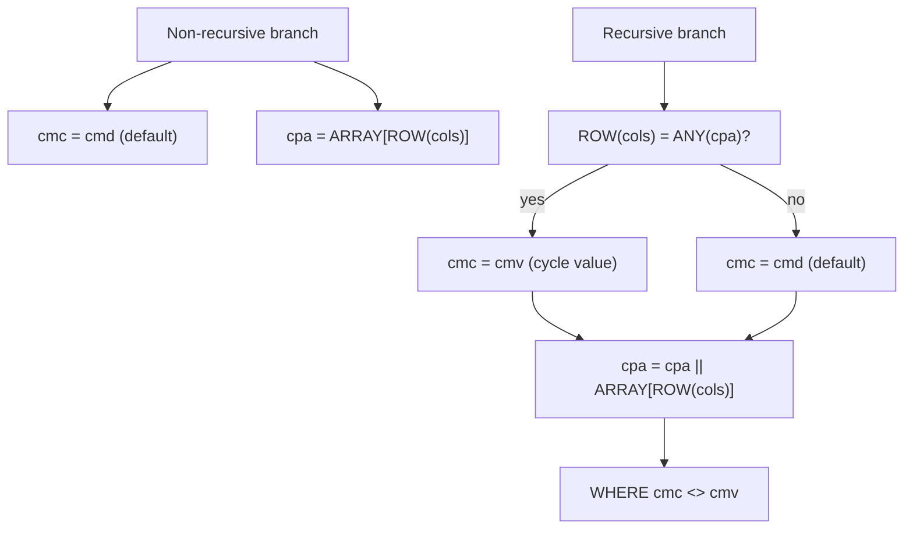

The `SEARCH` and `CYCLE` clauses introduced in SQL:2016 (and supported since PostgreSQL 14) give recursive CTEs a declarative way to control traversal order and detect repeated nodes. Rather than adding new executor machinery, PostgreSQL implements both features entirely in the [[subsystems/rewriter/overview|query rewriter]]: before the query ever reaches the planner, `rewriteSearchAndCycle()` transforms the CTE into a semantically equivalent query that carries extra columns tracking path state.

## What the Clauses Express

`SEARCH BREADTH FIRST BY col1, col2 SET sqc` requests that rows be returned in breadth-first order, where `sqc` is a synthetic ordering column the user can sort on. `SEARCH DEPTH FIRST BY col1, col2 SET sqc` requests depth-first ordering via an array that grows along each traversal path. `CYCLE col1, col2 SET cmc TO 'Y' DEFAULT 'N' USING cpa` marks rows as cyclic (setting `cmc` to the cycle-mark value `'Y'`) when a combination of the specified columns has already appeared on the current path, using `cpa` as the path-tracking array.

Both clauses are purely syntactic conveniences. After the rewriter runs, neither the planner nor the executor knows they existed.

## Rewrite Strategy

The entry point is `rewriteSearchAndCycle()` (`rewriteSearchCycle.c`), called from the rewriter whenever a `CommonTableExpr` node carries a non-null `search_clause` or `cycle_clause`. The function works on a deep copy of the CTE to leave the original parse tree intact.

Every valid recursive CTE has the structure `nonrecursive_term UNION [ALL] recursive_term`. The rewriter locates the two `RTE_SUBQUERY` range table entries that correspond to the left and right branches of the `SetOperationStmt`, then rewrites each branch independently before updating the `SetOperationStmt` and the CTE's own output column list to include the new columns.

The rewriter always appends the new columns after the user-declared columns in a fixed order: if both a `SEARCH` clause and a `CYCLE` clause are present, the search-sequence column comes first, then the cycle-mark column, then the cycle-path column (`rewriteSearchCycle.c`).

## Breadth-First Search Rewrite

For `SEARCH BREADTH FIRST BY cols SET sqc`, the ordering column `sqc` has type `record`. In the non-recursive branch, the rewriter initialises it to `ROW(0, col1, col2)` — a composite value whose first field is an integer depth counter starting at zero, followed by the values of the search columns. In the recursive branch, a `FieldSelect` extracts the depth field from the inherited `sqc` value and increments it via `int8inc`, producing `ROW(sqc.depth + 1, col1, col2)` (`make_path_rowexpr()`, `rewriteSearchCycle.c`).

Sorting the final CTE result by `sqc` then gives breadth-first order, because the depth counter is the leading field of the record. Record comparison is lexicographic.

## Depth-First Search Rewrite

For `SEARCH DEPTH FIRST BY cols SET sqc`, the column has type `record[]`. In the non-recursive branch it is `ARRAY[ROW(col1, col2)]`. In the recursive branch it becomes `sqc || ARRAY[ROW(col1, col2)]`, appending the current row's key to the inherited path array (`make_path_cat_expr()`, `rewriteSearchCycle.c`).

The resulting array encodes the full traversal path from the root to the current row. Sorting by `sqc` — which compares arrays element-by-element, then by length — produces a lexicographic ordering that corresponds to depth-first traversal.

## Cycle Detection Rewrite

For `CYCLE cols SET cmc TO cmv DEFAULT cmd USING cpa`, the rewriter adds two columns: a cycle-mark column `cmc` and a path column `cpa` of type `record[]`.

In the non-recursive branch:

- The rewriter initialises `cmc` to the default value `cmd` (e.g., `'N'`).
- It initialises `cpa` to `ARRAY[ROW(col1, col2)]`.

In the recursive branch, the cycle-mark expression is:

```sql
CASE WHEN ROW(col1, col2) = ANY (cpa) THEN cmv ELSE cmd END
```

This uses a `ScalarArrayOpExpr` with `RECORD_EQ_OP` to test whether the current row's key tuple already appears anywhere in the path array (`rewriteSearchCycle.c`). The rewriter updates the path column with `cpa || ARRAY[ROW(col1, col2)]`.

Critically, the recursive branch also gains a `WHERE cmc <> cmv` filter. This prevents the recursion from following edges that were already marked as cycles — it acts as the actual termination guard. Without it, cycle detection would mark rows but not stop the infinite loop.



## Path Tracking with ROW Expressions

Both search and cycle tracking use `ROW(...)` expressions wrapping the key columns. The resulting `record` type is anonymous — its field names are not meaningful to the executor — but the `RECORD_EQ_OP` operator can compare two `record` values structurally by comparing their elements in order. This is what makes `ROW(col1, col2) = ANY(cpa)` work: it compares each element of the path array against the current row's composite key.

The helper `make_path_rowexpr()` constructs a `RowExpr` node by scanning the CTE's output column list to find the declared types for each named key column and building the appropriate `Var` references (`rewriteSearchCycle.c`). This is necessary because the rewriter calls the same function for both the non-recursive and recursive branches. The `Var` attribute numbers differ between them, once the enclosing subqueries are wrapped.

## Constraint on Recursive Reference Placement

The rewriter can only inject path-tracking columns if it can find the recursive self-reference in the right-hand subquery's range table. It searches for an `RTE_CTE` entry at exactly two levels up from the UNION subquery (`ctelevelsup == 2`) — one level of wrapping for the outer `SELECT` that the rewriter itself introduces, and one for the UNION query (`rewriteSearchCycle.c`). If the recursive reference appears in a deeper subquery (for example, inside a sub-SELECT inside the recursive term), the rewriter raises:

```
ERROR: with a SEARCH or CYCLE clause, the recursive reference to WITH query
"..." must be at the top level of its right-hand SELECT
```

This is a deliberate limitation, not a fundamental impossibility: supporting deeper placements would require more complex Var-level surgery than the current rewrite performs.

## Interaction with UNION vs UNION ALL

When the CTE uses `UNION` (deduplication), the synthesised columns must participate in the deduplication step. The rewriter adds the extra columns to `SetOperationStmt.colTypes` and also appends a `SortGroupClause` entry to `SetOperationStmt.groupClauses` for each new column (`rewriteSearchCycle.c`). This ensures the `UNION` semantics treat two rows as equal only if their path-tracking state is also equal — otherwise, the deduplication would incorrectly discard legitimately distinct rows that happen to have the same user-visible columns but different traversal paths.

## Synthesised Columns by Clause

| Clause | Column | Type | Non-recursive init | Recursive update |
|---|---|---|---|---|
| `SEARCH BREADTH FIRST` | `sqc` | `record` | `ROW(0, cols)` | `ROW(sqc.depth+1, cols)` |
| `SEARCH DEPTH FIRST` | `sqc` | `record[]` | `ARRAY[ROW(cols)]` | `sqc \|\| ARRAY[ROW(cols)]` |
| `CYCLE` | `cmc` | user-defined | `cmd` (default) | `CASE WHEN … THEN cmv ELSE cmd END` |
| `CYCLE` | `cpa` | `record[]` | `ARRAY[ROW(cols)]` | `cpa \|\| ARRAY[ROW(cols)]` |

## Related Topics

- [[subsystems/rewriter/overview|Query Rewriter Overview]] — the broader rewrite pipeline that invokes `rewriteSearchAndCycle()`
- [[subsystems/planner/recursive-queries|Recursive Queries (WITH RECURSIVE)]] — how the executor evaluates recursive CTEs at runtime via `RecursiveUnion` and `WorkTableScan`
