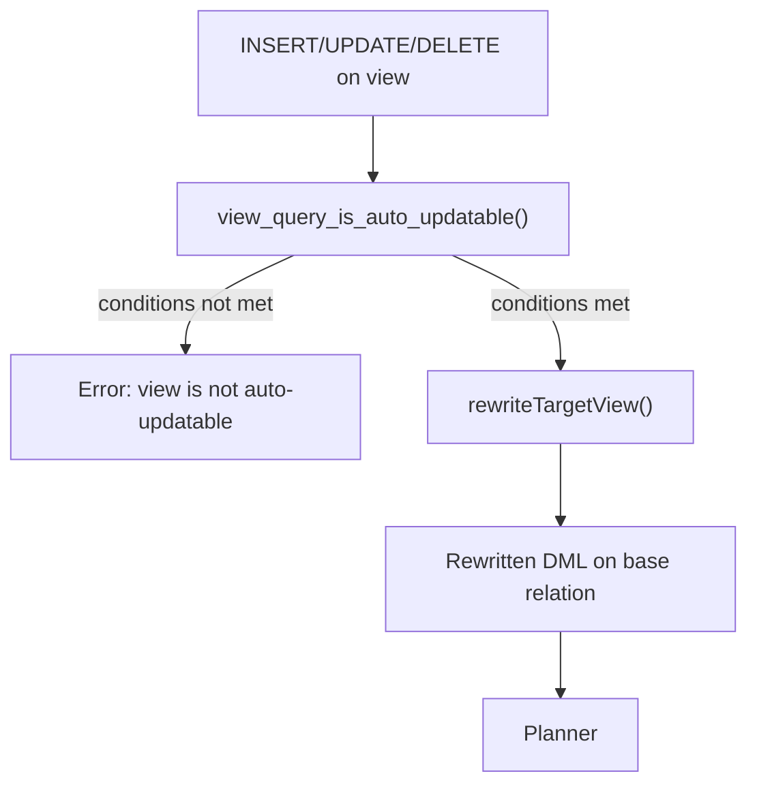
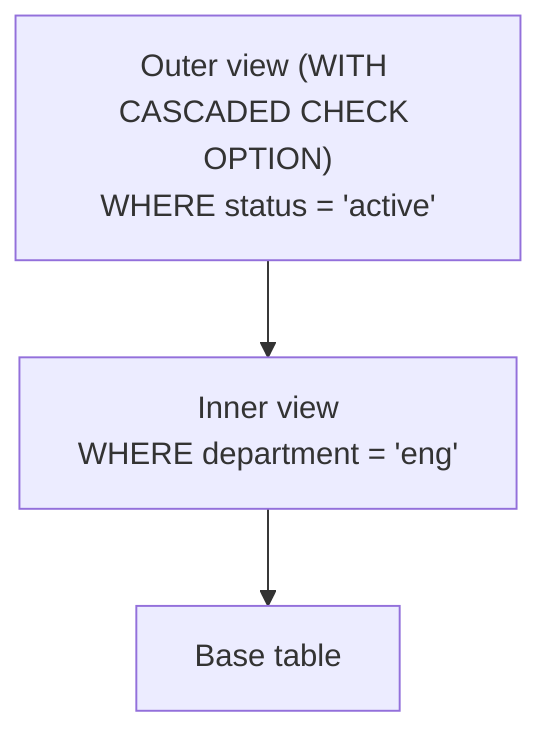

# Updatable Views

A view in PostgreSQL is a stored SELECT query represented as a rule (see [[subsystems/rewriter/overview]]). By default, views are read-only: writing through them requires extra machinery. PostgreSQL provides three paths for that machinery — automatic rewriting for simple views, explicit DO INSTEAD rules, and INSTEAD OF triggers. The rewriter chooses between them during query transformation, before the planner ever sees the statement.

## Automatically updatable views

When a view is structurally simple enough that each visible row corresponds to exactly one row in one base relation, PostgreSQL can rewrite INSERT, UPDATE, and DELETE statements targeting the view directly into equivalent statements on the base relation. No explicit rule or trigger is needed. The rewriter handles it transparently.

`view_query_is_auto_updatable()` in `rewriteHandler.c` performs the eligibility check. The view's stored SELECT query must satisfy all of the following:

- **Single base relation.** The FROM clause must contain exactly one item, and that item must be a plain table, another view, a foreign table, or a partitioned table — not a subquery, function, or join.
- **No DISTINCT.** DISTINCT would make the mapping from output rows to base rows ambiguous.
- **No GROUP BY or HAVING.** These collapse multiple base rows into single output rows.
- **No aggregates, window functions, or set-returning functions in the target list.** Each of these breaks the one-output-row-per-base-row invariant.
- **No set operations.** UNION, INTERSECT, and EXCEPT combine rows from multiple sources.
- **No LIMIT or OFFSET.** These slice the result set, so the view does not expose all rows of the base relation.
- **No CTEs (WITH clauses).** CTEs introduce independent query scopes that complicate row identity.
- **No TABLESAMPLE.** A sampled view does not represent the full base relation.
- **At least one updatable column** (required for INSERT and UPDATE, not for DELETE). A column is updatable when its target-list entry is a plain `Var` node referring to a user column (not a system column, not a whole-row reference, not an expression) of the single base relation.

A view can have computed expressions alongside updatable columns: SQL:1999 feature T111 permits a mix. What matters is that the columns actually targeted by an INSERT or UPDATE are all updatable. PostgreSQL rejects attempts to write to a computed column at rewrite time.

## How auto-updatable rewriting works

When `RewriteQuery()` processes a DML statement whose target is a view with no unconditional DO INSTEAD rule and no INSTEAD OF trigger for that command type, it calls `rewriteTargetView()`. That function:

1. Fetches the view's ON SELECT rule body (the stored `Query`).
2. Confirms the view passes `view_query_is_auto_updatable()`, raising a descriptive error if not.
3. Checks that any columns being written are updatable via `view_cols_are_auto_updatable()`.
4. Rewrites the DML statement to target the base relation instead of the view, mapping column references from view output positions to the corresponding base-relation attribute numbers.
5. Appends the view's WHERE clause (if any) to the rewritten query's WHERE clause, so an `UPDATE ... WHERE ...` on the view still filters on both the view's own predicate and the user-supplied predicate.
6. Carries over permission information so the executor still checks that the caller has appropriate rights on the view.

The result is a normal DML `Query` directed at the base relation. The planner receives this and has no knowledge that a view was involved. `RewriteQuery()` handles recursion through multiple layers of auto-updatable views naturally: it recurses on its product queries, so a view on top of an auto-updatable view on top of a table is unwound layer by layer.

PostgreSQL writes no DO INSTEAD rule rows to `pg_rewrite` for auto-updatable views. The rewriting is purely procedural inside `rewriteTargetView()`. It is not stored as a rule. If you inspect `pg_rules` you will see only the `_RETURN` rule that defines the view's SELECT.

## What breaks auto-updateability

Any feature in the view's SELECT that violates the one-output-row-per-base-row requirement disqualifies it. Common cases:

| View feature | Reason |
|---|---|
| `SELECT DISTINCT ...` | Output rows do not map 1-to-1 to base rows |
| `GROUP BY` / `HAVING` | Aggregation collapses multiple base rows |
| `UNION` / `INTERSECT` / `EXCEPT` | Rows come from multiple sources |
| `LIMIT` / `OFFSET` | View does not expose the full base relation |
| Aggregate or window function in target list | Not a plain column projection |
| Set-returning function in target list | Each base row might produce many output rows |
| More than one FROM item (join, subquery) | Row identity is ambiguous |
| `WITH` (CTE) | Separate query scope |
| `TABLESAMPLE` | Stochastic row subset |

When a view fails these checks, PostgreSQL raises an error whose text comes directly from `view_query_is_auto_updatable()` — for example: "Views containing DISTINCT are not automatically updatable." The error hint always suggests the two remedies: an INSTEAD OF trigger or an unconditional DO INSTEAD rule.

## Explicit DO INSTEAD rules

Before the auto-updatable path existed, the only way to write through a view was to create explicit ON INSERT/UPDATE/DELETE DO INSTEAD rules. PostgreSQL stores such a rule as a normal row in `pg_rewrite` with `is_instead = true` and `ev_qual IS NULL` (unconditional). The rewriter fires it through the standard rule-firing path in `fireRules()` rather than through `rewriteTargetView()`.

An unconditional DO INSTEAD rule takes precedence over auto-updateability. If one is present for a command type, `RewriteQuery()` treats the view as rule-updatable for that command and never calls `rewriteTargetView()`. The rule body can be an arbitrary query — it is not constrained to the auto-updatable restrictions.

DO INSTEAD rules are powerful but fragile: they fire at the rewrite level, before executor security checks. They also interact subtly with NEW/OLD references, RETURNING clauses, and ON CONFLICT. The SQL-level syntax for creating them is also verbose. Prefer INSTEAD OF triggers for complex cases.

## INSTEAD OF triggers

An INSTEAD OF trigger fires at the executor level, once per row, when an INSERT, UPDATE, or DELETE targets a view. Unlike a DO INSTEAD rule (which rewrites the query tree before the planner sees it), an INSTEAD OF trigger receives a fully planned and partially executed operation: the trigger function receives the NEW and OLD virtual rows and is responsible for propagating the change to whatever underlying tables it chooses.

`view_has_instead_trigger()` in `rewriteHandler.c` checks whether a view has a suitable trigger for the current command before attempting auto-updatable rewriting. If the trigger exists, `RewriteQuery()` skips `rewriteTargetView()` entirely — the query reaches the executor as-is, targeting the view relation, and the trigger fires row by row.

Differences that guide the choice:

| Aspect | INSTEAD OF trigger | DO INSTEAD rule |
|---|---|---|
| Fires at | Executor, per row | Rewriter, once per statement |
| Access to NEW/OLD | Yes, as full row records | Yes, but via Var substitution |
| Statement-level access | Requires statement-level trigger | Natural — rule rewrites the statement |
| RETURNING support | Works cleanly | Requires careful rule construction |
| WITH CHECK OPTION | Not supported | Only on auto-updatable views |
| Typical use | Complex views, multiple target tables | Historical, or when row-level firing is undesirable |

For most applications, INSTEAD OF triggers on a view are easier to write correctly than DO INSTEAD rules and integrate better with other PostgreSQL features.

## WITH CHECK OPTION

A view defined with `WITH CHECK OPTION` instructs the rewriter to reject any INSERT or UPDATE that would make the affected row invisible through the view's own WHERE clause. Without this option, a row inserted into the base table via the view can immediately become invisible: the user cannot read it back through the view, but it exists in the underlying table.

`WITH CHECK OPTION` is only permitted on auto-updatable views. `DefineView()` in `view.c` calls `view_query_is_auto_updatable()` at view-creation time and raises an error if the view does not qualify. PostgreSQL stores the check option as a reloption on the view relation.

At rewrite time, `rewriteTargetView()` reads the option and appends the view's WHERE clause to the query's `withCheckOptions` list as a `WithCheckOption` node. The executor evaluates these after each row is modified: if the resulting row fails the predicate, it raises an error rather than silently producing a row that the view cannot see.

### LOCAL vs CASCADED

When views are stacked — a view defined on top of another view — the two flavors control which predicates are enforced:

- **`WITH LOCAL CHECK OPTION`** enforces only the WHERE clause of the view it is declared on, ignoring parent views.
- **`WITH CASCADED CHECK OPTION`** (the default when you write just `WITH CHECK OPTION`) enforces the WHERE clause of the view and all views in the chain above it, whether or not those parent views have their own check option.

PostgreSQL implements this propagation by carrying a `cascaded` flag in `WithCheckOption` nodes. When `rewriteTargetView()` processes each layer, it checks whether any already-accumulated `WithCheckOption` is cascaded; if so, it adds the current view's predicate regardless of whether the current view itself was declared with a check option (`rewriteHandler.c:3674–3684`). `rewriteTargetView()` adds inner-view checks at the front of the list, so they are evaluated before outer-view checks, matching the SQL standard's specification.

An INSERT through the outer view above would be checked against both `status = 'active'` (from the outer view's cascaded option) and `department = 'eng'` (propagated from the cascade). With LOCAL on the outer view, only `status = 'active'` would be enforced at that layer.

## Cascaded view updates

When an auto-updatable view is defined on top of another view (rather than directly on a base table), `rewriteTargetView()` rewrites the statement to target the inner view. The recursion in `RewriteQuery()` then processes the rewritten statement again, applying the same auto-updateability check to the inner view. This continues until the statement reaches a plain table. Each layer may append its own WHERE clause to the combined filter and add its own `WithCheckOption` checks if cascading is in effect.

There is no artificial limit on the depth of this chain. The only practical constraint is the standard DML-rule loop detection in `RewriteQuery()`, which prevents cycles.

PostgreSQL also accepts foreign tables and partitioned tables as the base relation in an auto-updatable view. For foreign tables, the foreign data wrapper handles the actual write; for partitioned tables, partition routing proceeds normally after the view rewrite.

## Column updatability and partial writes

Even within a single auto-updatable view, not every column needs to be updatable. The view may expose computed expressions — `SELECT a, b, a + b AS total FROM t`. The rewriter permits writes as long as the targeted columns are updatable. An attempt to UPDATE the `total` column fails at rewrite time with an error naming the offending column.

`view_cols_are_auto_updatable()` computes this per-column assessment. It scans the view's target list and classifies each entry as updatable (a plain `Var` referencing a user column of the single base relation) or not. For INSERT the check considers which columns the statement specifies; for UPDATE it considers columns listed in the SET clause. The result is a bitmapset of updatable column positions. `rewriteTargetView()` uses this bitmapset to validate the operation, and to correctly map the modified columns to base-relation attribute numbers when rewriting column permission checks.

`relation_is_updatable()` exposes this information to the SQL layer via the `pg_catalog` functions `pg_relation_is_updatable()` and `pg_column_is_updatable()`. These are what information-schema views such as `information_schema.columns` use to populate the `is_updatable` column visible to clients.

## Related Topics

- [[subsystems/rewriter/overview|Rewriter Overview]] — explains how the rule system processes queries before planning, the context in which updatable-view rewriting runs.
- [[subsystems/rewriter/rules-vs-triggers|Rules vs Triggers]] — compares DO INSTEAD rules and INSTEAD OF triggers as mechanisms for view writability, covering trade-offs in detail.
- [[subsystems/triggers|Triggers]] — documents INSTEAD OF trigger creation and semantics, the preferred approach for complex updatable-view logic.
- [[subsystems/views|Views]] — covers view definition, storage, and the underlying SELECT rule, providing the foundation that updatable-view rewriting builds on.
- [[subsystems/catalog/pg-class|pg_class]] — describes the relation catalog entry where view reloptions (including WITH CHECK OPTION) are stored.
- [[code-paths/update|UPDATE]] — traces the full code path for UPDATE statements, including how a rewritten view update reaches the executor.
- [[subsystems/extensions/foreign-data-wrappers|Foreign Data Wrappers]] — relevant because foreign tables are a supported base relation for auto-updatable views, with writes delegated to the FDW.
