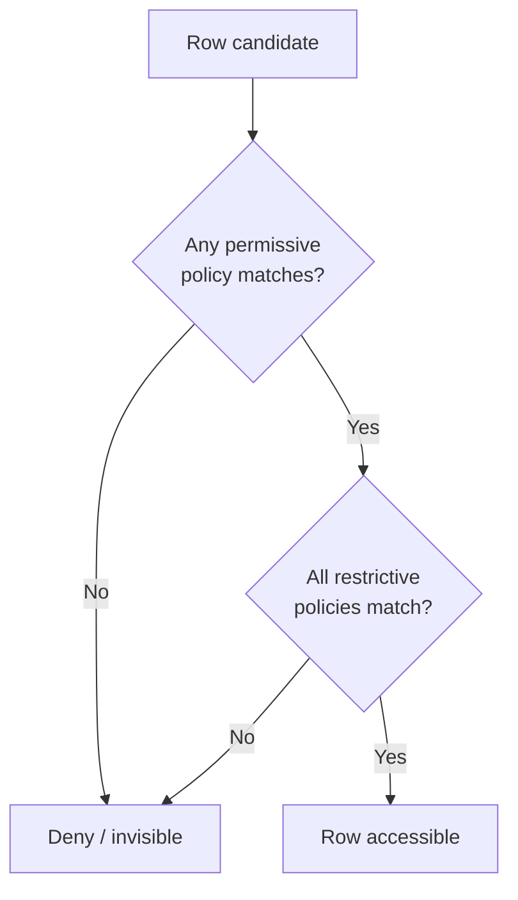
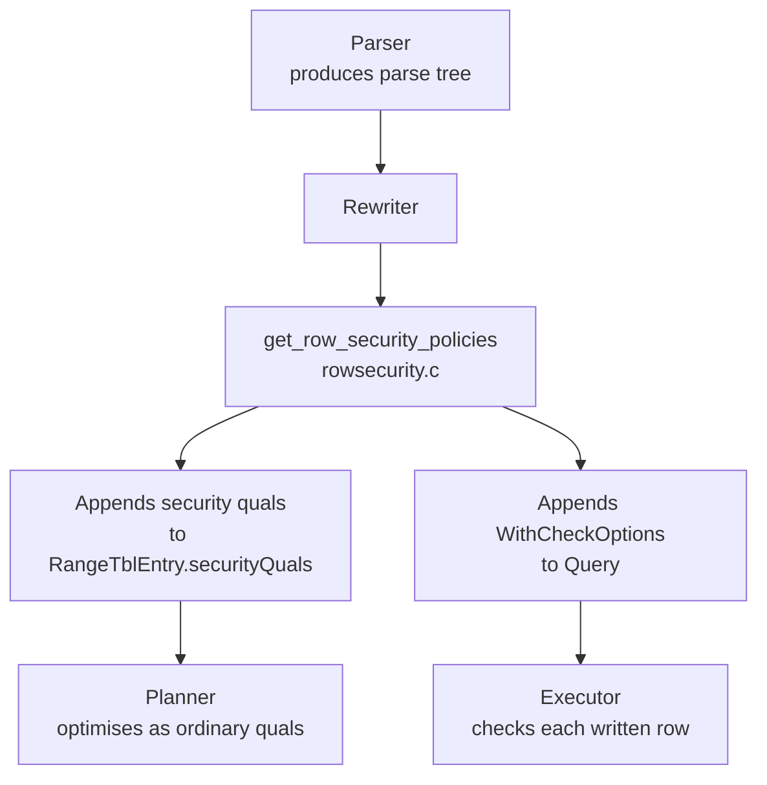

# Row-Level Security

Row-level security (RLS) lets a table restrict which rows a given user can see or modify, based on configurable policies evaluated against the user's identity at query time. Column-level privileges are enforced at parse time, when the query is first analyzed. RLS instead operates transparently below the application layer: the database silently filters or rejects rows without the querying session needing to know the policies exist.

An application can execute a plain `SELECT * FROM orders` and receive only the rows the current user is permitted to see — no special query structure, no application-level filtering, no risk of accidentally omitting a `WHERE` clause. This makes RLS a foundation for multi-tenant systems, data-classification enforcement, and regulatory compliance. Per-row access decisions must be made reliably, regardless of how application code is written.

RLS applies to ordinary tables and partitioned tables. Views, foreign tables, and system catalogs are not directly subject to RLS policies, though views interact with RLS in important ways (see [[subsystems/views|Views]]).

## Enabling RLS and the Default-Deny Behaviour

RLS is a two-step opt-in. The table owner first enables the mechanism on a given table:

```sql
ALTER TABLE orders ENABLE ROW LEVEL SECURITY;
```

With RLS enabled but no policies defined, a default-deny rule applies silently: no rows are accessible to anyone except users who bypass RLS (see below). This is intentional — enabling RLS on a table that has no policies produces a locked-down table, not a wide-open one. The same default-deny outcome applies when policies exist but none of them match the current user and command. In that case, the rewriter injects a literal `false` constant as a security qual, which means zero rows pass (add_security_quals(), rowsecurity.c).

Policies are added with `CREATE POLICY`:

```sql
CREATE POLICY tenant_isolation ON orders
    FOR ALL
    USING (tenant_id = current_setting('app.tenant')::int);
```

A policy may restrict a specific command (`SELECT`, `INSERT`, `UPDATE`, `DELETE`, or `ALL`), apply to a list of roles, and carry two distinct filter expressions: `USING` and `WITH CHECK`. Multiple policies on the same table combine according to rules described below.

Note that `relrowsecurity` in `pg_class` (set by `ENABLE ROW LEVEL SECURITY`) is distinct from the presence of policies. A table can have `relrowsecurity = true` with no policies — the default-deny rule still applies. Dropping all policies from a table does not implicitly disable RLS; only `ALTER TABLE ... DISABLE ROW LEVEL SECURITY` does that.

## USING and WITH CHECK: Two Sides of a Policy

A policy's two expressions serve different purposes and are evaluated at different points in execution.

The `USING` clause controls visibility of existing rows. On a `SELECT` it determines which rows are returned. On `UPDATE` and `DELETE` it determines which target rows the operation is permitted to touch. A row for which `USING` evaluates to false is not an error — the query behaves as if that row does not exist. The user sees fewer results, not a permission-denied message. This silent exclusion is a deliberate design: the presence of other tenants' rows is not revealed.

The `WITH CHECK` clause validates the content of rows being written. On `INSERT` and `UPDATE`, after a new or modified row is constructed, `WITH CHECK` must evaluate to true or the statement is rejected with an error. Write operations raise errors rather than silently dropping rows because silent data loss would be difficult to diagnose and would surprise the application.

If a policy carries no explicit `WITH CHECK` clause, the rewriter falls back to the `USING` clause for write validation as well. The `QUAL_FOR_WCO` macro in `add_with_check_options()` (rowsecurity.c) encodes this fallback: it selects `with_check_qual` when it is non-null, and `qual` otherwise. There is one important restriction on INSERT policies specifically: `CREATE POLICY ... FOR INSERT` may only carry a `WITH CHECK` clause, not a `USING` clause. This constraint is enforced in `CreatePolicy()` (policy.c) — INSERT has no "existing row" to filter, so a USING expression would have no meaning.

This separation enables nuanced policies. A policy might allow a user to read a broad range of rows (wide `USING`) but only insert into a narrow subset (narrow `WITH CHECK`). It can also enforce that an update never moves a row outside the visible set — a row the user could see before the update must remain visible after it.

## Permissive and Restrictive Policies

Multiple policies on the same table do not simply OR together. PostgreSQL distinguishes two kinds that combine differently:

**Permissive policies** (the default, specified with `AS PERMISSIVE`) are ORed together. A row passes if *any* permissive policy permits it. This suits multi-tenant or multi-role designs: a row that belongs to either department A or department B should be readable by a member of either department, so their policies are combined with OR.

**Restrictive policies** (specified with `AS RESTRICTIVE`) are ANDed with the result of the permissive evaluation. A row is accessible only if it passes at least one permissive policy *and* all restrictive policies. A restrictive policy imposes an unconditional floor — for example, a compliance requirement that certain sensitive rows are never exposed outside a trusted network regardless of other permissions.

The combination rule is:

```
access granted = (any permissive policy matches) AND (all restrictive policies match)
```

If no permissive policy matches at all, access is denied even if all restrictive policies would pass. The rewriter enforces this by injecting a literal `false` constant as a security qual when the permissive policy list is empty (add_security_quals(), rowsecurity.c). Conversely, if there are no restrictive policies, the AND term disappears. Access then depends solely on the permissive set.



Restrictive policies are sorted by name before being applied (`sort_policies_by_name()`, rowsecurity.c). This gives deterministic error messages. When a restrictive `WITH CHECK` fails, the policy name appears in the error. The order in which policies are checked is also consistent across sessions. The rewriter merges all permissive policies into a single ORed `WithCheckOption` node with no policy name attached. A write failure against the combined permissive result means only that no permissive policy granted permission, not that any specific named policy was violated.

## Policy Scope: Commands and Roles

Each policy carries a command scope and a role list. The command scope is stored in `pg_policy.polcmd` as a single character: `'*'` for `ALL`, `'r'` for `SELECT`, `'a'` for `INSERT`, `'w'` for `UPDATE`, and `'d'` for `DELETE`. `MERGE` has no dedicated policy type — it derives its access control from the underlying `UPDATE`, `DELETE`, and `INSERT` operations (see the multi-command section below).

Role matching (`check_role_for_policy()`, rowsecurity.c) uses `has_privs_of_role()`, which respects role inheritance. A policy assigned to `app_user` applies to any role that inherits from `app_user`. A policy assigned to `PUBLIC` (the default when no role is listed in `CREATE POLICY`) applies to all roles. Internally, PUBLIC is represented as `ACL_ID_PUBLIC` in the first element of the roles array; `check_role_for_policy()` short-circuits immediately when it sees that sentinel.

During `get_policies_for_relation()`, the rewriter scans the cached policy list, matches each entry against the command type and the current user's OID, and splits matching policies into permissive and restrictive lists. Because the policy data is held in the relation cache (`relation->rd_rsdesc->policies`, loaded by `RelationBuildRowSecurity()` in policy.c from `pg_policy`), no catalog scan is needed at query time.

## Catalog Storage and Relcache Loading

Policies are stored in the `pg_policy` system catalog, one row per policy. The key columns are `polrelid` (the table's OID), `polname`, `polcmd`, `polpermissive`, `polroles`, `polqual` (the USING expression, serialized as text), and `polwithcheck` (the WITH CHECK expression, similarly serialized).

When a relation is opened for the first time after a relcache miss, `RelationBuildRowSecurity()` (policy.c) scans `pg_policy` using an index on `(polrelid, polname)`. This index means policies are visited in name order. `stringToNode()` deserializes each policy's serialized expression strings back into expression trees. `RelationBuildRowSecurity()` stores them in a freshly allocated `RowSecurityDesc`, which hangs off `relation->rd_rsdesc`. The descriptor lives in its own `MemoryContext` parented under `CacheMemoryContext`. This makes cleanup straightforward: when the relcache entry is invalidated, the entire context is freed.

This loading path means that every DDL operation touching a policy — `CREATE POLICY`, `ALTER POLICY`, `DROP POLICY` — calls `CacheInvalidateRelcache()` on the parent table, which causes all backends to rebuild `rd_rsdesc` the next time they open the relation. The relcache invalidation mechanism is also what propagates policy changes to sessions with active cached query plans.

## How the Rewriter Injects Policies

The enforcement mechanism lives in the query rewriter, not the executor or the parser. During rewriting, the rewriter calls `get_row_security_policies()` (rowsecurity.c) for every range table entry that refers to a plain or partitioned table. It checks whether RLS is active for that relation and user. It then collects the applicable policies and modifies the parse tree, before the planner ever sees the query.

A key detail is how the rewriter determines the command type for a given range table entry. If the entry is the *target* relation (its index equals `root->resultRelation`), the rewriter uses the query's command type directly. If it is a *source* relation in a join or subquery, the rewriter always treats it as a `CMD_SELECT`, regardless of the overall query type. For example, in `UPDATE t1 SET ... FROM t2` the UPDATE policies apply to `t1` but only SELECT policies apply to `t2`.

For read access (`SELECT`, `UPDATE`, `DELETE`), the rewriter prepends the combined policy expression to `RangeTblEntry.securityQuals`. These become additional `WHERE` conditions that the [[subsystems/planner/overview|planner]] sees as ordinary quals. Because the planner treats them like any other predicate, it can use indexes, push them below joins, and apply cost estimation normally. A policy written as `tenant_id = current_setting('app.tenant')::int` can be satisfied by a B-tree index scan on `tenant_id` just as if the application had written the condition itself.

For write access (`INSERT`, `UPDATE`), the rewriter packages the policy expressions as `WithCheckOption` nodes attached to the query. The executor evaluates these after constructing each new or modified row, raising an error if the check fails. Restrictive policies each get their own `WithCheckOption` node so that the policy name can appear in the error message. The rewriter merges all permissive policies into a single ORed `WithCheckOption`. A failure there means only that no policy granted permission, not that any particular named policy was violated.



A key consequence is that RLS policies are not trigger-based and do not run row-by-row in a separate execution step. They are compiled into the query plan as ordinary predicate expressions. This means the planner can push them into index scans, use them for partition pruning, and combine them with application-supplied predicates using the same optimizer infrastructure.

## The RLS Bypass Hierarchy

Not all users are subject to RLS policies. `check_enable_rls()` (src/backend/utils/misc/rls.c) determines the effective status for each relation and user combination, returning one of three values:

| Return value | Meaning |
|---|---|
| `RLS_NONE` | RLS is not enabled on this relation; nothing to do |
| `RLS_NONE_ENV` | RLS is enabled but bypassed for this user in the current environment |
| `RLS_ENABLED` | RLS applies; inject policies |

The bypass hierarchy, evaluated in order:

**Superusers** always bypass RLS. Superuser status implies the `BYPASSRLS` attribute, so there is no separate check needed. Superusers bypass RLS even when `FORCE ROW LEVEL SECURITY` is set on the table.

**Roles with `BYPASSRLS`** — any role granted this attribute bypasses all RLS policies on all tables. The attribute is checked via `has_bypassrls_privilege()`. Both the superuser case and the `BYPASSRLS` case return `RLS_NONE_ENV` rather than `RLS_NONE`, because the decision is environment-dependent: if a connection changes roles, the bypass status may change and cached plans must be invalidated.

**Table owner bypass** — the table's owner bypasses RLS by default. This makes development and administration practical: the owner can inspect all data without policies interfering. The bypass can be revoked with:

```sql
ALTER TABLE orders FORCE ROW LEVEL SECURITY;
```

This sets `pg_class.relforcerowsecurity`. Once set, the owner's queries are subject to the same policies as any other user. However, there is one unconditional exemption: referential integrity checks (foreign key enforcement) run inside `InNoForceRLSOperation()` and are always exempt from `FORCE ROW LEVEL SECURITY`. Foreign key enforcement must be able to see all rows regardless of policies — otherwise it would incorrectly reject valid references to rows that the enforcing session's policies hide.

## Plan Cache Invalidation

Because the effective policy set depends on the current role and the `row_security` GUC, cached query plans must be sensitive to these environment factors. When `check_enable_rls()` returns `RLS_NONE_ENV` (user bypasses RLS), `get_row_security_policies()` sets the `hasRowSecurity` flag on the query even though no quals were injected. This flag causes the plan cache to treat the plan as environment-dependent and trigger a replan when the role or relevant GUCs change.

This mechanism is what allows a connection that runs `SET ROLE` mid-session to pick up the correct policy evaluation for the new role without using stale cached plans. The same invalidation path applies when a policy is created, altered, or dropped. The relcache entry for the table is flushed, which forces any cached plans referencing that relation to be rebuilt.

The practical cost of this design is that connection pools that switch roles frequently will observe replanning on the first query issued after each role switch. A common mitigation is to use a stable application-level role for all connections and enforce tenant isolation through a session parameter (`SET app.tenant = ...`) that the policy expression reads via `current_setting()`. Because the plan is reused across tenants, only the parameter value changes at runtime, not the plan itself.

## Context-Dependent Policy Evaluation

Policies are evaluated against `current_user`, which is the role active at the time the query is planned and executed. Several features interact with this:

`SET ROLE` changes `current_user` and triggers plan cache invalidation for any plans with `hasRowSecurity` set.

`SET SESSION AUTHORIZATION` resets both `session_user` and `current_user`, and similarly triggers replanning. Policy expressions that reference `session_user` (for auditing, for example) behave differently from those referencing `current_user` when these differ.

`checkAsUser` in `RTEPermissionInfo` handles the case of security definer views and functions: when a query runs through a view with a defined `checkAsUser`, PostgreSQL uses that OID for both privilege checks and policy evaluation, overriding the current user for that range table entry. The rewriter propagates `checkAsUser` into security quals and `WithCheckOption` nodes through `setRuleCheckAsUser()` so that any subqueries within a policy expression also see the correct identity.

## SECURITY DEFINER Functions and RLS

A `SECURITY DEFINER` function executes with the privileges of the function's owner, not the caller. This carries the owner's identity for RLS evaluation: policies on tables accessed inside the function are evaluated as if the function's owner were the querying user.

If the function owner holds `BYPASSRLS`, all RLS is bypassed for statements within the function, regardless of who called it. This is a significant privilege escalation vector: an unprivileged caller can invoke a `SECURITY DEFINER` function to read or write rows that their own policies would forbid. Operators should restrict `EXECUTE` on security definer functions carefully and audit which roles carry `BYPASSRLS`.

The mirror concern applies to `SECURITY INVOKER` functions (the default): they run as the caller, so RLS is evaluated for the caller's role. No escalation occurs. However, if a policy expression itself calls a user-defined function, that function executes as the querying user. The policy author must consider what side effects or information the function might expose.

## Leakproof Functions and Security Barrier Interaction

RLS security quals face the same concern as security barrier views: without appropriate restrictions, the planner might evaluate user-supplied functions against rows before those rows have been filtered by the security expression. A function that raises an error or takes different time on certain inputs can leak information about rows the user should not be able to see.

The planner treats `securityQuals` with the same caution as quals from a security barrier view. The planner can push only functions marked `LEAKPROOF` below a security qual. It holds non-leakproof functions in user-supplied predicates above the security qual in the plan tree, ensuring the security filter runs first. This is why `EXPLAIN` on a query with RLS may show a filter ordering that seems counterintuitive — the order reflects security requirements, not just cost optimality.

Policy authors should also consider functions used within a policy expression carefully. A policy that calls `current_setting()` or another leakproof built-in is safe. A policy that calls a user-defined function may introduce unintended side effects or leakage through that function. The `hassublinks` flag on `RowSecurityPolicy` signals to the planner that the policy expression contains a subquery; when set, it propagates to `Query.hasSubLinks` and informs downstream optimizations.

## Multi-Command Interactions

Several command types require policies from multiple command scopes to be collected and applied together.

**`SELECT FOR UPDATE / FOR SHARE`** requires update privileges. When `ACL_UPDATE` is in the required permissions for a SELECT, `get_row_security_policies()` collects both `UPDATE` USING policies and `SELECT` USING policies. The `UPDATE` policies are applied first (higher privilege wins), followed by `SELECT` policies. The result is that a row is only lockable if both the update policy and the select policy permit it.

**`UPDATE` with `RETURNING` or a `WHERE` referencing select-only columns** requires `ACL_SELECT`. This causes the rewriter to gather `SELECT` policies and add them as additional security quals. The `UPDATE` USING policy determines which rows can be modified; the `SELECT` policy determines which of those rows can appear in `RETURNING` output.

**`INSERT ... ON CONFLICT DO UPDATE`** must handle both the insert path and the update-on-conflict path. The rewriter produces multiple layers of `WithCheckOption` checks for the conflict case:

1. `WCO_RLS_CONFLICT_CHECK` using the `UPDATE` USING clauses — verifies the conflicting existing row can be updated at all.
2. `WCO_RLS_UPDATE_CHECK` using the `UPDATE` WITH CHECK clauses — verifies the post-update row is valid.

PostgreSQL raises an error rather than silently skipping the row, because silent data loss on a conflict would be surprising and hard to debug. The same principle applies to SELECT policies on RETURNING: those are also added as WCO nodes rather than security quals, again to produce a visible error rather than silent row omission.

**`MERGE`** has no dedicated policy type. Instead, `get_row_security_policies()` collects `UPDATE`, `DELETE`, and `INSERT` policies and packages them as `WithCheckOption` nodes of kinds `WCO_RLS_MERGE_UPDATE_CHECK`, `WCO_RLS_MERGE_DELETE_CHECK`, and `WCO_RLS_INSERT_CHECK` respectively. These are evaluated at the point each action is taken during merge execution, not during the initial scan. This differs from how normal `UPDATE` and `DELETE` handle USING policies, as security quals on the scan. For MERGE, the executor applies the USING check as a WCO error rather than silent row exclusion, consistent with how `INSERT ... ON CONFLICT DO UPDATE` handles it. An important consequence is that MERGE will raise an error if a matched row cannot be updated or deleted due to RLS, rather than silently skipping it.

## Partitioned Tables

RLS policies defined on a partitioned table apply to all partitions. When a query accesses a partitioned table, the rewriter applies the partition's own policies (if any) along with the parent's. Partition pruning still occurs before RLS filtering — the planner eliminates irrelevant partitions first, then injects RLS quals into the surviving partition scans.

Policies can be defined directly on individual partitions if per-partition access rules are needed, but this is uncommon. The more typical pattern is to define policies on the root partitioned table and let the rewriting process carry the security quals through to each partition scan.

## Column-Level Privileges and RLS

Column-level `GRANT` privileges operate independently from RLS. Both must be satisfied: a user must have the column-level privilege to select a column (enforced by the parser) and must pass the row-level policy to see the row at all (enforced by the rewriter). Having `SELECT` on a specific column does not grant access to rows that RLS would otherwise hide.

Conversely, RLS does not grant column-level access. A policy that grants a user visibility into a row does not override the column privileges on that row's individual columns. The two mechanisms are layered: column privileges gate which columns appear in the query; RLS gates which rows the query touches.

## Performance Considerations

RLS adds quals to every query that touches the protected table. Performance implications depend heavily on how policies are written.

A policy expression that matches an index column and uses only leakproof operators can be satisfied by an index scan with zero additional overhead over a plain query with the same predicate. The planner sees it as an ordinary qual and can choose the cheapest plan accordingly.

A policy expression that involves a subquery, a function call, or a non-indexed column adds per-row or per-scan cost. Sublinks in policy expressions set the `hassublinks` flag in `RowSecurityPolicy`. This causes the rewriter to set `hasSubLinks` on the query, alerting the planner that the expression may be correlated.

Use `EXPLAIN (ANALYZE, VERBOSE)` to see how RLS quals appear in the plan. They show up as `Filter` or `Index Cond` entries depending on whether the planner could push them into an index scan. If RLS quals appear as post-scan filters on a table with many rows, consider adding an index that covers the policy expression columns.

Because plans with `hasRowSecurity` are invalidated on role changes, connection poolers that switch roles frequently will incur replanning overhead. Using a stable application role (rather than per-user database roles) and enforcing tenant isolation through a session-level GUC (`SET app.tenant = ...`) is a common pattern to avoid this overhead while keeping policies data-driven.

## Extension Hooks

Two global function pointers in rowsecurity.c allow extensions to inject additional policies without modifying core code:

```c
row_security_policy_hook_type row_security_policy_hook_permissive;
row_security_policy_hook_type row_security_policy_hook_restrictive;
```

Both have the signature `List *(*)(CmdType, Relation)`. The rewriter appends extension-supplied permissive policies to the permissive list and ORs them in with built-in permissive policies. It sorts extension-supplied restrictive policies by name and appends them after all built-in restrictive policies, then ANDs them in. The rewriter always evaluates built-in restrictive policies before hook-supplied restrictive policies, providing a stable ordering: core policies in name order, then extension policies in name order.

This hook mechanism allows extensions to implement dynamic, externally-driven access control — for example, consulting an external authorization service by calling it inside the hook and constructing a qual expression based on its response.

## Key Data Structures

`RowSecurityPolicy` (rowsecurity.h) is the in-memory representation of a single policy, held in the relation cache:

| Field | Type | Purpose |
|---|---|---|
| `policy_name` | `char *` | Policy name as given in `CREATE POLICY` |
| `polcmd` | `char` | Command scope: `'*'` ALL, `'r'` SELECT, `'a'` INSERT, `'w'` UPDATE, `'d'` DELETE |
| `roles` | `ArrayType *` | Array of role OIDs; first element `ACL_ID_PUBLIC` means all roles |
| `permissive` | `bool` | `true` = permissive (ORed), `false` = restrictive (ANDed) |
| `qual` | `Expr *` | USING expression; used for visibility and as fallback for WITH CHECK |
| `with_check_qual` | `Expr *` | WITH CHECK expression; may be NULL |
| `hassublinks` | `bool` | Whether either expression contains a subquery |

`RowSecurityDesc` (rowsecurity.h) is the container attached to the relation cache entry:

```c
typedef struct RowSecurityDesc
{
    MemoryContext rscxt;   /* memory context for this descriptor */
    List         *policies; /* list of RowSecurityPolicy entries */
} RowSecurityDesc;
```

The `RowSecurityDesc` is allocated in its own `MemoryContext` (named for the relation) parented under `CacheMemoryContext`. When the relcache entry is invalidated — due to DDL, policy changes, or role changes — the context is freed and rebuilt from `pg_policy` the next time the relation is opened.

`WithCheckOption` nodes in the query carry the WCO kind, which determines when and how the check is evaluated:

| WCO kind | Used for |
|---|---|
| `WCO_RLS_INSERT_CHECK` | INSERT policies on new rows |
| `WCO_RLS_UPDATE_CHECK` | UPDATE policies on modified rows |
| `WCO_RLS_CONFLICT_CHECK` | ON CONFLICT DO UPDATE — check on the conflicting existing row |
| `WCO_RLS_MERGE_UPDATE_CHECK` | MERGE UPDATE action — check on the target row before updating |
| `WCO_RLS_MERGE_DELETE_CHECK` | MERGE DELETE action — check on the target row before deleting |

## Catalog Schema

The `pg_policy` catalog stores one row per policy. Its most important columns:

| Column | Type | Meaning |
|---|---|---|
| `polrelid` | `oid` | OID of the table the policy belongs to |
| `polname` | `name` | Policy name, unique per table |
| `polcmd` | `char` | Command scope character |
| `polpermissive` | `bool` | `true` = permissive, `false` = restrictive |
| `polroles` | `oid[]` | Array of role OIDs; `{0}` for PUBLIC |
| `polqual` | `pg_node_tree` | Serialized USING expression (nullable) |
| `polwithcheck` | `pg_node_tree` | Serialized WITH CHECK expression (nullable) |

The catalog is indexed on `(polrelid, polname)`. This index enforces the uniqueness of policy names per table and lets `RelationBuildRowSecurity()` scan all policies for a given relation efficiently, in a consistent name order. This consistent order matters for `equalRSDesc()`, the function that compares two `RowSecurityDesc` structures to decide if a relcache reload is necessary.

## Views and RLS

Views interact with RLS in a nuanced way that is worth understanding precisely. When a plain view is queried, the view expands to its underlying query. The rewriter then processes each range table entry in the expanded query independently. This means the policies on the underlying tables are enforced as if the query had been written against those tables directly. The view owner's identity is not injected; what matters is the identity of the session querying the view.

A security definer view — created with `CREATE VIEW ... WITH (security_invoker = false)` (the default) — sets `checkAsUser` on its range table entries to the view owner's OID. As a result, RLS on the underlying tables is evaluated as the view owner, not the querying user. This is the same mechanism used for `SECURITY DEFINER` functions. The view acts as a security boundary. All row-level access decisions inside it are made in the view owner's context.

Security barrier views (`CREATE VIEW ... WITH (security_barrier = true)`) add an additional layer: the view's own `WHERE` clause is treated like an RLS security qual. The planner must evaluate the view's filter before any user-supplied predicates, preventing information leakage through non-leakproof functions. A security barrier view is therefore a mechanism for implementing application-layer virtual RLS on tables that do not natively use RLS policies, or for wrapping RLS-protected tables with additional application-controlled filtering.

When a policy expression on table `T` contains a subquery that references another RLS-protected table `S`, the policies on `S` are also evaluated. The identity used for that evaluation is determined by `checkAsUser`, propagated into the subquery via `setRuleCheckAsUser()` (rowsecurity.c). This ensures that subqueries within policy expressions cannot be used to silently observe data from tables the current user cannot access.

## Common Design Patterns

### Per-tenant isolation with a session parameter

The most common RLS pattern for multi-tenant SaaS applications uses a session-level parameter to identify the current tenant:

```sql
ALTER TABLE orders ENABLE ROW LEVEL SECURITY;

CREATE POLICY tenant_isolation ON orders
    USING (tenant_id = current_setting('app.current_tenant_id')::int)
    WITH CHECK (tenant_id = current_setting('app.current_tenant_id')::int);
```

The application sets `app.current_tenant_id` at session start (e.g., via `SET LOCAL app.current_tenant_id = 42` within each transaction). This design has good performance: the policy expression references an indexed column, so the planner can produce an index scan. Because the application role is stable across all tenants, plan cache invalidation does not occur on tenant switches — only the GUC value changes.

An important operational concern with this pattern: if `current_setting('app.current_tenant_id')` is called without a fallback and the GUC is unset, PostgreSQL raises an error. Using `current_setting('app.current_tenant_id', true)` returns NULL instead. NULL causes the policy to evaluate to NULL (which counts as false), effectively locking out the session. Some applications prefer this fail-safe behaviour; others set a default in `postgresql.conf` or within a connection pooler reset script.

### Per-user row ownership

A straightforward ownership pattern grants users access only to rows they created:

```sql
CREATE POLICY user_owns_row ON documents
    USING (owner = current_user)
    WITH CHECK (owner = current_user);
```

This approach uses `current_user` directly in the policy. The downside is that every distinct application user becomes a database role, which does not scale beyond a few thousand users. It is suitable for systems where database roles map to real people, such as internal tools or analytics platforms.

### Layered policies: department access plus compliance restriction

A common enterprise pattern combines permissive department-level policies with a restrictive compliance policy:

```sql
-- Permissive: members of dept_a OR dept_b can see the row
CREATE POLICY dept_a_access ON sensitive_data AS PERMISSIVE
    TO dept_a_role
    USING (department = 'A');

CREATE POLICY dept_b_access ON sensitive_data AS PERMISSIVE
    TO dept_b_role
    USING (department = 'B');

-- Restrictive: regardless of department, only non-archived rows
CREATE POLICY no_archived ON sensitive_data AS RESTRICTIVE
    USING (archived = false);
```

Here, a user in `dept_a_role` can see department A rows, but only if they are not archived. The restrictive policy applies unconditionally across both permissive scopes.

### Preventing row hijacking on UPDATE

A common vulnerability in RLS implementations is the row-hijacking attack: a user updates a row they own to set its ownership to another tenant, making it permanently inaccessible to them and potentially visible to the wrong tenant. The WITH CHECK clause prevents this:

```sql
CREATE POLICY ownership ON items
    USING (owner_id = current_setting('app.tenant')::int)
    WITH CHECK (owner_id = current_setting('app.tenant')::int);
```

With this policy, PostgreSQL rejects an UPDATE that tries to change `owner_id` to a different tenant's ID, with a WITH CHECK violation. The new row must still satisfy the policy, so ownership cannot be transferred by update.

## Debugging and Observability

### Inspecting policies

The `pg_policies` view provides a human-readable summary of all policies, showing the table name, policy name, command, roles, USING expression, and WITH CHECK expression as SQL text:

```sql
SELECT schemaname, tablename, policyname, cmd, roles, qual, with_check
FROM pg_policies
WHERE tablename = 'orders';
```

The `pg_policy` catalog holds the raw serialized expression trees; `pg_policies` re-renders them as SQL. Both are useful for auditing.

### Checking whether RLS is active

The `pg_class` columns `relrowsecurity` and `relforcerowsecurity` indicate whether RLS is enabled and whether the owner is forced to obey it:

```sql
SELECT relname, relrowsecurity, relforcerowsecurity
FROM pg_class
WHERE relname = 'orders';
```

### Reading the query plan

`EXPLAIN (VERBOSE)` shows the security quals and WCO checks injected by the rewriter. The security qual appears as a `Filter` or `Index Cond`, indistinguishable from user-supplied predicates in most cases. The one observable difference is that the planner may refuse to push certain expressions below the security qual when leakproofness constraints apply. This can result in a sequential scan where an index scan would otherwise be used. `EXPLAIN (ANALYZE, VERBOSE)` will show actual rows and loop counts that reveal how much filtering is happening.

When a WITH CHECK fails at execution time, the error message identifies the relation and, for restrictive policies, the policy name:

```
ERROR:  new row violates row-level security policy "no_archived" for table "sensitive_data"
```

For permissive policy failures, no policy name is included because the failure means the ORed combination was false — no single policy is to blame.

## Extension Hooks

Two global function pointers in rowsecurity.c allow extensions to inject additional policies without modifying core code:

```c
row_security_policy_hook_type row_security_policy_hook_permissive;
row_security_policy_hook_type row_security_policy_hook_restrictive;
```

Both have the signature `List *(*)(CmdType, Relation)`. The rewriter appends extension-supplied permissive policies to the permissive list and ORs them in with built-in permissive policies. It sorts extension-supplied restrictive policies by name and appends them after all built-in restrictive policies, then ANDs them in. The rewriter always evaluates built-in restrictive policies before hook-supplied restrictive policies, providing a stable ordering: core policies in name order, then extension policies in name order.

This hook mechanism allows extensions to implement dynamic, externally-driven access control — for example, consulting an external authorization service by calling it inside the hook and constructing a qual expression based on its response.

## Related Topics

- [[subsystems/roles-privileges|Roles and Privileges]] — the privilege and role system that RLS policies build upon, including BYPASSRLS and role inheritance
- [[subsystems/rewriter/rules-vs-triggers|Rules vs Triggers]] — compares the rewriter-based mechanism (which RLS uses) with trigger-based alternatives for access control
- [[subsystems/catalog/relcache|Relcache]] — the relation cache that holds RowSecurityDesc and is invalidated when policies change
- [[subsystems/catalog/core-catalogs|Core Catalogs]] — covers pg_class columns relrowsecurity and relforcerowsecurity that control RLS activation
- [[subsystems/transactions/mvcc|MVCC]] — the visibility layer that interacts with RLS security quals during row filtering
- [[subsystems/locking/predicate-locking|Predicate Locking]] — serializable isolation uses predicate locks that interact with the same row-filtering layer as RLS
- [[subsystems/extensions/hooks|Hooks]] — the extension hook mechanism used by row_security_policy_hook_permissive and row_security_policy_hook_restrictive
- [[subsystems/rewriter/overview|Query Rewriter]] — the component that calls `get_row_security_policies()` for each range table entry
- [[subsystems/planner/overview|Planner]] — receives security quals as ordinary predicates and optimises them
- [[subsystems/executor/overview|Executor]] — evaluates `WithCheckOption` checks during INSERT, UPDATE, and MERGE
- [[subsystems/views|Views]] — security barrier views and their interaction with RLS quals
- [[code-paths/insert|INSERT code path]] — how INSERT WithCheckOptions are enforced row by row
