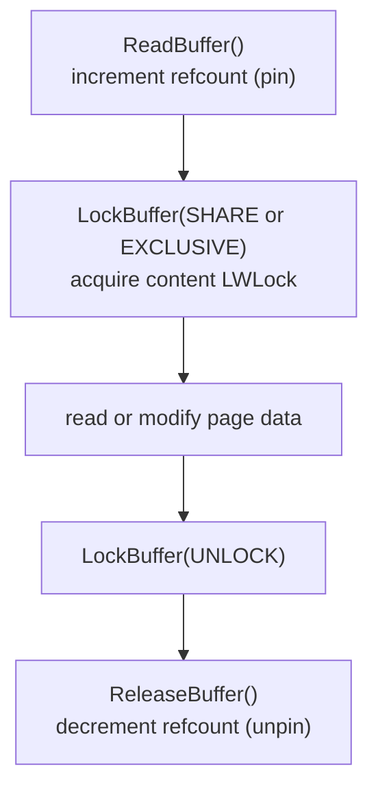

# Buffer Manager

Every heap page and index page that PostgreSQL reads or writes passes through the buffer manager. The buffer manager maintains a fixed pool of 8KB frames in shared memory (`shared_buffers`). When a backend needs a page, it asks the buffer manager to find or load it; when done, it releases its hold. When pages no longer fit in the pool, the buffer manager evicts them to make room, writing dirty pages to disk first.

The buffer manager is the primary mechanism by which all backends share access to on-disk data. No backend reads from or writes to heap or index files directly.

## Buffer pool structure

The pool is a flat array of `NBuffers` frames in shared memory, each exactly `BLCKSZ` (8KB) bytes. An array of `BufferDesc` structs runs parallel to the frame array, one per frame, and carries the metadata for the page currently in each frame.

A hash table (the buffer mapping table) maps `BufferTag` → frame index. PostgreSQL partitions the mapping table into `NUM_BUFFER_PARTITIONS` independent sections, each protected by its own [[subsystems/locking/lwlocks|LWLock]], to reduce contention on the common case of looking up a page already in the pool.

### BufferTag

`BufferTag` (`src/include/storage/buf_internals.h`) identifies a page uniquely:

| Field | Purpose |
|---|---|
| `spcOid` | Tablespace OID |
| `dbOid` | Database OID |
| `relNumber` | Relation file number |
| `forkNum` | Fork: main data, [[subsystems/storage/fsm|FSM]], [[subsystems/storage/visibility-map|visibility map]], init |
| `blockNum` | Block number within the fork |

### BufferDesc

A `BufferDesc` (line 244) describes each frame in the pool, sized to fit within one cache line (≤ 64 bytes). Fitting within a single cache line is deliberate: because every pin, unpin, and lock acquisition touches this struct, cache-line alignment eliminates false sharing between concurrent operations on different frames.

| Field | Purpose |
|---|---|
| `tag` | Which page is in this frame |
| `buf_id` | Index of this frame in the pool (never changes) |
| `state` | Packed 32-bit word: 18-bit refcount + 4-bit usage count + 10-bit flags |
| `content_lock` | LWLock for shared/exclusive access to page contents |
| `wait_backend_pgprocno` | Backend waiting for pin count to drop to 1 (for cleanup lock) |

Packing refcount, usage count, and flags into a single `pg_atomic_uint32` lets the buffer manager update all three atomically with a compare-and-swap loop, avoiding a separate spinlock for the common case.

**State flags** (selected):

| Flag | Meaning |
|---|---|
| `BM_DIRTY` | Page has been modified and must be written before eviction |
| `BM_VALID` | Frame contains a valid page |
| `BM_IO_IN_PROGRESS` | A read or write is in progress for this frame |
| `BM_JUST_DIRTIED` | Dirtied since the last write started (for WAL ordering) |
| `BM_PIN_COUNT_WAITER` | A backend is waiting for the pin count to drop to 1 |
| `BM_PERMANENT` | Frame is pinned permanently (never evicted) |

**Usage count** (4 bits, max 5): pinning a buffer increments it, and the clock sweep decrements it. It approximates recency: frequently accessed pages accumulate a higher count and survive more sweep passes before being chosen for eviction.

## Access protocol

Every access to a heap or index page follows the same four-step pattern:

The protocol separates two concerns that must not be conflated: keeping a frame from being recycled, and controlling concurrent read/write access to its contents.

A **pin** (`ReadBuffer()`, `bufmgr.c`) is a promise from the buffer manager that the frame will not be evicted for the duration of the operation — the page data remains stable at a known address in shared memory. Pinning alone does not grant the right to read or modify page contents; it only prevents the frame from being recycled. The refcount tracking this is part of the packed `state` word in `BufferDesc`.

**Content locks** (`LockBuffer()`, `bufmgr.c`) are the second layer. A reader acquires the frame's `content_lock` LWLock in shared mode; a writer acquires it in exclusive mode. Separating the pin from the content lock allows multiple backends to hold a pin simultaneously while serialising only the actual data access — a backend waiting for the exclusive lock does not need to re-acquire its pin.

Once a writer has modified a page and is ready to release the exclusive lock, it marks the frame dirty by calling `MarkBufferDirty()` (`bufmgr.c`). This sets `BM_DIRTY` and `BM_JUST_DIRTIED` atomically; the WAL machinery uses `BM_JUST_DIRTIED` to detect pages that were dirtied after a checkpoint write began. The frame will not be reused until its contents have been flushed to disk.

Releasing the pin (`ReleaseBuffer()`, `bufmgr.c`) decrements the refcount. When refcount reaches zero the frame becomes eligible for eviction by the clock sweep. To turn a buffer number into a pointer to the actual bytes in shared memory, callers use `BufferGetPage()` (an inline in `bufmgr.h`, line 357), which does nothing more than index into the frame array; it is called between pin and unpin.

## Finding or loading a page

When a backend requests a page, the buffer manager first consults the partitioned hash table under a shared partition lock. If the tag is present, the buffer manager increments the frame's refcount atomically. The backend then proceeds immediately — this is the common, fast path. The partitioned design limits lock contention: concurrent lookups into different partitions proceed in parallel without blocking each other.

On a cache miss the buffer manager must bring the page into the pool. It selects a victim frame via the clock sweep (see below). It evicts the victim's current contents, writing to disk first if dirty. It reads the requested page from disk into the frame. It inserts the new `BufferTag` into the hash table. It returns the pinned frame to the caller (`ReadBufferExtended()`, `bufmgr.c`).

Some callers need slightly different behaviour, controlled by the `ReadBufferMode` argument to `ReadBufferExtended()`:
- `RBM_NORMAL` — standard read; validates the page header.
- `RBM_ZERO_AND_LOCK` — returns a zeroed frame locked exclusively, without reading disk (used when extending a relation).
- `RBM_ZERO_ON_ERROR` — reads from disk but zeroes the page on a checksum error rather than panicking.

**PostgreSQL 17:** Sequential heap and index scans issue vectored `ReadBuffer` calls, merging adjacent block requests into a single read syscall. The `io_combine_limit` GUC (default 16 blocks) caps the maximum number of blocks merged per syscall. `ANALYZE` benefits from the same mechanism. This reduces system call overhead and improves throughput on both spinning and solid-state storage.

**PostgreSQL 18:** A dedicated asynchronous I/O (AIO) subsystem (`src/backend/storage/aio/`) replaces the synchronous read path for eligible operations. The `io_method` GUC selects the backend: `sync` (default, preserves prior behaviour), `worker` (async dispatch via background workers), or `io_uring` (Linux kernel async I/O). The AIO layer batches and dispatches I/O requests asynchronously, overlapping CPU and disk work. Sequential scans, bitmap heap scans, and VACUUM all benefit. The `pg_aios` view exposes currently open AIO file handles. `io_max_combine_limit` sets the upper bound on block merging for the AIO path. Additionally, PostgreSQL 18 raised the defaults for `effective_io_concurrency` and `maintenance_io_concurrency` from 1 to 16, allowing the planner and maintenance operations to issue more concurrent I/O requests by default.

## Eviction: clock sweep

When no free frame is available, the buffer manager needs a replacement policy that approximates LRU without the cost of maintaining an explicit linked list or per-access timestamps. The clock sweep (`StrategyGetBuffer()`, `freelist.c`) achieves this using the 4-bit usage count in each `BufferDesc`.

The algorithm advances a shared clock hand through the `BufferDesc` array, skipping pinned frames (refcount > 0). For each unpinned frame it encounters, it decrements the usage count by one rather than evicting immediately. The algorithm only chooses a frame as a victim once its usage count has already dropped to zero.

The algorithm checks the freelist of completely unused frames first. When that is exhausted, the clock hand advances.

The usage count cap of 5 means a recently accessed page can survive up to five full passes of the clock hand before it becomes eligible for eviction. This approximates LRU without maintaining an explicit linked list or per-access timestamps, keeping the hot path cheap.

If the selected victim frame is dirty, the buffer manager must write it to disk before the frame can be reused. To reduce the latency this imposes on foreground backends, the [[subsystems/background/bgwriter|bgwriter]] process runs in the background, scanning ahead of the clock hand and proactively flushing dirty frames so that clean frames are available when eviction is needed.

## Buffer ring strategies

Sequential scans and bulk operations use *buffer rings* (`freelist.c`) — small private pools of frames that cycle in FIFO order, separate from the main clock sweep. Without this isolation, a large sequential scan would populate the entire buffer pool with pages it visits only once, evicting the working set of concurrent OLTP queries.

Within a ring, frames cycle. After reaching the end of the ring, the scan reuses the oldest frame, writing it to disk first if dirty.

| Strategy | Ring size | Used by |
|---|---|---|
| `BAS_BULKREAD` | 256 KB | Sequential scans |
| `BAS_BULKWRITE` | 16 MB | COPY, CREATE TABLE AS |
| `BAS_VACUUM` | 256 KB (configurable via `vacuum_buffer_usage_limit`) | VACUUM |

## See also

- [[subsystems/storage/heap]] — how heap pages are laid out within a buffer frame
- [[architecture/overview]] — buffer manager in the broader shared-memory picture
