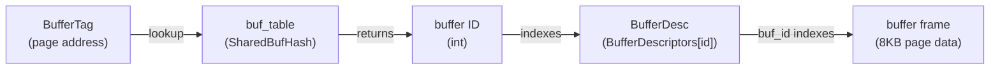

# Buffer Lookup Table

The buffer lookup table is a hash map in shared memory that answers one question: given a page address, is that page already loaded in the buffer pool, and if so, which slot holds it? It is the directory that makes the [[subsystems/storage/buffer-manager|shared buffer manager]] efficient — without it, finding a cached page would require scanning all of `shared_buffers`. Every buffer access begins with a lookup here, making it one of the most frequently consulted data structures in the system.

## The key and value: BufferTag and buffer ID

The hash map is keyed by `BufferTag`, a struct that uniquely identifies any on-disk page without consulting any catalog:

| Field | Purpose |
|---|---|
| `spcOid` | Tablespace OID |
| `dbOid` | Database OID |
| `relNumber` | Relation file number |
| `forkNum` | Fork: main data, [[subsystems/storage/fsm|FSM]], [[subsystems/storage/visibility-map|visibility map]], init |
| `blockNum` | Block number within the fork |

Because the hash table uses `BufferTag` as a raw hash key, every byte must be deterministic. `InitBufferTag()` must zero any padding bytes explicitly, since padding left uninitialized would produce different hash values for logically identical tags.

The value stored alongside each key is a plain `int` buffer ID — a zero-based index into the `BufferDescriptors[]` array. The entry type is `BufferLookupEnt`, which is simply `{BufferTag key; int id;}`. The table stores nothing else: all page state (pin count, dirty flag, usage count) lives in the descriptor array, not here. The lookup table is purely a directory.

## Partitioned locking for concurrent access

A single lock protecting the entire hash table would serialize all buffer lookups across all backends. Instead, PostgreSQL divides the table into `NUM_BUFFER_PARTITIONS` (128) independent partitions, each guarded by its own [[subsystems/locking/lwlocks|LWLock]] from the `BufMappingLock` family.

The tag's hash code determines its partition:

```
partition = BufTableHashCode(tag) % NUM_BUFFER_PARTITIONS
```

`BufTableHashCode()` computes the hash once and returns it to the caller. The caller uses that same value to identify the right partition lock and passes it into every subsequent table operation. Computing the hash only once matters because `hash_any` is not free. The caller also needs the partition index both to acquire the lock and to pass it to the hash table internals.

`BufMappingPartitionLock()` maps a hash code to the corresponding `LWLock*` from the global `MainLWLockArray`. With 128 partitions, 128 backends can perform simultaneous lookups into distinct partitions without any contention. Because `NUM_BUFFER_PARTITIONS` must be a power of two, the modulo reduces to a bitwise AND.

## The three table operations

`buf_table.c` exposes exactly three mutating operations. Each has a fixed locking requirement that the caller is responsible for satisfying before calling in:

**BufTableLookup** requires the caller to hold at least a shared-mode lock on the partition lock. It returns the buffer ID if the tag is present, or -1 if not. Shared mode is sufficient because a lookup is a read-only probe.

**BufTableInsert** requires an exclusive lock on the partition lock. It inserts a new entry and returns -1 on success. If an entry for that tag already exists (a race where another backend loaded the same page first), it returns the existing buffer ID instead of overwriting it. The caller treats a non-negative return as a signal to abandon the frame it was about to use and instead pin the already-loaded one.

**BufTableDelete** requires an exclusive lock on the partition lock. It removes the entry for a tag and raises an error if no such entry exists, since a missing entry would indicate hash table corruption.

The design deliberately leaves locking to callers rather than handling it internally. After a lookup or insert, the caller must update the buffer descriptor state — incrementing the pin count, setting `BM_TAG_VALID`, and so on — before releasing the partition lock. If the lock were released inside the table operation, another backend could evict the frame between the lookup and the pin.

## Sizing: InitBufTable

`InitBufTable()` creates the hash table in shared memory via `ShmemInitHash()`. `InitBufTable()` sizes the table relative to `NBuffers` (the number of buffer frames). The caller passes a `size` argument that may be slightly larger than `NBuffers` to leave headroom. Because every frame can hold at most one page at a time, the table never needs more than `NBuffers` live entries. Extra capacity, however, reduces hash collision probability and avoids resizing during operation. The `HASH_PARTITION` flag tells the dynahash subsystem to divide the table into the partition structure described above.

## The lookup-then-pin gap

The table returns a buffer ID, not a pinned buffer. The caller must separately acquire a pin on the corresponding `BufferDesc` before the partition lock is released. This two-step — consult the table, then pin the descriptor — is not atomic. The sequence is carefully ordered to be safe:

1. Compute hash code; acquire shared partition lock.
2. Call `BufTableLookup()` to get the buffer ID.
3. Atomically increment the refcount in `BufferDesc.state` (pinning the buffer).
4. Release the partition lock.
5. Verify that the descriptor's tag still matches the target tag (another backend might have evicted the frame between step 2 and 3 — but only if the refcount was zero at the time, which it cannot be once the pin is held).

The safety guarantee rests on the eviction protocol: a frame cannot be evicted and its table entry removed while any backend holds a pin on it. The protocol holds the partition lock across steps 2 and 3, precisely to prevent a concurrent eviction from removing the entry after it is found but before the pin is acquired.

## Relationship to BufferDescriptors

The table and the descriptor array are complementary structures that together form the buffer pool's control plane:



`buf_table.c` owns only the mapping from tag to index. The `BufferDesc` stores all page lifecycle state — whether the page is dirty, how many backends have pinned it, whether I/O is in progress, the usage count for the clock sweep. The table entry exists if and only if `BM_TAG_VALID` is set in the descriptor's state word; the partition lock keeps them consistent.

## See also

- [[subsystems/storage/buffer-manager|shared buffer manager]] — overall buffer pool design, pinning protocol, eviction
- [[subsystems/locking/lwlocks|LWLocks]] — the lock class used for partition locks
