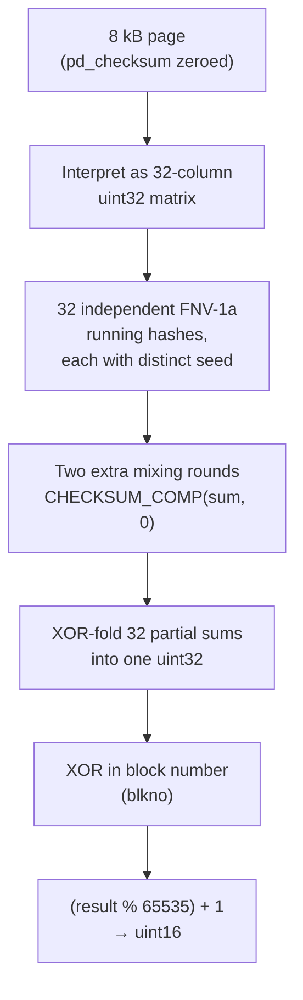
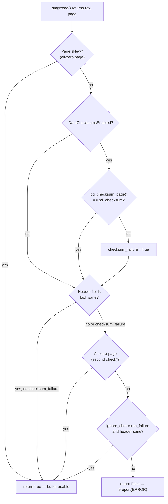

Page checksums give PostgreSQL an end-to-end way to detect storage corruption. Every 8 kB page carries a 16-bit checksum that is recomputed on each read from disk. A bit-flip, silent data loss, or partial write that modifies a page between its last write and a subsequent read therefore surfaces as a mismatch, rather than silently corrupting query results.

## Enabling checksums

Checksums are a cluster-wide, immutable property governed by a single field (`data_checksum_version`) in the global `pg_control` file. The field is either zero (disabled) or a positive version number (currently only version 1 exists and means enabled). There is no per-database or per-table override.

The standard path is `initdb --data-checksums` (`-k`). Since PostgreSQL 12, the offline `pg_checksums` tool can also enable or disable checksums on an existing shut-down cluster. Enabling on an existing cluster rewrites every data page to stamp the initial checksum value, making the operation proportional to total data size.

```sql
-- Check current status while the server is running
SHOW data_checksums;
SELECT setting FROM pg_settings WHERE name = 'data_checksums';
```

```sh
# Verify all pages (cluster must be stopped through PG 16; online verify added in PG 17)
pg_checksums --check   -D /var/lib/postgresql/data

# Stamp checksums on an existing cluster (requires clean shutdown)
pg_checksums --enable  -D /var/lib/postgresql/data

# Remove checksums
pg_checksums --disable -D /var/lib/postgresql/data
```

`DataChecksumsEnabled()` (`xlog.c`) simply reads the flag from the in-memory copy of the control file:

```c
bool
DataChecksumsEnabled(void)
{
    Assert(ControlFile != NULL);
    return (ControlFile->data_checksum_version > 0);
}
```

This is a hot path — called on every buffer read and write — so keeping it a single integer comparison matters.

## Where the checksum lives

The checksum occupies `pd_checksum`, the second 16-bit field of `PageHeaderData` (`src/include/storage/bufpage.h`):

| Field | Bytes | Description |
|---|---|---|
| `pd_lsn` | 8 | LSN of last WAL record modifying this page |
| `pd_checksum` | 2 | 16-bit checksum, or 0 if checksums are disabled |
| `pd_flags` | 2 | Flag bits (PD_HAS_FREE_LINES, etc.) |
| `pd_lower` | 2 | Byte offset to start of free space |
| `pd_upper` | 2 | Byte offset to end of free space |
| `pd_special` | 2 | Byte offset to start of special space |
| `pd_pagesize_version` | 2 | Page size and layout version |
| `pd_prune_xid` | 4 | Oldest XID that might be prunable here |

The checksum covers all 8192 bytes of the page, including the header. However, the algorithm zeroes the `pd_checksum` field itself before computation (and restores it afterwards), so its prior value cannot affect the result. The final value is guaranteed non-zero: the algorithm reduces the 32-bit intermediate with `(checksum % 65535) + 1`, mapping the result into the range [1, 65535].

All-zero pages — which arise when a backend extends a relation and then crashes before writing content — carry no checksum. The code calls `PageIsNew()` before either computing or verifying checksums on such pages.

## The checksum algorithm

The implementation lives in `src/include/storage/checksum_impl.h` as an inline header rather than a `.c` file, so that external tools (`pg_checksums`, `pg_filedump`) can use it by including the header without linking against the server.

The core challenge is throughput. On a system where the working set lives in the OS page cache but not in `shared_buffers`, pages can stream in at hundreds of MB/s. The checksum computation itself then becomes the bottleneck. Plain FNV-1a — `hash = (hash ^ value) * FNV_PRIME` — serialises every iteration on the previous result, which prevents instruction-level parallelism across the multiplication latency.

PostgreSQL's variant treats the 8 kB page as a two-dimensional array with 32 columns of 32-bit integers. Each column maintains an independent running hash, initialised to one of 32 distinct random constants (`checksumBaseOffsets`). Because the 32 partial hashes are independent, a processor with out-of-order execution or SIMD 32-bit multiply instructions (SSE4.1's `pmulld`, ARM NEON's `vmul.i32`) can advance all 32 simultaneously.

The per-word mixing step also extends plain FNV-1a with a right-shift to address weak high-bit avalanche:

```c
#define CHECKSUM_COMP(checksum, value) \
do { \
    uint32 __tmp = (checksum) ^ (value); \
    (checksum) = __tmp * FNV_PRIME ^ (__tmp >> 17); \
} while (0)
```

The developers chose the shift value 17 empirically: it shares no simple relationship with the bit positions of `FNV_PRIME` (16777619) and produces the fastest mixing of high bits into low positions in practice. After the main loop, two extra rounds of `CHECKSUM_COMP(..., 0)` flush the influence of the last real word into every bit position of all partial sums.

The final 32-bit XOR-fold of all 32 partial sums is then mixed with the block number before reduction to 16 bits:

```c
checksum ^= blkno;
return (uint16) ((checksum % 65535) + 1);
```

The block number XOR means a page that has been physically relocated to the wrong block offset within a relation file will fail verification. The algorithm catches transposition corruption just like bit-flip corruption.

The parallelism count of 32 is a fixed part of the algorithm: changing it would change the checksum output. The developers chose it as the largest state that fits within the architecturally visible x86 SSE registers, while leaving room for intermediate values.



## Writing checksums

PostgreSQL does not store the checksum in the shared buffer; it stamps the checksum on a copy of the page just before the OS write. This matters because the buffer is held only under a shared content lock during I/O. Concurrent hint-bit updates could therefore alter the page between when the checksum was computed and when the bytes hit disk. `PageSetChecksumCopy()` (`src/backend/storage/page/bufpage.c`) solves this by copying the page to a process-local static buffer, computing the checksum on the copy, and returning the copy to the write path:

```c
char *
PageSetChecksumCopy(Page page, BlockNumber blkno)
{
    /* Allocated once per backend in TopMemoryContext */
    if (pageCopy == NULL)
        pageCopy = MemoryContextAllocAligned(TopMemoryContext,
                                             BLCKSZ, PG_IO_ALIGN_SIZE, 0);

    memcpy(pageCopy, (char *) page, BLCKSZ);
    ((PageHeader) pageCopy)->pd_checksum = pg_checksum_page(pageCopy, blkno);
    return pageCopy;
}
```

The shared buffer itself retains whatever `pd_checksum` value it had (typically 0 or the previous checksum). Only the copy written to disk carries the fresh checksum.

When the caller holds an exclusive lock and no concurrent modification is possible — bulk loading, WAL segment initialization, `pg_checksums --enable` — `PageSetChecksumInplace()` sets `pd_checksum` directly on the page without copying.

Unlogged and temporary tables are exempt from checksums. The buffer manager identifies permanent buffers with the `BM_PERMANENT` flag (`src/include/storage/buf_internals.h`); unlogged relation pages lack this flag, and the write path skips them.

## Verifying checksums on read

Every page that enters shared buffers from disk passes through `PageIsVerifiedExtended()` (`src/backend/storage/page/bufpage.c`) before becoming visible to other backends. The call site in `ReadBufferExtended` is immediately after `smgrread`:

```c
smgrread(smgr, forkNum, blockNum, bufBlock);

if (!PageIsVerifiedExtended((Page) bufBlock, blockNum,
                             PIV_LOG_WARNING | PIV_REPORT_STAT))
{
    if (mode == RBM_ZERO_ON_ERROR || zero_damaged_pages)
        MemSet((char *) bufBlock, 0, BLCKSZ);   /* last-resort zeroing */
    else
        ereport(ERROR, (errcode(ERRCODE_DATA_CORRUPTED), ...));
}
```

`PageIsVerifiedExtended` performs two independent checks. First, if checksums are enabled, it recomputes `pg_checksum_page()` and compares the result to `pd_checksum`. Second, it checks header sanity: `pd_lower <= pd_upper <= pd_special <= BLCKSZ` and `pd_special` is `MAXALIGN`-aligned. A page can fail either check independently.

All-zero pages pass unconditionally — they are a normal consequence of relation extension followed by a crash.



The `PIV_LOG_WARNING` flag causes a `WARNING`-level log entry naming the block number and relation path. The `PIV_REPORT_STAT` flag increments the failure counter visible in `pg_stat_database`.

Reads served from an already-populated shared buffer skip `PageIsVerifiedExtended` entirely — verification happens exactly once, when the page first crosses the OS-to-shared-buffer boundary.

## Failure response

When verification fails the caller raises `ereport(ERROR)` with `errcode(ERRCODE_DATA_CORRUPTED)`, aborting the current transaction. The backend session can continue and serve new queries. Other backends are unaffected.

Two GUCs alter this behavior:

**`ignore_checksum_failure`** (`PGC_SUSET`, default off) — when set, `PageIsVerifiedExtended` returns true despite a checksum mismatch as long as the header sanity check passes. PostgreSQL still logs the WARNING, and the stat counter still increments. This is a forensic recovery tool: it lets operators run `pg_dump` or targeted `SELECT` statements against a cluster with known, localized corruption to salvage uncorrupted rows. Using it in production risks cascading corruption, because PostgreSQL makes no guarantees about safe execution against a page whose content may be arbitrary.

**`zero_damaged_pages`** (`PGC_SUSET`, default off) — when verification fails and this GUC is on, PostgreSQL zeroes the buffer and emits a WARNING instead of raising an error. This destroys the content of affected pages but allows queries to complete.

```sql
-- Forensic data extraction from a cluster with known, contained corruption
SET ignore_checksum_failure = on;
\COPY possibly_corrupted_table TO '/tmp/recovered.csv' CSV;
SET ignore_checksum_failure = off;
```

## Checksums vs torn pages

A torn write occurs when a write system call is interrupted mid-page — for instance, a system crash after the first 4 kB of an 8 kB page has been flushed — leaving a mix of old and new content on disk. Because the stored checksum was computed over the complete new page, the checksum of the torn hybrid almost certainly does not match. Checksums therefore detect both storage-layer corruption and torn writes through the same mechanism.

`full_page_writes = on` (the default) is a complementary, preventative defence. After each checkpoint, the first modification to a page writes a Full Page Image (FPI) into the WAL record. During crash recovery, the WAL replayer can restore the complete pre-modification page from the FPI before applying the change record, sidestepping any torn write that might have occurred during the crash. With `full_page_writes = off`, crash recovery must trust that on-disk pages are internally consistent — a torn write during a crash can produce unrecoverable corruption whether or not checksums are enabled.

The combination to be wary of is `full_page_writes = off` with checksums enabled. Checksums will detect corruption caused by torn writes, but recovery cannot repair the damage, since no FPI was written to WAL. The checksum failure becomes a dead end rather than a recoverable event.

### [[subsystems/transactions/hint-bits|Hint bits]] and `XLOG_FPI_FOR_HINT`

Hint bits (transaction visibility flags set as a side effect of reads) do not normally produce WAL records. With checksums enabled, setting a hint bit changes the page content, making the previously written checksum stale. If the page is flushed with the new hint bit content and a torn write occurs, crash recovery has no FPI from which to restore the page.

PostgreSQL handles this by writing an `XLOG_FPI_FOR_HINT` WAL record — containing the full page image — the first time a hint bit is set on a page since the last checkpoint (`MarkBufferDirtyHint`, `bufmgr.c`). This is why `XLogHintBitIsNeeded()` includes the checksum condition:

```c
#define XLogHintBitIsNeeded() (DataChecksumsEnabled() || wal_log_hints)
```

Both checksums and the `wal_log_hints` GUC trigger this extra WAL writing, because both scenarios need a durable FPI to protect hint bit flushes from torn-write data loss.

## Observability

```sql
-- Cumulative checksum failures since last stats reset
SELECT datname,
       checksum_failures,
       checksum_last_failure
FROM pg_stat_database
WHERE checksum_failures > 0
   OR checksum_last_failure IS NOT NULL;
```

`checksum_failures` counts all mismatches regardless of whether `ignore_checksum_failure` was active. `checksum_last_failure` records the timestamp of the most recent mismatch in that database. A non-zero value warrants immediate investigation — checksum failures are always a sign of a hardware, firmware, or filesystem problem.

The `pg_checksums` offline verifier provides a complement:

```sh
# Offline scan — produces summary with bad block count
pg_checksums -D $PGDATA --check --progress --verbose
```

Exit code 1 means the tool found at least one mismatch; exit code 0 means all scanned pages verified cleanly.

## Performance overhead

The checksum calculation runs on every buffer write (as part of `PageSetChecksumCopy`) and every buffer read from disk. Reads from an already-loaded shared buffer skip verification, so the read-side cost is proportional to cache miss rate, not total read volume.

The typical reported overhead is around 1–2% CPU. The main variables are:

- **Cache hit rate** — a workload that reads entirely from `shared_buffers` pays essentially nothing for checksums on the read path.
- **Write rate** — every dirty buffer eviction pays for a full 8 kB `memcpy` plus the checksum computation in `PageSetChecksumCopy`. This is the cost that does not go away for write-heavy workloads.
- **SIMD availability** — GCC can auto-vectorize `pg_checksum_block` with `-msse4.1 -funroll-loops -ftree-vectorize`, reducing the multiplication loop to a handful of SIMD instructions. Without vectorization the scalar loop is measurably slower.
- **Working-set-fits-in-OS-cache-but-not-shared-buffers** — this is the worst-case scenario identified in the source comments. Pages cycle through the checksum code at OS cache speed, where the computation itself (not disk I/O) can become the limiting factor.

## Related Topics

- [[subsystems/storage/page-layout|Page Layout]] — defines the `PageHeaderData` structure that holds `pd_checksum` and the other header fields verified alongside the checksum.
- [[subsystems/storage/buffer-manager|Buffer Manager]] — the write and read paths where `PageSetChecksumCopy` and `PageIsVerifiedExtended` are called on every buffer eviction and cache miss.
- [[subsystems/wal/overview|WAL Overview]] — full-page writes (FPI) and `XLOG_FPI_FOR_HINT` complement checksums by enabling torn-write recovery; the two features interact directly.
- [[subsystems/wal/checkpoint|Checkpoint]] — checkpoints reset the full-page-write trigger, determining how often FPIs are written and therefore how checksums and torn-page protection interact after a crash.
- [[subsystems/transactions/hint-bits|Hint Bits]] — hint-bit updates force `XLOG_FPI_FOR_HINT` WAL records specifically when checksums are enabled, linking the two subsystems at the buffer-dirty path.
- [[subsystems/observability/pg-stat-database|pg_stat_database]] — exposes `checksum_failures` and `checksum_last_failure`, the primary runtime signal that page checksums have detected storage corruption.
- [[troubleshooting/bloat|Bloat]] — storage-level corruption detected by checksums can contribute to table bloat when damaged pages prevent normal vacuuming and tuple recycling.
