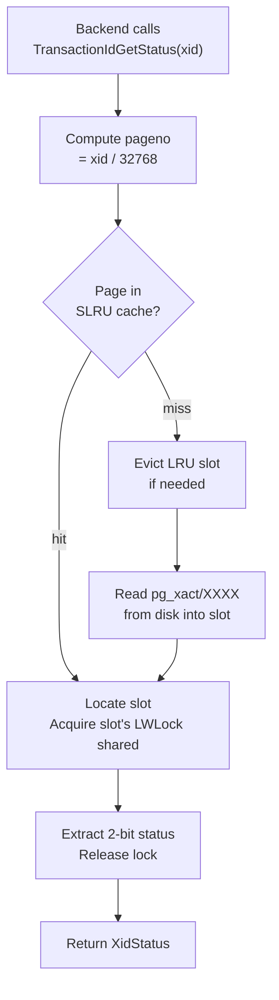
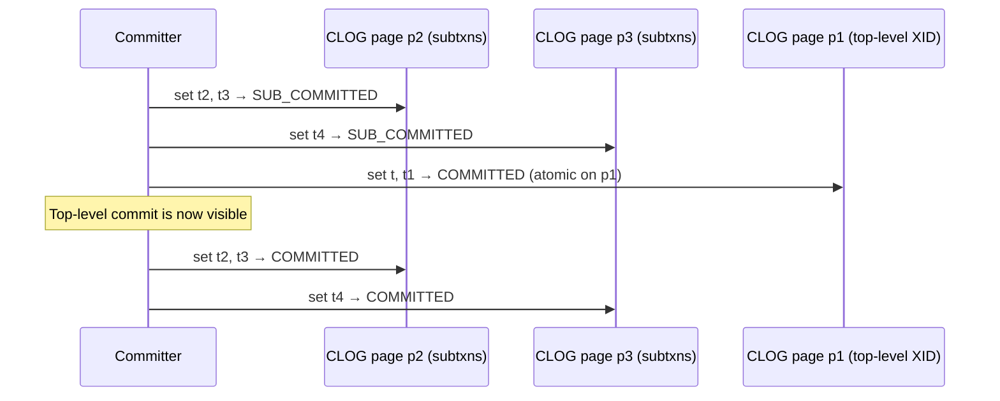
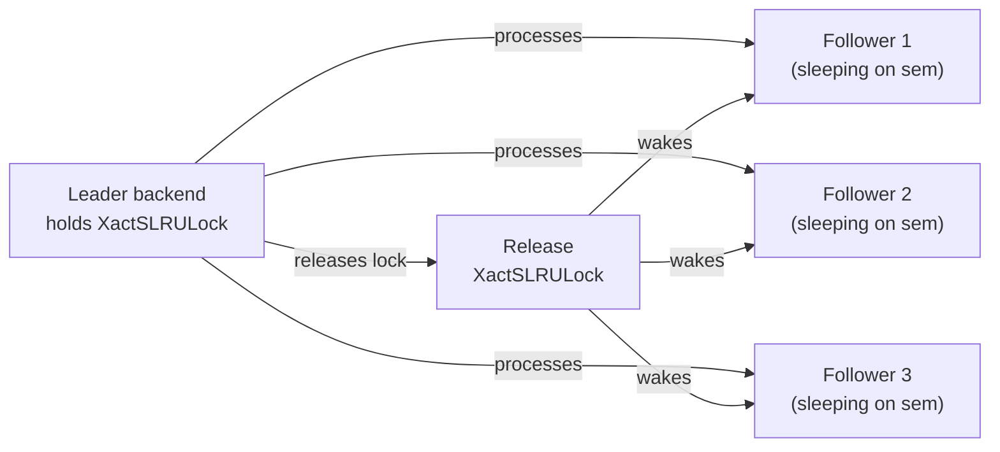
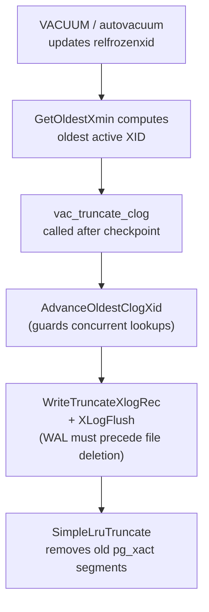
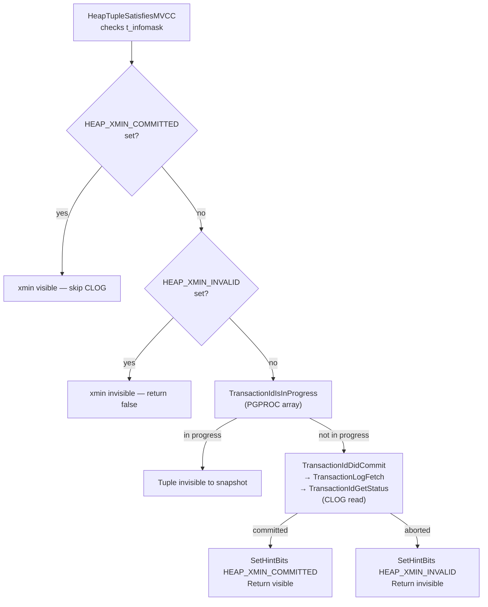

# Commit Log (CLOG / pg_xact)

The commit log is PostgreSQL's authoritative record of the final outcome of every transaction. For each transaction ID (XID), it stores a two-bit status: in-progress, committed, aborted, or sub-committed. Every visibility check that cannot be answered by hint bits in the tuple header must consult the commit log, making it one of the hottest data structures in the system.

The on-disk representation lives in `$PGDATA/pg_xact/` (renamed from `pg_clog` in PostgreSQL 10). In memory, the SLRU subsystem manages it through a module-local `SlruCtlData` instance named `XactCtl`.

## Two-bit encoding

Each XID occupies exactly two bits in the CLOG, packed four transactions per byte:

| Status constant | Value (binary) | Meaning |
|---|---|---|
| `TRANSACTION_STATUS_IN_PROGRESS` | `00` | Transaction is active or we do not know its outcome |
| `TRANSACTION_STATUS_COMMITTED` | `01` | Transaction committed |
| `TRANSACTION_STATUS_ABORTED` | `10` | Transaction aborted or crashed |
| `TRANSACTION_STATUS_SUB_COMMITTED` | `11` | Subtransaction committed; parent not yet resolved |

The `00` encoding for in-progress is deliberate: a freshly zeroed CLOG page requires no initialization beyond the zero-fill. `ZeroCLOGPage` always zeroes a new page before its first XID is assigned, so any XID that has never had its status set reads as in-progress.

`TRANSACTION_STATUS_SUB_COMMITTED` is a transient state used only during multi-page commit. It signals to a concurrent reader that the subtransaction's parent determines the final status; the reader must walk `pg_subtrans` to find the top-level XID and check its CLOG entry.

## XID-to-page mapping

The CLOG stores one bit-pair per XID, laid out sequentially across BLCKSZ (8 kB) pages:

| Macro | Formula | Value (default BLCKSZ=8192) |
|---|---|---|
| `CLOG_BITS_PER_XACT` | 2 | 2 bits |
| `CLOG_XACTS_PER_BYTE` | 4 | 4 transactions per byte |
| `CLOG_XACTS_PER_PAGE` | `BLCKSZ * 4` | 32,768 transactions per page |
| `SLRU_PAGES_PER_SEGMENT` | 32 (in slru.h) | 32 pages per segment file |
| Transactions per segment | `32,768 × 32` | 1,048,576 (≈ 1 M XIDs) |

Given an XID, the four address macros locate its bit-pair exactly:

```c
#define TransactionIdToPage(xid)    ((xid) / (TransactionId) CLOG_XACTS_PER_PAGE)
#define TransactionIdToPgIndex(xid) ((xid) % (TransactionId) CLOG_XACTS_PER_PAGE)
#define TransactionIdToByte(xid)    (TransactionIdToPgIndex(xid) / CLOG_XACTS_PER_BYTE)
#define TransactionIdToBIndex(xid)  ((xid) % (TransactionId) CLOG_XACTS_PER_BYTE)
```

The bit-pair for XID `x` sits at byte `TransactionIdToByte(x)` within its page, shifted left by `TransactionIdToBIndex(x) * 2` bits. The mask `CLOG_XACT_BITMASK` (`0x03`) extracts those two bits:

```c
/* from TransactionIdGetStatus */
status = (*byteptr >> bshift) & CLOG_XACT_BITMASK;
```

With a full 32-bit XID space, the CLOG requires at most 2^32 / 4 bytes = 1 GB on disk, spread across 4,096 segment files of 256 kB each. In practice, `TruncateCLOG` removes old segments regularly so the directory stays small.

## SLRU backing store

CLOG is one of several PostgreSQL subsystems that use the Simple LRU (SLRU) page cache. The SLRU provides a small fixed-size pool of shared-memory page buffers, an LRU eviction policy, and file I/O to a dedicated subdirectory. The module-static `XactCtlData` holds all CLOG state:

```c
static SlruCtlData XactCtlData;
#define XactCtl (&XactCtlData)
```

`CLOGShmemInit` calls `SimpleLruInit` with:
- **Buffer count**: `CLOGShmemBuffers()` — `min(128, max(4, NBuffers / 512))`. On a system with `shared_buffers = 128 MB` (16,384 buffers), this gives 32 CLOG buffers. The cap at 128 reflects empirical testing showing no throughput gain beyond that point.
- **LSN groups per page**: `CLOG_LSNS_PER_PAGE` = 1,024, used for async-commit WAL ordering (see below).
- **Lock**: the single `XactSLRULock` [[subsystems/locking/lwlocks|LWLock]] guards the entire CLOG buffer pool.

The `SlruSharedData` layout (in `slru.h`) is:

| Field | Purpose |
|---|---|
| `page_buffer[]` | Array of `num_slots` page-sized memory regions |
| `page_status[]` | `EMPTY / READ_IN_PROGRESS / VALID / WRITE_IN_PROGRESS` per slot |
| `page_dirty[]` | True if slot has unflushed modifications |
| `page_number[]` | Which CLOG page number occupies each slot |
| `page_lru_count[]` | Monotone counter snapshot at last use; used for LRU eviction |
| `cur_lru_count` | Global counter incremented on every access |
| `group_lsn[]` | Per-LSN-group maximum async-commit LSN (CLOG-specific) |
| `latest_page_number` | Hint to avoid evicting the current page |

Eviction selects the slot with the largest `cur_lru_count - page_lru_count[slot]` (i.e., least recently used), writes it to disk if dirty, and reuses the slot.



## Reading transaction status

The preferred call chain for visibility checks is:

```
HeapTupleSatisfiesMVCC
  └─ TransactionIdDidCommit          (transam.c)
       └─ TransactionLogFetch        (transam.c — checks per-backend cache first)
            └─ TransactionIdGetStatus (clog.c)
                 └─ SimpleLruReadPage_ReadOnly (slru.c)
```

`TransactionIdGetStatus` (`clog.c:638`) acquires `XactSLRULock` in shared mode via `SimpleLruReadPage_ReadOnly`. It extracts the two-bit status from the appropriate byte. It reads the group LSN for async-commit purposes. It releases the lock before returning:

```c
XidStatus
TransactionIdGetStatus(TransactionId xid, XLogRecPtr *lsn)
{
    int pageno  = TransactionIdToPage(xid);
    int byteno  = TransactionIdToByte(xid);
    int bshift  = TransactionIdToBIndex(xid) * CLOG_BITS_PER_XACT;
    int slotno;

    slotno  = SimpleLruReadPage_ReadOnly(XactCtl, pageno, xid);
    status  = (XactCtl->shared->page_buffer[slotno][byteno] >> bshift)
              & CLOG_XACT_BITMASK;
    *lsn    = XactCtl->shared->group_lsn[GetLSNIndex(slotno, xid)];
    LWLockRelease(XactSLRULock);
    return status;
}
```

`TransactionLogFetch` in `transam.c` wraps `TransactionIdGetStatus` with a **per-backend single-entry cache**, storing the most-recently-checked committed or aborted XID in `cachedFetchXid`. Because committed and aborted statuses are immutable, caching them is safe. `TransactionLogFetch` never caches in-progress and sub-committed results, since they may change.

## Writing transaction status

### Writing final status across a transaction tree

When a transaction commits or aborts, `TransactionIdSetTreeStatus` (`clog.c:162`) records the final status for the top-level XID and all its subtransaction XIDs. The challenge is that a transaction tree can span multiple CLOG pages. An atomic write is only possible within a single page.

The protocol for a cross-page commit is:



The `SUB_COMMITTED` intermediate state ensures that a concurrent reader encountering a subtransaction XID at step 2 will look up the parent XID in `pg_subtrans` to resolve its status rather than treating it as aborted. Once the top-level XID is committed (step 3), the overall transaction is durably committed even if the process crashes before completing steps 4–5; recovery will re-apply the commit WAL record.

### Encoding a status transition into the CLOG bit pair

The low-level bit manipulation lives in `TransactionIdSetStatusBit` (`clog.c:569`). It computes the byte address and shift, then reads the current byte. It masks out the two bits, ORs in the new status, and writes back the result. It also maintains the `group_lsn` array for async commits:

```c
byteval  = *byteptr;
byteval &= ~(((1 << CLOG_BITS_PER_XACT) - 1) << bshift);
byteval |= (status << bshift);
*byteptr = byteval;
```

An assertion guards legal transitions: a CLOG bit-pair may only move from `IN_PROGRESS (00)` to a final state, or from `SUB_COMMITTED (11)` to `COMMITTED (01)`. Status never regresses.

### Group commit optimization

Under heavy commit concurrency, many backends may contend for `XactSLRULock` when writing to the same CLOG page. `TransactionIdSetPageStatus` implements a **group update** mechanism: if the lock is busy, a backend enqueues itself on a lock-free linked list threaded through `PGPROC.clogGroupNext`. The first backend to hold `XactSLRULock` becomes the leader and processes all enqueued updates in a single lock hold, then wakes the followers via `PGSemaphoreUnlock`.



The group update mechanism only applies when all XIDs in the group land on the same CLOG page and the transaction has at most `THRESHOLD_SUBTRANS_CLOG_OPT` (5) sub-XIDs. Larger subtransaction trees fall back to direct locking.

## Async commit and WAL ordering

For synchronous commits, PostgreSQL has already flushed the WAL commit record before it calls `TransactionIdSetTreeStatus`, so the CLOG write ordering is trivially safe. For **async commits** (where `synchronous_commit = off`), the CLOG might reach disk before the WAL record does, which would violate the WAL rule.

To prevent this, CLOG maintains `group_lsn[]` — an array of `CLOG_LSNS_PER_PAGE` (1,024) LSN values per page, each covering 32 consecutive XIDs (`CLOG_XACTS_PER_LSN_GROUP`). When `TransactionIdSetStatusBit` records a committed status with a valid LSN, it updates the group LSN if the new LSN is higher. `SimpleLruWriteAll` then checks `group_lsn` and calls `XLogFlush` to flush WAL up to that point before writing the CLOG page.

`TransactionIdGetStatus` returns the group LSN alongside the status. Callers that need to ensure WAL durability (e.g., `HeapTupleSatisfiesDirty`) can use this LSN to verify that the commit record is on disk.

## Lifecycle management

### Initialization

`BootStrapCLOG` runs once during `initdb` to create and flush the first CLOG page (page 0). `StartupCLOG` runs at every server start to record `latest_page_number` for the SLRU hint. `TrimCLOG` runs after crash recovery to zero out any bytes beyond the last valid XID on the current page, preventing stale bits from a previous incarnation from being misread.

### Extension

The XID allocation path calls `ExtendCLOG(newestXact)` while it holds `XidGenLock`. It only does work when `newestXact` is the first XID on a new page (`TransactionIdToPgIndex(newestXact) == 0`). It zeros the new page and emits a `CLOG_ZEROPAGE` WAL record so that standby servers and crash recovery can reproduce the zeroing.

### Checkpointing

`CheckPointCLOG` calls `SimpleLruWriteAll`, which writes every dirty CLOG buffer to disk and queues fsync requests to the checkpointer. This ensures that after a checkpoint, all CLOG pages modified before the checkpoint LSN are durable without requiring WAL replay.

### Truncation

`vac_truncate_clog` calls `TruncateCLOG(oldestXact, oldestxid_datoid)` after a checkpoint, when VACUUM has established that no live transaction needs status information for XIDs older than `oldestXact`.



The cutoff is the page containing `oldestXact`. `SimpleLruTruncate` removes all segment files whose highest page precedes the cutoff according to `CLOGPagePrecedes`. The page-ordering comparison uses modular XID arithmetic to handle wraparound correctly:

```c
static bool CLOGPagePrecedes(int page1, int page2)
{
    TransactionId xid1 = ((TransactionId) page1) * CLOG_XACTS_PER_PAGE
                         + FirstNormalTransactionId + 1;
    TransactionId xid2 = ((TransactionId) page2) * CLOG_XACTS_PER_PAGE
                         + FirstNormalTransactionId + 1;
    return (TransactionIdPrecedes(xid1, xid2) &&
            TransactionIdPrecedes(xid1, xid2 + CLOG_XACTS_PER_PAGE - 1));
}
```

Before deleting any files, `TruncateCLOG` calls `AdvanceOldestClogXid` to update the global `ShmemVariableCache->oldestClogXid`. Concurrent callers of `TransactionIdGetStatus` that would attempt to read a truncated page will detect the stale XID and raise an error rather than returning garbage.

`TruncateCLOG` WAL-logs the truncate operation with a `CLOG_TRUNCATE` record carrying the cutoff page number and `oldestXact`. On standby replay, `clog_redo` calls `SimpleLruTruncate` to keep the standby's `pg_xact/` directory in sync.

## Interaction with hint bits

Reading CLOG on every visibility check would be prohibitively expensive. PostgreSQL caches commit status in the tuple header using **hint bits** in `t_infomask`:

| Hint bit | Mask | Meaning |
|---|---|---|
| `HEAP_XMIN_COMMITTED` | `0x0100` | `t_xmin` is known committed; no CLOG check needed |
| `HEAP_XMIN_INVALID` | `0x0200` | `t_xmin` is known aborted/crashed |
| `HEAP_XMIN_FROZEN` | `0x0300` | Both bits set; tuple is frozen, always visible |
| `HEAP_XMAX_COMMITTED` | `0x0400` | `t_xmax` is known committed |
| `HEAP_XMAX_INVALID` | `0x0800` | `t_xmax` is invalid (no live deleter) |

The hint-bit write path in `heapam_visibility.c` is `SetHintBits` (private) / `HeapTupleSetHintBits` (exported):

```c
static inline void
SetHintBits(HeapTupleHeader tuple, Buffer buffer,
            uint16 infomask, TransactionId xid)
{
    if (TransactionIdIsValid(xid)) {
        XLogRecPtr commitLSN = TransactionIdGetCommitLSN(xid);
        if (BufferIsPermanent(buffer) && XLogNeedsFlush(commitLSN) &&
            BufferGetLSNAtomic(buffer) < commitLSN)
            return;   /* WAL not yet flushed; defer hint */
    }
    tuple->t_infomask |= infomask;
    MarkBufferDirtyHint(buffer, true);
}
```

PostgreSQL defers setting a committed hint bit when the commit's WAL record has not yet been flushed to disk (async commit scenario). Writing the hint bit to a permanent table would otherwise let a reader infer the CLOG conclusion from the heap page before the commit is durable. Once the WAL is flushed, any future visibility check on the same tuple will find the hint bit and skip the CLOG entirely.

`MarkBufferDirtyHint` marks the buffer dirty without updating the page LSN (the page LSN is only updated for WAL-logged changes). The hint bit therefore does not generate a WAL record of its own; crash recovery reconstructs it by re-reading CLOG.

The full visibility check fast path is:



The PGPROC check (`TransactionIdIsInProgress`) must precede the CLOG check to close a race window: `xact.c` writes the commit status to CLOG before clearing `MyProc->xid` in the shared PGPROC array. Without checking PGPROC first, a backend could observe a just-committed XID as committed in CLOG while a concurrent `GetSnapshotData` still sees it as in-progress, leading to snapshot anomalies.

## CLOG vs pg_subtrans

CLOG and `pg_subtrans` are complementary but distinct:

| Property | CLOG / pg_xact | pg_subtrans |
|---|---|---|
| Stores | Final commit/abort status per XID | Parent XID for each subtransaction XID |
| Data per XID | 2 bits | 4 bytes (one `TransactionId`) |
| SLRU buffers | Up to 128 | Fixed 32 |
| Retained after commit | Until VACUUM advances `relfrozenxid` | Only until oldest active XID passes |
| Read on visibility check | Yes (if no hint bit) | Only when `SUB_COMMITTED` status found in CLOG |

When `TransactionIdGetStatus` returns `TRANSACTION_STATUS_SUB_COMMITTED`, the caller must call `SubTransGetTopmostTransaction(xid)` to find the top-level XID, then re-read CLOG for that XID. This two-level lookup handles the window between steps 1–2 and 3 in the cross-page commit protocol described above.

## WAL records

The CLOG resource manager (`RM_CLOG_ID`) generates two types of records:

| Record type | Constant | When emitted | Redo action |
|---|---|---|---|
| Zero new page | `CLOG_ZEROPAGE` | `ExtendCLOG` allocates a new page | `ZeroCLOGPage` then `SimpleLruWritePage` |
| Truncate old segments | `CLOG_TRUNCATE` | `TruncateCLOG` before segment deletion | `AdvanceOldestClogXid` + `SimpleLruTruncate` |

The CLOG module itself does not WAL-log individual commit and abort status writes. `xact.c` records them as part of the transaction's commit or abort WAL record, which re-invokes `TransactionIdSetTreeStatus` during redo.

## See also

- [[subsystems/transactions/mvcc]] — how XID status feeds snapshot-based visibility
- [[subsystems/transactions/hint-bits]] — lazy caching of CLOG results in tuple headers
- [[subsystems/storage/slru]] — the Simple LRU layer that backs pg_xact on disk
- [[subsystems/wal/checkpoint]] — CheckPointCLOG and the truncation trigger
