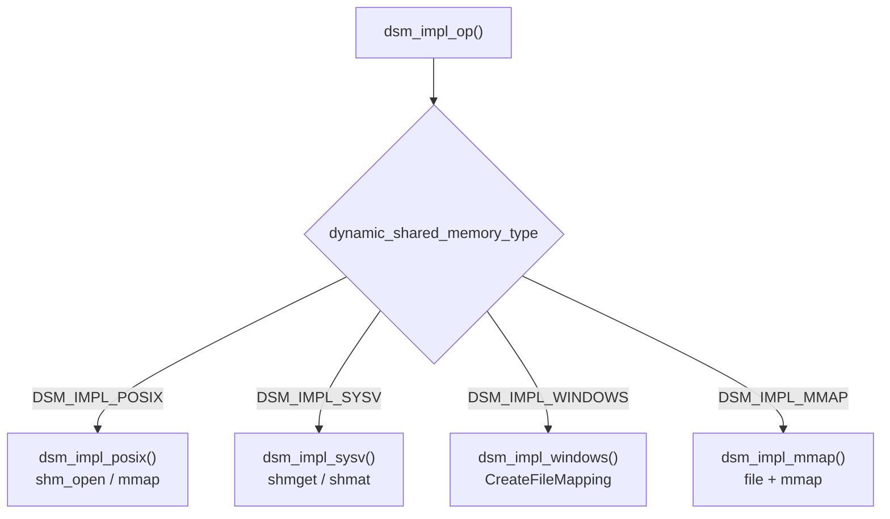

PostgreSQL's dynamic shared memory system provides a platform-neutral way for backends and parallel workers to allocate, share, and release memory segments at runtime. The higher-level API in `dsm.c` handles lifecycle tracking, cleanup callbacks, and the [[subsystems/storage/ipc-primitives|shared memory table of contents]] that lets workers locate their sub-regions. `dsm_impl.c` sits beneath it and translates the four abstract operations (create, attach, detach, destroy) into whichever OS mechanism the installation is configured to use.

## The four abstract operations

Every DSM backend implements a single interface: `dsm_impl_op()`. It accepts a `dsm_op` enum and a `dsm_handle` (a `uint32` identifier chosen by the caller). It dispatches to the appropriate platform implementation. The four operations are:

- **`DSM_OP_CREATE`** — allocate a new segment of a requested size and map it into the calling process's address space.
- **`DSM_OP_ATTACH`** — map an existing segment (identified by handle) into the calling process. The implementation discovers the segment's current size rather than relying on a caller-supplied value.
- **`DSM_OP_DETACH`** — unmap the segment from the calling process without destroying it; other processes continue to see it.
- **`DSM_OP_DESTROY`** — unmap and permanently delete the segment.

The function returns a boolean indicating success. It also accepts an `elevel` argument that controls whether failures are `ERROR`, `WARNING`, or silently ignored. This lets the caller treat a missing segment on attach as a soft failure rather than a crash.

## Platform selection and the GUC

The `dynamic_shared_memory_type` GUC controls which backend is active. At build time, `dsm_impl.h` detects the available mechanisms. It then sets `DEFAULT_DYNAMIC_SHARED_MEMORY_TYPE`: POSIX (`shm_open`) on platforms that support it, System V as the fallback on non-Windows UNIX systems, and Windows file mapping on Win32. The mmap backend is always compiled in on non-Windows platforms as an additional option. Administrators can change the GUC in `postgresql.conf`, but the change only takes effect at server restart.

## POSIX shared memory

The POSIX backend (`dsm_impl_posix()`) calls `shm_open()` with a name of the form `/PostgreSQL.<handle>`, sizes the object with `ftruncate()` or `posix_fallocate()`, then maps it with `mmap()`. The backend closes the file descriptor immediately after mapping; only the memory mapping itself persists in the process.

On Linux, `shm_open` creates a file in a `tmpfs` mount. A plain `ftruncate` would leave a sparse file full of holes. Accessing an unmapped hole causes `tmpfs` to allocate pages on demand; if `/dev/shm` is full, this raises `SIGBUS` rather than a clean error. The POSIX backend avoids this by calling `posix_fallocate()` on Linux. This eagerly pre-allocates the space and returns `ENOSPC` at creation time if memory is unavailable.

The flat namespace is a practical limitation. On most systems the name lives in `/dev/shm`. Two PostgreSQL clusters on the same host can collide if they pick the same random handle value. The collision probability is low given the 32-bit handle space, but it is non-zero. On some platforms (notably older macOS), the OS treats `shm_open` names as root-filesystem paths (`/PostgreSQL.<handle>` creates a real file in `/`). This is incorrect behavior, and those platforms should use a different backend.

## System V shared memory

The System V backend (`dsm_impl_sysv()`) maps the `dsm_handle` to a `key_t` and calls `shmget()`, `shmat()`, `shmdt()`, and `shmctl()`. The main practical disadvantage is that the kernel imposes low default limits on segment count (`SHMMNI`), total shared memory (`SHMALL`), and maximum segment size (`SHMMAX`). On many default Linux installations these limits are generous enough for typical PostgreSQL workloads, but databases with heavy parallel query use can exhaust them. Administrators must raise kernel parameters via `sysctl` if they hit these limits.

System V segments also have a subtlety: `shmget()` requires knowing the exact size when creating a segment, but must receive size `0` when looking up an existing one (the kernel returns `EINVAL` if the lookup size exceeds the actual segment size). The implementation handles this by always passing `0` for `DSM_OP_ATTACH` and the requested size only for `DSM_OP_CREATE`.

The System V namespace uses numeric keys rather than string names. This sidesteps the POSIX namespace collision problem, but introduces a different one: the special value `IPC_PRIVATE` (key `0`) cannot be used. The backend detects this case during create and reports `EEXIST`. This causes the caller to retry with a different handle.

## mmap backend

The mmap backend (`dsm_impl_mmap()`) avoids both POSIX and System V by creating regular files under the `pg_dynshmem/` directory (named `mmap.<handle>`) and mapping them with `mmap(MAP_SHARED)`. It is the most portable option. It is also the only one that survives a server crash in recoverable form, since the files persist on disk until explicitly deleted.

The write-to-disk behavior is the primary drawback. The OS may flush dirty pages to the backing file even when there is no memory pressure. This adds latency to shared memory writes. Placing `pg_dynshmem/` on a `tmpfs` or RAM disk eliminates this overhead. Segment creation is also slower than the other backends because the file must be zero-filled in full before mapping (`write()` loop in `ZBUFFER_SIZE` chunks). This ensures that all disk space is pre-allocated and that later accesses cannot fail with `SIGBUS`.

## Windows backend

On Windows, dynamic shared memory uses `CreateFileMapping()` backed by the system paging file rather than a real file. This is the closest Windows equivalent to POSIX shared memory. The Windows backend names segments in the `Global\` namespace so that any session can open them. The kernel reference-counts Windows file mapping objects and destroys them automatically when the last handle is closed. This is semantically different from the UNIX backends, where destroy is an explicit operation. To keep a segment alive even when no backend has it attached (needed for segments that outlive their creator), the postmaster duplicates the handle into its own process via `DuplicateHandle()` in `dsm_impl_pin_segment()` — the only platform where this function does any real work.

## Segment pinning and the postmaster

`dsm_impl_pin_segment()` and `dsm_impl_unpin_segment()` allow the higher-level DSM layer to keep a segment alive beyond its creator's lifetime. On POSIX, System V, and mmap platforms, segments persist independently of which processes have them mapped. These functions are therefore no-ops on those platforms. On Windows, the automatic cleanup on last-handle-close means the postmaster must hold an open handle to prevent premature destruction.

## Choosing a backend

The default selection is appropriate for most deployments. POSIX (`posix`) is the right choice on Linux and modern BSD systems — it is fast, uses `tmpfs`-backed memory, and avoids kernel tuning. System V (`sysv`) is available as a fallback when `shm_open` is absent or broken, but may require raising kernel limits with `sysctl`. The mmap backend (`mmap`) trades performance for universality. It is most useful on platforms that lack both POSIX and System V shared memory, or in environments where the `pg_dynshmem/` directory is on a RAM disk.

## See also

- [[subsystems/storage/shared-memory|Static Shared Memory]]
- [[subsystems/storage/ipc-primitives|IPC Primitives: Exit Callbacks and Shared Memory TOC]]
- [[subsystems/storage/parallel-barriers|Parallel Barriers]]
- [[architecture/process-architecture|Process Model]]
