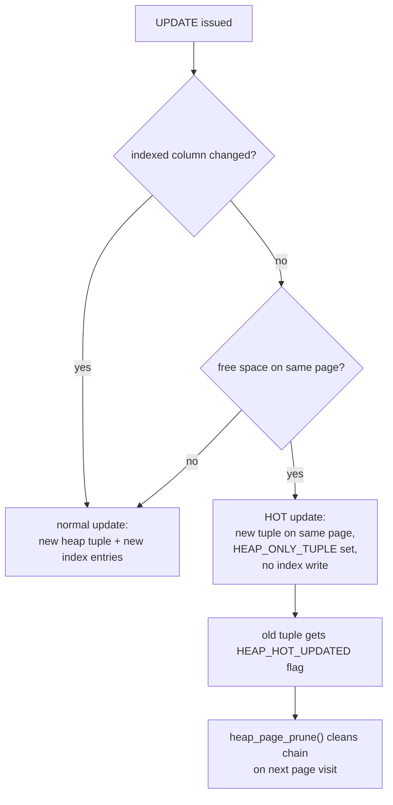

# Fillfactor and HOT Updates

Fillfactor is a storage parameter that controls how full PostgreSQL allows a page to become when inserting new rows or index entries. Leaving free space on data pages enables a critical optimisation called Heap-Only Tuples (HOT), which lets UPDATE write a new tuple version without touching any index. Understanding how fillfactor interacts with HOT, [[subsystems/background/autovacuum|autovacuum]], and index maintenance is central to tuning write-heavy tables.

## How PostgreSQL reads the fillfactor

Every relation's storage parameters are kept in `pg_class.reloptions` as a text array and decoded at open time into an `StdRdOptions` struct (`src/include/access/reloptions.h`):

```c
typedef struct StdRdOptions {
    int32   vl_len_;               /* varlena header */
    int     fillfactor;            /* fillfactor, 10–100 */
    AutoVacOpts autovacuum;        /* per-relation autovacuum overrides */
    bool    user_catalog_table;
    int     parallel_workers;
    bool    vacuum_index_cleanup;
    bool    vacuum_truncate;
} StdRdOptions;
```

Two macros wrap the common access pattern (`src/include/access/heapam.h`):

```c
#define RelationGetFillFactor(relation, defaultff) \
    ((relation)->rd_options ? \
     ((StdRdOptions *)(relation)->rd_options)->fillfactor : (defaultff))

#define RelationGetTargetPageFreeSpace(relation, defaultff) \
     (BLCKSZ * (100 - RelationGetFillFactor(relation, defaultff)) / 100)
```

`RelationGetTargetPageFreeSpace()` converts the percentage to a byte target. The heap insertion code in `heapam.c` calls `PageGetHeapFreeSpace()` against each candidate page; that function accounts for both actual free bytes and the space needed by a new line pointer slot in the page header. As a result, pages that have plenty of body space but a full line-pointer array are still treated as full.

## Default fillfactor values by relation type

| Relation type | Default fillfactor | Source constant |
|---|---|---|
| Heap (table) | 100 | `HEAP_DEFAULT_FILLFACTOR` |
| B-tree index | 90 | `BTREE_DEFAULT_FILLFACTOR` |
| GiST index | 90 | `GIST_DEFAULT_FILLFACTOR` |
| SP-GiST index | 80 | `SPGIST_DEFAULT_FILLFACTOR` |
| GIN index | 60 | `GIN_DEFAULT_FILLFACTOR` |
| BRIN index | 90 | `BRIN_DEFAULT_FILLFACTOR` |
| Hash index | 75 | `HASH_DEFAULT_FILL_FACTOR` |

Heap tables default to 100 because the HOT mechanism already recovers space without explicit reservation. Index defaults are lower because page splits are more expensive to recover from than heap bloat.

## HOT update mechanics

A HOT update occurs when all three conditions hold: the updated row fits on the same page as the old version, no indexed column changed value, and there is free space on that page. When those conditions are met, PostgreSQL places the new tuple version on the same heap page and links it into the same heap chain, with no new index entries written anywhere.

Two tuple header flags mark the chain (`src/include/access/htup_details.h`):

- `HEAP_HOT_UPDATED` — set on the old version, indicating it was superseded by a HOT update.
- `HEAP_ONLY_TUPLE` — set on the new version, indicating it has no index entries of its own.

Index scans that reach a HOT chain follow the chain pointer from the index-visible root tuple to the latest live version without an additional index lookup. `heap_page_prune()` (`src/backend/access/heap/pruneheap.c`) prunes the chain. It runs opportunistically whenever a page is visited during a sequential scan or vacuum. Pruning redirects or removes dead chain members and recovers the line pointer slots.



HOT updates are pure heap operations. They avoid both the index write and the index dead-tuple cleanup that a normal update requires. This makes them dramatically cheaper on tables with many indexes.

## B-tree fillfactor and page splits

Fillfactor for a B-tree index limits how full leaf pages become during bulk load or index build. It does not directly control split point selection during live inserts after build. That responsibility belongs to `_bt_findsplitloc()` (`src/backend/access/nbtree/nbtsplit.c`). This function attempts to split a full page at a point that minimises wasted space given the observed insertion pattern.

What fillfactor actually controls is the initial packing density when the index is built via `CREATE INDEX` or `REINDEX`. A lower fillfactor leaves cushion for subsequent inserts. This defers the first split on each leaf page.

| Insert pattern | Suggested fillfactor | Rationale |
|---|---|---|
| Append-only (monotone key) | 90–100 | Pages fill sequentially; splits at the right edge are cheap |
| Random inserts, stable table | 70–80 | Cushion reduces split frequency across all leaf pages |
| Time-series with occasional backfill | 80–90 | Mostly sequential, but backfill hits older pages |
| Rarely updated, read-heavy | 100 after REINDEX | Maximise read density; splits only happen on writes |

After a split, the two resulting pages are each about half full regardless of the original fillfactor. The fillfactor only delays the first split; it does not set the long-run steady-state density.

## Setting and altering fillfactor

Storage parameters are set at table or index creation and changed with `ALTER TABLE ... SET (...)` or `ALTER INDEX ... SET (...)`:

```sql
-- Set at creation
CREATE TABLE orders (
    id   bigint PRIMARY KEY,
    status text
) WITH (fillfactor = 70);

CREATE INDEX orders_status_idx ON orders (status)
    WITH (fillfactor = 80);

-- Change later
ALTER TABLE orders SET (fillfactor = 75);
ALTER INDEX orders_status_idx SET (fillfactor = 85);
```

`ALTER TABLE SET (fillfactor = ...)` updates `pg_class.reloptions` immediately but does not rewrite the table. New inserts will respect the new value; PostgreSQL does not reorganise existing pages. To apply the new packing to existing data, repack explicitly:

```sql
-- Repack heap pages to new fillfactor
VACUUM FULL orders;
-- or, preserving physical order:
CLUSTER orders USING orders_pkey;

-- Repack an index
REINDEX INDEX orders_status_idx;
```

`VACUUM FULL` and `CLUSTER` both acquire an `ACCESS EXCLUSIVE` lock. For production systems, `pg_repack` (an extension) performs the same work without a prolonged lock.

## CLUSTER and fillfactor interaction

`CLUSTER` rewrites the heap in index order and respects the table's fillfactor when packing rows onto new pages. A table clustered with `fillfactor = 70` emerges with roughly 30% free space on each page. This makes subsequent HOT updates far more likely to find room on the same page. The interaction is especially valuable on tables with a dominant sequential access pattern: clustering physically co-locates rows that are read together. The fillfactor reservation keeps HOT updates working for those rows over time.

PostgreSQL does not maintain the cluster order automatically. Rows inserted after `CLUSTER` land wherever heap insertion places them. Periodic `CLUSTER` runs (or an equivalent `pg_repack` with `--order-by`) preserve the benefit.

## Inspecting storage parameters

```sql
-- Show reloptions for a table and its indexes
SELECT relname, reloptions
FROM   pg_class
WHERE  relname IN ('orders')
    OR (relkind = 'i'
        AND relname IN (
            SELECT indexname FROM pg_indexes WHERE tablename = 'orders'
        ));
```

`reloptions` is NULL when all values are at their defaults. A non-NULL value is a text array such as `{fillfactor=70,autovacuum_vacuum_scale_factor=0.01}`.

## Per-table autovacuum overrides

Fillfactor is one of several storage parameters that tune per-relation behaviour. The full set of heap autovacuum overrides, including [[subsystems/storage/toast|TOAST]] equivalents, is:

| Parameter | Type | TOAST equivalent | Notes |
|---|---|---|---|
| `fillfactor` | integer | — | 10–100; controls HOT headroom |
| `autovacuum_enabled` | boolean | `toast.autovacuum_enabled` | Disable for append-only staging tables |
| `autovacuum_vacuum_threshold` | integer | `toast.autovacuum_vacuum_threshold` | Minimum dead tuples before vacuum |
| `autovacuum_vacuum_scale_factor` | float | `toast.autovacuum_vacuum_scale_factor` | Fraction of reltuples; overrides GUC |
| `autovacuum_analyze_threshold` | integer | — | TOAST tables are not analyzed |
| `autovacuum_analyze_scale_factor` | float | — | |
| `autovacuum_vacuum_cost_delay` | integer | `toast.autovacuum_vacuum_cost_delay` | ms; -1 inherits GUC |
| `autovacuum_vacuum_cost_limit` | integer | `toast.autovacuum_vacuum_cost_limit` | -1 inherits GUC |
| `autovacuum_freeze_min_age` | integer | `toast.autovacuum_freeze_min_age` | |
| `autovacuum_freeze_max_age` | integer | `toast.autovacuum_freeze_max_age` | Triggers aggressive vacuum |
| `autovacuum_freeze_table_age` | integer | `toast.autovacuum_freeze_table_age` | |
| `autovacuum_multixact_freeze_min_age` | integer | `toast.autovacuum_multixact_freeze_min_age` | |
| `autovacuum_multixact_freeze_max_age` | integer | `toast.autovacuum_multixact_freeze_max_age` | |
| `autovacuum_multixact_freeze_table_age` | integer | `toast.autovacuum_multixact_freeze_table_age` | |
| `autovacuum_vacuum_insert_threshold` | integer | `toast.autovacuum_vacuum_insert_threshold` | Triggers vacuum on insert-only tables |
| `autovacuum_vacuum_insert_scale_factor` | float | `toast.autovacuum_vacuum_insert_scale_factor` | |
| `log_autovacuum_min_duration` | integer | `toast.log_autovacuum_min_duration` | ms; -1 disables logging |
| `vacuum_index_cleanup` | enum | — | `auto`, `on`, `off` |
| `vacuum_truncate` | boolean | — | Whether to truncate trailing empty pages |

## Index storage parameters

Beyond fillfactor, each index access method exposes its own storage parameters:

**B-tree**

- `deduplicate_items` (boolean, default `on`): enables posting-list deduplication of index entries with identical key values. Reduces index size significantly on low-cardinality columns. Disable only if the extra CPU work during inserts is measurable on a specific workload.

**GIN**

- `fastupdate` (boolean, default `on`): buffers index insertions in a pending list (`pg_gin_pending_list_limit` rows or the relation-level `gin_pending_list_limit`) before merging into the main index. Dramatically reduces insert overhead for high-frequency writes at the cost of slower reads when the pending list is large.
- `gin_pending_list_limit` (integer, default from GUC): maximum size of the per-index pending list in kilobytes before an immediate cleanup is triggered.

**BRIN**

- `pages_per_range` (integer, default 128): number of heap pages summarised by each BRIN range entry. Smaller values improve range selectivity at the cost of a larger index; larger values reduce index size but allow less precise range elimination.
- `autosummarize` (boolean, default `off`): triggers background summarisation of unsummarised page ranges when the range is filled. Without it, the next vacuum summarises unsummarised ranges lazily.

**GiST**

- `buffering` (enum: `auto`/`on`/`off`): enables the buffered build strategy, which reduces random I/O during index creation on large datasets. At query time, buffering has no effect.

**SP-GiST**

No additional storage parameters beyond fillfactor.

**Hash**

No additional storage parameters beyond fillfactor.

## Choosing a fillfactor

The right fillfactor balances HOT headroom against storage density. Both extremes carry real costs.

| Scenario | Recommended fillfactor | Cost of going too high | Cost of going too low |
|---|---|---|---|
| Append-only (INSERT only, no UPDATE) | 100 | None | Wasted space, more pages to scan |
| High UPDATE rate, no indexed-column changes | 60–75 | HOT misses, index bloat, slower updates | More pages to scan, more I/O |
| Mixed OLTP (moderate UPDATE) | 75–85 | Moderate index churn | Moderate space waste |
| Low UPDATE rate | 90–100 | Occasional index dead-tuple buildup | Negligible waste |
| Read-heavy, almost no writes | 100 | Very rare index splits | More pages, slower sequential scans |
| Time-series append with range queries | 90 (index) / 100 (heap) | Index splits on every insert batch | Unnecessary index space overhead |
| Bulk-load staging table (truncated and reloaded) | 100 | None | Wasted pages during bulk scan |

A fillfactor that is too high on an update-heavy table causes HOT chains to break — the new tuple version cannot fit on the same page. Every update then produces a new index entry and a dead index tuple. Autovacuum must then clean both the heap dead tuples and the index dead entries. With high update rates it may fall behind. This leads to index bloat that degrades scan performance.

A fillfactor that is too low wastes storage and increases the number of pages that must be read for sequential or index scans. This raises I/O for read-heavy workloads.

## Bloat dynamics: fillfactor 100 vs 70

The two paths diverge quickly on a table with frequent in-place updates:

```mermaid
flowchart TD
    subgraph FF100["fillfactor = 100"]
        A100["Page full on insert"] --> B100["UPDATE: no room on page"]
        B100 --> C100["New tuple on different page"]
        C100 --> D100["New index entry written"]
        D100 --> E100["Old index entry becomes dead"]
        E100 --> F100["Autovacuum must clean index"]
        F100 --> G100["Index bloat if vacuum falls behind"]
    end

    subgraph FF70["fillfactor = 70"]
        A70["Page 30% free after insert"] --> B70["UPDATE: room on same page"]
        B70 --> C70["HOT update: no index write"]
        C70 --> D70["heap_page_prune() cleans chain"]
        D70 --> E70["No index bloat"]
    end
```



The key asymmetry is that index cleanup requires a full index vacuum pass (or `VACUUM (INDEX_CLEANUP on)`), while HOT chain pruning happens page-by-page during ordinary access. On tables with dozens of indexes, the difference in vacuum overhead is significant.

## Monitoring queries

**HOT effectiveness — fraction of updates that avoided index writes:**

```sql
SELECT relname,
       n_tup_upd                                      AS total_updates,
       n_tup_hot_upd                                  AS hot_updates,
       round(n_tup_hot_upd::numeric / nullif(n_tup_upd, 0) * 100, 1) AS hot_pct
FROM   pg_stat_user_tables
ORDER  BY n_tup_upd DESC;
```

A low `hot_pct` on a frequently updated table suggests the fillfactor is too high, pages are too full for HOT updates to find room, or updates are changing indexed columns.

**Bloat risk — tables where dead tuple fraction is growing:**

```sql
SELECT c.relname,
       s.n_live_tup,
       c.relpages,
       (regexp_match(array_to_string(c.reloptions, ','), 'fillfactor=(\d+)'))[1]::int
           AS configured_ff,
       round(100.0 * s.n_dead_tup / nullif(s.n_live_tup + s.n_dead_tup, 0), 1)
           AS dead_pct
FROM   pg_class c
JOIN   pg_stat_user_tables s ON s.relid = c.oid
WHERE  c.relkind = 'r'
  AND  c.relpages > 100
ORDER  BY dead_pct DESC NULLS LAST;
```

**Index-to-table bloat ratio — large indexes relative to their heap:**

```sql
SELECT t.relname                    AS table_name,
       i.relname                    AS index_name,
       pg_size_pretty(pg_relation_size(i.oid))  AS index_size,
       pg_size_pretty(pg_relation_size(t.oid))  AS table_size,
       round(pg_relation_size(i.oid)::numeric /
             nullif(pg_relation_size(t.oid), 0), 2) AS ratio
FROM   pg_class t
JOIN   pg_index ix  ON ix.indrelid = t.oid
JOIN   pg_class i   ON i.oid = ix.indexrelid
WHERE  t.relkind = 'r'
  AND  pg_relation_size(t.oid) > 1024 * 1024
ORDER  BY ratio DESC;
```

An index-to-table ratio well above the expected selectivity (e.g. a non-unique index larger than the table) is a strong signal of index bloat from missed HOT updates.

## Implementation internals

The `StdRdOptions` struct and `RelationGetFillFactor` macro are the two load-bearing pieces of the fillfactor mechanism. PostgreSQL populates `StdRdOptions` (`src/include/access/reloptions.h`) from `pg_class.reloptions` when it builds the relcache entry. A NULL `rd_options` pointer means no options were set; the access method then uses its default constant instead. The macro pattern — check `rd_options` for NULL, cast, read the field — appears throughout heap, btree, gist, spgist, gin, and brin code wherever a fillfactor-sensitive decision is made.

`PageGetHeapFreeSpace()` (`src/backend/storage/page/bufpage.c`) is the gatekeeper on the heap side. It subtracts `sizeof(ItemIdData)` (4 bytes) from the raw free space before returning it, because every new tuple requires both a body allocation and a new line pointer slot in the page header. A page that reports exactly `RelationGetTargetPageFreeSpace()` bytes of raw free space will pass the check; a page that has that same raw space but a full line-pointer array (`PageGetMaxOffsetNumber(page) >= MaxHeapTuplesPerPage`) returns zero and is skipped.

## Related Topics

- [[subsystems/storage/hot|HOT Updates]] — deep dive into the Heap-Only Tuple mechanism that fillfactor is specifically designed to enable
- [[subsystems/storage/heap|Heap Storage]] — the physical heap page format and how tuples are inserted, updated, and pruned
- [[subsystems/storage/page-layout|Page Layout]] — internals of the page header, line pointer array, and free-space accounting that governs HOT eligibility
- [[subsystems/storage/fsm|Free Space Map]] — how PostgreSQL tracks per-page free space so heap insertion can find pages with enough HOT headroom
- [[subsystems/background/autovacuum|Autovacuum]] — the daemon that cleans HOT chains and index dead tuples; its effectiveness depends on fillfactor headroom
- [[subsystems/storage/table-and-index-bloat|Table and Index Bloat]] — diagnosing and recovering from bloat caused by missed HOT updates at high fillfactor
- [[subsystems/storage/reloptions|Relation Options]] — the full set of per-relation storage parameters in which fillfactor lives alongside autovacuum overrides
- [[subsystems/storage/visibility-map|Visibility Map]] — tracks all-visible pages; interacts with fillfactor through vacuum
- [[subsystems/transactions/multixact|MultiXactId]] — multi-transaction row locking; affects the rate at which dead tuples are generated between vacuums
- [[code-paths/vacuum|VACUUM Code Path]] — how autovacuum and manual vacuum process HOT chains and index dead tuples
- [[subsystems/executor/overview|Executor Overview]] — executor context for how index scans follow HOT chains
