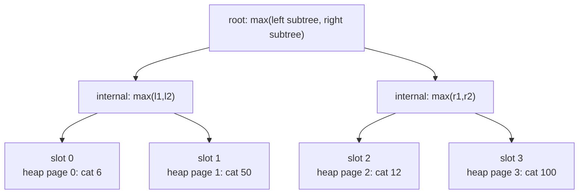
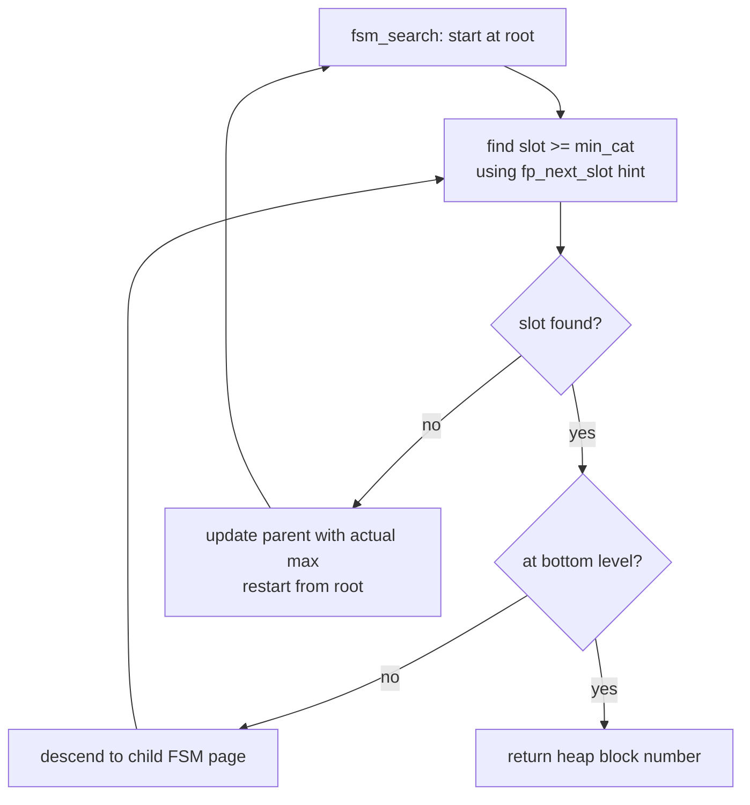

# Free Space Map

The Free Space Map (FSM) tracks approximately how much free space is available on each heap page. When a backend needs to insert a tuple, it asks the FSM for a page with enough room rather than scanning the heap linearly. This makes INSERT roughly O(1) in terms of page lookups, regardless of table size.

## The fork file

PostgreSQL stores the FSM as a dedicated relation fork (`FSM_FORKNUM`), a separate file on disk alongside the main heap fork. It names the file with the relation's filenode number followed by the suffix `_fsm` — for example, a heap stored in `16384` has its FSM in `16384_fsm`. The generic fork path machinery (`forkNames[]`, `relpath.c`) handles this naming. PostgreSQL creates the FSM fork on demand the first time a backend needs to record free space; a fresh table has no FSM file until its first insert or vacuum.

The tree structure described below determines the number of FSM blocks needed to cover a heap of `N` blocks. PostgreSQL stores the tree depth-first on disk, so the root is always at physical block 0 of the FSM fork. The file grows outward as the heap grows.

## Encoding free space

Each byte in the FSM represents one heap page's available space, encoded as a value from 0 to 255. The encoding divides the usable page space into 256 equal-sized categories: value `n` represents approximately `n × (BLCKSZ / 256)` bytes free (`FSM_CAT_STEP = BLCKSZ / FSM_CATEGORIES`, `freespace.c`). Value 255 is special — it means "at least `MaxFSMRequestSize` bytes free," where `MaxFSMRequestSize` equals `MaxHeapTupleSize`. This threshold ensures a page reported as 255 can always satisfy the largest possible single-tuple request.

With the default 8 KB `BLCKSZ` and `MaxHeapTupleSize` of 8164 bytes, the category boundaries look like:

| Range (bytes) | Category |
|---|---|
| 0–31 | 0 |
| 32–63 | 1 |
| … | … |
| 8096–8127 | 253 |
| 8128–8163 | 254 |
| 8164–8192 | 255 |

The encoding is lossy by design. A page with 100 bytes free and one with 120 bytes free map to the same FSM category. This loss of precision is acceptable because the goal is to find *a* page with enough space, not to find the best-fitting page. The rounding direction matters: when recording available space, the category rounds down (`fsm_space_avail_to_cat()`). As a result, the stored value never overstates reality. When PostgreSQL converts a request to a minimum category, it rounds up (`fsm_space_needed_to_cat()`). This ensures a match can always service the request. Together, these conventions make the FSM conservative: it may miss pages that technically qualify, but it never directs an insert to a page that cannot hold the tuple.

Callers must verify actual free space after pinning a page — the FSM is a guide, not a guarantee.

## FSM page format

Each FSM page is an ordinary PostgreSQL buffer page. The page header is followed by an `FSMPageData` struct (`fsm_internals.h`) with two fields:

- `fp_next_slot` — an integer hint indicating where the next search within this page should start. The FSM updates it without an exclusive lock, so it can be transiently garbled. That is harmless because it is only a hint.
- `fp_nodes[]` — a flat array of `uint8` values encoding the binary tree described below.

The number of nodes that fit depends on block size. With 8 KB pages, the page header and `fp_next_slot` consume a fixed overhead. The remaining space holds:

```
NodesPerPage     = BLCKSZ - MAXALIGN(SizeOfPageHeaderData) - offsetof(FSMPageData, fp_nodes)
NonLeafNodesPerPage = BLCKSZ / 2 - 1
LeafNodesPerPage = NodesPerPage - NonLeafNodesPerPage
SlotsPerFSMPage  = LeafNodesPerPage
```

With the default 8 KB `BLCKSZ`, `SlotsPerFSMPage` is approximately 4000. Each slot corresponds to one heap page (at the bottom level of the multi-level tree) or one lower-level FSM page (at upper levels).

## Binary tree of maxima within a page

The `fp_nodes[]` array stores a binary tree using the standard array encoding: the root is at index 0, and for any node at index `i`, its left child is at `2i + 1` and its right child is at `2i + 2`. Non-leaf nodes occupy indices 0 through `NonLeafNodesPerPage - 1`; leaf nodes occupy the rest.

Every non-leaf node holds the maximum of its two children. The root therefore holds the maximum free-space category across all heap pages covered by this FSM page.



Because the page header takes space, the tree is not a perfect binary tree. The rightmost leaf nodes are missing. A few non-leaf nodes on the right side have no right child. The tree is still complete above the leaf level, which is what matters for search correctness.

Setting a leaf value requires bubbling the change upward: after writing the new leaf, the update walks up to each parent and recomputes it as the max of its two children. It stops when a parent's value does not change (`fsm_set_avail()`, `fsmpage.c`). If the final root value is less than the value just written — indicating corruption — the code rebuilds the page from scratch (`fsm_rebuild_page()`).

## How a heap block number maps to a leaf slot

Given a heap block number, the FSM address consists of two parts:

1. Which bottom-level FSM page holds the slot: `logpageno = heapblk / SlotsPerFSMPage`
2. Which slot within that page: `slot = heapblk % SlotsPerFSMPage`

This means FSM pages at level 0 cover contiguous ranges of heap pages. The first level-0 FSM page covers heap blocks 0 through `SlotsPerFSMPage - 1`, the second covers the next range, and so on. `fsm_get_location()` (`freespace.c`) handles the conversion.

## Multi-level structure for large tables

A single FSM page covers roughly 4,000 heap pages. A table with millions of pages needs a multi-level structure. PostgreSQL builds this by stacking FSM pages into a tree of FSM pages.

Leaf-level (level 0) FSM pages each cover a fixed range of heap pages, with one slot per heap page. Level-1 FSM pages cover level-0 pages, with one slot per level-0 page; each slot value is the maximum free-space category across all heap pages that level-0 page covers. A level-2 root page does the same for level-1 pages.

With the default 8 KB `BLCKSZ`, three levels are sufficient to address the maximum relation size of 2³²-1 blocks, because `4000³ > 2³²`. The depth is fixed at compile time:

```
FSM_TREE_DEPTH   = 3  (for SlotsPerFSMPage >= 1626, i.e. BLCKSZ >= 4096)
FSM_ROOT_LEVEL   = FSM_TREE_DEPTH - 1  = 2
FSM_BOTTOM_LEVEL = 0
```

For smaller block sizes (512 or 1024 bytes), `SlotsPerFSMPage` falls below 1626. PostgreSQL needs four levels instead.

### Physical layout of the FSM file

PostgreSQL stores FSM pages on disk in depth-first order, with the root at physical block 0. For a three-level tree with fanout F, the layout looks like:

```
Block 0:  root (level 2, logpageno 0)
Block 1:    level-1 page 0
Block 2:      level-0 page 0   → heap pages 0..F-1
Block 3:      level-0 page 1   → heap pages F..2F-1
...
Block F+1:    level-1 page 1
Block F+2:      level-0 page F
...
```

`fsm_logical_to_physical()` (`freespace.c`) computes the physical block number for any logical address `(level, logpageno)`: it counts the number of upper-level ancestor pages that precede the page in depth-first order by summing across each level of the tree. The formula is:

```
leafno = logpageno * F^level          (first leaf beneath this page)
pages  = sum over l in [0, FSM_TREE_DEPTH):
             (leafno / F^l) + 1       (upper nodes that prefix those leaves)
physical = pages - level - 1
```

This arithmetic is O(depth) and requires no I/O.

## Searching the FSM

A search for a page with at least `spaceNeeded` bytes proceeds in two phases (`GetPageWithFreeSpace()`, `freespace.c`):

1. Convert `spaceNeeded` to a minimum category with `fsm_space_needed_to_cat()`.
2. Call `fsm_search()`. It starts at the root and descends level by level. It stops when it reaches a bottom-level leaf that holds a qualifying heap block number.

Within each FSM page, the search uses the binary tree structure and the `fp_next_slot` hint to find the first qualifying slot at or after the hint position. It wraps around if necessary (`fsm_search_avail()`, `fsmpage.c`). The algorithm expands a "search triangle" rightward from the hint: at each step it moves right, then climbs to the parent. This doubles the number of slots covered. This guarantees that the search finds a qualifying slot in O(log N) steps if one exists. It also produces a round-robin distribution over successive calls.

When the search descends from a level-1 (or level-2) page into a child that turns out not to contain any qualifying page — meaning the parent's recorded maximum was a stale overestimate — the search updates the parent's slot to the actual maximum found, then restarts from the root. This self-correction gradually repairs stale upper nodes through ordinary search traffic. The implementation caps restarts at 10,000. If that limit is hit, the function returns `InvalidBlockNumber`. The caller then extends the relation.



Because the FSM encodes space in 32-byte categories and rounds recorded values down, it can also return a page that proves insufficient when pinned. A page with 63 bytes free is stored as category 1, which covers the range 32–63 bytes. If a caller requests 50 bytes, the minimum category needed is `ceil(50 / 32) = 2`. Category 1 does not satisfy category 2, so the FSM correctly skips that page. Even so, the FSM can still direct a caller to a page that cannot satisfy the request:

- **Concurrent inserts**: Another backend inserted a tuple into the page between the FSM lookup and the caller's exclusive lock on the page. The FSM entry was accurate at lookup time but stale by the time the lock was acquired.
- **Rounding at the top of a category**: A page stored as category 5 has between `5 × 32 = 160` and `6 × 32 - 1 = 191` bytes free. A request for 180 bytes maps to minimum category `ceil(180 / 32) = 6`. Category 5 does not satisfy this, so the FSM will not return this page. But if the page had exactly 192 bytes free (category 6), it would qualify. It would genuinely have enough space.

The real danger is the first case. The caller must always verify actual free space after pinning the returned page. The standard pattern in `RelationGetBufferForTuple()` (`hio.c`) is:

1. Pin and exclusive-lock the page returned by the FSM.
2. Check `PageGetFreeSpace()` directly.
3. If there is not enough room, call `RecordAndGetPageWithFreeSpace()` to update the FSM entry for the rejected page and fetch the next candidate in one operation, then loop.

## Recording free space

`RecordPageWithFreeSpace()` converts the measured available space to a category (rounding down) and writes it into the corresponding leaf slot of the appropriate bottom-level FSM page. The write uses `MarkBufferDirtyHint()`, not `MarkBufferDirty()`. This means the change may not be WAL-logged, depending on the hint-bit WAL setting. It can be lost on a crash. The FSM tolerates this: a zeroed page after recovery simply causes PostgreSQL to append new pages until VACUUM runs.

A critical subtlety: writing a higher-than-previous value into a leaf slot does not immediately make that space visible to searches from the root. The parent chain above that leaf still records the old (lower) maximum. A search descending from the root can only reach the updated leaf if every ancestor reflects the new value. `RecordPageWithFreeSpace()` updates the leaf and propagates up within that FSM page (the `fsm_set_avail()` bubble-up), but it does not climb to parent FSM pages. Only `FreeSpaceMapVacuum()` updates those.

This means that space reclaimed by VACUUM is temporarily invisible to the FSM even after individual leaf writes. The space becomes searchable only after `FreeSpaceMapVacuum()` propagates the changes upward.

## FSM during VACUUM

VACUUM is the primary mechanism that corrects the FSM after dead tuples are reclaimed. As VACUUM scans heap pages, it calls `RecordPageWithFreeSpace()` for each page it has cleaned. This writes the updated available space into the bottom-level leaf nodes. Because `RecordPageWithFreeSpace()` updates within-page parent nodes immediately, a search that happens to land on that FSM page will see the new value. But parent FSM pages at level 1 and 2 still reflect old maxima.

VACUUM periodically calls `FreeSpaceMapVacuumRange()` as it finishes processing a range of heap blocks. It calls `FreeSpaceMapVacuum()` once at the end of the heap scan. Both functions invoke `fsm_vacuum_page()` (`freespace.c`). This function traverses the FSM tree recursively in depth-first order, matching the on-disk layout for better I/O locality:

1. Recurse into each child page that overlaps the requested heap block range.
2. Obtain the maximum available category from each child page after recursion.
3. Update the corresponding slot on the current page to that maximum.
4. Return the new maximum of the current page to its caller.

Because depth-first traversal updates children before parents, each parent receives accurate information from its children. After `FreeSpaceMapVacuum()` completes, the root node holds the true maximum free-space category across the entire relation. A search from the root can reach any page with reclaimed space.

`FreeSpaceMapVacuum()` also resets `fp_next_slot` to 0 on each FSM page it touches. This encourages subsequent searches to start from lower-numbered pages. That increases the likelihood that VACUUM can later truncate empty pages from the end of the relation.

## The asymmetry that VACUUM corrects

The FSM is updated promptly when space is consumed — every INSERT records the new free space after the tuple is placed. But DELETE does not update the FSM at all. A DELETE merely stamps `t_xmax` on a tuple; the page's FSM entry still shows that space as used. This asymmetry is intentional: reclaimed space is not usable until a snapshot old enough to see the deleted tuple no longer exists. Updating the FSM eagerly on DELETE would therefore be premature and misleading.

The consequence is that a heavily-deleted table accumulates pages whose FSM values significantly underestimate actual available space. The FSM directs concurrent inserts to the end of the relation (or to new blocks) rather than to the dead-tuple space, because it does not know that space is there. Only after VACUUM runs — reclaiming dead tuples and calling `RecordPageWithFreeSpace()` for each cleaned page, then calling `FreeSpaceMapVacuum()` — does the FSM reflect the true picture.

## Self-correction

The FSM incorporates several self-correcting mechanisms so that stale data does not persist indefinitely:

**Within-page correction**: `fsm_search_avail()` detects when a parent node promises more space than either child actually has. When a descending search reaches a node where neither child satisfies the minimum category despite the parent claiming it should, the code rebuilds the page via `fsm_rebuild_page()`. The search then restarts.

**Cross-page correction**: `fsm_search()` detects when a level-1 (or level-2) page directs the search to a child that has no qualifying slot. In that case, the function reads the actual maximum from the child page and writes it back to the parent slot, then restarts from the root. This repairs stale upper-level overestimates through ordinary search traffic rather than requiring a full vacuum.

**Crash recovery**: Because FSM changes are not WAL-logged, a crash can leave FSM pages in an inconsistent state. All FSM reads use `RBM_ZERO_ON_ERROR` mode, which zeros a page rather than raising an error on checksum mismatch or other corruption. A zeroed FSM page simply tells the search "no free space here." This causes PostgreSQL to append new pages — a safe fallback. VACUUM will eventually rebuild accurate state.

## [[subsystems/storage/fillfactor|Fillfactor]] and the FSM

The fillfactor storage parameter changes what the FSM treats as "free space" for a given page. A table with `fillfactor=70` keeps each page 30% empty to leave room for future HOT updates — in-place updates that keep the new tuple version on the same page and avoid an index update. The code in `hio.c` computes a `saveFreeSpace` reservation:

```
saveFreeSpace = RelationGetTargetPageFreeSpace(relation, HEAP_DEFAULT_FILLFACTOR)
              = BLCKSZ * (100 - fillfactor) / 100
```

The insertion logic adds this `saveFreeSpace` to the tuple size when it queries the FSM for a candidate page (`RelationGetBufferForTuple()`, `hio.c`). A page that is 72% full satisfies a `fillfactor=100` table's 28% free requirement, but it does *not* satisfy a `fillfactor=70` table's 30% reserved requirement. The FSM will direct the insert elsewhere in that case. The insertion logic never records the reservation into the FSM itself; rather, it asks the FSM for `tuplesize + saveFreeSpace` bytes. A page must have that combined amount free for the FSM to select it. The practical effect is that FSM-directed inserts will skip pages that are merely at the physical fillfactor threshold; the fillfactor reserves those pages' space for same-page updates, not new inserts.

## Consequences of approximation

The FSM's lossy encoding has several practical consequences worth understanding:

**Missed opportunities**: A page with 31 bytes free is stored as category 0. The FSM will never return it for any insert, even one for a 1-byte tuple, because it cannot express "31 bytes free" — only "0–31 bytes." This wastes a small amount of space on every page, bounded by one `FSM_CAT_STEP` per page.

**False hope**: A page stored as category 5 has somewhere between 160 and 191 bytes free. If the FSM returns the page to a caller requesting 160 bytes, the caller must still verify. If a concurrent insert consumed 30 bytes since the FSM was last updated, the page may only have 130 bytes free. The caller must then reject it and try again.

**Delayed reclamation**: Space reclaimed by DELETE is not visible in the FSM until VACUUM runs and `FreeSpaceMapVacuum()` completes. A table with a high DELETE/INSERT ratio and infrequent [[subsystems/background/autovacuum|autovacuum]] will grow faster than necessary because PostgreSQL adds new blocks rather than reusing dead-tuple space.

**No per-page write pressure**: Using `MarkBufferDirtyHint()` for FSM writes means that the FSM contributes minimally to checkpoint pressure. The tradeoff is that FSM state is not durable; callers must treat it as an advisory cache that VACUUM will eventually rebuild to an accurate state.

## Relation to heap insert

When `RelationGetBufferForTuple()` (`hio.c`) needs a page for a new tuple, it consults the FSM first. If the FSM returns a valid block, the backend pins that page and verifies there is actually enough room. If the FSM returns `InvalidBlockNumber` — meaning no tracked page has sufficient free space — the backend extends the relation with a new block. After a successful insert, the backend records the page's updated free space back into the FSM so future inserts can find it.

There is also a fast path: `RelationGetBufferForTuple()` first checks the most recently used page cached in the relation's `rd_targblock` field (or in the bulk insert state). This avoids an FSM lookup entirely for sequential-insert workloads. `RelationGetBufferForTuple()` consults the FSM only when the cached block is full or absent.

## See also

- [[subsystems/storage/visibility-map]] — the visibility map stored in a parallel fork
- [[subsystems/storage/heap]] — how `RelationGetBufferForTuple` uses the FSM during insert
- [[code-paths/insert]] — the full INSERT path that calls into the FSM
- [[code-paths/vacuum]] — how VACUUM updates FSM entries after reclaiming dead tuples
- [[code-paths/update]] — how HOT updates rely on fillfactor-reserved space
