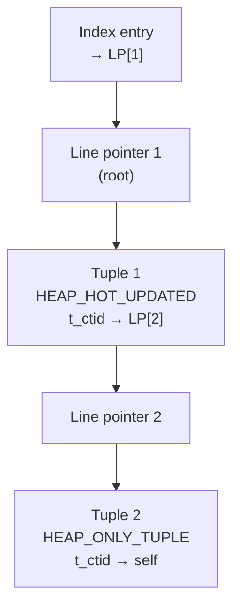
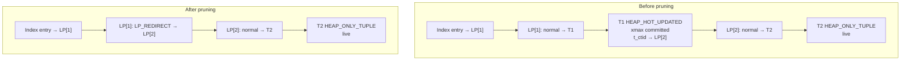

# Heap Storage and Tuple Format

PostgreSQL stores table rows as *heap tuples* on 8 KB pages in the heap relation file. Each tuple carries a fixed-size header that the executor and visibility logic read to determine whether the tuple is visible to a given transaction. Understanding the header is essential for understanding MVCC, HOT updates, and VACUUM.

## The in-memory tuple wrapper

Code that handles tuples outside the buffer pool works with `HeapTupleData` (`src/include/access/htup.h`), a lightweight in-memory envelope that bundles a pointer to the actual on-disk header with the metadata needed to locate and identify the tuple:

| Field | Purpose |
|---|---|
| `t_len` | Total length in bytes of `*t_data` |
| `t_self` | Item pointer: block number + offset number identifying this tuple on disk |
| `t_tableOid` | OID of the table this tuple came from |
| `t_data` | Pointer to the `HeapTupleHeaderData` (may point into a buffer page or a palloc'd copy) |

`t_self` is the tuple's physical address on disk. It serves as the TID (tuple identifier) in index entries and in `t_ctid` chains. When `t_data` points directly into a shared buffer page (rather than a palloc'd copy), the caller must hold a pin on the buffer for the lifetime of the pointer.

## The on-disk tuple header

Every on-disk tuple begins with a `HeapTupleHeaderData` (`src/include/access/htup_details.h`), a fixed prefix that encodes the tuple's transaction identity, structural layout, and visibility state. Its base size is 23 bytes before the nullable bitmap:

```
[ t_choice (xmin/xmax/cmin/cmax) ]  [ t_ctid ]  [ t_infomask2 ]  [ t_infomask ]  [ t_hoff ]  [ null bitmap ]
      8 bytes                           6 bytes        2 bytes          2 bytes        1 byte     0 or more bytes
```

### Transaction fields (t_choice)

`t_choice` is a union of `HeapTupleFields` (for live tuples) and `DatumTupleFields` (for composite datums passed as values in queries). The dual-use design means the same header structure works for both stored rows and row-type datums; the datum variant overlays the XID fields with a varlena length word and a type OID. As a result, the header doubles as a composite-type datum with zero extra indirection.

For live heap tuples the relevant fields are:

| Field | Purpose |
|---|---|
| `t_xmin` | XID of the transaction that inserted this tuple |
| `t_xmax` | XID of the transaction that deleted or locked this tuple (0 if neither) |
| `t_cid` | Command ID within the inserting/deleting transaction (shared field; see below) |

PostgreSQL sets `t_xmin` to the current XID when the tuple is inserted. The value never changes afterward. It is the tuple's birth certificate: any snapshot whose xmin threshold is older than `t_xmin` will see the tuple as long as that transaction committed.

`t_xmax` starts at zero (which `HEAP_XMAX_INVALID` reflects). When a transaction deletes or locks the tuple, it sets `t_xmax` to that transaction's XID. A snapshot determines whether the deletion is visible by checking whether `t_xmax` committed before the snapshot was taken. If the deleting transaction aborted, `t_xmax` remains set, but PostgreSQL eventually flags `HEAP_XMAX_INVALID`. This lets future visibility checks skip the [[subsystems/storage/clog|CLOG]] lookup.

The `t_cid` (command ID) field records how far into a transaction the event occurred. This is what allows a statement to see its own prior-command effects but not its own current-command effects — a property required for correct self-visibility within a transaction. `t_cid` is physically shared with the `t_xvac` field used by old-style `VACUUM FULL` (pre-9.0). The `HEAP_MOVED` infomask bits distinguish between the two uses.

When a tuple is both inserted and deleted in the same transaction, storing separate cmin and cmax values would require two fields. PostgreSQL instead stores a *combo command ID* in `t_cid` and sets `HEAP_COMBOCID` in `t_infomask`. The combo CID encodes both the cmin and cmax as a backend-local mapping maintained in memory during the transaction (`combocid.c`). Combo CIDs are valid only within the originating backend and transaction; they are never stored permanently.

### t_ctid

`t_ctid` is the "current TID" of this version of the row. For a live tuple that has not been updated, `t_ctid` points to itself (same block, same offset). When a tuple is updated, PostgreSQL changes the old version's `t_ctid` to point to the new version. This forms a chain of versions that visibility logic and index scans follow to find the latest version of a row.

Two exceptional uses of `t_ctid` exist:

- During a speculative insert (`INSERT ... ON CONFLICT`), `t_ctid` temporarily stores a *speculative token* rather than a real TID. The `HeapTupleHeaderIsSpeculative()` macro detects this by checking whether the offset number matches `SpecTokenOffsetNumber`.
- After a tuple is moved to a different partition during `UPDATE` on a partitioned table, `ItemPointerSetMovedPartitions()` encodes a sentinel in `t_ctid` so that concurrent readers know not to follow the chain within the same relation.

### t_infomask in depth

`t_infomask` (2 bytes) carries both structural flags and visibility [[subsystems/transactions/hint-bits|hint bits]]. The structural flags describe the tuple's data layout and are permanent; the hint bits are cached results of CLOG lookups that any backend can set lazily once it has confirmed a transaction's outcome.

**Structural flags:**

| Bit | Name | Meaning |
|---|---|---|
| `0x0001` | `HEAP_HASNULL` | Tuple has at least one NULL column; null bitmap is present |
| `0x0002` | `HEAP_HASVARWIDTH` | Tuple has at least one variable-length column |
| `0x0004` | `HEAP_HASEXTERNAL` | At least one attribute is stored out-of-line in [[subsystems/storage/toast|TOAST]] |
| `0x0020` | `HEAP_COMBOCID` | `t_cid` holds a combo CID, not a plain command ID |
| `0x0040` | `HEAP_XMAX_EXCL_LOCK` | `t_xmax` is an exclusive row lock, not a delete |
| `0x0010` | `HEAP_XMAX_KEYSHR_LOCK` | `t_xmax` is a key-share row lock |
| `0x0080` | `HEAP_XMAX_LOCK_ONLY` | `t_xmax` is a lock of any kind; the row is not being deleted |
| `0x1000` | `HEAP_XMAX_IS_MULTI` | `t_xmax` is a `MultiXactId` (multiple concurrent lockers) |
| `0x2000` | `HEAP_UPDATED` | This tuple is an updated version, not an original insert |

**Visibility hint bits:**

| Bit | Name | Meaning |
|---|---|---|
| `0x0100` | `HEAP_XMIN_COMMITTED` | `t_xmin` is known committed (cached) |
| `0x0200` | `HEAP_XMIN_INVALID` | `t_xmin` is known aborted or crashed |
| `0x0300` | `HEAP_XMIN_FROZEN` | Both bits set together: tuple is frozen |
| `0x0400` | `HEAP_XMAX_COMMITTED` | `t_xmax` is known committed (cached) |
| `0x0800` | `HEAP_XMAX_INVALID` | `t_xmax` is invalid: no deleter, or deleter aborted |

Hint bits exist because checking whether a transaction committed requires reading the commit log (CLOG), which is expensive. The first backend to confirm a transaction's commit status sets the corresponding hint bit directly in the tuple header. This lets subsequent visibility checks short-circuit the CLOG lookup. Because hint bits are set without holding exclusive lock on the page, they require a careful write protocol. PostgreSQL marks the page dirty with `MarkBufferDirtyHint()` rather than the full `MarkBufferDirty()`. It writes WAL only if the page has not been WAL-logged since the last checkpoint. This avoids a full WAL record for every tuple access.

The frozen state (`HEAP_XMIN_FROZEN`, both bits simultaneously set) is a special outcome of VACUUM freeze processing. Every transaction treats a frozen tuple's `t_xmin` as committed, regardless of the actual XID value. This breaks the [[subsystems/transactions/xid-wraparound|XID wraparound]] dependency: once frozen, a tuple's visibility no longer depends on any active transaction boundary. The `HeapTupleHeaderXminFrozen()` macro tests for this condition.

The lock-only bits deserve extra attention. `HEAP_XMAX_LOCK_ONLY` means `SELECT FOR UPDATE/SHARE` set `t_xmax`, rather than a DELETE. Combined with `HEAP_XMAX_EXCL_LOCK` or `HEAP_XMAX_KEYSHR_LOCK` it indicates the precise lock strength. When a lock-only `t_xmax` transaction commits or aborts, PostgreSQL does not consider the tuple deleted. The row remains live, and PostgreSQL simply abandons the locker's XID. `HEAP_XMAX_IS_MULTI` indicates that multiple transactions hold locks simultaneously, encoded as a `MultiXactId`; the actual member list lives in the `pg_multixact` files (see [[subsystems/transactions/multixact]]).

### t_infomask2 in depth

`t_infomask2` (2 bytes) packs the column count and the HOT chain flags into a single word:

| Bits | Name | Meaning |
|---|---|---|
| `0x07FF` | `HEAP_NATTS_MASK` | Number of columns stored in this tuple version (11 bits, max 2047) |
| `0x2000` | `HEAP_KEYS_UPDATED` | The update changed key columns, or this tuple was deleted |
| `0x4000` | `HEAP_HOT_UPDATED` | This tuple was updated and the replacement is a heap-only tuple |
| `0x8000` | `HEAP_ONLY_TUPLE` | This tuple has no index entries; it is reachable only through a HOT chain |

The column count stored in `HEAP_NATTS_MASK` may be less than the current number of columns in the relation. This is what allows `ALTER TABLE ADD COLUMN` with a default value to be nearly instantaneous for simple cases: existing tuples on disk simply record fewer attributes. The executor fills in the default value from the catalog when it deforms the tuple. Logical replication and serializable snapshot isolation consult `HEAP_KEYS_UPDATED` to determine whether an update affected the replica identity or a key column.

### t_hoff and the null bitmap

`t_hoff` is the byte offset from the start of `HeapTupleHeaderData` to the first user data byte. It must always be a `MAXALIGN`-aligned value (typically 8 bytes on 64-bit platforms). This means there may be padding between the end of the null bitmap and `t_hoff`.

The null bitmap is present only when `HEAP_HASNULL` is set in `t_infomask`. It occupies `BITMAPLEN(natts)` bytes — one bit per column, where bit 0 of byte 0 corresponds to attribute 1. A set bit means the attribute is *not* null (the semantics are inverted from what one might expect). When `HEAP_HASNULL` is clear, there is no null bitmap at all and every attribute is implicitly non-null; this saves space on the common case.

The memory layout of `t_hoff` and the null bitmap follows this pattern:

```
Offset 0:   HeapTupleHeaderData (23 bytes fixed)
Offset 23:  null bitmap (ceil(natts/8) bytes, only if HEAP_HASNULL)
Offset 23+: alignment padding to reach next MAXALIGN boundary
t_hoff:     first user attribute byte
```

User data starts at `(char *) tup->t_data + tup->t_data->t_hoff`, which is the `GETSTRUCT()` macro. See [[subsystems/storage/heap-tuple-manipulation|Heap Tuple Construction and Deforming]] for how `fastgetattr()` and `nocachegetattr()` navigate to individual attributes from there.

## Variable-length attributes and TOAST

Attributes flagged by `HEAP_HASVARWIDTH` use the `varlena` storage format. Every varlena value begins with a length/flags word that encodes both the actual data length and whether the value has been toasted:

- A 1-byte header (short varlena) is used when the value is small enough (up to 126 bytes of data). The high bit of the byte is clear and the remaining 7 bits hold the total length including the header.
- A 4-byte header is used for larger inline values. The high two bits distinguish inline uncompressed (`00`), inline compressed (`10`), and out-of-line TOAST (`01` or `11`) variants.

When a tuple would exceed `TOAST_TUPLE_THRESHOLD` (roughly 2 KB by default), `heap_prepare_insert()` calls `heap_toast_insert_or_update()` which compresses and/or moves large attributes to the TOAST table. `heap_toast_insert_or_update()` replaces the in-line varlena value with a `varatt_external` pointer that records the TOAST relation OID, chunk sequence, and raw/compressed size. It sets `HEAP_HASEXTERNAL` in `t_infomask` when any such external pointer is present.

## Attribute alignment and padding

PostgreSQL stores each attribute at an offset that satisfies its alignment requirement. It recognizes four alignment classes: `char` (1 byte), `int2` (2 bytes), `int4` (4 bytes), and `double` (8 bytes). The deform loop in `nocachegetattr()` and `heap_deform_tuple()` advances through attributes by first satisfying the next attribute's alignment, then reading its value.

See [[subsystems/storage/heap-tuple-manipulation|Heap Tuple Construction and Deforming]] for how the `attcacheoff` cache lets `fastgetattr()` reach leading fixed-width attributes in O(1) instead of walking the attribute list.

NULL values have no storage at all. The null bitmap records their absence; the deform loop simply skips the storage position for any attribute with its bitmap bit clear. This has a subtle consequence: the on-disk layout of a tuple with NULLs in the middle differs from one without. The offsets of trailing attributes depend on which earlier attributes are NULL.

## HOT: Heap Only Tuples

When a row is updated without changing any indexed column, PostgreSQL can avoid creating a new index entry. Instead it creates a *heap-only tuple* (HOT) on the same page and marks the chain with two bits:

- `HEAP_HOT_UPDATED` on the old tuple: "my replacement is a heap-only tuple."
- `HEAP_ONLY_TUPLE` on the new tuple: "I have no index entries; find me by following the chain."



The index entry still points to line pointer 1 (the root). When an index scan finds this entry, it follows the `t_ctid` chain to find the latest visible version without consulting the index again. VACUUM can reclaim dead tuples in the chain by replacing intermediate line pointers with redirect pointers. It can eventually compact the page as well — all without touching the index.

HOT applies only when two conditions both hold: the old and new tuple fit on the same page, and the update does not touch any indexed column. `heap_update()` (`heapam.c`) checks the second condition using the `hot_attrs` bitmap, which `RelationGetIndexAttrBitmap()` constructs from the index catalog. If either condition fails, `heap_update()` performs a normal index-entry-creating update instead. It optionally flags the old page with `PageSetFull()` as a hint to the next pruning pass.

### Chain formation and traversal

A HOT chain always starts at a non-heap-only tuple — one that has a corresponding index entry. This starting tuple is called the *root*. Each member of the chain has `HEAP_HOT_UPDATED` set, with its `t_ctid` pointing at the next member. The chain terminates at a tuple without `HEAP_HOT_UPDATED`, which points to itself in `t_ctid`. The chain can grow arbitrarily long if rows are updated repeatedly without pruning.

An index scan following a TID into the heap does not simply fetch that tuple and stop. Because HOT updates never create new index entries, the index TID always points at the chain root, which may itself be dead. The heap access method therefore follows `t_ctid` links from the root until it finds a tuple that is visible to the query's snapshot. This process is transparent to the index-scan caller.

Sequential scans behave differently. They visit every line pointer on each page; when they encounter a `HEAP_ONLY_TUPLE`, they recognize it as part of a chain already visited from its root and skip re-processing it. Sequential scans ignore a heap-only tuple with no live root (an orphan resulting from a crash mid-update or an aggressive prune) as dead.

### Prune-time chain compaction

When a page accumulates dead HOT-chain members — old tuple versions whose `t_xmax` has committed — the chain wastes space and slows traversal. Page pruning recovers this space without VACUUM by redirecting line pointers and removing dead members.

`heap_page_prune_opt()` (`pruneheap.c`) is the opportunistic entry point called from the heap scan itself whenever a page is accessed for reading. It checks two conditions before doing any work: whether the page's `pd_prune_xid` hint (the oldest XID that could become removable on this page) has aged past the global visibility horizon, and whether the page's free space has fallen below a fill-factor threshold. If both are met and the buffer can be locked for cleanup without blocking, it calls `heap_page_prune()`.

`heap_page_prune()` operates in two passes. The first pass scans all line pointers in reverse order. It calls `HeapTupleSatisfiesVacuumHorizon()` on each normal tuple, caching the result in `prstate.htsv[]`. The pass uses reverse order because tuples are physically stored in decreasing offset-number order on the page. Scanning in reverse therefore corresponds to increasing memory addresses, which is friendlier for CPU prefetching. The second pass walks forward and calls `heap_prune_chain()` on each unprocessed chain root.

`heap_prune_chain()` classifies each member of a HOT chain according to its cached HTSV result and decides what to do:

- If the whole chain is dead (no living or in-progress member), `heap_prune_chain()` sets the root line pointer to `LP_DEAD` and sets all members to `LP_UNUSED`.
- If the chain has a dead prefix followed by a live or in-progress tail, `heap_prune_chain()` converts the root to an `LP_REDIRECT` pointing at the first surviving member. This allows the index entry (which still points at the root line pointer) to reach the live tail without following the now-removed dead tuples.
- `heap_prune_chain()` sets dead intermediate members between the root and the new chain head to `LP_UNUSED`. This frees their line pointer slots.



After `heap_prune_chain()` has classified all chains, `heap_page_prune_execute()` applies the collected redirects, dead-markings, and unused-markings inside a critical section, then calls `PageRepairFragmentation()` to consolidate the freed space into a contiguous free region at the end of the page. PostgreSQL WAL-logs the whole operation as a single `XLOG_HEAP2_PRUNE` record so that standby servers can replay it.

The `pd_prune_xid` field in the page header is a running minimum of all `t_xmax` values on the page that could eventually become removable. It lets `heap_page_prune_opt()` bail out immediately without locking the page when the horizon has not advanced far enough. This keeps the common case cheap.

## Deleting a tuple

A DELETE does not remove the tuple from the page. It sets `t_xmax` to the deleting transaction's XID and clears `HEAP_XMAX_INVALID`. The `compute_new_xmax_infomask()` function (`heapam.c`) handles the subtle case where an existing locker is already recorded in `t_xmax`: it combines the locking information so that neither the locker's presence nor the new deletion is lost. DELETE resets `t_ctid` to point to itself. This indicates the row has no successor version.

DELETE updates the page header's `pd_prune_xid` with `PageSetPrunable()` to record that this XID may eventually allow pruning. Until the deleting transaction's visibility can be confirmed, the dead tuple occupies space on the page.

## Updating a tuple

An update is a delete of the old version plus an insert of the new version. `heap_update()` keeps the two operations consistent by stamping both tuple versions with the same XID and CID, and by pointing the old tuple's `t_ctid` at the new tuple's TID.

`heap_update()` decides whether to use HOT by comparing the set of modified columns against `hot_attrs`. When HOT is not possible — either because the page is full or because an indexed column changed — `RelationGetBufferForTuple()` finds a page for the new tuple, which may or may not be the same page as the old tuple.

After the new tuple is placed, `heap_update()` updates the old tuple's header in a single critical section: it sets `t_xmax`, conditionally sets `HEAP_HOT_UPDATED`, and points `t_ctid` at the new tuple. It marks both pages dirty and emits WAL as a single `XLOG_HEAP_UPDATE` record (or `XLOG_HEAP2_MULTI_INSERT` variant for bulk operations).

## Reading rows from the heap

Two distinct access patterns drive heap reads. Understanding why they differ helps make sense of the code.

A sequential scan must visit every live tuple in the relation. It therefore amortises the cost of buffer management by processing all visible tuples on each page before moving to the next. When the scan must check visibility tuple-by-tuple — for example under certain snapshot types — it tests each tuple individually. Either way, `heap_getnextslot()` (`heapam.c`) places the result in a `TupleTableSlot` for the executor.

Fetching a tuple by its TID is a fundamentally different access pattern: the target page is already known, so `heap_fetch()` (`heapam.c`) pins and locks the buffer directly, validates the item pointer, and tests the tuple for visibility against the caller's snapshot. Index scans use this path after retrieving a TID from the index. This avoids any relation-wide traversal.

## Writing a new tuple to the heap

Inserting a tuple involves three distinct concerns: stamping it with the correct transaction identity, finding a page with enough room to hold it, and making the write durable.

`heap_prepare_insert()` (`heapam.c`) fills the tuple's transaction header first: it sets `t_xmin` to the current transaction's XID, clears `t_xmax` to zero, and records the command ID within the transaction in `t_cid`. This happens before the tuple touches any page, so the header is complete and self-consistent by the time it is copied to disk.

Finding a suitable page is the job of the Free Space Map. The FSM tracks available space per page so that the inserter can land on a page with enough room without scanning the relation linearly. When no existing page has sufficient free space, PostgreSQL extends the relation by one page. Once `RelationGetBufferForTuple()` (`hio.c`) selects a page, it pins and locks the page in the buffer pool.

`heap_insert()` (`heapam.c`) then copies the tuple onto the page and sets `t_ctid` to the tuple's own TID. This indicates it has no successor version. It marks the buffer dirty and WAL-logs the insert so that recovery can replay it.

`heap_insert()` clears the all-visible bit in the visibility map on any page that receives a new tuple, because the new tuple is not yet visible to all transactions. This interacts with index-only scans: until VACUUM re-sets the all-visible bit, index-only scans on that page must visit the heap to check visibility rather than trusting the index alone.

## MinimalTuple: the executor-internal variant

Executor nodes that never inspect transaction visibility fields — hash joins, sort, aggregation — pass around `MinimalTupleData` instead of a full `HeapTupleHeaderData`; see [[subsystems/storage/heap-tuple-manipulation|Heap Tuple Construction and Deforming]] for its layout and the conversion functions between the two forms.

## See also

- [[subsystems/storage/heap-tuple-manipulation]] — in-memory tuple construction, deforming, attcacheoff/fastgetattr fast paths, and the MinimalTuple conversion functions
- [[subsystems/transactions/mvcc]] — how t_xmin, t_xmax, and hint bits are used for visibility
- [[subsystems/storage/buffer-manager]] — how pages are pinned and locked before tuple access
- [[subsystems/storage/fsm]] — how the Free Space Map directs insert placement
- [[subsystems/storage/visibility-map]] — how the all-visible bit interacts with index-only scans
- [[subsystems/transactions/multixact]] — MultiXactId storage for multiple concurrent lockers
- [[code-paths/insert]] — the full INSERT execution path from ModifyTable to heap_insert
- [[code-paths/vacuum]] — how VACUUM extends page pruning to reclaim LP_DEAD slots and freeze tuples
