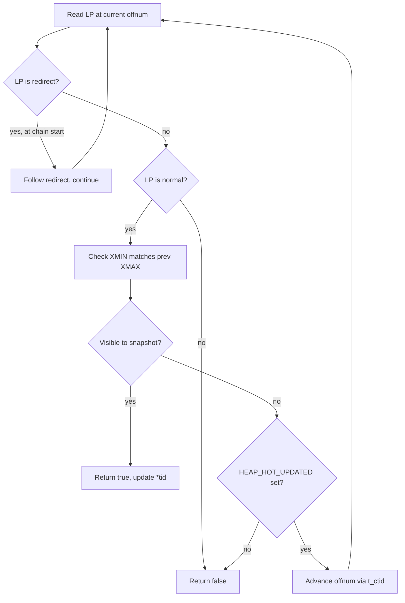
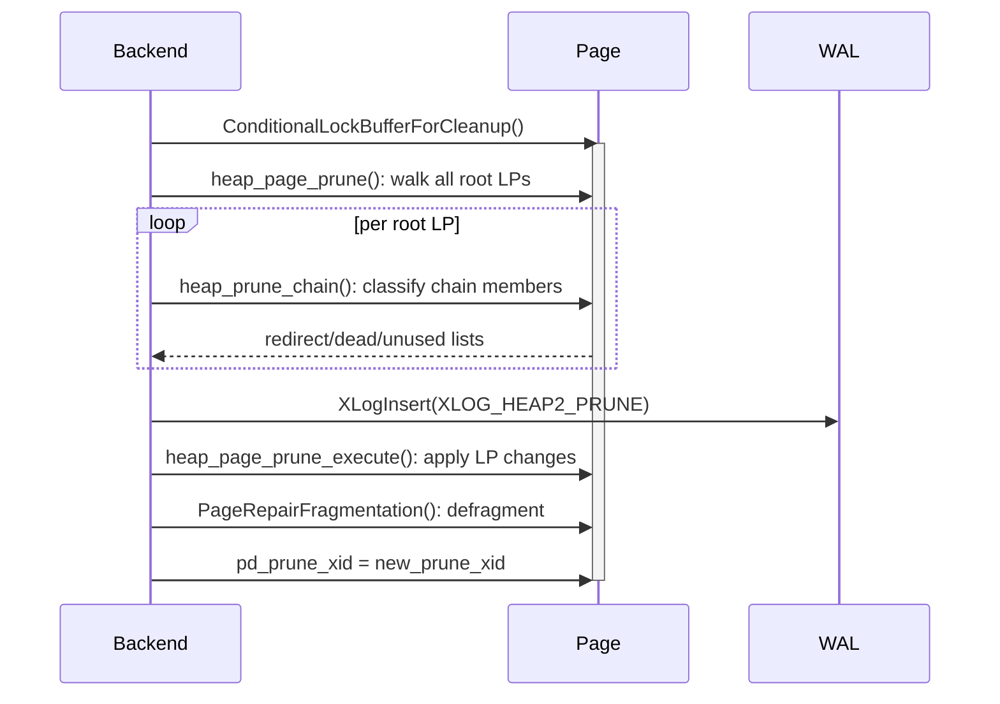
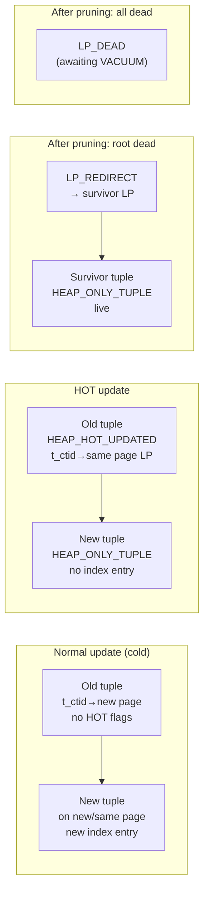

# HOT Updates (Heap Only Tuples)

HOT (Heap Only Tuples) is an optimization that avoids creating redundant index entries when a row is updated without changing any indexed column. It also enables single-page space reclamation — reclaiming dead tuple space without a full VACUUM index pass. The feature is described in detail in `src/backend/access/heap/README.HOT`.

## The problem HOT solves

Without HOT, every UPDATE writes a new tuple version to the heap and inserts a new entry into every index on the table, even when the updated columns are not referenced by any index. This has two compounding costs:

1. **Index bloat.** An index on column `c` accumulates one entry per row version even if `c` never changes. For tables subject to heavy write traffic on non-indexed columns, index size grows unboundedly until VACUUM reclaims dead entries.
2. **VACUUM overhead.** Standard VACUUM must scan every index to find and remove stale entries before it can reclaim heap space. This cost cannot be amortised below the level of a full index scan.

HOT attacks both problems for the common case where the update does not touch any indexed column and the new tuple fits on the same heap page. Under those conditions, `heap_update()` writes no new index entries. A page-local operation can reclaim dead space on the page, rather than a full VACUUM cycle.

## The two conditions for a HOT update

`heap_update()` (`heapam.c`) evaluates two conditions before committing to HOT:

| Condition | Check |
|---|---|
| No indexed column was modified | `!bms_overlap(modified_attrs, hot_attrs)` |
| New tuple fits on the same heap page | `newbuf == buffer` after `RelationGetBufferForTuple()` |

Both must hold. If either fails, the update falls back to a "cold" update: `heap_update()` creates a new index entry for every index on the table, and it writes the new tuple wherever space permits.

### The hot_attrs bitmap

`hot_attrs` is a `Bitmapset` built by `RelationGetIndexAttrBitmap(relation, INDEX_ATTR_BITMAP_HOT_BLOCKING)` at the start of `heap_update()`. It includes every column referenced anywhere in a non-summarizing index definition: stored columns, expression index columns, and partial-index predicate columns. `RelationGetIndexAttrBitmap()` excludes summarizing indexes (BRIN) because they do not store per-tuple TIDs and cannot break the HOT invariant.

`HeapDetermineColumnsInfo()` computes the actual change set `modified_attrs` by comparing the binary representations of old and new column values. HOT uses bitwise equality rather than datatype-specific equality to avoid invoking potentially non-immutable user-defined functions.

If `modified_attrs` overlaps only with `sum_attrs` (the summarizing-index columns) but not with `hot_attrs`, HOT proceeds, but `heap_update()` also propagates the update to all summarizing indexes. `summarized_update` tracks this.

## Flags: HEAP_HOT_UPDATED and HEAP_ONLY_TUPLE

Both HOT-specific flags live in `t_infomask2` of `HeapTupleHeaderData` (`htup_details.h`):

| Bit | Name | Set on | Meaning |
|---|---|---|---|
| `0x4000` | `HEAP_HOT_UPDATED` | Old tuple | This tuple was updated; its successor is a heap-only tuple. Follow `t_ctid` to find it. |
| `0x8000` | `HEAP_ONLY_TUPLE` | New tuple | This tuple has no direct index entries. It can only be reached by following a HOT chain from the root. |

Accessor macros in `htup_details.h`:

```c
HeapTupleIsHotUpdated(tup)     /* tests HEAP_HOT_UPDATED on t_infomask2 */
HeapTupleSetHotUpdated(tup)
HeapTupleClearHotUpdated(tup)

HeapTupleIsHeapOnly(tup)       /* tests HEAP_ONLY_TUPLE on t_infomask2 */
HeapTupleSetHeapOnly(tup)
HeapTupleClearHeapOnly(tup)
```

In `heap_update()`, after the same-page and no-indexed-column checks pass, the code stamps the flags inside the critical section:

```c
if (use_hot_update) {
    HeapTupleSetHotUpdated(&oldtup);
    HeapTupleSetHeapOnly(heaptup);
    HeapTupleSetHeapOnly(newtup);
}
```

`heap_update()` then sets `t_ctid` of the old tuple to the physical TID of the new tuple on the same page. This completes the chain link.

## The HOT chain

An index entry always points to the **root** line pointer of the chain — the line pointer that was in place when the row was first indexed. `t_ctid` threads subsequent heap-only versions together. They are reachable only by following the chain forward from the root.

### Initial state after one HOT update

```
Index entry → LP[1] (root)
              │
              ▼
         Tuple 1  (HEAP_HOT_UPDATED, t_ctid → LP[2])
              │
              ▼
         Tuple 2  (HEAP_ONLY_TUPLE, t_ctid → self)
```

PostgreSQL holds LP[1] permanently as long as any live member remains in the chain. The index never needs updating.

### Line pointer states

Line pointers (`ItemId`, `itemid.h`) used in HOT have four possible `lp_flags` values:

| `lp_flags` value | Constant | Meaning in HOT |
|---|---|---|
| `0` | `LP_UNUSED` | Free slot, available for reuse |
| `1` | `LP_NORMAL` | Points to a normal tuple (root or heap-only member) |
| `2` | `LP_REDIRECT` | Points to another line pointer (root has been replaced by redirect after root tuple died) |
| `3` | `LP_DEAD` | Dead; no live member remains in the chain; index entry can be killed |

`LP_REDIRECT` is the key line pointer type introduced by HOT. When the root tuple dies but heap-only successors are still live, pruning converts the root line pointer to a redirect rather than freeing it. This lets the index entry still lead to the live tuple:

```
Index entry → LP[1] (LP_REDIRECT → LP[3])
                                    │
                                    ▼
                              Tuple 3  (HEAP_ONLY_TUPLE, live)
```

### Evolution of a chain through multiple updates

```mermaid
flowchart TD
    subgraph "After first HOT update"
        I1["Index → LP[1]"]
        LP1a["LP[1] LP_NORMAL"]
        T1["Tuple 1<br/>HEAP_HOT_UPDATED<br/>t_ctid→LP[2]"]
        LP2a["LP[2] LP_NORMAL"]
        T2["Tuple 2<br/>HEAP_ONLY_TUPLE<br/>live"]
        I1-->LP1a-->T1-->LP2a-->T2
    end

    subgraph "After pruning when T1 is dead"
        I2["Index → LP[1]"]
        LP1b["LP[1] LP_REDIRECT→LP[2]"]
        LP2b["LP[2] LP_NORMAL"]
        T2b["Tuple 2<br/>HEAP_ONLY_TUPLE<br/>live"]
        I2-->LP1b-->LP2b-->T2b
    end

    subgraph "After second HOT update and further pruning"
        I3["Index → LP[1]"]
        LP1c["LP[1] LP_REDIRECT→LP[3]"]
        LP3c["LP[3] LP_NORMAL"]
        T3["Tuple 3<br/>HEAP_ONLY_TUPLE<br/>live"]
        I3-->LP1c-->LP3c-->T3
    end

    subgraph "When all versions are dead"
        I4["Index → LP[1]"]
        LP1d["LP[1] LP_DEAD"]
        I4-->LP1d
    end
```



When the entire chain is dead, pruning marks the root LP as `LP_DEAD`. The next regular VACUUM pass removes the index entry pointing at LP[1] and then reclaims the line pointer itself. At that point the index entry is gone and the line pointer slot becomes `LP_UNUSED`, available for reuse.

## Same-page constraint

HOT relies on the invariant that all members of a chain reside on the same heap page, enforced in `heap_update()` by the `newbuf == buffer` check. If the new tuple cannot fit on the same page, the update is cold. `heap_update()` then writes a new index entry. The constraint exists for two reasons:

1. **Space reclamation is page-local.** The entire value of HOT comes from being able to prune and defragment a single page without touching indexes. Spanning pages would require at minimum two page locks and would destroy this property.
2. **Index traversal cost.** Following `t_ctid` within a single already-pinned page is essentially free — the page is in the buffer cache and no extra I/O is needed. Chasing a cross-page link would require fetching a second buffer.

When a cold update lands on a different page, `heap_update()` calls `PageSetFull()` on the old page as a hint that it might benefit from future pruning, even though no HOT chain is being extended.

## Index scans: following the chain

The function `heap_hot_search_buffer()` (`heapam.c`, line 1520) is the core routine that index scans use to follow a HOT chain and find the version visible to the caller's snapshot.

```c
bool
heap_hot_search_buffer(ItemPointer tid, Relation relation, Buffer buffer,
                       Snapshot snapshot, HeapTuple heapTuple,
                       bool *all_dead, bool first_call);
```

On entry, `*tid` is the TID from the index entry (the root). The function walks the chain:



Key safety check: when following `t_ctid`, the function validates that the `t_xmin` of the next tuple matches the `t_xmax` of the current one. This detects broken chains (e.g. caused by an aborted transaction that was pruned before the chain walk) and treats them as end-of-chain rather than erroring.

Under an MVCC snapshot there can be at most one visible tuple in the chain, since two versions cannot both be live to the same snapshot. The search therefore stops as soon as it finds a visible tuple. Non-MVCC snapshots such as `SnapshotAny` must walk the entire chain.

### Integration with index_fetch_heap

`index_fetch_heap()` (`indexam.c`) calls `table_index_fetch_tuple()`. This dispatches to `heapam_index_fetch_tuple()` in `heapam_handler.c`, which in turn calls `heap_hot_search_buffer()`. `index_fetch_heap()` wires the `all_dead` output parameter back to `scan->kill_prior_tuple`. If every member of the HOT chain is globally dead, it instructs the index AM to mark its entry for deletion on the next `amgettuple` call. This avoids a future index scan following the same dead chain.

Sequential scans do not need `heap_hot_search_buffer` at all. They visit every line pointer on every page in order and evaluate each live tuple for visibility independently. The HOT chain structure is invisible to a sequential scan.

## HOT pruning: heap_page_prune

HOT pruning is the page-local operation that collapses dead intermediate tuples out of HOT chains. It converts root line pointers to redirects and frees dead intermediate line pointers. It is distinct from full VACUUM: no index is touched.

### Trigger: heap_page_prune_opt

The heap sequential scan path (`heapgettup_pagemode`, `heapam.c`) calls `heap_page_prune_opt()` (`pruneheap.c`) whenever it accesses a page. It decides whether to attempt pruning based on two conditions, both of which must hold:

1. **`pd_prune_xid` is old enough.** Every `PageSetPrunable(page, xid)` call (issued by `heap_update()` and `heap_delete()`) stores the minimum XID of a potentially pruneable tuple in the page header field `pd_prune_xid`. `heap_page_prune_opt()` bails out immediately if no XID is recorded or if it has not yet fallen below the global visibility horizon.
2. **The page is near full.** Free space must be below `max(fillfactor_target, BLCKSZ/10)` — currently at least 819 bytes — or the page must be flagged full by a previous failed HOT update attempt (`PageIsFull()`).

If both conditions are met, the function tries `ConditionalLockBufferForCleanup()`, a non-blocking attempt to get the exclusive buffer cleanup lock. If contention prevents the lock acquisition, PostgreSQL defers pruning — the worst-case consequence is that the current UPDATE cannot be HOT (the new tuple may end up on a different page).

### heap_prune_chain

`heap_prune_chain()` (`pruneheap.c`) processes one HOT chain starting from a root line pointer. It walks the chain. It classifies each tuple as `HEAPTUPLE_DEAD`, `HEAPTUPLE_RECENTLY_DEAD`, `HEAPTUPLE_LIVE`, or `HEAPTUPLE_INSERT_IN_PROGRESS`.

For each chain it finds the contiguous dead prefix — the run of dead tuples at the head of the chain — and:

- Records intermediate (non-root) dead line pointers for marking `LP_UNUSED`.
- Records the root line pointer for conversion to `LP_REDIRECT` pointing at the first surviving member.
- If the entire chain is dead, records the root for `LP_DEAD` instead.

`heap_prune_chain()` applies the XMIN/XMAX matching check at every step to guard against race conditions with concurrent abort and pruning.

### heap_page_prune_execute

After `heap_page_prune()` has collected the list of changes by calling `heap_prune_chain()` for every root LP on the page, `heap_page_prune_execute()` applies them atomically under the buffer lock:

1. Redirects: root LPs are converted to `LP_REDIRECT` via `ItemIdSetRedirect()`.
2. Dead: root LPs whose entire chain is dead are converted to `LP_DEAD`.
3. Unused: intermediate LPs are freed with `ItemIdSetUnused()`.
4. Defragmentation: `PageRepairFragmentation()` compacts all surviving tuples toward one end of the page. This coalesces fragmented free space into the central `pd_lower`–`pd_upper` gap so that future insertions can use it.

PostgreSQL WAL-logs the sequence via `XLOG_HEAP2_PRUNE` so that the page-level restructuring is replay-safe after a crash.



### Line pointer cap

To bound the worst case of long-running LP_REDIRECT chains, PostgreSQL caps the total number of line pointers per page at `MaxHeapTuplesPerPage` (the number of the smallest possible tuples that could fit on a page). This prevents LP bloat from accumulating pathological numbers of redirect entries.

## VACUUM and HOT chains

Regular VACUUM (`lazy_vacuum`, `vacuumlazy.c`) interacts with HOT chains in two ways:

1. **Pruning pass.** VACUUM calls `heap_page_prune()` on every page in the relation. This collapses any remaining dead HOT chain members that HOT pruning missed (e.g. because the page was not near full). This step does not touch indexes.
2. **Index cleanup.** After pruning, VACUUM scans indexes to find and remove entries pointing to `LP_DEAD` line pointers. Once VACUUM removes an index entry, it can reclaim the `LP_DEAD` line pointer and set it to `LP_UNUSED`.

A subtle statistics note: when pruning successfully eliminates dead heap-only tuples, it decrements the `n_dead_tup` counter in pgstats, which may postpone the next [[subsystems/background/autovacuum|autovacuum]] trigger. However, `LP_DEAD` root line pointers do not decrement `n_dead_tup` — VACUUM still needs to run to clean up the index entries pointing at them.

### CREATE INDEX and broken HOT chains

A newly created index introduces a new definition of "indexed column." Existing HOT chains built before the index existed may have chain members with different values for the new index's key — a "broken" HOT chain.

Non-concurrent `CREATE INDEX` handles this by setting `pg_index.indcheckxmin = true`. This prevents old transactions from using the index until they have advanced past the XID of the CREATE INDEX transaction. Transactions that can see the index will only see rows that were live after indexing began. Those rows have consistent chains.

`CREATE INDEX CONCURRENTLY` prevents broken chains from forming in the first place by publishing the new index definition as "not ready for inserts" before scanning the table. All concurrent transactions then include the new index in HOT-safety checks before committing any HOT updates. This ensures no HOT update changes the new index's key while the index is being built.

## Interaction with logical replication

Logical decoding (`decode.c`) treats `XLOG_HEAP_HOT_UPDATE` and `XLOG_HEAP_UPDATE` identically:

```c
case XLOG_HEAP_HOT_UPDATE:
case XLOG_HEAP_UPDATE:
    if (SnapBuildProcessChange(builder, xid, buf->origptr) && !ctx->fast_forward)
        DecodeUpdate(ctx, buf);
    break;
```

The WAL record layout is the same for both. `DecodeUpdate()` extracts the old key tuple and new tuple images directly from the WAL record — specifically the `XLH_UPDATE_CONTAINS_NEW_TUPLE` and `XLH_UPDATE_CONTAINS_OLD` sections of `xl_heap_update`. It does not need to follow a HOT chain at replay time because PostgreSQL embeds the full new tuple image (when `wal_level = logical`) in the WAL record itself.

On the physical side, WAL replay for HOT updates (`heap_xlog_update()`, `heapam.c`) applies both the old-tuple flag changes and the new-tuple insertion to the same page. This mirrors exactly what the original `heap_update()` did.

## Flag and line pointer state transitions



## See also

- [[subsystems/storage/heap]] — heap tuple format, `t_ctid`, `t_infomask`, `t_infomask2` flag reference
- [[subsystems/transactions/mvcc]] — how snapshots use `t_xmin`/`t_xmax` to determine visibility of chain members
- [[subsystems/indexes/btree]] — B-tree index scans that call `heap_hot_search_buffer` via `index_fetch_heap`
- [[code-paths/update]] — the full UPDATE execution path from `ModifyTable` through `heap_update`
