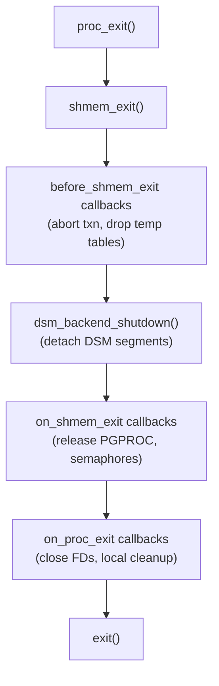

PostgreSQL's IPC infrastructure handles two distinct problems. The first is ensuring that every process cleans up its shared resources in the correct order when it exits. The second is allowing parallel worker processes to locate their sub-regions within a dynamic shared memory segment without hardcoding offsets. Despite the name, `src/backend/storage/ipc/ipc.c` is almost entirely about the first of these — ordered exit callbacks — while `shm_toc.c` addresses the second through a lightweight key-value directory embedded at the head of a dynamic shared memory (DSM) segment.

## Ordered teardown: the three callback stacks

When a backend exits, it must release resources in a specific order. A backend must abort its open transaction before freeing its PGPROC slot; it must detach from dynamic shared memory segments before the postmaster can reclaim them; it must release all [[subsystems/locking/lwlocks|LWLocks]] before touching any shared buffer. Getting this order wrong corrupts shared state for other processes.

PostgreSQL enforces teardown order through three separate callback stacks, each a fixed-size array of at most 20 entries (`MAX_ON_EXITS`, `ipc.c`). Each entry holds a function pointer and an opaque `Datum` argument registered by the subsystem at initialization time. The three stacks and their intended use are:

- **`before_shmem_exit`** — high-level cleanup that still needs the rest of the system functional: aborting open transactions, dropping temp tables, flushing catalog state. These run first because they depend on catalog access and other infrastructure that will be torn down later.
- **`on_shmem_exit`** — low-level shared memory resource release: releasing the PGPROC slot, detaching DSM segments, releasing semaphores. These run after `before_shmem_exit` but before the process actually exits.
- **`on_proc_exit`** — pure process-local cleanup: closing file descriptors, writing profiling data. These run last, after all shared memory work is done.

All three stacks are invoked in LIFO order (last registered, first called) within their tier, which mirrors the natural construction-destruction pairing of subsystems: a subsystem initialized later often depends on infrastructure initialized earlier, so its cleanup should run first.

The stacks protect against infinite loops during teardown by decrementing the index before invoking each callback, rather than after. If a callback throws `ERROR` or `FATAL`, re-entry to the teardown path finds a smaller index and will not re-invoke the callback that failed.

## proc_exit versus shmem_exit

`proc_exit()` is the only legitimate way for a backend to terminate. It sets `proc_exit_inprogress` and clears any pending interrupts, so that signal handlers cannot re-enter the exit path. It then calls `shmem_exit()`, drains the `on_proc_exit` stack, and calls `exit()`.

`shmem_exit()` can also be called in isolation — the postmaster uses it to re-initialize shared resources after a backend crashes without itself exiting. This is the mechanism behind crash recovery: the postmaster detects the dead child via `SIGCHLD`, calls `shmem_exit()` to clean up that child's shared-memory footprint (LWLocks, PGPROC, etc.), and then re-initializes state for the next connection. The `shmem_exit_inprogress` flag is visible to the rest of the system during this window.

The very first thing `shmem_exit()` does is call `LWLockReleaseAll()`. This is a safety measure: a crashing process may hold LWLocks that other backends are waiting on. Releasing them unconditionally, before any callback runs, prevents those waiters from deadlocking.

A C-level safety net also exists: the first call to any of the registration functions (`on_proc_exit`, `before_shmem_exit`, `on_shmem_exit`) installs an `atexit()` handler that calls `proc_exit_prepare()`. This backstop catches direct calls to `exit()` from extension code or third-party libraries that bypass `proc_exit()`.

## Fork safety: on_exit_reset

When the postmaster forks a new backend, the child inherits the postmaster's exit-callback stacks. That would be catastrophic: the child would try to call the postmaster's teardown routines on exit. Immediately after `fork()`, the child calls `on_exit_reset()`. This function zeroes all three stack indices and resets the DSM detach callbacks. The child then registers its own callbacks from scratch as it initializes its own subsystems.

## PG_ENSURE_ERROR_CLEANUP

The `before_shmem_exit` mechanism doubles as an error-cleanup primitive via the `PG_ENSURE_ERROR_CLEANUP` / `PG_END_ENSURE_ERROR_CLEANUP` macro pair defined in `ipc.h`. The pattern registers a `before_shmem_exit` callback before entering a critical section, then removes it (`cancel_before_shmem_exit`) on clean exit. If the block throws an error, the callback fires during stack unwinding. This is used to undo transient changes to shared state — for example, releasing a lock on a catalog tuple if the code modifying it fails midway.

Because `cancel_before_shmem_exit` can only remove the most-recently-added entry, `PG_ENSURE_ERROR_CLEANUP` blocks must be strictly nested.

## Shared memory table of contents (shm_toc)

When a backend spawns parallel workers, all of them map the same DSM segment. But they still need to find their assigned sub-regions — the serialized snapshot, the executor parameter buffer, the tuple queues, the instrumentation area — without the leader having to communicate individual offsets through a separate channel. The shared memory table of contents solves this by embedding a small, self-describing directory at the start of the DSM segment itself.

A `shm_toc` is a header structure that occupies the beginning of a DSM segment. It holds a magic number (used to verify the segment belongs to the expected subsystem), a spinlock, total and allocated byte counts, and a variable-length array of `(key, offset)` pairs. Keys are plain `uint64` integers whose meaning is defined by convention within each subsystem — parallel query uses a set of `PARALLEL_KEY_*` constants.

The leader allocates memory within the segment using `shm_toc_allocate()`. This function carves out buffer-aligned chunks from the **end** of the segment, while the TOC entry array grows from the **start**. This bidirectional layout avoids fragmentation. Entries and data approach each other from opposite ends, and an overflow check detects when they would collide.

Once the leader allocates a region, it calls `shm_toc_insert()` to record the `(key, offset)` pair. Because the segment may be mapped at different virtual addresses in each process, `shm_toc` stores only the offset relative to the TOC start. Workers add the offset to their own mapping base to recover the pointer.

Workers attach to an existing segment with `shm_toc_attach()`, which validates the magic number and returns `NULL` on mismatch rather than crashing. They then call `shm_toc_lookup()` with the well-known key to recover a pointer to their region. Lookup is intentionally lock-free: it reads `toc_nentry` once, issues a read barrier, and then scans the entry array. The insert path uses a write barrier between filling in the entry and incrementing `toc_nentry`. As a result, a concurrent lookup either sees the new entry or does not see it at all — it never sees a partially written entry.

The estimator helpers (`shm_toc_initialize_estimator`, `shm_toc_estimate_chunk`, `shm_toc_estimate_keys`, `shm_toc_estimate`) let the leader compute the total segment size needed before calling `dsm_create()`, avoiding a guess-and-resize cycle.

## Connection lifecycle and the postmaster contract

The full lifecycle ties both halves of this article together. The postmaster calls `on_exit_reset()` in each newly forked child, then the child registers its own `before_shmem_exit` and `on_shmem_exit` callbacks as it initializes. For parallel query, the backend leader also creates a DSM segment with a `shm_toc` header and populates it before worker processes attach. Workers register their own `on_shmem_exit` callbacks (primarily to detach the DSM segment). When the query finishes, or the backend receives a fatal signal, teardown flows through the three-tier callback sequence. The DSM segment is detached and eventually freed. The postmaster then detects the backend's exit via `SIGCHLD`.

## Related Topics

- [[subsystems/storage/latch-and-ipc|Latches and IPC]]
- [[subsystems/storage/procsignal|Process Signalling (ProcSignal)]]
- [[architecture/process-architecture|Process Model]]
- [[subsystems/storage/shared-memory|Shared Memory Layout]]
- [[subsystems/locking/lwlocks|Lightweight Locks (LWLocks)]]
- [[subsystems/memory/contexts|Memory Contexts]]
