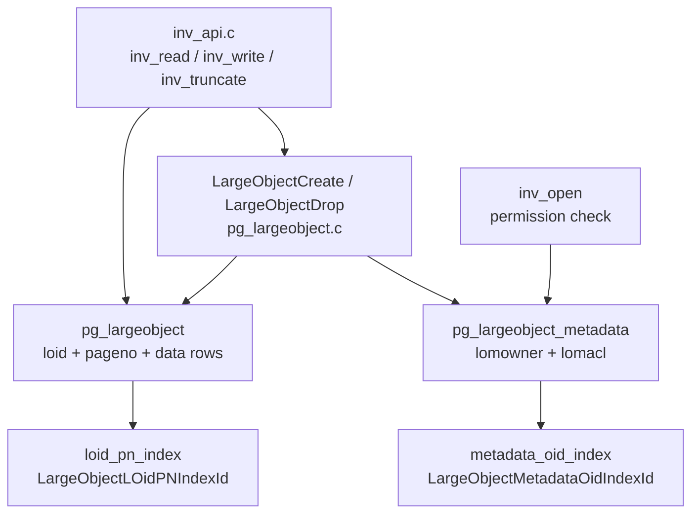

The inversion API is the storage layer for PostgreSQL large objects. It splits binary data into fixed-size pages and stores each page as a row in the `pg_largeobject` system catalog. The higher-level SQL interface (`be-fsstubs.c`, [[subsystems/storage/large-object-fsstubs|Large Object SQL Interface]]) translates POSIX-like file-descriptor semantics into calls to this layer; `inv_api.c` itself speaks directly to the heap and index.

## Storage Model

A large object is identified by an OID and stored as a sequence of rows in `pg_largeobject`, each holding one page of data:

| Column | Type | Purpose |
|---|---|---|
| `loid` | oid | Large object identifier |
| `pageno` | int4 | 0-based page number |
| `data` | bytea | Page content, up to `LOBLKSIZE` bytes |

`LOBLKSIZE` is `BLCKSZ / 4` (typically 2 KB). A large object is therefore a sparse sequence of these rows, indexed by the `(loid, pageno)` composite key. Gaps between pages are valid — reading across a gap returns zero bytes, matching Unix file hole semantics.

Large object data is stored as `bytea` in `pg_largeobject`, so each page tuple can be [[subsystems/storage/toast|TOAST]]-compressed. The inversion API always detoasts page data before use (`getdatafield()`, `inv_api.c`).

## Relation Caching

Opening `pg_largeobject` and its index is expensive. So `inv_api.c` keeps a pair of module-level `Relation` pointers (`lo_heap_r`, `lo_index_r`) that stay open for the life of the transaction. `inv_api.c` calls `open_lo_relation()` at the start of each read or write. It also moves ownership of these references to `TopTransactionResourceOwner`, so they survive subtransaction boundaries. It calls `close_lo_relation()` at transaction end.

`open_lo_relation()` opens both relations with `RowExclusiveLock`, even for reads. This is intentional: read operations may need to follow up with writes (e.g. during `lo_write`, the page is first read and then updated in place). Using a single lock level for both avoids lock upgrades that could deadlock.

## Access Descriptors

`inv_open()` allocates a `LargeObjectDesc` in the caller-supplied [[subsystems/memory/contexts|memory context]] and returns it. The descriptor holds:

- `id` — the large object OID
- `offset` — current seek position (64-bit)
- `flags` — combination of `IFS_RDLOCK` and `IFS_WRLOCK`, set at open time
- `snapshot` — MVCC snapshot for reads; `NULL` for write-mode descriptors

Write mode always uses an instantaneous snapshot (`snapshot = NULL`). This is necessary because a write-mode scan must see the tuple the writer itself just inserted in the same command. An MVCC snapshot taken before the command would miss it.

Permission checks happen inside `inv_open()` against `pg_largeobject_metadata`, which records ACLs. The `lo_compat_privileges` GUC suppresses these checks for backward compatibility with pre-8.4 databases.

## Reading

`inv_read()` scans `pg_largeobject` forward using the index. It starts from the page that contains the current offset. For each page, it computes the byte range to copy and fills the caller's buffer. If a page is missing (a hole), `inv_read()` zero-fills the corresponding bytes in the output buffer. The descriptor's `offset` advances by the number of bytes actually delivered.

## Writing

`inv_write()` merges new data into existing pages. For each page in the write range:

- If a page already exists at that `pageno`, `inv_write()` loads the existing content, overlays the new bytes at the correct intra-page offset, and stores the updated tuple back with `CatalogTupleUpdateWithInfo()`.
- If no page exists — a write into a hole, or beyond the end of the object — `inv_write()` constructs a fresh tuple and inserts it with `CatalogTupleInsertWithInfo()`.

Before writing, `inv_write()` zero-fills any hole bytes in the page buffer between the end of existing content and the start of the write. After `inv_write()` processes all pages, `CommandCounterIncrement()` makes the new tuples visible to subsequent operations within the same command.

## Truncation

`inv_truncate()` handles both shrinking and extending by writing a zero-padded terminal page at the truncation point, then deleting all pages with a higher `pageno`. If the truncation point falls inside an existing page, `inv_truncate()` updates that page in place. If it falls in a hole, `inv_truncate()` inserts a new zero page to mark the end. This ensures that a subsequent call to `inv_getsize()` returns the correct value, even when the object has been truncated to a length that isn't a page boundary. `inv_getsize()` determines the object's size by reading the last page.

## Size Determination

`inv_getsize()` determines the logical end of the object by scanning the index *backwards* from the highest `pageno` and reading the last valid page. The size is `pageno * LOBLKSIZE + len(data)` of that page. Because large objects can contain holes, this returns the offset of the last byte plus one, not a total byte count.

## Drop and Dependency

`inv_drop()` delegates to `performDeletion()`, which handles cascade deletion through `pg_depend`. Object creation records the dependency on the owning role at create time with `recordDependencyOnOwner()`, so dropping the owning role also drops the large object.

## Catalog Layer: pg_largeobject.c

While `inv_api.c` handles the file-like semantics seen by callers, `pg_largeobject.c` provides the lower-level catalog manipulation functions that create, drop, and check for large objects. These functions operate directly on both system catalogs that together represent a large object.

### Two-Catalog Design

Every large object occupies entries in two distinct system catalogs:

- **`pg_largeobject_metadata`** (OID 2995, `LargeObjectMetadataRelationId`) — one row per large object, storing the owning role (`lomowner`) and an optional ACL (`lomacl`). This is the ownership and permission record. Existence and permission lookups all use its primary key index (`LargeObjectMetadataOidIndexId`).

- **`pg_largeobject`** (OID 2613, `LargeObjectRelationId`) — one row per 2 KB chunk, with columns `loid`, `pageno`, and `data`. A newly created large object has a metadata row but zero data rows; it appears as an empty object with size 0.

This split cleanly separates the administrative record (ownership, ACL) from the potentially large volume of data rows. Permission checks scan `pg_largeobject_metadata`; data I/O touches only `pg_largeobject`.

### Object Lifecycle

`LargeObjectCreate()` (pg_largeobject.c) inserts a single row into `pg_largeobject_metadata` with the calling user as `lomowner` and a NULL ACL (inheriting no special permissions). `LargeObjectCreate()` either uses an OID supplied by the caller or allocates one via `GetNewOidWithIndex()` against the metadata index. It inserts no rows into `pg_largeobject` at this point — `inv_write()` creates the data pages on demand.

`LargeObjectDrop()` performs a two-phase delete: it first removes the metadata row (scanning by OID on `LargeObjectMetadataOidIndexId`), then iterates over all matching `loid` rows in `pg_largeobject` using the composite index `LargeObjectLOidPNIndexId` and deletes each one. `LargeObjectDrop()` opens both relations with `RowExclusiveLock`. The `inv_drop()` path in `inv_api.c` reaches this via `performDeletion()` rather than calling `LargeObjectDrop()` directly, because dependency tracking must run first to handle cascade.

`LargeObjectExists()` scans `pg_largeobject_metadata` with an up-to-date snapshot. Intentionally, it does not use the system catalog cache here — the comment in the source notes that caching metadata rows could consume too much local memory when many large objects are active. For read-only opens, the caller's snapshot should govern visibility, so callers invoke `LargeObjectExists()` only in write-mode contexts where currency matters.

### MVCC and Visibility

Each row in `pg_largeobject` is a regular heap tuple and participates fully in [[subsystems/storage/clog|MVCC]]. A write that updates a page produces a new tuple version; the old version remains visible to concurrent transactions holding earlier snapshots. This means:

- Consider a transaction that opened a large object in read-only mode with an MVCC snapshot. It continues to see the pre-update page content, even after another transaction commits a write to the same page.
- Write-mode descriptors pass `snapshot = NULL` to the index scan, so they see the latest committed version of each page. This includes tuples written by earlier commands in the same transaction, which `CommandCounterIncrement()` makes visible.
- The `RowExclusiveLock` on `pg_largeobject` serializes concurrent writers to the same large object at the page level. Two sessions writing to non-overlapping page ranges can proceed without conflict at the lock level, though they still contend on the shared buffer for individual pages.

Because `pg_largeobject` rows are subject to dead-tuple accumulation like any other heap, heavily written large objects benefit from [[subsystems/background/autovacuum|autovacuum]] to reclaim space from superseded page versions.

### Index Structure

The composite index `pg_largeobject_loid_pn_index` (`LargeObjectLOidPNIndexId`) covers `(loid, pageno)` with a unique constraint. This index drives both sequential forward scans (reads, writes that iterate page by page) and the reverse scan used by `inv_getsize()`. Because the index physically clusters pages for a given `loid` in order, forward scans are efficient even for objects with many thousands of pages.

Existence checks, permission lookups, and drop operations all use the metadata index `pg_largeobject_metadata_oid_index` (`LargeObjectMetadataOidIndexId`), which covers only the OID column.

## Related Topics

- [[subsystems/storage/large-object-fsstubs|Large Object SQL Interface (be-fsstubs)]] — the SQL-callable layer above this one
- [[subsystems/storage/toast|TOAST]] — page data may be compressed
- [[subsystems/storage/heap|Heap storage]] — underlying storage for `pg_largeobject` tuples
- [[subsystems/memory/contexts|Memory contexts]] — descriptor allocation
- [[subsystems/storage/clog|MVCC / CLOG]] — visibility of large object page versions
- [[subsystems/background/autovacuum|Autovacuum]] — reclaims dead page versions in `pg_largeobject`
