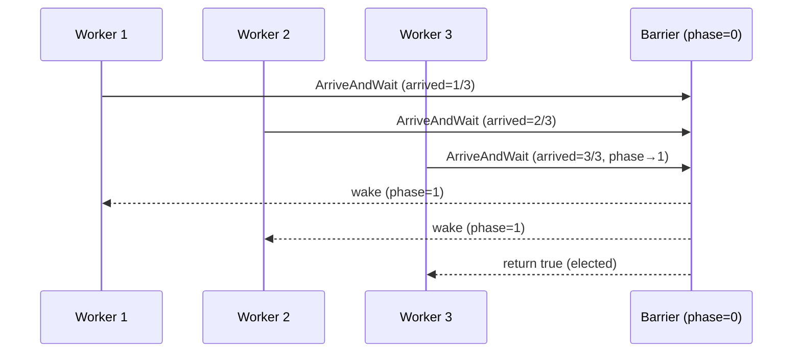

A `Barrier` is a rendezvous point. It holds a set of cooperating processes at a phase boundary until every participant has arrived. Then it releases all of them simultaneously, so that the next phase can begin. PostgreSQL uses barriers heavily in parallel query execution to coordinate workers across the distinct stages of a parallel scan — startup, tuple production, queue flushing, and final aggregation. Each stage must complete across all workers before the next one starts.

## The Barrier Struct

The `Barrier` struct packs five fields together with a spinlock and a condition variable:

```c
typedef struct Barrier
{
    slock_t           mutex;
    int               phase;        /* monotonically increasing phase counter */
    int               participants; /* how many processes are currently attached */
    int               arrived;      /* how many have called ArriveAndWait so far */
    int               elected;      /* highest phase that has elected a leader */
    bool              static_party; /* assertion guard only */
    ConditionVariable condition_variable;
} Barrier;
```

`phase` is the key invariant: it starts at zero and increments by one every time all current participants rendezvous. A waiting process wakes from the condition variable and checks whether `phase` has advanced past the value it saw before going to sleep. If not, the wakeup was spurious, and the process goes back to sleep. Because a participant cannot advance `phase` a second time without its own cooperation, the assertion `phase == start_phase || phase == next_phase` always holds inside the wait loop for an attached participant.

`participants` and `arrived` together implement the countdown. Whichever process increments `arrived` to match `participants` resets `arrived` to zero, increments `phase`, and broadcasts on the condition variable.

## Static vs. Dynamic Participation

`BarrierInit` accepts either a positive participant count (static) or zero (dynamic).

With a **static barrier**, `BarrierInit` counts every participant at initialization, and the code does not need to call `BarrierAttach` or `BarrierDetach`. The implementation sets `static_party = true` and uses it only for assertions. Because the count never changes, each call to `BarrierArriveAndWait` is unambiguous: the barrier knows exactly how many arrivals to expect.

With a **dynamic barrier**, workers call `BarrierAttach` when they start and `BarrierDetach` (or one of the arrive-and-detach variants) when they finish. `BarrierAttach` increments `participants` under the spinlock and returns the current `phase`, which the worker uses to fast-forward its own program counter to the correct phase of a multi-phase algorithm — a technique analogous to Java's `Phaser.arriveAndAwaitAdvance` after a `register` call.

Dynamic participation is the critical feature that distinguishes PostgreSQL's barriers from POSIX `pthread_barrier_t`. The planner assembles parallel query groups at plan time with a target worker count, but workers may fail to start or may complete early. Suppose the static count included a worker that never showed up. It would deadlock every other participant waiting at the barrier.

## Phase Advancement and Leader Election

When the final participant arrives, `BarrierArriveAndWait` returns `true` in exactly one process. This elected process can immediately begin any serial work required between phases — for example, setting up shared state — while the other processes are still waking from the condition variable. In the common path, the algorithm elects the last-to-arrive process, because it already holds a CPU timeslice and can proceed without a context switch.

The phase can also advance because a participant detached rather than arrived — the `BarrierDetachImpl` path. In that case, the broadcasting process is not the one that will continue executing. Instead, the barrier elects an arbitrary newly-woken waiter: the implementation stores `elected = barrier->phase` under the spinlock, and the first waiter to observe `phase == next_phase` and `elected != next_phase` wins.



## Detach and Its Effect on Waiting Participants

Three variants exist for a worker that wants to leave without blocking others:

- `BarrierDetach` — the worker is simply done; it removes itself from `participants` and, if the remaining participants were already waiting for it, releases them.
- `BarrierArriveAndDetach` — the worker records its arrival and then removes itself. If it was the last participant needed, it advances `phase` and broadcasts, just as `BarrierArriveAndWait` would, except the caller does not sleep afterward.
- `BarrierArriveAndDetachExceptLast` — used when a group of workers want to converge to a single survivor. Every worker except the last decrements `participants` and returns `false`; the last worker advances `phase` and returns `true`, remaining attached to drive any final serial work.

The detach path always re-evaluates whether `arrived == participants` after decrementing `participants`. This ensures correct behavior even when a participant detaches instead of arriving. For example, suppose three workers are needed and two have already arrived. If the third worker detaches rather than arriving, the detach path releases the two waiting workers rather than stranding them.

## Phase Numbering as a Spurious-Wakeup Guard

Condition variables in PostgreSQL (and on Linux via pthreads) can deliver spurious wakeups — a sleeping process wakes even though no broadcast was issued. The `phase` field eliminates any risk from this. The wait loop is:

```
record start_phase = barrier->phase
loop:
    check barrier->phase == next_phase → break
    ConditionVariableSleep(...)
```

Because `phase` is a monotone counter protected by the spinlock, a spurious wakeup simply causes the process to re-evaluate the condition and sleep again. The loop terminates only when the barrier actually broadcasts and increments `phase`.

Reading `phase` outside the lock (as `BarrierPhase` does) is safe for an attached participant. The invariant is that `phase` cannot advance past `current + 1` without the reader's own participation. The spinlock acquire/release inside `BarrierAttach`, or the previous `BarrierArriveAndWait` call, provides a memory barrier that makes the last written value visible.

## Where Barriers Appear in Parallel Query

The parallel query infrastructure in `src/backend/executor/execParallel.c` initializes a `Barrier` in the DSM (dynamic shared memory) segment that is shared among the leader and all workers. The phase values correspond to named constants such as `PHJ_BUILD_HASHING_INNER`, `PHJ_BUILD_DONE`, and so on for parallel hash join, or scan-startup and scan-finished phases for parallel sequential scan.

Workers attach to the barrier with `BarrierAttach` and read the returned phase to determine where the algorithm currently stands. They then fall into the appropriate case of a switch statement with fall-through semantics. This pattern lets a late-arriving worker skip phases that have already completed and join at the current frontier without any special-case leader intervention.

The leader uses `BarrierArriveAndWait` at each phase boundary, after signaling workers via latches. It uses the `elected` return value to decide which process should perform once-only setup work, such as allocating a bucket array for the hash table.

## Related Topics

- [[subsystems/executor/parallel|parallel query]]
- [[subsystems/storage/latch-and-ipc]]
- [[subsystems/storage/ipc-primitives]]
