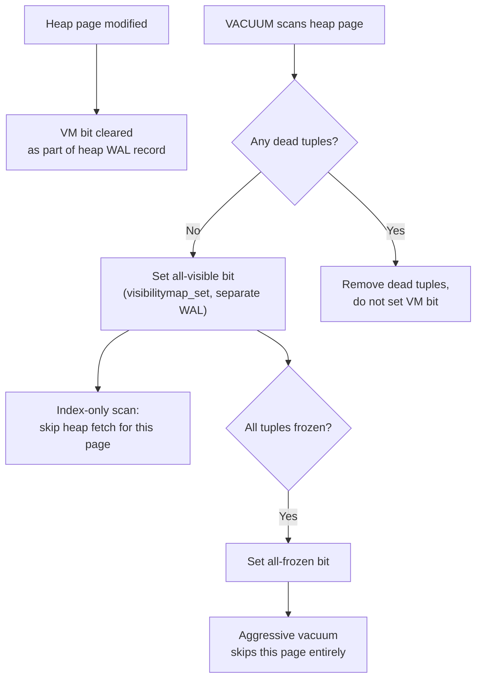
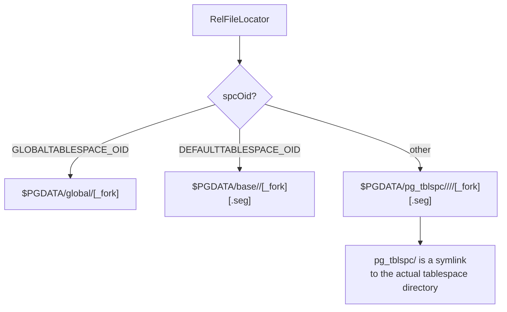
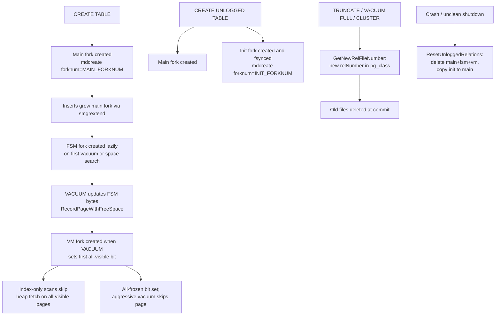

Every PostgreSQL relation that stores data occupies between one and four groups of physical files on disk. Each group is called a **fork**. A small integer called `ForkNumber` identifies each fork. The fork abstraction is load-bearing throughout the storage stack. Buffer tags encode a fork number. WAL records reference forks. The smgr API takes a fork number on every call. Size-reporting functions iterate across forks. Misreading the fork abstraction as a minor detail leads to confusion when reading `md.c`, WAL replay code, or the buffer manager.

## The Four Forks

The `ForkNumber` enum is defined in `src/include/common/relpath.h`:

```c
typedef enum ForkNumber
{
    InvalidForkNumber = -1,
    MAIN_FORKNUM = 0,
    FSM_FORKNUM,           /* 1 */
    VISIBILITYMAP_FORKNUM, /* 2 */
    INIT_FORKNUM           /* 3 */
} ForkNumber;

#define MAX_FORKNUM  INIT_FORKNUM
```

`forkNames[]` in `src/common/relpath.c` maps each enum value to its on-disk suffix token:

```c
const char *const forkNames[] = {
    "main",  /* MAIN_FORKNUM            — no suffix on actual filename */
    "fsm",   /* FSM_FORKNUM             — _fsm suffix */
    "vm",    /* VISIBILITYMAP_FORKNUM   — _vm  suffix */
    "init"   /* INIT_FORKNUM            — _init suffix */
};
```

The `_main` token never appears as a filename suffix. The main fork file has no suffix at all. PostgreSQL appends the other three tokens literally.

| Fork | ForkNumber | Present on | Filename suffix | Created when |
|------|-----------|------------|-----------------|--------------|
| Main | 0 | All permanent and unlogged relations | (none) | At `CREATE TABLE / INDEX` |
| FSM | 1 | Heap relations, hash indexes | `_fsm` | Lazily, on first vacuum or space search |
| Visibility Map | 2 | Heap relations only | `_vm` | Lazily, when VACUUM first sets a bit |
| Init | 3 | Unlogged relations only | `_init` | At `CREATE UNLOGGED TABLE / INDEX` |

The enum's compactness is intentional. `SMgrRelationData` stores per-fork arrays sized `MAX_FORKNUM + 1`, and loops like `for (forkNum = 0; forkNum <= MAX_FORKNUM; forkNum++)` are idiomatic throughout the codebase.

## Physical Identity: RelFileLocator

A relation's on-disk location is fully described by `RelFileLocator` (`src/include/storage/relfilelocator.h`):

```c
typedef struct RelFileLocator
{
    Oid           spcOid;    /* tablespace OID */
    Oid           dbOid;     /* database OID; 0 for shared catalogs */
    RelFileNumber relNumber; /* file number (see pg_class.relfilenode) */
} RelFileLocator;
```

`relNumber` is a typedef for `Oid`, but it does not equal `pg_class.oid` in general — only at the moment a relation is first created. After any rewrite operation, PostgreSQL assigns a new `relNumber` while the OID stays constant. `RelFileLocator` identifies a storage unit, not the logical relation.

For temporary relations, a `BackendId` is layered on top:

```c
typedef struct RelFileLocatorBackend
{
    RelFileLocator locator;
    BackendId      backend;  /* InvalidBackendId for permanent/unlogged */
} RelFileLocatorBackend;
```

Temporary files use a path prefix (`t<backendId>_<relNumber>`) that distinguishes them from permanent files in the same directory. The prefix also ensures that PostgreSQL never WAL-logs these files.

## How Filenames Are Constructed

`GetRelationPath` in `src/common/relpath.c` is the single authority for turning a `RelFileLocator` into a path string. It is compiled into both the backend and frontend tools (pg_dump, pg_upgrade, pg_resetwal) because it contains no backend-only types.

The path logic has three branches:

**Global tablespace** (shared system catalogs, `dbOid = 0`):
```
$PGDATA/global/<relNumber>[_<forkname>]
```

**Default tablespace** (the database's `base/<dbOid>` directory):
```
$PGDATA/base/<dbOid>/<relNumber>[_<forkname>]
```
Temporary relations add a `t<backendId>_` prefix:
```
$PGDATA/base/<dbOid>/t<backendId>_<relNumber>[_<forkname>]
```

**Other tablespaces** (accessed via symlinks from `pg_tblspc`):
```
$PGDATA/pg_tblspc/<spcOid>/<TABLESPACE_VERSION_DIRECTORY>/<dbOid>/<relNumber>[_<forkname>]
```

`TABLESPACE_VERSION_DIRECTORY` expands to something like `PG_16_202307071` — a concatenation of the major version and catalog version number (`src/include/common/relpath.h`). This subdirectory prevents two clusters sharing the same tablespace root from colliding.

The main fork never appends `_main`; only non-main forks append their suffix. All paths are relative to `$PGDATA`.

### Segment suffixes

When a fork grows beyond `RELSEG_SIZE` blocks (131072 at the default 8 kB block size, giving a 1 GiB cap), `md.c` creates additional segment files. Segment 0 has no numeric suffix. Segments 1, 2, … append `.1`, `.2`, etc. The fork suffix, when present, comes before the segment suffix:

```
16384          — main fork, segment 0
16384.1        — main fork, segment 1
16384_fsm      — FSM fork, segment 0
16384_fsm.1    — FSM fork, segment 1 (rarely occurs)
16384_vm       — VM fork, segment 0
16384_init     — init fork (unlogged tables only)
```

## The Main Fork

The main fork holds the actual heap tuples or index pages. It is always present for any relation with physical storage. The buffer manager always accesses it via `MAIN_FORKNUM`. When code calls `ReadBuffer(rel, blocknum)` without specifying a fork, the call goes to the main fork via `ReadBufferExtended(rel, MAIN_FORKNUM, blocknum, ...)`.

`RELSEG_SIZE` caps each segment file at compile time. It defaults to 131072, but a build can change it at `configure` time. The change requires `initdb` to take effect. A block number `N` maps to segment `N / RELSEG_SIZE`. Its within-segment offset is `(N % RELSEG_SIZE) * BLCKSZ`. This arithmetic appears in `md.c`'s `_mdfd_getseg`.

The smgr layer in `md.c` tracks open segments per fork as an array of `MdfdVec`:

```c
typedef struct _MdfdVec
{
    File        mdfd_vfd;   /* virtual file descriptor from the fd.c pool */
    BlockNumber mdfd_segno; /* segment number, starting at 0 */
} MdfdVec;
```

`SMgrRelationData` (the cached handle for an open relation in the smgr) holds:

```c
int      md_num_open_segs[MAX_FORKNUM + 1]; /* open segment count per fork */
MdfdVec *md_seg_fds[MAX_FORKNUM + 1];       /* array of open segment fds */
```

It is normal for a fork's `md_num_open_segs` to be smaller than the total number of on-disk segments — it means the backend has opened only the first few segments. The backend opens segments lazily, on first access.

One subtle behaviour: after `mdtruncate`, PostgreSQL **zeros to length zero** any segments that no longer contain active data, rather than unlinking them immediately. Immediate unlinking would leave dangling file descriptors in other backends that still have those segments open. If a later extension pushes the relation back past the old truncation point, PostgreSQL reuses those zero-byte files. Only when the relation is fully dropped does `mdunlinkfork` call `unlink` on each segment file in reverse order.

## The FSM Fork

The Free Space Map fork tracks available space per heap page so that `INSERT` and `UPDATE` can find a suitable page without a linear heap scan. It is created lazily — a freshly created table has no FSM file until the first vacuum or until the table reaches a threshold where the FSM is needed.

The FSM is stored as a collection of binary max-heap trees, one per FSM page. Each leaf node of the tree stores a one-byte approximation of free space on a single heap page (0 = full, 255 ≈ maximum free space). The root of each tree holds the maximum of all descendants, so a free-space search can descend from root to leaf in O(log n) steps without reading all pages. A value of 255 guarantees at least `MaxHeapTupleSize` bytes free. The encoding is intentionally lossy, because the FSM is only a hint. The heap level resolves any false positives.

Heap relations use the FSM fork. B-tree indexes manage free space through a separate index-level mechanism in `indexfsm.c`, so they do not have a `_fsm` file. Hash indexes do have an FSM fork.

## The Visibility Map Fork

The VM fork stores two bits per heap page, packed four heap pages per byte:

```c
/* src/include/access/visibilitymapdefs.h */
#define VISIBILITYMAP_ALL_VISIBLE  0x01  /* all tuples visible to all transactions */
#define VISIBILITYMAP_ALL_FROZEN   0x02  /* all tuples are frozen */
#define BITS_PER_HEAPBLOCK         2
#define HEAPBLOCKS_PER_BYTE        (BITS_PER_BYTE / BITS_PER_HEAPBLOCK)  /* 4 */
```

At 8 kB pages, one VM page covers roughly 32,000 heap pages (about 256 MiB of heap data). The VM fork is created lazily when VACUUM first sets a bit.

**All-visible** means every tuple on the heap page is visible to all currently running transactions. VACUUM can skip such pages because they contain no dead tuples. Index-only scans can return index data without a heap fetch because any matching tuple is guaranteed visible.

**All-frozen** means vacuum has frozen all tuples, replacing their `xmin` with `FrozenTransactionId`. Aggressive vacuums — those triggered to prevent transaction ID wraparound — can skip all-frozen pages entirely. This makes freeze scans on large, stable tables much faster.

**Setting** a VM bit requires WAL. **Clearing** a VM bit does not need a dedicated WAL record — the clearing piggybacks on the WAL record for the heap modification that invalidated it. This asymmetry is correct: a set bit is a strong guarantee that must be durably recorded; clearing is conservative (marking a page as possibly dirty is safe to redo).



Only heap relations have a VM fork. Indexes do not.

## The Init Fork

The init fork exists exclusively for **unlogged tables** (`RELPERSISTENCE_UNLOGGED`). An unlogged table skips WAL for its heap writes, making bulk inserts and updates significantly faster at the cost of losing all data after a crash or unclean shutdown.

The init fork holds a blank, structurally valid copy of the relation — just the relation header page(s), with no tuples. PostgreSQL WAL-logs it once, at creation time (`log_smgrcreate` with `INIT_FORKNUM`), and never modifies it again. Its purpose is to be a template. After a crash, recovery cannot replay the missing WAL for the main fork. Instead, it resets the relation from the init fork.

`heapam_handler.c` creates the init fork at table creation:

```c
smgrcreate(srel, INIT_FORKNUM, false);
log_smgrcreate(newrlocator, INIT_FORKNUM);
smgrimmedsync(srel, INIT_FORKNUM);
```

The `smgrimmedsync` is essential: the init fork must be durably on disk before any writes to the main fork, because recovery depends on the init fork still being intact after a crash.

### Crash recovery for unlogged tables

`xlog.c` calls `ResetUnloggedRelations` during startup recovery. It operates in two passes over every database directory:

**Pass 1 — cleanup** (`UNLOGGED_RELATION_CLEANUP`): scan the directory, identify every relfilenode that has an `_init` file, then delete all other fork files for that relfilenode (main, `_fsm`, `_vm`, and any `.1`, `.2` segments). This pass preserves the init fork itself.

**Pass 2 — init** (`UNLOGGED_RELATION_INIT`): scan again, find each `_init` file, and copy it to the corresponding main fork path by stripping the `_init` suffix from the destination name (`reinit.c: copy_file`). After copying, PostgreSQL fsyncs each produced file.

The logic in `reinit.c` builds the destination path by stripping the `_init` token from the filename — this is why the `forkNames[]` array and `strlen(forkNames[INIT_FORKNUM])` appear directly in the path arithmetic.

An unlogged table has only `_init` (covering the main fork). There are no `_fsm_init` or `_vm_init` files. Cleanup wipes FSM and VM along with the main fork, and recovery recreates them from scratch afterward.

During a clean shutdown, the main fork is already consistent, so `ResetUnloggedRelations` is effectively a no-op (the init fork is still present but the main fork is already good). The same call runs harmlessly.

## The smgr Interface

All fork-level I/O passes through the Storage Manager (`smgr`) API (`src/include/storage/smgr.h`). The smgr sits between the buffer manager and the actual filesystem implementation (`md.c`). Every smgr function takes a `ForkNumber`:

```c
SMgrRelation smgropen(RelFileLocator rlocator, BackendId backend);
bool         smgrexists(SMgrRelation reln, ForkNumber forknum);
void         smgrcreate(SMgrRelation reln, ForkNumber forknum, bool isRedo);
void         smgrextend(SMgrRelation reln, ForkNumber forknum,
                        BlockNumber blocknum, const void *buffer, bool skipFsync);
void         smgrread(SMgrRelation reln, ForkNumber forknum,
                      BlockNumber blocknum, void *buffer);
void         smgrwrite(SMgrRelation reln, ForkNumber forknum,
                       BlockNumber blocknum, const void *buffer, bool skipFsync);
BlockNumber  smgrnblocks(SMgrRelation reln, ForkNumber forknum);
void         smgrtruncate(SMgrRelation reln, ForkNumber *forknum,
                          int nforks, BlockNumber *nblocks);
```

`smgropen` creates or looks up an in-memory handle (`SMgrRelation`) in a backend-local hash table. It does not open any file. `mdopenfork` defers file opens until first access.

`smgrcreate` (`mdcreate` in `md.c`) creates segment 0 of a fork using `O_CREAT | O_EXCL`. When `isRedo` is true and the file already exists, `smgrcreate` falls back to opening the existing file without error. WAL replay hits this case when it re-runs a creation.

The `smgrtruncate` variant accepts arrays of fork numbers and block counts, enabling a single call to truncate multiple forks atomically from the WAL replay perspective. This matters for `TRUNCATE`, since it must truncate the main fork, FSM, and VM together.

## Relfilenode vs OID

`pg_class.oid` is the stable, externally-visible identifier. `pg_class.relfilenode` is the current file-level identifier. It can change. Any operation that rewrites the physical file assigns a new relfilenode by calling `GetNewRelFileNumber` (`src/backend/catalog/catalog.c`). This function allocates an OID-like value that is guaranteed unique within the tablespace.

| Operation | Assigns new relfilenode |
|-----------|------------------------|
| `CREATE TABLE` | No — OID == relfilenode at birth |
| `TRUNCATE` | Yes |
| `VACUUM FULL` | Yes |
| `CLUSTER` | Yes |
| `REINDEX` (non-concurrent) | Yes |
| `ALTER TABLE ... SET TABLESPACE` | Yes |
| `REFRESH MATERIALIZED VIEW` (non-concurrent) | Yes |

PostgreSQL does not delete the old storage files at the moment it assigns the new relfilenode. It schedules them for deletion at transaction commit instead. If the transaction aborts, the old files stay intact. The `pg_class` row reverts to the old `relfilenode`. This deferred deletion is why an aborted `TRUNCATE` leaves table data intact.

A special case: several core system catalogs (`pg_class`, `pg_attribute`, and a handful of others) store `relfilenode = 0` in `pg_class`. `relmapper.c` maintains their actual file numbers separately in `$PGDATA/global/pg_filenode.map`. This breaks the bootstrap circularity of needing to open `pg_class` to find the file for `pg_class`.

## Tablespace Paths in Detail



The build process constructs the version subdirectory (`TABLESPACE_VERSION_DIRECTORY`) at compile time, as `"PG_" PG_MAJORVERSION "_" CATALOG_VERSION_NO`. Its presence means two clusters of different major versions can share the same tablespace root directory without colliding — each will use a different version subdirectory. Upgrading via `pg_upgrade` does not reuse the old version subdirectory.

## TOAST Relations

When a table has oversized column values, PostgreSQL stores them in a companion TOAST table: `pg_toast.pg_toast_<parentOid>`. A TOAST table is a completely independent relation with its own `relfilenode`. It has a main fork (the toast chunk rows), an FSM fork, and a VM fork, exactly like any other heap.

The TOAST index (`pg_toast.pg_toast_<parentOid>_index`) is also independent. It has a main fork and an FSM fork; it does not have a VM fork (B-tree indexes do not use the visibility map mechanism).

PostgreSQL does not require a TOAST table to be in the same tablespace as its parent table, though it follows the parent's tablespace by default. Each TOAST relation has its own `_fsm` and `_vm` files on disk. The `pg_table_size` function sums main, FSM, and VM for the parent table but deliberately excludes TOAST storage; `pg_total_relation_size` includes TOAST.

## Inspecting Forks from SQL

```sql
-- Path to the main fork file (relative to $PGDATA)
SELECT pg_relation_filepath('mytable');
-- e.g. base/16384/24601

-- Size of each fork individually
SELECT pg_relation_size('mytable', 'main');
SELECT pg_relation_size('mytable', 'fsm');
SELECT pg_relation_size('mytable', 'vm');
SELECT pg_relation_size('mytable', 'init');  -- non-zero only for unlogged tables

-- Demonstrate relfilenode change on TRUNCATE
SELECT oid, relfilenode FROM pg_class WHERE relname = 'mytable';
TRUNCATE mytable;
SELECT oid, relfilenode FROM pg_class WHERE relname = 'mytable';
-- oid is the same; relfilenode is a new, larger OID

-- Inspect VM bits (requires pg_visibility extension)
CREATE EXTENSION IF NOT EXISTS pg_visibility;
SELECT blkno, all_visible, all_frozen
FROM pg_visibility_map('mytable')
WHERE all_visible OR all_frozen
LIMIT 20;

-- Find the TOAST table and its files for a given relation
SELECT c.relname, c.relfilenode, c.reltablespace
FROM pg_class c
WHERE c.oid = (
    SELECT reltoastrelid FROM pg_class WHERE relname = 'mytable'
);
```

`pg_relation_size` with a fork name calls `forkname_to_number` to convert the string to a `ForkNumber`. It then iterates over segment files using the same pattern as `calculate_relation_size` in `dbsize.c`: keep calling `stat` on `<path>`, `<path>.1`, `<path>.2`, … until `ENOENT`.

## Fork Lifecycle



## Related Topics

- [[subsystems/storage/smgr|Storage Manager (smgr)]] — the smgr API is the interface that dispatches all fork-level I/O. Every smgr call takes a ForkNumber explicitly.
- [[subsystems/storage/heap|Heap Storage]] — the main fork holds heap pages. Understanding heap tuple layout depends on knowing how PostgreSQL organizes and segments the main fork physically.
- [[subsystems/storage/visibility-map|Visibility Map]] — the VM fork stores all-visible and all-frozen bits per heap page. This article covers the fork file itself, while the visibility-map article covers the bit-level semantics and VACUUM interactions.
- [[subsystems/storage/fsm|Free Space Map]] — the FSM fork's binary max-heap structure and its role in routing INSERT/UPDATE to pages with enough free space.
- [[subsystems/storage/toast|TOAST]] — oversized column values land in a companion TOAST relation that has its own set of forks (main, FSM, VM) with a separate relfilenode.
- [[subsystems/storage/tablespaces|Tablespaces]] — tablespace OID is one of the three fields in RelFileLocator. It determines which directory branch GetRelationPath constructs.
- [[subsystems/catalog/relmapper|Relation Mapper]] — core system catalogs store relfilenode = 0 in pg_class. They rely on relmapper's pg_filenode.map to resolve their actual file numbers, bypassing the normal RelFileLocator lookup.
- [[subsystems/storage/temp-files|Temporary Files]] — sort and hash spill files live outside the fork system entirely, using their own naming scheme under `base/pgsql_tmp`.
- [[subsystems/storage/buffer-manager|Buffer Manager]] — the shared buffer pool addresses pages by fork-qualified block number, mediating all reads and writes to the forks described here.
- [[code-paths/vacuum|VACUUM Code Path]] — VACUUM walks the main fork to find dead tuples. It updates the FSM and visibility map forks as it goes.
