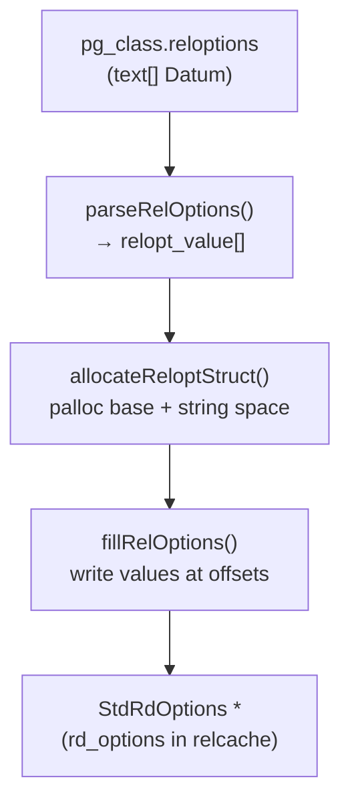

Relation storage options (reloptions) are per-relation and per-attribute configuration values stored in `pg_class.reloptions` and `pg_attribute.attoptions` as text arrays. They let operators tune autovacuum thresholds, [[subsystems/storage/fillfactor|fillfactor]], planner cost constants, and access-method-specific behaviour on a table-by-table or index-by-index basis, overriding server-wide GUCs without a reload.

## Storage format and lifecycle

`pg_class.reloptions` holds a PostgreSQL text array where each element is a `name=value` string, for example `{fillfactor=70,autovacuum_vacuum_scale_factor=0.01}`. A NULL value means all options are at their defaults. When a relation carries no non-default options, the column is NULL. The relcache then sets `rd_options` to NULL. Callers check for NULL before dereferencing it.

The text-array format is the on-disk canonical form. `transformRelOptions()` (reloptions.c) converts a `List` of `DefElem` nodes produced by the parser into this format, merging new settings with the existing array. Options present in both are replaced. Options present only in the old array survive unchanged. Options listed in a RESET statement are dropped. The function handles both `CREATE TABLE ... WITH (...)` and `ALTER TABLE SET/RESET (...)` through the same path, distinguished by the `isReset` flag.

When a relcache entry is opened, `extractRelOptions()` reads the raw `Datum` from the `pg_class` tuple. It then dispatches to the appropriate parser function based on `relkind`. For ordinary tables and materialized views this is `heap_reloptions()`, for views `view_reloptions()`, and for indexes `index_reloptions()`. The index path delegates to the access method's `amoptions` function pointer. TOAST tables go through `heap_reloptions()` but receive adjusted defaults (fillfactor forced to 100, no analyze parameters). The result is a palloc'd bytea struct pointed to by `rd_options` in the relcache entry.

## Option kinds and the relopt_kind bitmask

Each option is tagged with a bitmask of `relopt_kind` values indicating which relation types accept it:

| Kind | Bit | Applies to |
|---|---|---|
| `RELOPT_KIND_HEAP` | `1 << 0` | Regular tables, materialized views |
| `RELOPT_KIND_TOAST` | `1 << 1` | TOAST tables (via `toast.` namespace) |
| `RELOPT_KIND_BTREE` | `1 << 2` | B-tree indexes |
| `RELOPT_KIND_HASH` | `1 << 3` | Hash indexes |
| `RELOPT_KIND_GIN` | `1 << 4` | GIN indexes |
| `RELOPT_KIND_GIST` | `1 << 5` | GiST indexes |
| `RELOPT_KIND_ATTRIBUTE` | `1 << 6` | Column-level options (`pg_attribute.attoptions`) |
| `RELOPT_KIND_TABLESPACE` | `1 << 7` | Tablespace options (`pg_tablespace.spcoptions`) |
| `RELOPT_KIND_SPGIST` | `1 << 8` | SP-GiST indexes |
| `RELOPT_KIND_VIEW` | `1 << 9` | Views |
| `RELOPT_KIND_BRIN` | `1 << 10` | BRIN indexes |

An option can be valid for multiple kinds simultaneously: `autovacuum_enabled` is tagged `RELOPT_KIND_HEAP | RELOPT_KIND_TOAST`, so the same option definition serves both ordinary tables and their [[subsystems/storage/toast|TOAST]] companions. When `parseRelOptions()` builds its candidate list, it filters by kind using bitwise AND.

The special value `RELOPT_KIND_LOCAL` (0) marks options defined by access method code. These options are scoped to a single `local_relopts` context. Access method code never registers them in the global table. Custom access methods use this path to define AM-specific options without touching the shared static arrays.

## Option type hierarchy

Every option definition begins with a `relopt_gen` header that carries the name, description, kind bitmask, required lock level, and type tag. The type-specific structs embed this header as their first member, enabling safe casts:

| Struct | Type tag | Extra fields |
|---|---|---|
| `relopt_bool` | `RELOPT_TYPE_BOOL` | `default_val` |
| `relopt_int` | `RELOPT_TYPE_INT` | `default_val`, `min`, `max` |
| `relopt_real` | `RELOPT_TYPE_REAL` | `default_val`, `min`, `max` |
| `relopt_enum` | `RELOPT_TYPE_ENUM` | `members[]`, `default_val`, `detailmsg` |
| `relopt_string` | `RELOPT_TYPE_STRING` | `default_val`, `validate_cb`, `fill_cb` |

String options have two callbacks. PostgreSQL calls `validate_cb` at parse time to reject bad values with an error. It calls `fill_cb` during struct allocation. `fill_cb` computes how much extra space the string needs and copies it into the trailing region of the bytea struct. This design lets the parsed struct remain a single contiguous allocation. PostgreSQL addresses its strings as byte offsets from the struct base (via the `GET_STRING_RELOPTION` macro).

Enum options accept multiple string representations for the same numeric value — for instance, `vacuum_index_cleanup` accepts `"on"`, `"true"`, `"yes"`, and `"1"` as aliases for `STDRD_OPTION_VACUUM_INDEX_CLEANUP_ON`. The string-to-integer mapping lives in a null-terminated `relopt_enum_elt_def[]` array that each enum option carries directly.

## Parse and fill pipeline

The path from a text-array Datum to a populated C struct goes through three steps:

1. `parseRelOptions()` scans the global `relOpts[]` array (initialized lazily by `initialize_reloptions()`). It selects all options matching the requested kind. It calls `parse_one_reloption()` on each `name=value` string to decode the value and set `isset = true` on the matching entry. Options not present in the array keep `isset = false`. They receive their defaults later.

2. `allocateReloptStruct()` computes the total allocation size: the struct's base size plus trailing space for any string values.

3. `fillRelOptions()` writes each parsed value into the struct at the field offset recorded in the `relopt_parse_elt[]` table. For fields not set by the user (`isset = false`), it writes the default from the option definition. `fillRelOptions()` copies string values into the trailing region. The field then stores the byte offset from the struct base.

`build_reloptions()` wraps all three steps into a single call. `default_reloptions()` wraps `build_reloptions()` with the `StdRdOptions` parse table for the common case of heap tables.



## StdRdOptions: the heap options struct

`StdRdOptions` is the parsed form for regular tables, materialized views, and TOAST tables. It is a fixed-layout struct followed by any string data:

```c
typedef struct StdRdOptions {
    int32   vl_len_;               /* varlena header — SET_VARSIZE covers full alloc */
    int     fillfactor;
    int     toast_tuple_target;
    AutoVacOpts autovacuum;        /* embedded sub-struct for AV overrides */
    bool    user_catalog_table;
    int     parallel_workers;
    StdRdOptIndexCleanup vacuum_index_cleanup;
    bool    vacuum_truncate;
} StdRdOptions;
```

`AutoVacOpts` contains the full set of per-relation [[subsystems/background/autovacuum|autovacuum]] overrides (thresholds, scale factors, cost parameters, freeze ages). A value of -1 in any integer or real field means "inherit the server-wide GUC". Autovacuum checks this sentinel before applying its cost accounting. This sentinel design means that unset options cost nothing at runtime: the comparison with -1 is cheaper than a NULL check through an indirection.

## Lock levels for ALTER TABLE SET

A critical invariant of the option system is that every option's `lockmode` must conflict with itself. Initialization asserts this via `DoLockModesConflict(lockmode, lockmode)`. This guarantees that two concurrent `ALTER TABLE SET (option=...)` for the same option cannot both succeed, preventing lost updates.

The required lock level follows the semantics of how the option is consumed:

- Options that affect query results (e.g., `security_barrier`, `check_option` on views) require `AccessExclusiveLock` because a concurrent reader could see the old value mid-query.
- Options consumed only by [[subsystems/background/autovacuum|autovacuum]] or ANALYZE (`autovacuum_*`, `n_distinct`) require only `ShareUpdateExclusiveLock`. Normal DML never consults them, and any in-flight autovacuum finishes with the old value regardless.
- `fillfactor` uses `ShareUpdateExclusiveLock` because it applies only to pages that future inserts write, not to any currently-executing statement.
- `parallel_workers` uses `ShareUpdateExclusiveLock` for the same reason as planner parameters: plans cannot change mid-flight. The old plan finishes normally while new queries pick up the new setting.

`AlterTableGetRelOptionsLockLevel()` scans the list of options being changed. It returns the highest lock level required. As a result, a single `ALTER TABLE SET (fillfactor=70, security_barrier=true)` acquires `AccessExclusiveLock` for the whole operation.

## Custom options for extension AMs

Extension access methods that need their own storage parameters have two registration paths:

**Global registration** — `add_reloption_kind()` allocates a fresh `relopt_kind` bit (there are 30 available). `add_bool_reloption()` / `add_int_reloption()` / etc. then register the option in the shared `custom_options[]` array. This triggers a rebuild of the global `relOpts[]` table (via `need_initialization = true`). Globally registered options are visible through `pg_class.reloptions`. They also survive across connections.

**Local (AM-scoped) registration** — `init_local_reloptions()` initializes a `local_relopts` struct with `RELOPT_KIND_LOCAL`. Options added through `add_local_*_reloption()` live only in that struct. `build_local_reloptions()` parses them on demand. This path is suited to index AMs that parse their options once during `ambuildempty` or `amoptions`. These AMs do not need the options to appear in the global catalog table.

Both paths share the same `fillRelOptions()` back-end, so the parsed struct layout and the string-offset addressing scheme are identical.

## TOAST namespace

The `toast.` namespace prefix in SQL specifies options for a table's TOAST companion:

```sql
ALTER TABLE t SET (toast.autovacuum_vacuum_scale_factor = 0.1);
```

`transformRelOptions()` filters by namespace when building the text array, so the heap and TOAST arrays stay separate. `HEAP_RELOPT_NAMESPACES` lists `"toast"` as the only valid non-NULL namespace for heap relations. PostgreSQL rejects anything else with an error.

## Related Topics

- [[subsystems/storage/fillfactor|Fillfactor and HOT Updates]] — how `StdRdOptions.fillfactor` controls page packing and enables HOT
- [[subsystems/storage/heap|Heap Storage and Tuple Format]] — the relcache entry that holds `rd_options`
- [[subsystems/background/autovacuum|autovacuum]] — how `AutoVacOpts` overrides server-wide GUCs per relation
- [[subsystems/storage/toast|TOAST]] — TOAST-companion option namespace
- [[subsystems/transactions/xid-wraparound|XID wraparound]] — `autovacuum_freeze_max_age` mitigates wraparound risk
