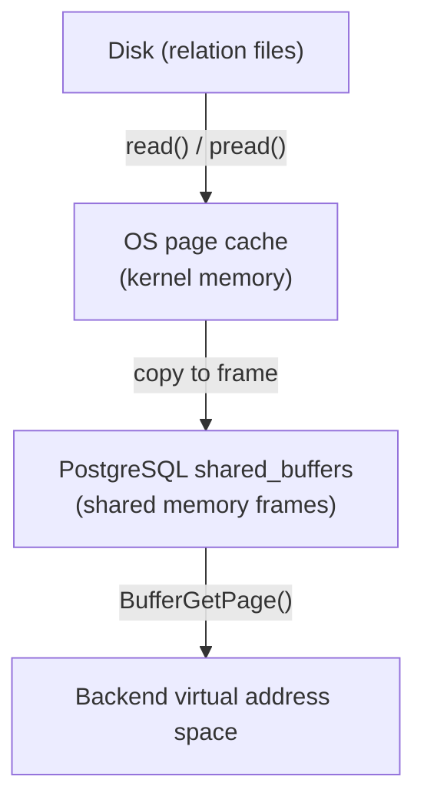
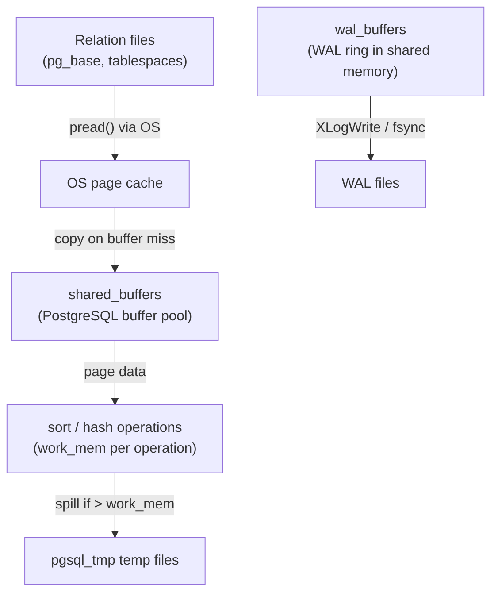

# Memory Parameters: shared_buffers, work_mem, wal_buffers, effective_cache_size

PostgreSQL exposes four GUCs that dominate memory configuration. Each controls a fundamentally different layer: the shared buffer pool, per-operation sort/hash memory, the WAL ring buffer, and the planner's model of available cache. Getting the model right for each one prevents both under-utilisation and the more dangerous failure modes — excessive OS swapping, query plan regressions, and write throughput bottlenecks under high commit load.

## shared_buffers

`shared_buffers` is the size of PostgreSQL's shared buffer pool — the fixed region of shared memory through which every backend reads and writes heap and index pages. Its unit is 8 KB pages. The GUC stores the result as the global `NBuffers` (`src/include/storage/bufmgr.h`). At postmaster startup, `buf_init.c` allocates three parallel arrays in shared memory, each `NBuffers` elements long:

| Array | Per-entry size | Purpose |
|---|---|---|
| `BufferDescriptors` | `sizeof(BufferDescPadded)` (~64 B) | Tag, state, locks for each frame |
| `BufferBlocks` | `BLCKSZ` (8 KB) | The actual page data |
| Buffer condition variables | `sizeof(ConditionVariableMinimallyPadded)` | Waits for I/O completion |

For `shared_buffers = 8GB`, the buffer pool alone consumes roughly `8 GB + 8 GB / 8192 × 64 B ≈ 8.06 GB` of shared memory.

Operators should treat the conventional advice — "set `shared_buffers` to 25% of RAM" — as a floor, not a ceiling. On a dedicated database server with 64 GB of RAM, 16 GB is a reasonable starting point, but servers that hold a working set much smaller than physical RAM can often push to 40–50% without issue. The constraint is not RAM scarcity; it is the interaction with the OS page cache (see below) and the fact that shared memory is wired and cannot be swapped out.

### Observing the hit rate

A high hit rate means most page lookups find the page already in the buffer pool, avoiding a physical read. The cheapest approximation uses `pg_stat_database`:

```sql
SELECT sum(blks_hit) / nullif(sum(blks_hit + blks_read), 0) AS hit_rate
FROM pg_stat_database;
```

Values below 0.95 on an OLTP workload typically signal that `shared_buffers` is too small relative to the active working set.

PostgreSQL 17 introduced `pg_stat_io`, which gives per-context I/O counters broken down by backend type, I/O object (relation, temp file, WAL), and I/O context (normal, bulkread, vacuum). For tracking buffer-pool effectiveness at a finer grain:

```sql
SELECT backend_type, context, hits, reads, evictions, reuses
FROM pg_stat_io
WHERE object = 'relation' AND context = 'normal'
ORDER BY reads DESC;
```

`pg_shmem_allocations` (PG 13+) shows the precise byte cost of the buffer pool in the live segment:

```sql
SELECT name, size, allocated_size
FROM pg_shmem_allocations
WHERE name IN ('Buffer Descriptors', 'Buffer Blocks', 'Buffer IO Locks')
ORDER BY allocated_size DESC;
```

### The OS page cache and double-caching

PostgreSQL's buffer pool and the OS page cache are two separate caches sitting on top of the same disk files. When PostgreSQL reads a page via the buffer manager, the kernel reads the file through the page cache into kernel memory. It then copies the page to the shared memory frame. The page exists in both places simultaneously — this is double-caching.



Double-caching wastes RAM: a page that PostgreSQL keeps hot in `shared_buffers` is also resident in the OS page cache even though no backend reads it from there again. On a memory-constrained server, very large `shared_buffers` settings can squeeze the OS page cache to the point where it cannot buffer WAL writes and temp-file I/O effectively.

PG16+ introduced the `io_direct` GUC (`IO_DIRECT_DATA` flag, `src/include/storage/fd.h`), which opens relation files with `O_DIRECT`, bypassing the OS page cache for data reads and writes. When `io_direct` is enabled, PostgreSQL's buffer pool becomes the sole cache for data pages, eliminating double-caching. This comes at the cost of requiring aligned I/O and losing the OS readahead for sequential scans. This is an advanced setting. Operators should use it only when the OS page cache provides no value to the workload.

`full_page_writes` interacts with this two-cache architecture in an important way. When `full_page_writes = on` (the default), the first modification to a page after a checkpoint writes the entire 8 KB page image into WAL. This ensures that a partially-written page — one that was torn by a crash mid-write — can be recovered. If `io_direct` is not enabled, the OS page cache often absorbs these writes cheaply because the page is already cached in kernel memory. With direct I/O the full-page image write hits storage directly, making a high checkpoint frequency more costly.

## effective_cache_size

`effective_cache_size` does not allocate any memory. It is a hint to the query planner about how much buffer space — PostgreSQL shared buffers plus OS page cache — is available to serve random page accesses without a physical read.

The planner uses it inside `index_pages_fetched()` (`src/backend/optimizer/path/costsize.c`). This function implements the Mackert-Lohman cache model. The model estimates how many index pages the query will actually fetch from storage, given that some fraction is already in memory. The function computes the effective cache allocation available for the relation under consideration as a pro-rated share of `effective_cache_size`:

```c
/* b is pro-rated share of effective_cache_size */
b = (double) effective_cache_size * T / total_pages;
```

where `T` is the number of pages in the table. `total_pages` is the sum of all table and index pages accessed by the query. A larger `b` means a higher probability that random index page accesses are cache hits. This reduces the estimated cost of index scans.

The consequence of mis-setting `effective_cache_size` is plan instability:

- Too low: the planner overestimates the cost of index scans, preferring sequential scans even when the index is highly selective and the working set fits in RAM. Queries that should use an index do a full table scan instead.
- Too high: the planner underestimates index scan cost, choosing nested-loop + index joins over hash joins even when the outer table is large and the index is on a cold relation.

A reasonable setting is `shared_buffers` + available OS page cache. On a 64 GB machine with `shared_buffers = 16 GB` and 32 GB of RAM not otherwise committed, `effective_cache_size = 48GB` is defensible. The critical insight is that the value has no runtime effect on memory allocation — setting it higher than reality does not consume more memory, but it does mislead the planner.

## work_mem

`work_mem` controls how much memory any single sort or hash operation may use before spilling to disk. The key word is *single*: it is not a per-query or per-connection limit. A query plan with multiple Sort and HashJoin nodes allocates `work_mem` independently for each. With parallel query enabled, each worker also gets its own grant per operation.

The multiplicative effect matters for capacity planning. A query containing 10 hash joins and 5 parallel workers can hold up to `10 × 5 × work_mem` simultaneously. At `work_mem = 64 MB`, that is 3.2 GB for one query — a plausible explosion on a busy server running hundreds of connections.

### The spill path

When a sort operation accumulates tuples exceeding its `work_mem` grant (`allowedMem` in `Tuplesortstate`, `src/backend/utils/sort/tuplesort.c`), it flushes the current in-memory batch as a sorted run to a logical tape — a virtual stream within a `BufFile` (`src/backend/storage/file/buffile.c`). Once the sort operation consumes all input, it merges the runs using a polyphase merge sort. The merge may require multiple passes, depending on the number of runs and the tape fanout (default `MAXTAPES = 7`).

Hash joins (`src/backend/executor/nodeHash.c`) size their hash table against `work_mem × hash_mem_multiplier`. When the actual tuple stream overflows the table, `ExecHashIncreaseNumBatches` doubles the batch count. It spills overflow tuples to per-batch temp files. The executor then processes the inner and outer relations batch-by-batch, re-reading each batch from disk.

Both spill paths create files in `pgsql_tmp` within the data directory or any configured `temp_tablespaces`. Spilled sorts and hashes run 2–10× slower than their in-memory counterparts; the exact factor depends on I/O bandwidth and the number of merge/batch passes required.

### Observing spills

`EXPLAIN ANALYZE` reports spill at each node directly:

- Sort: `Sort Method: external merge  Disk: 18432kB` — any `external merge` means a spill occurred.
- Hash join: `Batches: 8  Memory Usage: 4096kB` — `Batches > 1` means the hash table spilled.

For fleet-wide spill discovery without per-query `EXPLAIN`, query [[subsystems/observability/pg-stat-statements|pg_stat_statements]]:

```sql
SELECT query,
       temp_blks_written,
       round(temp_blks_written * 8.0 / 1024, 1) AS temp_mb_written
FROM pg_stat_statements
WHERE temp_blks_written > 0
ORDER BY temp_blks_written DESC
LIMIT 20;
```

`temp_blks_written` counts 8 KB blocks written to temp files, accumulating across all sort runs and hash batch files for matching query fingerprints.

### Sizing work_mem safely

The ceiling for a global `work_mem` increase is not RAM per se — it is the product of the number of active connections and the number of concurrent sort/hash operations each can run:

```
theoretical_peak = max_connections × max_parallel_workers_per_gather × concurrent_ops × work_mem
```

On a 128 GB server with 200 connections and `max_parallel_workers_per_gather = 4`, raising `work_mem` from 4 MB to 64 MB raises the theoretical peak from ~3.2 GB to ~51 GB. In practice not every connection runs a parallel sort simultaneously, but operators must stress-test any global increase before deployment.

The safer pattern for expensive analytical queries is a session-scoped override:

```sql
SET work_mem = '256MB';
-- expensive query here
RESET work_mem;
```

## wal_buffers

`wal_buffers` controls the size of the WAL write-ahead ring buffer in shared memory. Backends generate WAL records. `XLogInsert` (`src/backend/access/transam/xlog.c`) assembles them into this ring before `XLogWrite` flushes them to disk. The ring is `XLOGbuffers` pages wide, where each page is `XLOG_BLCKSZ` (8192) bytes.

The default value of `-1` triggers automatic sizing via `XLOGChooseNumBuffers()` at shared memory initialisation time, called from `XLOGShmemSize()`:

```c
xbuffers = NBuffers / 32;
if (xbuffers > (wal_segment_size / XLOG_BLCKSZ))
    xbuffers = (wal_segment_size / XLOG_BLCKSZ);
if (xbuffers < 8)
    xbuffers = 8;
```

The formula produces roughly 3% of `shared_buffers`, capped at one WAL segment's worth of pages (128 pages at the default 1 MB segment size) with a floor of 8 pages (64 KB). For `shared_buffers = 8 GB` the auto-tuned value saturates at the segment cap: one WAL segment, 1 MB.

The WAL ring matters under high concurrent commit load. When many backends generate WAL records simultaneously, the ring needs enough capacity to absorb the burst between `XLogWrite` calls. If the ring fills — because a slow fsync is blocking the writer — backends stall waiting for space. The `pg_stat_io` counter `wal_buffers_full` (visible via the `wal` object and `normal` context in PG16+) counts how many times this stall occurred.

For workloads with many small, fast transactions committing simultaneously — connection poolers sending hundreds of transactions per second — increasing `wal_buffers` to 16 MB or 32 MB often improves throughput. Beyond 32 MB the gains are typically negligible because the bottleneck shifts to fsync latency, not ring capacity.

Increasing `wal_buffers` above the auto-tuned value requires a server restart (it is a `PGC_POSTMASTER` GUC). The cost is modest: 1 MB of additional shared memory per 128 pages.

## Two-cache architecture summary



`effective_cache_size` is not a box in this diagram — it is a parameter used by the planner to model the probability that a random read finds data in boxes B or C.

## maintenance_work_mem

`maintenance_work_mem` sets the memory limit for maintenance operations: `VACUUM`, `ANALYZE`, `CREATE INDEX`, `ALTER TABLE ADD FOREIGN KEY`, `CLUSTER`, and `REINDEX`. Each such operation that requires sort or hash space — for example, sorting tuples during index creation, or accumulating dead-tuple TIDs during VACUUM — draws from this budget independently. Unlike `work_mem`, maintenance operations typically run one at a time per backend, so the risk of multiplicative memory consumption across a single session is much lower.

The default is 64 MB, which is conservative. On servers with ample RAM, values of 256 MB to 1 GB are common and appropriate:

- **CREATE INDEX**: larger `maintenance_work_mem` produces longer in-memory sort runs, which reduces the number of merge passes needed to build the final index. The speedup is most pronounced on large tables where the default produces dozens of merge passes.
- **VACUUM**: the maintenance context holds dead-tuple TIDs (6 bytes each) before flushing them to index vacuuming passes. A larger grant lets VACUUM accumulate more TIDs per pass, reducing the number of index scans required to process a heavily bloated table.

### autovacuum_work_mem

`autovacuum_work_mem` is a separate GUC applied exclusively to [[subsystems/background/autovacuum|autovacuum]] worker processes. Its default value of `-1` means "use `maintenance_work_mem`". Setting it independently lets you allocate less memory to background autovacuum than to manual `VACUUM` and `REINDEX` operations:

```sql
-- Give manual maintenance operations 512 MB,
-- but keep autovacuum workers at 64 MB to avoid
-- contending with query workloads.
ALTER SYSTEM SET maintenance_work_mem = '512MB';
ALTER SYSTEM SET autovacuum_work_mem = '64MB';
SELECT pg_reload_conf();
```

This split is particularly useful on servers where autovacuum workers share RAM with OLTP query traffic: aggressive autovacuum is desirable, but giving each worker 512 MB could crowd out `work_mem` for queries.

### Parallel index builds and memory multiplication

Since PostgreSQL 11, `CREATE INDEX` can use parallel workers controlled by `max_parallel_maintenance_workers` (default 2). Each parallel worker receives its own `maintenance_work_mem` grant independently of the leader process. Total memory consumed by a parallel index build is therefore:

```
total_index_build_memory = maintenance_work_mem × (1 + max_parallel_maintenance_workers)
```

At the default settings (`maintenance_work_mem = 64 MB`, `max_parallel_maintenance_workers = 2`) that is 192 MB per `CREATE INDEX`. After raising `maintenance_work_mem` to 1 GB, the same build uses 3 GB. If multiple `CREATE INDEX` operations run concurrently — for example during `pg_restore` — the number of concurrent builds multiplies the total again. Size `maintenance_work_mem` with this ceiling in mind. Consider reducing `max_parallel_maintenance_workers` if memory is constrained.

### Monitoring

`pg_stat_progress_create_index` and `pg_stat_progress_vacuum` expose the current phase of active index builds and vacuum operations respectively:

```sql
-- Active index builds with phase and blocks done
SELECT phase, blocks_done, blocks_total,
       tuples_done, tuples_total,
       partitions_done, partitions_total
FROM pg_stat_progress_create_index;

-- Active vacuums with heap and index progress
SELECT phase, heap_blks_scanned, heap_blks_vacuumed,
       index_vacuum_count, num_dead_item_ids
FROM pg_stat_progress_vacuum;
```

`maintenance_work_mem` exhaustion does not raise an error — it degrades gracefully but visibly. Index builds require extra merge passes (the `phase` column cycles through `building index: sorting live tuples` more times than expected). VACUUM performs more index scans per table heap (`index_vacuum_count` is higher). If either counter is significantly larger than 1 for tables of moderate size, increasing `maintenance_work_mem` is the first lever to pull.

## See also

- [[subsystems/storage/buffer-manager]]
- [[subsystems/storage/temp-files]]
- [[subsystems/executor/work-mem-and-spill]]
- [[subsystems/wal/overview]]
- [[subsystems/storage/shared-memory]]
